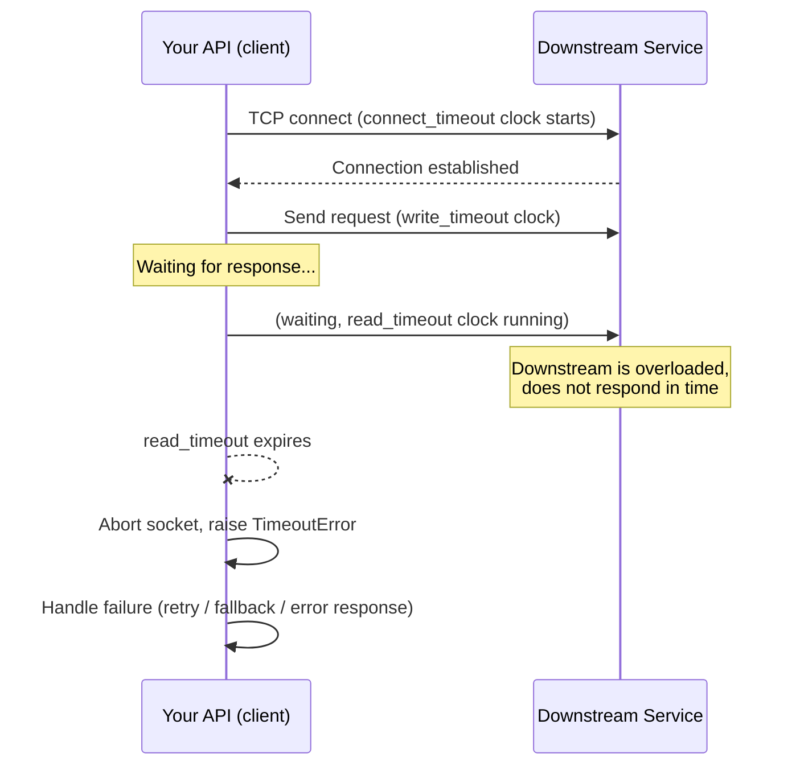

# Timeouts

## Why This Matters

Every network call your API makes — to a database, to another microservice, to a third-party payment processor, to an LLM provider — can fail in two very different ways: it can come back with an error quickly, or it can simply never come back. The first case is easy to handle: catch the exception, return a 502, move on. The second case is the dangerous one. Without a timeout, a single slow dependency can hang a request thread indefinitely, and if enough requests pile up waiting on the same dead dependency, they can exhaust your server's connection pool, thread pool, or memory — turning one slow downstream call into a full outage of your own service. A timeout is the single cheapest, highest-leverage reliability primitive you can add to any network call, and it's also one of the most commonly forgotten.

## Core Concept

A **timeout** is a maximum amount of time your code is willing to wait for an operation to complete before giving up and treating it as a failure. Timeouts convert "unknown, possibly infinite wait" into "bounded wait, followed by a deterministic failure you can handle." That's the entire value proposition: predictability. A request that fails fast can be retried, routed elsewhere, or surfaced to the user with a clear error. A request that hangs forever consumes a thread, a socket, and (usually) a slice of memory for as long as the underlying connection stays open — which, for a misbehaving server or a black-holed network path, can be forever.

It helps to separate timeouts into distinct phases, because "the request timed out" is ambiguous otherwise:

- **Connect timeout** — how long to wait while establishing the TCP/TLS connection to the remote host. If the host is down, unreachable, or the network is dropping SYN packets silently, this is where you'd hang without a limit.
- **Read timeout** (sometimes called a socket timeout) — how long to wait for the next chunk of data once the connection is established and the request has been sent. A slow or stuck server can accept your connection and then simply never respond.
- **Write timeout** — how long to wait while sending your request body, relevant for large uploads over a congested or slow link.
- **Total (overall) timeout** — an end-to-end cap on the entire operation, covering connect + write + read + any retries, regardless of how time is distributed across the phases.

Most production-grade HTTP clients let you configure all four independently, and you generally should — a database call and a large file upload to object storage have very different tolerances for each phase.

## Mental Model

Think of a timeout like the "please hold" limit you'd privately set before hanging up on a customer-service phone line. You don't wait forever — you decide in advance "if nobody picks up in two minutes, I'll hang up and try again later, or try a different number." Without that private limit, you'd sit on hold indefinitely, unable to do anything else, and if you're doing this on behalf of ten other people (i.e., you're a server handling ten other requests on the same limited pool of resources), all ten of them are now also stuck waiting behind you.

## How It Works

1. Your HTTP client opens a connection to the target host, starting a connect-timeout clock.
2. Once connected, your client sends the request; a write-timeout clock may apply during transmission of the body.
3. After the request is sent, your client waits for the first bytes of a response; a read-timeout clock governs this wait, and may reset on each new chunk received (some clients enforce read timeout per-chunk, others enforce it as one contiguous wait for the full response).
4. If any clock expires before its phase completes, the client aborts the underlying socket and raises a timeout exception/error — this is a *client-side* decision; the remote server is not notified and may still be processing the request.
5. Your application code catches that timeout exception and decides what to do next: fail the request, retry (see [Retries](retries.md)), fall back to a cached value, or degrade gracefully.

A subtlety worth internalizing: a timeout firing does **not** mean the remote operation didn't happen. The server may have received the request, started processing, and even completed a write to its database — you simply stopped waiting for the acknowledgment. This is exactly why timeouts and retries must be reasoned about together with idempotency in mind (see [Retries](retries.md) and [Part 2's idempotency chapter](../02-rest-api-design/idempotency.md)).

## Architecture



## Request / Response Example

From the caller's point of view, a timeout looks like this — no HTTP response is ever received, so the client synthesizes its own failure:

```http
GET /v1/inventory/sku-4471 HTTP/1.1
Host: inventory-service.internal
Authorization: Bearer eyJhbGciOi...

(connection established, request sent, then... silence)
```

```text
httpx.ReadTimeout: The read operation timed out after 2.0s
  while waiting for a response from inventory-service.internal
```

Contrast this with a downstream service that is aware it's overloaded and responds *before* your timeout fires — this is the well-behaved alternative, and it's why [Rate Limiting](rate-limiting.md) and [Circuit Breakers](circuit-breakers.md) matter on the server side too:

```http
HTTP/1.1 503 Service Unavailable
Retry-After: 5
Content-Type: application/json

{
  "error": "service_overloaded",
  "message": "Inventory service is temporarily overloaded. Retry after 5 seconds."
}
```

A `503` with `Retry-After` is strictly better than a hang: it's a fast, explicit signal your client can act on immediately instead of discovering the problem only after a timeout clock expires.

## Code Example

```python
import os
import httpx

# Configure timeouts per-phase, not as a single number, whenever the client
# supports it. Values are pulled from environment variables so they can be
# tuned per-environment (staging vs. production) without a code change.
CONNECT_TIMEOUT = float(os.getenv("HTTP_CONNECT_TIMEOUT_SECONDS", "1.0"))
READ_TIMEOUT = float(os.getenv("HTTP_READ_TIMEOUT_SECONDS", "2.0"))
WRITE_TIMEOUT = float(os.getenv("HTTP_WRITE_TIMEOUT_SECONDS", "2.0"))
POOL_TIMEOUT = float(os.getenv("HTTP_POOL_TIMEOUT_SECONDS", "1.0"))  # time waiting
                                                                      # to acquire a
                                                                      # connection from
                                                                      # the pool itself

timeout_config = httpx.Timeout(
    connect=CONNECT_TIMEOUT,
    read=READ_TIMEOUT,
    write=WRITE_TIMEOUT,
    pool=POOL_TIMEOUT,
)

client = httpx.Client(timeout=timeout_config)


def get_inventory(sku: str) -> dict:
    try:
        response = client.get(f"https://inventory-service.internal/v1/inventory/{sku}")
        response.raise_for_status()
        return response.json()
    except httpx.ConnectTimeout:
        # The remote host never accepted the TCP connection in time --
        # likely down, unreachable, or a firewall/network issue.
        raise UpstreamUnavailableError("inventory-service: connect timeout")
    except httpx.ReadTimeout:
        # We connected fine, sent the request, but got no response in time.
        # IMPORTANT: the server may still have processed this -- do not
        # assume it was a no-op. See retries.md before blindly retrying.
        raise UpstreamUnavailableError("inventory-service: read timeout")


class UpstreamUnavailableError(Exception):
    pass
```

Notice there is no call in this file made without an explicit timeout — that's intentional. Most HTTP libraries default to *no timeout at all* if you don't configure one, which is the single most common reliability bug in production API code.

## Production Considerations

- **Timeout budgets across a call chain must be allocated, not duplicated.** If your public API has a 10-second SLA and it calls Service A, which calls Service B, which calls a database, the *sum* of every downstream timeout in the chain must fit inside that 10 seconds — with room left for your own processing. A common mistake is giving every layer its own generous 10-second timeout, so a single slow leaf service can make the total chain take 30+ seconds even though no individual timeout looks unreasonable in isolation.
- **Different operations deserve different budgets.** A cache read should time out in tens of milliseconds; a report-generation endpoint might reasonably allow tens of seconds. Don't apply one global timeout constant to every call your service makes.
- **Timeouts interact with connection pools.** If a downstream dependency is slow and your timeout is too generous, connections pile up waiting, and your pool can exhaust even though each individual call would technically "succeed" eventually. A tighter timeout frees the pool faster.
- **Propagate a deadline, not just a per-hop timeout, in deep call chains.** Passing a remaining-time budget (e.g., via a header or context deadline) down the chain lets each hop know how much time is actually left, rather than each hop independently assuming it has the full budget.

## Common Mistakes

- **No timeout configured at all** — many HTTP client libraries default to waiting forever; this is the single most common cause of a "the service is up but not responding" style outage.
- **Setting the timeout far too high "to be safe,"** which defeats the purpose — a 60-second timeout on a call that should take 100ms just delays the inevitable failure and ties up resources for a minute per stuck request.
- **Using one timeout value for connect and read**, missing the fact that DNS/connect problems and slow-response problems have very different acceptable wait times.
- **Forgetting that a timeout on the client doesn't cancel work on the server** — assuming a timed-out write was "rolled back" when it may have actually succeeded downstream.
- **Not accounting for the total budget across a chain of calls**, leading to a fast top-level timeout tripping constantly even though each individual hop looks "fine" on its own.

## Best Practices

- Set an explicit timeout on every network call, with no exceptions — treat "no timeout" as a code review blocker.
- Configure connect, read, write, and pool-acquisition timeouts separately when your client supports it.
- Base timeout values on measured p99 latency of the dependency plus a safety margin, not on guesswork.
- Propagate a remaining-time budget through multi-hop call chains so downstream services can fail fast once the budget is already exhausted upstream.
- Log timeout failures distinctly from other error types (they usually indicate a *different* root cause — congestion or an unhealthy dependency — than a 4xx/5xx response).

## AI Engineering Perspective

LLM API calls are one of the worst-behaved timeout cases you'll deal with: a chat completion can legitimately take anywhere from a few hundred milliseconds to tens of seconds depending on output length, and a naive fixed timeout will either kill legitimate long generations or leave you exposed to genuinely hung connections during provider incidents. This is why production LLM gateways (see [Part 15 — Production AI Systems](../15-production-ai-systems/README.md)) typically separate the **connect/first-token timeout** from the **total generation timeout**, and lean heavily on streaming: if you're streaming tokens, you can apply a much stricter "no new token for N seconds" idle timeout rather than one large timeout for the entire response, catching a stalled generation quickly without cutting off a legitimately long — but still actively producing — response. When you build a multi-provider LLM gateway, per-provider timeout tuning (some providers are simply slower at time-to-first-token than others) becomes a first-class configuration concern, not an afterthought.

## Exercises

**Beginner**
1. Take an existing `requests` or `httpx` call in a personal project and check whether it has an explicit timeout. If not, add one, and explain in one sentence what would happen without it under a slow-network condition.

**Intermediate**
2. Write a wrapper function around an HTTP client call that distinguishes `ConnectTimeout` from `ReadTimeout` and logs each with a different severity/message, explaining why you'd want to tell them apart operationally.

**Advanced**
3. Design a timeout budget for a request that flows through: API Gateway (public-facing) → Order Service → Payment Service → external payment processor. Given a 6-second end-to-end SLA, allocate a specific timeout to each hop, leaving margin for your own processing time at each layer, and justify the allocation.

## Key Takeaways

- A timeout turns an unbounded wait into a bounded, predictable failure — this is its entire purpose.
- Configure connect, read, write, and (where applicable) pool timeouts separately; they protect against different failure modes.
- A client-side timeout does not mean the server-side operation didn't happen — this has direct implications for [Retries](retries.md) and idempotency.
- Timeout budgets must be allocated across a multi-hop call chain, not duplicated generously at every layer.
- Never ship a network call without an explicit timeout — it is the cheapest reliability improvement available to you.

See also: [Retries](retries.md), [Exponential Backoff](exponential-backoff.md), [Circuit Breakers](circuit-breakers.md), and the [glossary](../../resources/glossary.md).

[← Back to Part 6 — Production Reliability](README.md)
