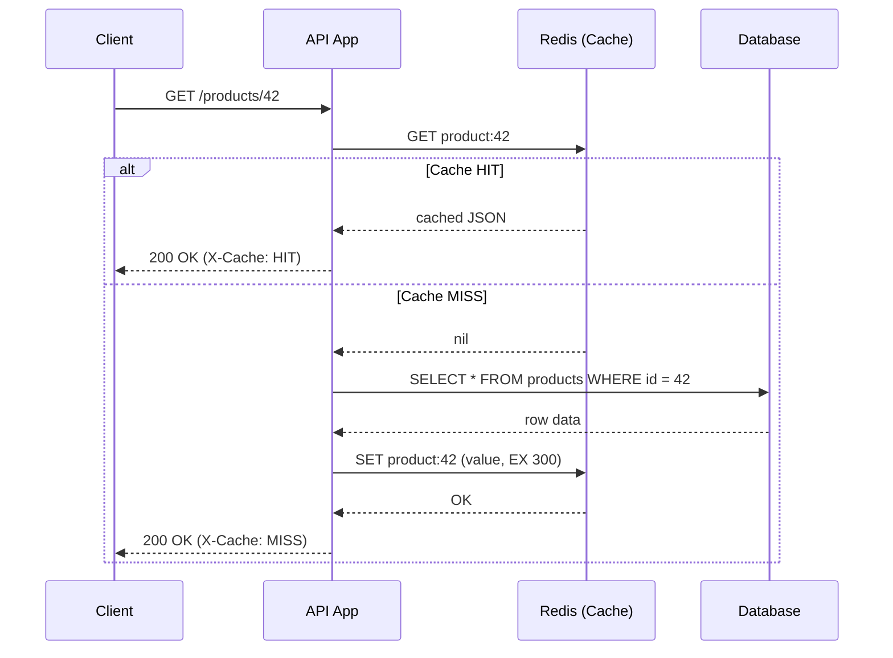

# Cache-Aside Pattern

## Why This Matters

Cache-aside (also called "lazy loading") is the default caching strategy in most API systems, and for good reason: it's the simplest pattern that gets the core benefit of caching — protecting the database from redundant reads — with the least amount of new infrastructure. If you only learn one caching pattern well, it should be this one, because it's also the pattern that every other strategy (write-through, write-behind, TTL-based expiry) gets compared against. Understanding *why* cache-aside works the way it does, and specifically *why* it puts the application in charge of populating the cache rather than the cache or database doing it automatically, sets up everything else in this part.

## Core Concept

Cache-aside describes a **read path** where the application code is directly responsible for managing the cache: check it, and if the answer isn't there, go get it and put it there yourself. The cache never talks to the database on its own — Redis, for example, has no idea a PostgreSQL database exists. All of the coordination lives in the application layer, which is precisely what "aside" means in the name: the cache sits *beside* the data flow, not *inside* it.

This is in contrast to two other strategies you'll meet in future chapters:

- **Write-through caching** (`write-through-caching.md`, planned): every write to the database also writes through to the cache at the same time, so the cache is always warm and consistent immediately after a write — at the cost of extra latency on every write, whether or not that data is ever read again.
- **Write-behind (write-back) caching**: writes go to the cache first and are asynchronously flushed to the database later, prioritizing write latency at the cost of durability risk if the cache fails before the flush happens.

Cache-aside makes the opposite trade-off from both of these: writes are simple (just write to the database, nothing else required), but the first read after a write — or after any TTL expiry — pays the full cost of a cache miss. This makes cache-aside a great fit for **read-heavy workloads**, which describes the overwhelming majority of API endpoints (product pages, user profiles, search results, dashboards).

## Mental Model

Picture a librarian who doesn't pre-shelve everything upfront. When you ask for a specific book, the librarian first checks a small "recently requested" cart near the front desk. If it's there, they hand it over instantly. If it's not, they walk into the stacks, find the book, bring it back — and *also* leave a copy in the front cart before handing you yours, so the next person who asks doesn't require another trip into the stacks.

This is exactly cache-aside: the "trip into the stacks" is the database query, the "front cart" is the cache, and the librarian's decision to leave a copy behind is the cache population step. Nobody pre-loads the cart in advance (that would be more like write-through); the cart fills up organically based on what's actually being asked for, which is why it's called "lazy" — it does the minimum necessary work, exactly when needed.

## How It Works

The read path has four explicit steps, and it's worth naming each one because production bugs usually trace back to skipping or mishandling one of them:

1. **Check the cache** using a well-defined cache key derived from the request (e.g., `product:42`).
2. **On hit**, deserialize and return the cached value immediately — the database is never touched for this request.
3. **On miss**, query the database (or perform the expensive computation) for the authoritative answer.
4. **Populate the cache** with the result, including a TTL, *before* returning the response — so the next request benefits.

The subtlety that trips up a lot of implementations is step 4: it must happen synchronously (or at least reliably) as part of handling the miss, not as an afterthought. If you return the response and then asynchronously (and unreliably) try to populate the cache, you can end up with an inconsistent cache state, or worse, silently never populate it at all if that background step fails and nobody notices.

There's also an important negative case: what happens when the *database* has no answer either (e.g., `product/99999` doesn't exist)? Naively, you might not cache anything, meaning every request for a nonexistent resource *always* falls through to the database — an easy target for abuse or accidental hot-looping clients. The mitigation, sometimes called **negative caching**, is to cache the "not found" result too, with a shorter TTL, so repeated lookups of a missing key don't repeatedly hammer the database.

## Architecture



The key detail visible in this diagram: the database is only ever consulted on the miss branch, and the cache population (`SET ... EX 300`) happens *before* the response is returned to the client, keeping the cache consistently ahead of the next request rather than racing it.

## Request / Response Example

First request for a resource (cold cache):

```http
GET /users/501/profile HTTP/1.1
```

```http
HTTP/1.1 200 OK
X-Cache: MISS
X-Response-Time: 84ms
Content-Type: application/json

{"id": 501, "name": "Priya Shah", "plan": "pro"}
```

Behind the scenes, this triggered:

```
> GET user_profile:501
(nil)
> SELECT id, name, plan FROM users WHERE id = 501;
> SET user_profile:501 '{"id":501,"name":"Priya Shah","plan":"pro"}' EX 300
OK
```

Second request, within the TTL window:

```http
GET /users/501/profile HTTP/1.1
```

```http
HTTP/1.1 200 OK
X-Cache: HIT
X-Response-Time: 2ms
Content-Type: application/json

{"id": 501, "name": "Priya Shah", "plan": "pro"}
```

```
> GET user_profile:501
"{\"id\":501,\"name\":\"Priya Shah\",\"plan\":\"pro\"}"
```

## Code Example

This example shows cache-aside as a reusable decorator, including **negative caching** and a basic **stampede mitigation** using a short-lived lock, so a burst of concurrent misses for the same key doesn't all hit the database simultaneously (a deeper treatment of stampedes is in [`cache-invalidation.md`](cache-invalidation.md)).

```python
import asyncio
import json
import os
from functools import wraps
from typing import Any, Awaitable, Callable

import redis.asyncio as redis

REDIS_URL = os.environ.get("REDIS_URL", "redis://localhost:6379/0")
redis_client = redis.from_url(REDIS_URL, decode_responses=True)

NEGATIVE_CACHE_TTL = 30  # short TTL for "not found" results
SENTINEL_NOT_FOUND = "__NOT_FOUND__"
LOCK_TTL = 5  # seconds; guards against stampede while DB is being queried


def cache_aside(key_template: str, ttl: int = 300):
    """Decorator implementing the cache-aside read pattern.

    `key_template` is a format string using the wrapped function's
    keyword arguments, e.g. "product:{product_id}".
    """

    def decorator(fetch_fn: Callable[..., Awaitable[Any]]):
        @wraps(fetch_fn)
        async def wrapper(**kwargs) -> dict[str, Any]:
            cache_key = key_template.format(**kwargs)

            cached = await redis_client.get(cache_key)
            if cached is not None:
                if cached == SENTINEL_NOT_FOUND:
                    return {"data": None, "cache": "HIT_NEGATIVE"}
                return {"data": json.loads(cached), "cache": "HIT"}

            # Stampede mitigation: only one caller performs the DB read;
            # others briefly wait and retry the cache instead of all
            # hitting the database at once for the same missing key.
            lock_key = f"lock:{cache_key}"
            acquired = await redis_client.set(lock_key, "1", nx=True, ex=LOCK_TTL)

            if not acquired:
                await asyncio.sleep(0.05)
                cached = await redis_client.get(cache_key)
                if cached is not None and cached != SENTINEL_NOT_FOUND:
                    return {"data": json.loads(cached), "cache": "HIT_AFTER_WAIT"}

            try:
                result = await fetch_fn(**kwargs)
            finally:
                await redis_client.delete(lock_key)

            if result is None:
                # Negative caching: avoid repeated DB hits for missing data.
                await redis_client.set(cache_key, SENTINEL_NOT_FOUND, ex=NEGATIVE_CACHE_TTL)
                return {"data": None, "cache": "MISS_NEGATIVE"}

            await redis_client.set(cache_key, json.dumps(result), ex=ttl)
            return {"data": result, "cache": "MISS"}

        return wrapper

    return decorator


@cache_aside(key_template="product:{product_id}", ttl=300)
async def get_product(product_id: int) -> dict[str, Any] | None:
    return await fetch_product_from_db(product_id)


async def fetch_product_from_db(product_id: int) -> dict[str, Any] | None:
    # Real implementation would query PostgreSQL via an async driver/ORM.
    ...
```

## Production Considerations

- **Read-heavy vs. write-heavy fit.** Cache-aside shines when reads vastly outnumber writes for the same key — a product page read thousands of times between price updates is ideal; a counter incremented on every request is a poor fit (see `write-through-caching.md` and rate-limiting patterns instead).
- **First-request penalty.** Every cache miss (cold start, TTL expiry, invalidation) pays full database latency. For latency-sensitive, high-traffic keys, consider proactive cache warming rather than relying purely on lazy population.
- **Consistency window.** Between a database write and the next cache miss/repopulation (or explicit invalidation), the cache can serve stale data. Combine cache-aside with explicit invalidation on writes (see [`cache-invalidation.md`](cache-invalidation.md)) when staleness is unacceptable.
- **Cache and database can diverge under partial failures.** If the cache-populate step fails after a successful database read, the request still succeeds (data was fetched) but the cache stays cold — handle this failure without breaking the response.

## Common Mistakes

- **Populating the cache before confirming the database read succeeded**, risking caching partial or error data.
- **Not caching "not found" results**, letting attackers or buggy clients cheaply force repeated database hits on nonexistent keys.
- **Forgetting stampede protection on high-traffic keys**, so an expiry during peak load causes dozens or hundreds of simultaneous database queries for the same data.
- **Using cache-aside for data that changes on nearly every read** (e.g., a live inventory count under heavy contention) where the miss rate approaches 100% and the cache adds overhead without benefit.
- **Mismatched serialization** between what's written to the cache and what's expected on read (e.g., changing a model's shape without also changing the cache key or invalidating old entries).

## Best Practices

- Always pair cache-aside with an explicit TTL, even if you also plan to invalidate on writes — treat TTL as your correctness safety net.
- Use negative caching with a shorter TTL for "not found" results to blunt hot-key abuse on missing data.
- Add stampede protection (a lock, or probabilistic early expiration — see [`cache-invalidation.md`](cache-invalidation.md)) for any key that's both high-traffic and expensive to recompute.
- Keep cache keys versioned or structured so a schema change to cached data doesn't require manually flushing unrelated keys.
- Measure hit rate per key pattern, not just globally — a 95% overall hit rate can hide a critical endpoint sitting at 10%.

## AI Engineering Perspective

Cache-aside is the base pattern underneath LLM response caching: check whether an identical (or, with semantic caching, a sufficiently similar) prompt has already been answered before paying for a new model call. The mechanics are the same — check, miss, call the expensive resource (here, the LLM API instead of the database), populate, return — but the stakes for stampede protection are higher: without a lock around concurrent identical LLM requests, a burst of simultaneous users asking the same popular question can trigger dozens of redundant, costly model calls in the same second. Part 15's prompt caching and semantic caching chapters build directly on this pattern, and Part 16's RAG chapters apply the same idea to caching retrieval results so identical or near-duplicate queries skip redundant vector search and reranking.

## Exercises

**Beginner**
1. Trace through, step by step, what happens on a cache miss for `GET /orders/77` using the cache-aside pattern, from the moment the request arrives to the moment the response is sent.
2. Why does cache-aside populate the cache *after* reading from the database, rather than before?

**Intermediate**
3. Design a negative-caching strategy for a `GET /coupons/{code}` endpoint where most lookups are for invalid or expired codes. What TTL would you choose, and why should it differ from the TTL for valid coupons?

**Advanced**
4. A single popular product's cache entry expires during a traffic spike, and 200 concurrent requests hit at once. Walk through what happens with and without the lock-based stampede mitigation shown in the code example, and identify the trade-off the lock introduces (hint: what happens to the requests that don't get the lock?).

## Key Takeaways

- Cache-aside is a read path fully managed by application code: check cache, miss, read database, populate cache, return.
- It optimizes for read-heavy workloads by keeping writes simple, at the cost of a cold-start penalty on every miss.
- Negative caching and stampede protection (locks or probabilistic early expiry) are essential additions for production traffic, not optional extras.
- It contrasts with write-through and write-behind caching, which shift work to the write path instead — covered in upcoming chapters.
- The same pattern extends directly to caching expensive LLM calls and retrieval results in AI systems.

---

Continue to [Cache Invalidation](cache-invalidation.md), or return to the [Part 7 index](README.md). See [`examples/redis-cache/`](../../examples/redis-cache/) for a working FastAPI implementation of this pattern.
