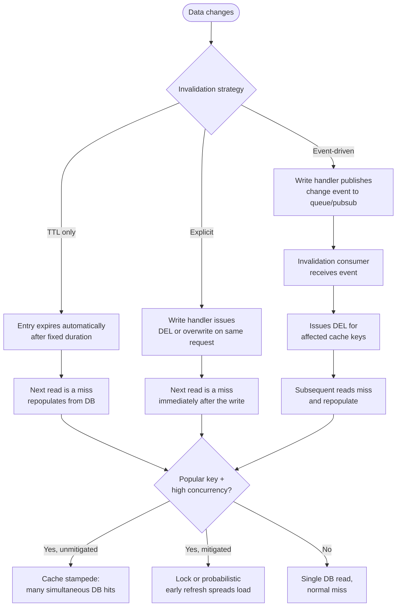

# Cache Invalidation

## Why This Matters

There's a well-worn joke in computer science, usually attributed to Phil Karlton: "There are only two hard things in Computer Science: cache invalidation and naming things." It's funny because it's true, and it's worth taking seriously rather than treating as a punchline. Cache invalidation is hard not because the *concept* is complicated — "remove or update a cache entry when the underlying data changes" is one sentence — but because getting it *reliably correct* under concurrency, partial failures, and distributed systems is genuinely difficult. A cache that's fast but wrong is worse than no cache at all, because wrong answers look exactly like right answers to your API consumers until someone notices the bug.

This chapter is the real answer to the joke: it walks through the actual strategies engineers use to keep caches correct, why each one exists, what it costs, and the specific failure mode — cache stampede — that catches almost every team by surprise at least once in production.

## Core Concept

Cache invalidation is the problem of keeping cached data consistent with its source of truth as that source of truth changes over time. There are three fundamental strategies, and virtually every real system is some combination of them:

1. **TTL-based expiry (passive).** Every cache entry is written with an expiration time. After that time elapses, Redis (or any cache) automatically discards it, and the next request becomes a miss that repopulates the cache with fresh data. This is passive: nobody has to *do* anything when the underlying data changes — staleness is simply bounded by the TTL window. The full mechanics of choosing TTLs are covered in the upcoming `ttl.md` chapter; here, TTL matters as one leg of the invalidation strategy.
2. **Explicit invalidation (active).** The application actively deletes or overwrites a cache entry at the exact moment the underlying data changes — e.g., when a product's price is updated via `PUT /products/42`, the handler also issues `DEL product:42` (or updates it directly) as part of the same operation. This gives you much tighter consistency than TTL alone, because there's no waiting for expiry — but it requires that *every* code path that changes the data also remembers to invalidate the cache, which is a discipline problem, not just a technical one.
3. **Event-driven invalidation.** Instead of every write handler remembering to invalidate caches inline, the system publishes an event when data changes (e.g., to a message queue or pub/sub channel), and one or more subscribers are responsible for invalidating relevant cache entries. This decouples "who changes the data" from "who's responsible for keeping the cache correct," which scales much better across multiple services or write paths, at the cost of additional infrastructure and, usually, a small amount of eventual consistency (the invalidation happens shortly after the write, not atomically with it).

A fourth technique, **stale-while-revalidate**, is a refinement rather than a fourth fundamental strategy: instead of treating an expired entry as unusable, you serve the stale value immediately while asynchronously refreshing it in the background. This trades a small, bounded amount of staleness for the elimination of the "everyone waits for the miss" latency spike — a good fit for data where "correct within the last few seconds" is good enough (a homepage feed, a trending list) but a bad fit for data that must never be shown wrong (an account balance).

## Mental Model

Think of invalidation strategies as three different answers to "how do I know when to throw out an old note?"

- **TTL** is like writing "best before [date]" on a sticky note — you don't need to know *when* the underlying fact changes, you just decide in advance how long you're willing to trust the note before treating it as suspect. Simple, robust, but imprecise: the note might go stale seconds after you write it, or stay accurate for way longer than the TTL — you don't know, and you don't try to know.
- **Explicit invalidation** is like a colleague who, the moment they change a shared fact, walks over and rips your outdated sticky note off the board. Precise, but only works if that colleague reliably remembers to do it every single time, from every place the fact can change (a manual admin panel, a background job, a data migration, a webhook handler) — miss one, and you have a note that's wrong indefinitely.
- **Event-driven invalidation** is like installing a notification system: whenever any fact changes anywhere in the building, a message goes out on the intercom, and everyone responsible for a sticky note listens for the announcement and updates their own. Nobody has to remember to walk over personally, but now you're depending on the intercom system working.

## How It Works

**TTL-based expiry** requires nothing beyond setting `EX` (or `PX` for milliseconds) when writing to Redis — the cache itself enforces the deadline. The trade-off is a direct dial: shorter TTL means fresher data but more cache misses (more database load); longer TTL means fewer misses but longer staleness windows.

**Explicit invalidation** typically happens inline with a write:

```
UPDATE products SET price = 79.99 WHERE id = 42;
DEL product:42          -- or SET product:42 <new value> EX 300 directly
```

The `DEL` approach is simpler and safer (next read repopulates naturally via cache-aside); directly overwriting with `SET` avoids one extra miss but requires the write path to construct the exact same serialized shape the read path expects — an easy source of subtle bugs if the two paths drift apart.

**Event-driven invalidation** decouples this: the write handler publishes `{"event": "product.updated", "id": 42}` to a queue or pub/sub channel, and a separate invalidation consumer (which might be the same service or a dedicated one) receives it and issues the `DEL`. This is especially valuable when multiple services or write paths can modify the same underlying data — each doesn't need its own copy of "and don't forget to invalidate the cache" logic; there's one listener responsible for it.

**Stale-while-revalidate** modifies the read path itself: when a cache entry is found but past its "soft" expiry (distinct from its hard TTL), the request handler returns the stale value immediately to the client and kicks off an async refresh in the background so the *next* request gets fresh data — nobody pays the full miss latency in the request path.

### The cache stampede problem

A **cache stampede** (also called a "dogpile" or "thundering herd") happens when a single popular cache key expires, and a large number of concurrent requests for that key all miss at the same instant. Every one of them independently falls through to the database, all doing the same expensive work simultaneously, at exactly the moment the database was supposed to be protected. For a genuinely hot key (a trending product, a homepage banner) with expiry hitting during peak traffic, this can spike database load from "one query" to "hundreds of identical concurrent queries" in a single moment — sometimes enough to take the database down.

Two standard mitigations:

- **Locking (mutex-based):** the first request to miss acquires a short-lived lock (e.g., `SET lock:key val NX EX 5` in Redis — "set if not exists") and performs the database read; concurrent requests that fail to acquire the lock either wait briefly and retry the cache, or serve a slightly stale fallback, rather than all hitting the database. This is the technique shown in the [`cache-aside.md`](cache-aside.md) code example.
- **Probabilistic early expiration:** each read, as the entry approaches its TTL, has a small and increasing random chance of treating the entry as "expired early" and refreshing it — proactively, before the hard deadline, and only for a small fraction of requests rather than all of them at once. This spreads the refresh load out over time instead of concentrating it at one instant, and is the mechanism behind the well-known XFetch algorithm.

## Architecture



## Request / Response Example

Explicit invalidation on write, shown as Redis commands alongside the API call that triggers them:

```http
PUT /products/42 HTTP/1.1
Content-Type: application/json

{"price": 79.99}
```

```
> DEL product:42
(integer) 1
```

```http
HTTP/1.1 200 OK
X-Cache-Invalidated: product:42
```

Next read, immediately after — a guaranteed miss that repopulates with fresh data:

```http
GET /products/42 HTTP/1.1
```

```http
HTTP/1.1 200 OK
X-Cache: MISS
Content-Type: application/json

{"id": 42, "name": "Wireless Mechanical Keyboard", "price": 79.99}
```

Compare this to a system relying on TTL alone, where the same `GET /products/42` immediately after the price update could still return `X-Cache: HIT` with the stale `89.99` price for up to the remaining TTL window — a concrete illustration of why explicit invalidation matters for data where "briefly wrong" is unacceptable.

## Code Example

```python
import asyncio
import json
import os
import random
import time
from typing import Any

import redis.asyncio as redis

REDIS_URL = os.environ.get("REDIS_URL", "redis://localhost:6379/0")
redis_client = redis.from_url(REDIS_URL, decode_responses=True)


async def update_product_price(product_id: int, new_price: float) -> None:
    """Explicit invalidation: write to the DB, then invalidate the cache
    as part of the same operation so no stale read is possible after
    this function returns."""
    await update_price_in_db(product_id, new_price)  # source of truth first
    await redis_client.delete(f"product:{product_id}")


async def update_price_in_db(product_id: int, new_price: float) -> None:
    ...  # real DB write via SQLAlchemy/asyncpg


# --- Probabilistic early expiration (a simplified XFetch-style approach) ---

CACHE_TTL = 300          # hard TTL, seconds
BETA = 1.0                # tuning constant; higher = more aggressive early refresh


async def get_with_early_refresh(
    product_id: int, fetch_fn, ttl: int = CACHE_TTL
) -> dict[str, Any]:
    key = f"product:{product_id}"
    meta_key = f"{key}:meta"  # stores when the value was computed + how long it took

    cached = await redis_client.get(key)
    meta_raw = await redis_client.get(meta_key)

    if cached is not None and meta_raw is not None:
        meta = json.loads(meta_raw)
        now = time.time()
        delta = meta["compute_time"]          # how long the DB read took
        cached_at = meta["cached_at"]
        # XFetch-style check: probabilistically treat the entry as expired
        # *before* its real TTL, with rising probability as expiry nears.
        should_refresh_early = (
            now - (delta * BETA * abs(random.random() and random.gauss(0, 1) or 0))
            >= cached_at + ttl
        )
        if not should_refresh_early:
            return {"data": json.loads(cached), "cache": "HIT"}

    # Miss, or probabilistically chosen for early refresh: recompute.
    start = time.time()
    fresh = await fetch_fn(product_id)
    compute_time = time.time() - start

    await redis_client.set(key, json.dumps(fresh), ex=ttl)
    await redis_client.set(
        meta_key,
        json.dumps({"cached_at": time.time(), "compute_time": compute_time}),
        ex=ttl,
    )
    return {"data": fresh, "cache": "MISS_OR_EARLY_REFRESH"}
```

The lock-based stampede mitigation (a simpler and more commonly reached-for alternative to probabilistic early expiration) is shown in full in [`cache-aside.md`](cache-aside.md); the two techniques solve the same problem and are rarely used together — pick one based on whether you prefer "one refresher, everyone else waits" (locking) or "spread refreshes probabilistically over time" (early expiration).

## Production Considerations

- **Every write path must be accounted for.** Explicit invalidation only works if *every* place data can change — API handlers, admin tools, background jobs, data migrations, direct database edits — also triggers invalidation. Missing even one path is a common source of "the cache is randomly wrong" bugs.
- **Invalidate on writes, but never rely on invalidation alone.** Always keep a TTL as a safety net; if an invalidation code path is ever missed or fails silently, the TTL guarantees eventual correctness instead of permanent staleness.
- **Event-driven invalidation adds infrastructure and a consistency window.** Between the write and the consumer processing the invalidation event, a stale read is still possible — decide whether that window (usually milliseconds) is acceptable for your use case.
- **Cache stampedes get worse, not better, under load** — the traffic spike that makes a popular key expire under heavy concurrency is exactly when your database is least able to absorb a sudden burst of duplicate queries. Mitigate proactively for known-hot keys, not reactively after an incident.

## Common Mistakes

- **Caching error responses.** If a downstream call fails and your code accidentally caches the error (or an empty/partial result) as if it were a valid answer, every subsequent request gets the cached failure until the TTL expires — often much longer than the original outage.
- **Assuming TTL alone is "good enough" invalidation** for data with strict consistency requirements, without measuring whether the staleness window actually matters to users.
- **Invalidating the wrong key** due to inconsistent key naming between the read and write paths (e.g., `product:42` vs `products:42`).
- **No stampede protection on known-hot keys**, discovered only after an incident where a popular item's cache expiry took down the database.
- **Forgetting to invalidate related/derived caches** — e.g., invalidating `product:42` but not a `category:5:products` list that embeds product 42's stale data.

## Best Practices

- Default to combining TTL (as a safety net) with explicit invalidation (for immediacy) rather than choosing only one.
- For data changed by multiple services or write paths, prefer event-driven invalidation over expecting every write path to remember inline invalidation.
- Add stampede protection specifically for keys you know are both hot and expensive — don't apply it uniformly everywhere if it's not needed.
- Never cache a failed or error response; check for success before writing to the cache.
- Use stale-while-revalidate for data where a few seconds of staleness is invisible to users but a miss-latency spike is not.

## AI Engineering Perspective

Invalidation gets genuinely harder in AI systems because the "source of truth" is often fuzzier than a database row. A cached LLM response tied to a knowledge base article is stale the moment that article is edited — but unlike a `DEL product:42` on a clean primary key, invalidating "every cached response that might have used this document" (in a RAG system) can require tracking which cache entries were derived from which source documents. Semantic caches (Part 15) compound this further: a cache entry keyed by "meaning" rather than an exact string doesn't have one obvious key to delete when the underlying data changes — invalidation may require re-embedding and comparing, or simply leaning more heavily on TTL as the primary staleness control since explicit invalidation is much harder to target precisely. This is part of why AI system caching (Part 15, Part 16) often uses shorter TTLs and more conservative freshness guarantees than typical database-backed API caching.

## Exercises

**Beginner**
1. Explain, in your own words, the difference between TTL-based expiry and explicit invalidation, and give one example scenario where each is the better choice.
2. Why is caching an error response worse than not caching at all?

**Intermediate**
3. Design an event-driven invalidation flow for a blog platform where posts can be edited from both a web admin panel and a bulk-import script. What event would you publish, and what would the invalidation consumer do?

**Advanced**
4. Compare lock-based stampede mitigation and probabilistic early expiration for a highly popular, expensive-to-compute cache key (e.g., a homepage recommendation list). Under what traffic pattern would you prefer one over the other, and what happens to user-perceived latency in each case during the refresh window?

## Key Takeaways

- Cache invalidation has three fundamental strategies — TTL-based expiry, explicit invalidation, and event-driven invalidation — and most production systems combine at least two.
- TTL should always be present as a safety net, even when explicit or event-driven invalidation is the primary mechanism.
- A cache stampede occurs when a hot key's expiry causes many concurrent requests to miss simultaneously and overwhelm the database; locking and probabilistic early expiration are the two standard mitigations.
- Never cache an error or failed response — it turns a transient failure into a sustained one for the length of the TTL.
- Invalidation gets structurally harder in AI systems where cache keys are semantic rather than exact, making event-driven and TTL-based approaches more important than precise explicit invalidation.

---

Continue to [Latency and P95/P99](latency-and-percentiles.md), or return to the [Part 7 index](README.md). See also [`../04-databases-and-apis/README.md`](../04-databases-and-apis/README.md) for the database side of this trade-off.
