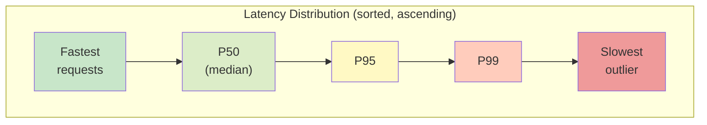
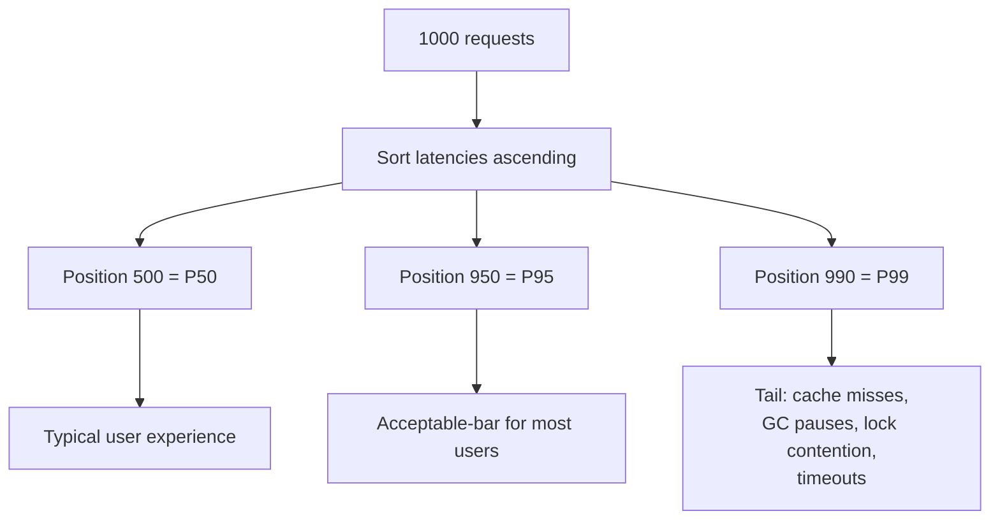

# Latency and P95/P99

## Why This Matters

If you take one measurement habit from this entire handbook, it should be this: **averages lie, and percentiles tell the truth.** Every previous chapter in this part — cache-aside, Redis, invalidation — exists to reduce latency and database load, but you can't know whether any of it actually worked if you're only looking at the average response time. A cache that dramatically speeds up 95% of requests while leaving the remaining 5% just as slow (or slower, due to stampede-induced contention) can produce an average that looks great while a meaningful slice of your users have a bad experience every single day. Understanding percentiles is what lets you see past that illusion — and it's the correct lens for evaluating everything else in this part.

## Core Concept

**Latency** is the time between a client sending a request and receiving a response. It sounds simple, but a single number "the latency" doesn't exist for any real system — latency is a *distribution*: some requests are fast, some are slow, and the shape of that distribution matters far more than any single summary statistic.

The **average (mean)** latency is the sum of all response times divided by the count. It's easy to compute and easy to misread. The core problem: an average is dominated by the bulk of typical requests and can completely hide a smaller but significant population of slow ones. If 990 requests take 10ms and 10 requests take 5,000ms (a real database timeout or lock contention scenario), the average is about 60ms — a number that looks perfectly healthy, while 1% of your users are waiting five full seconds.

**Percentiles** answer a more honest question: "what response time do X% of requests fall at or below?"

- **P50 (median):** half of all requests are faster than this, half are slower. This is a reasonable "typical" experience number.
- **P95:** 95% of requests are faster than this value; the slowest 5% are worse. This is the standard bar for "is my system acceptably fast for almost everyone."
- **P99:** 99% of requests are faster than this value; the slowest 1% are worse. This captures the tail — often the requests that hit a cache miss, a lock, a garbage collection pause, a network hiccup, or a downstream timeout.
- **P99.9** and beyond are used for very large-scale systems where even a 0.1% tail represents thousands of real, frustrated users per day.

Why does the tail matter so much? Because for any individual user, a single slow request is a bad experience regardless of how fast the *average* request was. And in systems with multiple dependent calls per user action (fan-out), the tail compounds — covered in detail below.

## Mental Model

Imagine a coffee shop that proudly advertises "average wait time: 45 seconds." That sounds great — until you learn that 9 out of 10 customers are served in 20 seconds, but 1 in 10 waits 4 minutes because the espresso machine periodically jams and needs a manual reset. The average hides this completely; the P90 (90th percentile) would immediately reveal it, because it specifically measures "how bad is the experience for the worst 10%?"

Now imagine that same coffee shop with caching: the barista pre-memorizes the 20 most common orders (like a warm cache). Ordering one of those 20 drinks is now instant — this shifts P50 and P95 down dramatically. But if the espresso machine jam is unrelated to which drink was ordered, P99 barely moves — the tail is caused by a different failure mode than the one caching fixes. This is exactly the situation you'll encounter in real systems: caching improves the "typical" case aggressively but often does little for tail latency caused by contention, cold starts, timeouts, or resource exhaustion, which is why P99 needs to be watched independently from P50.

## How It Works

To compute a percentile from raw data: sort every recorded latency value in ascending order, then walk to the position that's X% of the way through the sorted list. For 1,000 sorted latency samples, the P95 is (approximately) the value at index 950; the P99 is the value at index 990.

In production, you don't literally sort every raw sample forever — that's memory-expensive at scale. Real observability systems use approximation algorithms (histograms with bucketed ranges, or streaming sketches like t-digest or HDRHistogram) that estimate percentiles accurately with bounded memory, updated continuously as requests stream in. Most APM tools (Prometheus histograms, Datadog, New Relic) expose P50/P95/P99 directly as dashboard metrics using these techniques — you rarely compute this by hand in production, but understanding the underlying math is what lets you interpret those dashboards correctly and avoid being misled by an average sitting quietly next to them.

### How caching changes the shape of the distribution

Before caching, most requests hit the database, so the latency distribution clusters around "typical database query time" (say, 80–150ms) with a tail extending out from slow queries, lock contention, or connection pool exhaustion.

After introducing cache-aside caching with a high hit rate, the distribution becomes **bimodal**: a large cluster of very fast cache-hit responses (1–5ms) and a smaller cluster of cache-miss responses that still pay full database latency (80–150ms or worse). P50 and P95 usually drop sharply, because most traffic now falls in the fast cluster. But P99 may barely improve, or can even *worsen* under a cache stampede, because the tail is made up almost entirely of misses — and if those misses cluster together (e.g., right after a popular key expires), they can experience *more* contention than they would have without a cache, since the database wasn't being hit at all during the "warm" period and now has to absorb a spike.

### Tail latency amplification in fan-out systems

This is the concept that makes percentiles non-optional to understand for any nontrivial system. Suppose a single user-facing API call internally fans out to five backend calls (e.g., a "checkout" endpoint that calls inventory, pricing, tax, shipping, and payment services) and must wait for *all five* to complete before responding. If each individual backend call has a P99 of "1 in 100 requests is slow," then the probability that *at least one* of the five calls is slow on any given user request is meaningfully higher than 1% — approximately `1 - (0.99)^5 ≈ 4.9%`. The overall user-facing P99 gets amplified by the fan-out factor: what was a rare tail event for one service becomes a much more common event for the composed system. This is why teams operating microservice architectures obsess over P99 (and even P99.9) at the individual service level — tail latency compounds across every hop in a call graph, and caching is one of the most effective tools for shrinking the tail's contribution at each hop before it compounds.

## Architecture





## Request / Response Example

A latency report comparing average vs. percentiles for the same endpoint over a one-hour window — this is the kind of summary a monitoring dashboard or APM tool would surface, and the format worth learning to read at a glance:

```json
{
  "endpoint": "GET /products/{id}",
  "window": "2026-08-18T14:00:00Z/2026-08-18T15:00:00Z",
  "sample_count": 148302,
  "latency_ms": {
    "avg": 14.2,
    "p50": 3.1,
    "p95": 9.8,
    "p99": 187.4,
    "p99_9": 512.0
  },
  "cache_hit_rate": 0.94
}
```

Notice how misleading the average (14.2ms) looks in isolation — it seems to imply a mostly-fast, occasionally-slightly-slower system. The percentiles tell the real story: the *typical* request (P50) is extremely fast at 3.1ms (a cache hit), P95 is still healthy at 9.8ms, but P99 jumps to 187ms — nearly 20x the P50 — because the slowest 1% of requests are cache misses hitting the database, and a smaller fraction of those (P99.9) are hitting something worse still, like lock contention or a slow query plan.

## Code Example

```python
import statistics
from dataclasses import dataclass


@dataclass
class LatencyReport:
    count: int
    avg_ms: float
    p50_ms: float
    p95_ms: float
    p99_ms: float


def compute_percentile(sorted_values: list[float], percentile: float) -> float:
    """Nearest-rank method: simple and adequate for illustration.

    Production systems typically use streaming approximations
    (e.g., t-digest, HDRHistogram) instead of sorting raw samples,
    since sorting all samples doesn't scale to millions of requests
    held in memory — but the underlying math is identical.
    """
    if not sorted_values:
        raise ValueError("no latency samples provided")

    # Clamp the rank into a valid index range.
    rank = max(0, min(len(sorted_values) - 1, int(round(percentile / 100 * len(sorted_values))) - 1))
    return sorted_values[rank]


def build_latency_report(latencies_ms: list[float]) -> LatencyReport:
    sorted_latencies = sorted(latencies_ms)
    return LatencyReport(
        count=len(sorted_latencies),
        avg_ms=round(statistics.mean(sorted_latencies), 2),
        p50_ms=round(compute_percentile(sorted_latencies, 50), 2),
        p95_ms=round(compute_percentile(sorted_latencies, 95), 2),
        p99_ms=round(compute_percentile(sorted_latencies, 99), 2),
    )


# Simulated sample: mostly cache hits (fast), a tail of cache misses (slow).
cache_hits = [round(1 + 3 * (i % 5) / 5, 2) for i in range(950)]      # ~1-4ms
cache_misses = [round(90 + 120 * (i % 10) / 10, 2) for i in range(50)]  # ~90-210ms

report = build_latency_report(cache_hits + cache_misses)
print(report)
# LatencyReport(count=1000, avg_ms=10.1, p50_ms=2.6, p95_ms=3.8, p99_ms=199.0)
```

The simulated output mirrors the JSON example above: the average is dragged only modestly by the tail, P50/P95 look excellent, and P99 exposes the cache-miss population that the average almost entirely conceals.

## Production Considerations

- **Alert on P95/P99, not on average latency.** An average-based alert can stay silent while a real subset of users experiences serious degradation.
- **Track percentiles per-endpoint and per-cache-status (hit vs. miss) separately.** A blended P99 across hits and misses tells you less than knowing the miss-path P99 specifically — the miss path is where fixes usually need to happen.
- **Watch P99 after any caching change.** A new cache can dramatically improve P50 while leaving P99 unchanged or, if it introduces stampede risk, making it worse — the two numbers can move independently.
- **Fan-out amplification means service-level P99 targets should be tighter than your user-facing target.** If the user-facing SLA is P99 < 500ms across five sequential dependent calls, each individual service needs a P99 target well under 500ms/5 to leave margin for amplification.
- **Sample size matters for percentile trustworthiness.** P99 computed from only 50 requests is noisy and can swing wildly; percentiles need a reasonably large sample window to be meaningful.

## Common Mistakes

- **Reporting only average latency in dashboards, incident reviews, or SLAs** — this is the single most common and most consequential mistake in this chapter's scope.
- **Conflating P95 and P99 as interchangeable "good enough" tail metrics** — they can tell very different stories, especially in fan-out systems.
- **Not segmenting latency by cache hit/miss**, making it impossible to tell whether a caching change actually helped the tail or only the median.
- **Ignoring fan-out amplification** when setting per-service latency targets, leading to a user-facing SLA that's mathematically impossible to meet even if every individual service "looks fine" on its own dashboard.
- **Computing percentiles from too small a sample** and treating the noisy result as a stable signal.

## Best Practices

- Always report P50, P95, and P99 (and P99.9 for very large-scale systems) alongside — never instead of — the average.
- Segment latency metrics by cache status, endpoint, and (where relevant) region or tenant, rather than relying on one global number.
- Set SLOs (Service Level Objectives) in terms of percentiles ("P99 < 300ms"), not averages — this ties directly into the SLI/SLO/SLA concepts covered in Part 12's observability chapters.
- When designing fan-out call graphs, budget latency per hop with the amplification effect in mind, not just the sum of "typical" per-hop latencies.
- Use histogram-based or streaming percentile approximations (t-digest, HDRHistogram) in production rather than sorting raw samples at scale.

## AI Engineering Perspective

Latency percentiles matter even more in AI-backed APIs because the underlying latency distribution is inherently wider and less predictable than a database query. An LLM completion's latency depends on output length, model load, and provider-side queueing — a P50 of 800ms next to a P99 of 8 seconds is common and not necessarily a bug, just the nature of generative inference. This is exactly why prompt caching and semantic caching (Part 15) are evaluated the same way caching is evaluated here: by their effect on the *distribution*, not the average — a semantic cache that produces a fast P50 but does nothing for P99 (because novel queries still require a full model call) is working as intended, not broken. In multi-step AI agent or RAG pipelines (Parts 16 and 17), each step — retrieval, reranking, generation — is its own fan-out hop, and the tail-amplification math above applies directly: a pipeline with five sequential AI-powered steps, each with a P99 tail, compounds into a much worse end-to-end tail than any single step suggests, which is a primary reason production AI systems invest heavily in per-step caching and timeouts rather than only optimizing the "happy path."

## Exercises

**Beginner**
1. Given the latency samples `[10, 12, 11, 9, 10, 400, 11, 10, 12, 9]` (milliseconds), compute the average by hand, then identify which value is likely to dominate the P99 and why the average understates the problem.
2. Explain in one paragraph why an alerting system based only on average latency could fail to catch a real user-facing problem.

**Intermediate**
3. An endpoint has P50 = 4ms, P95 = 8ms, P99 = 220ms, with a 92% cache hit rate. Propose two concrete hypotheses for what's causing the P99 tail, and how you would confirm each using the tools/metrics described in this chapter.

**Advanced**
4. A user-facing endpoint fans out to four independent backend calls, each with an independent P99 of 2% (i.e., a 2% chance any single call exceeds the target latency). Estimate the probability that the user-facing request exceeds that same target latency due to at least one slow backend call, and discuss what per-service P99 target you'd need to keep the user-facing failure rate under 1%.

## Key Takeaways

- A latency distribution, not a single average number, describes how an API actually performs — averages routinely hide serious tail problems.
- P50, P95, and P99 each answer a different question: typical experience, near-universal acceptable bound, and worst-case-for-the-unlucky-few, respectively.
- Caching typically improves P50 and P95 dramatically by creating a fast "hit" cluster, but often has a much smaller (or even negative, under stampede) effect on P99, which is dominated by the miss path.
- In fan-out systems, individual-service tail latency compounds across calls — a rare per-service tail event becomes a much more common user-facing event.
- Always alert, report, and set SLOs on percentiles, never on averages alone.

---

Return to the [Part 7 index](README.md). Continue conceptually to [Part 15 — Production AI Systems](../15-production-ai-systems/README.md), where prompt and semantic caching apply these exact ideas to LLM latency.
