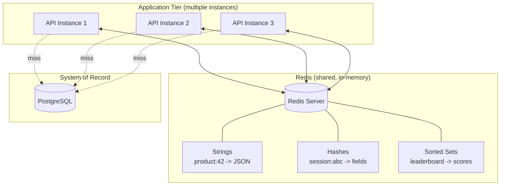

# Redis

## Why This Matters

"Redis is just a cache" is one of the most common — and most limiting — misconceptions in API engineering. Understood only as a cache, you'll reach for it exactly once, for exactly one pattern (cache-aside), and miss the rest of what makes it one of the most widely deployed pieces of infrastructure in modern backend systems: rate limiting counters, session stores, leaderboards, job queues, distributed locks, pub/sub messaging, and real-time analytics all run on the same tool. Understanding *what Redis actually is* — an in-memory data structure server — unlocks all of these uses, and makes the caching patterns in the rest of this part (cache-aside, invalidation, TTL) feel like special cases of a more general and more powerful tool.

## Core Concept

Redis (**RE**mote **DI**ctionary **S**erver) is an in-memory data structure store that can be used as a database, cache, message broker, and more. The critical phrase is "data structure store," not "key-value cache." A plain key-value cache lets you store and retrieve opaque blobs by key. Redis goes further: it natively understands strings, hashes, lists, sets, sorted sets, streams, and bitmaps, and it exposes atomic, purpose-built commands for each — increment a counter, push onto a queue, add to a set, get the top N scores from a leaderboard — all executed in-memory, all in sub-millisecond time, all without you writing serialization or locking logic yourself.

This matters for API engineering because a huge share of backend problems are really just "store some data and answer questions about it fast," and Redis's data structures map directly onto common API needs: rate limiter → sorted set or counter with TTL; session store → hash; job queue → list; unique-visitors-today → set; trending-posts leaderboard → sorted set. Reducing all of that to "a cache" throws away most of what you'd actually use it for.

## Mental Model

Think of Redis as a very fast, very disciplined whiteboard that the entire application shares. Any process — your API server, a background worker, a scheduled job — can write to it and read from it, and everyone sees the same board immediately, because it lives in memory on one (or a clustered set of) dedicated server(s), not inside any single application process. Unlike a whiteboard, it enforces structure: instead of scribbling freeform notes, you write in one of a few well-defined shapes (a string, a list, a set...), and Redis gives you atomic tools for manipulating each shape correctly even when many people are writing to it concurrently.

Contrast this with an in-process cache (e.g., a Python dict, or `functools.lru_cache`) which lives inside a single application instance's memory: fast, but invisible to every other instance of your API running behind a load balancer, and wiped out the moment that process restarts. Redis solves both problems: it's shared across every instance of your application, and it survives individual application restarts (though not necessarily a Redis restart, depending on persistence configuration — more below).

## How It Works

Redis achieves its speed through a combination of design decisions:

- **Everything lives in RAM.** There's no disk seek, no page cache miss, no B-tree traversal on the hot path — reading a value is a memory lookup, which is roughly 100,000x faster than a disk seek and still meaningfully faster than even an indexed database row fetch (which involves query parsing, planning, locking, and buffer management).
- **Single-threaded command execution (per core, in modern versions).** Historically Redis processed one command at a time on a single thread. This sounds like a limitation, but it's actually a major simplification: there's no lock contention between commands, so every operation on a data structure is naturally atomic — no race conditions to reason about, no need for application-level locking for basic operations like `INCR`. Redis 6+ added I/O threading for network handling, and Redis 7+ improved multi-threading further, but command execution atomicity remains a core guarantee.
- **Purpose-built data structures with O(1) or O(log N) operations.** A `HASH` lets you get or set one field of an object without deserializing the whole thing. A `SORTED SET` maintains order automatically via a skip list, so "give me the top 10 scores" is a fast range query, not an application-side sort. This is fundamentally different from treating Redis as a bag of JSON blobs.
- **A simple, text-based protocol (RESP)** with minimal overhead per command, which keeps round-trip latency low even over a network.

### Data structures relevant to API work

| Structure | Command examples | Typical API use |
|---|---|---|
| **String** | `SET`, `GET`, `INCR`, `EXPIRE` | Cached JSON blobs, counters, feature flags, rate-limit counters |
| **Hash** | `HSET`, `HGET`, `HGETALL` | Storing an object's fields (e.g., a user session or profile) without re-serializing the whole thing on every field update |
| **List** | `LPUSH`, `RPUSH`, `LPOP`, `BRPOP` | Simple job/task queues, activity feeds (bounded with `LTRIM`) |
| **Set** | `SADD`, `SISMEMBER`, `SINTER` | Unique visitor tracking, tag membership, deduplication |
| **Sorted Set** | `ZADD`, `ZRANGE`, `ZINCRBY` | Leaderboards, rate limiting with sliding windows, "trending" rankings by score |

### Persistence

Redis is in-memory first, but it's not necessarily volatile. Two mechanisms let it survive restarts:

- **RDB (snapshotting):** periodically writes the entire dataset to disk as a compact binary snapshot. Fast to restore, but you can lose data written since the last snapshot.
- **AOF (append-only file):** logs every write operation to disk as it happens (with configurable fsync frequency). More durable, slightly slower, and produces larger files, but minimizes data loss.

For pure caching use cases, persistence is often disabled or minimal — if Redis restarts and the cache is empty, the cache-aside pattern just repopulates it from the database on the next miss. For Redis used as a system of record (session store, queue), persistence matters much more.

## Architecture



All API instances talk to the *same* Redis, which is what makes it useful as a shared cache and shared state store across a horizontally scaled fleet — unlike an in-process cache, which would be inconsistent across instances.

## Request / Response Example

Redis commands, issued via `redis-cli`, shown as request/response pairs — this is the same protocol your application's Redis client speaks under the hood:

```
> SET product:42 '{"id":42,"name":"Mechanical Keyboard","price":89.99}' EX 300
OK
```

```
> GET product:42
"{\"id\":42,\"name\":\"Mechanical Keyboard\",\"price\":89.99}"
```

```
> TTL product:42
(integer) 287
```

```
> HSET session:abc123 user_id 7 role "admin" last_seen 1755500000
(integer) 3
```

```
> HGET session:abc123 role
"admin"
```

```
> ZADD trending_posts 542 "post:9001"
(integer) 1
> ZREVRANGE trending_posts 0 2 WITHSCORES
1) "post:9001"
2) "542"
```

The `EX 300` in the first command sets a TTL of 300 seconds directly on write — this is the single most important habit to build, and it's the topic of the upcoming `ttl.md` chapter.

## Code Example

```python
import os

import redis.asyncio as redis

REDIS_URL = os.environ.get("REDIS_URL", "redis://localhost:6379/0")
redis_client = redis.from_url(REDIS_URL, decode_responses=True)


async def cache_product_string(product_id: int, payload: str) -> None:
    """String use case: cache a serialized product with a TTL."""
    await redis_client.set(f"product:{product_id}", payload, ex=300)


async def update_session_field(session_id: str, field: str, value: str) -> None:
    """Hash use case: update one field of a session object without
    reading/deserializing/rewriting the entire session blob."""
    await redis_client.hset(f"session:{session_id}", field, value)
    # Sessions should still expire — hashes support TTL on the whole key.
    await redis_client.expire(f"session:{session_id}", 1800)


async def record_unique_visitor(day: str, user_id: int) -> int:
    """Set use case: count unique visitors per day without duplicates."""
    key = f"visitors:{day}"
    await redis_client.sadd(key, user_id)
    await redis_client.expire(key, 60 * 60 * 24 * 2)  # keep 2 days
    return await redis_client.scard(key)


async def bump_trending_score(post_id: int, amount: int = 1) -> float:
    """Sorted set use case: maintain a live leaderboard of trending posts."""
    return await redis_client.zincrby("trending_posts", amount, f"post:{post_id}")


async def top_trending_posts(count: int = 10) -> list[tuple[str, float]]:
    # Returns (member, score) pairs, highest score first.
    return await redis_client.zrevrange("trending_posts", 0, count - 1, withscores=True)
```

## Production Considerations

- **Memory is finite.** Redis holds everything in RAM, so uncontrolled key growth (no TTLs, unbounded lists/sets) can exhaust memory and trigger eviction or OOM errors. Configure a `maxmemory` policy (e.g., `allkeys-lru`) as a safety net, but don't rely on it as your primary TTL strategy.
- **Single-threaded execution means slow commands block everything.** Commands like `KEYS *` (scans the entire keyspace) or large `SORT`/`SMEMBERS` on huge collections can stall all other clients. Use `SCAN` instead of `KEYS` in production, and be deliberate about data structure sizes.
- **Redis is a single point of failure unless deployed for high availability.** Production deployments typically use Redis Sentinel (automated failover) or Redis Cluster (sharding + replication) rather than a single instance — this becomes especially relevant in the upcoming `distributed-caching.md` chapter.
- **Network latency still applies.** Redis is fast, but it's still a network hop. Batch operations with pipelining or `MGET`/`MSET` when fetching many keys at once, rather than issuing N sequential round trips.

## Common Mistakes

- **Treating Redis purely as a JSON blob store** and ignoring hashes, sets, and sorted sets — this pushes work (filtering, ranking, deduplication) into the application that Redis could do natively and faster.
- **Forgetting to set a TTL**, especially on data structures other than simple strings — hashes, sets, and sorted sets can also expire, but it's easy to forget since the `HSET`/`SADD`/`ZADD` commands themselves don't take a TTL argument.
- **Using `KEYS *` in application code or scripts against a production instance** — this blocks the single-threaded event loop and can cause a latency spike across every client connected to that Redis instance.
- **Storing huge values in a single key** (e.g., an entire 50MB dataset as one string) instead of breaking it into structured, independently-accessible pieces.
- **Assuming Redis data survives forever by default** — without persistence configured, a Redis restart wipes everything; understand whether your use case needs RDB/AOF or can tolerate loss.

## Best Practices

- Pick the data structure that matches your access pattern, not just "string with JSON in it," when the access pattern calls for partial reads/writes or ordering.
- Always set explicit TTLs on cache-related keys, and be intentional about which keys are meant to be durable (sessions, queues) vs. ephemeral (cache entries).
- Use consistent, namespaced key naming (`resource:id`, `session:id`, `leaderboard:name`) to avoid collisions and make debugging easier.
- Use pipelining or multi-key commands (`MGET`, `MSET`) to reduce round trips when working with many keys at once.
- Monitor memory usage, eviction counts, and slow log entries in production — Redis exposes `INFO`, `SLOWLOG`, and `MEMORY` commands specifically for this.

## AI Engineering Perspective

Redis shows up constantly in AI-backed API infrastructure beyond simple response caching. Rate limiting LLM API calls per user or per API key (a sorted set tracking request timestamps in a sliding window) prevents runaway token spend. Session and conversation state for chat APIs is naturally modeled as a Redis hash or list (message history), giving fast reads without round-tripping to a primary database on every turn. Semantic caching layers (covered in [Part 15](../15-production-ai-systems/README.md)) often use Redis alongside a vector index to store both the cached completion and metadata about the embedding that produced the hit. And in RAG pipelines (Part 16), Redis frequently caches intermediate results — retrieved chunks, reranked candidates — so that repeated or near-duplicate queries don't re-run expensive retrieval and reranking steps.

## Exercises

**Beginner**
1. For each of the following, name the Redis data structure you'd use and why: (a) a per-user daily API call counter, (b) a shopping cart's line items, (c) a set of currently online user IDs.
2. Write the Redis commands (as you would type them in `redis-cli`) to cache a user's profile as a hash with fields `name` and `email`, and set the whole hash to expire in 10 minutes.

**Intermediate**
3. Explain why `KEYS *` is dangerous in production Redis but `SCAN` is safe, in terms of how Redis processes commands.
4. Design a sorted-set-based "top 5 most viewed articles today" feature, including how you'd reset it at midnight.

**Advanced**
5. Your Redis instance is approaching its memory limit. Compare the trade-offs of (a) setting `maxmemory-policy allkeys-lru`, (b) auditing and shortening TTLs, and (c) scaling to a Redis Cluster. When would you choose each?

## Key Takeaways

- Redis is an in-memory *data structure* store, not just a key-value cache — strings, hashes, lists, sets, and sorted sets each map to different API problems beyond caching.
- Its speed comes from RAM-only storage, single-threaded atomic command execution, and purpose-built structures with efficient operations.
- Persistence (RDB/AOF) is optional and configurable — decide per use case whether Redis is disposable cache or a system of record.
- Matching your data structure to your access pattern (hash for partial updates, sorted set for rankings) unlocks capabilities a plain blob cache doesn't offer.
- The same Redis instance commonly powers caching, rate limiting, sessions, and queues in a single production API system.

---

See [Cache-Aside Pattern](cache-aside.md) for how Redis is used in the most common caching flow, or return to the [Part 7 index](README.md). For hands-on code, see [`examples/redis-cache/`](../../examples/redis-cache/).
