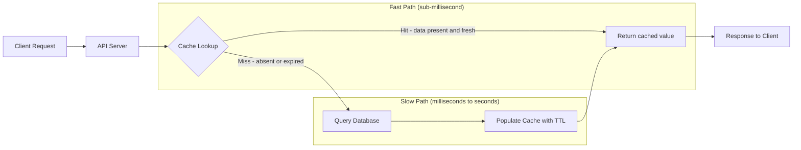

# Why Caching Matters

## Why This Matters

Every production API eventually hits the same wall: the database is slower than the traffic demands. You ship a clean FastAPI endpoint, it queries PostgreSQL, everything works beautifully in development with three test rows and one user — you. Then real traffic arrives. Ten requests per second becomes a thousand. The same product page, the same user profile, the same "trending posts" query gets executed over and over, each time re-reading rows from disk (or from the database's buffer pool, at best), re-running joins, re-serializing the result. The database — the most expensive, hardest-to-scale-horizontally part of your system — becomes the bottleneck for work that didn't need to be redone at all.

Caching exists to break this cycle: to answer a question once and reuse the answer for everyone who asks it again, for as long as the answer is still true enough to be useful.

This chapter is the anchor for all of Part 7. Every later chapter — Redis, cache-aside, invalidation, TTL, distributed caching, CDNs — is a refinement of the ideas introduced here. If you understand *why* caching is necessary before you learn *how* to do it, every subsequent pattern will make sense as a specific answer to a specific version of this same problem.

## Core Concept

At its core, caching is a trade: you spend memory (fast, expensive, limited) to save time (slow, cumulative, unbounded as traffic grows). A cache is a smaller, faster storage layer that sits between your application and a slower system of record — usually a database, but sometimes a downstream API, a computation, or an LLM call — and holds a copy of recently or frequently requested data.

The chain of reasoning that gets you to "we need a cache" looks like this:

1. **The latency problem.** A database read isn't free. Even a well-indexed PostgreSQL query might take 5–20ms; an unindexed one, or one involving joins across large tables, might take 200ms or more. Compare that to reading a value from an in-memory store, which takes well under 1ms. Multiply the difference by millions of requests per day and the gap becomes the dominant cost in your system's latency budget.
2. **The database pressure problem.** Latency per query is only half the story. Databases have a finite number of connections, finite CPU, finite I/O throughput. Every request that hits the database competes with every other request for those resources. As traffic grows, queries don't just stay slow — they get *slower*, because the database is now also managing lock contention, connection queueing, and cache eviction inside its own buffer pool. A popular endpoint under load can degrade the database for *every other endpoint*, including ones that have nothing to do with the hot data.
3. **The redundant work problem.** Most read traffic is skewed. A small number of resources (a trending post, a popular product, a celebrity's profile) account for a disproportionate share of requests — this is the classic "hot key" or power-law distribution you'll see constantly in production systems. Recomputing or re-fetching the exact same answer thousands of times per minute is pure waste.
4. **The solution: cache-aside.** Put a fast, shared, in-memory store (Redis, in almost all modern stacks) between the application and the database. Before querying the database, check the cache. If the data is there — a **cache hit** — return it immediately, skipping the database entirely. If it isn't — a **cache miss** — fall through to the database, get the answer, store ("populate") it in the cache, and return it. The next request for the same data gets a hit. This exact flow is called the **cache-aside pattern**, and it's covered in full detail in [`cache-aside.md`](cache-aside.md).
5. **The staleness problem.** A cached answer is a snapshot in time. The underlying data can change — a product's price is updated, a user edits their profile — and now the cache is lying. This is the central tension of caching: the more aggressively you cache, the more likely you are to serve stale data; the less aggressively you cache, the less benefit you get. Two techniques manage this tension: **TTL (time-to-live)**, where every cached entry automatically expires after a set duration (explored fully in the upcoming `ttl.md` chapter), and **invalidation**, where you actively remove or update a cache entry the moment the underlying data changes (covered in depth in [`cache-invalidation.md`](cache-invalidation.md)).
6. **The failure-mode problem.** A cache is an additional moving part, and moving parts fail in new ways: cold caches after a deploy, thundering herds when a popular key expires, cache stampedes, stale data served indefinitely because someone forgot a TTL, entire outages because the application assumed the cache would always be available. Production caching isn't just "add Redis" — it's designing for what happens when the cache is wrong, empty, or down.

## Mental Model

Think of a cache like a barista's memory of a regular customer's order. The first time you visit a coffee shop, the barista asks what you want, walks to the register, checks the menu, calculates the price — this is the "cache miss": slow, but necessary once. If you come back the next day and order the same thing, a good barista just remembers: "large oat milk latte, no sugar" — no need to re-derive it. That's the cache hit: fast, because the work was already done.

But memory can go stale. If the shop changes its recipe or a price, and the barista doesn't update their mental note, they'll confidently serve you the *wrong* thing, quickly and efficiently. Speed without correctness is worse than being slow — this is precisely why invalidation and TTL exist: they are the barista's way of saying "let me double check, it's been a while" or "actually, we changed that."

A second useful mental model: caching is **speculative reuse**. You are betting that the cost of storing an answer and occasionally being wrong is lower than the cost of recomputing the answer for every single request. Nearly all of caching engineering is about managing that bet: how long to trust an answer, how to know when to throw it away, and what to do when many people ask for an answer that isn't ready yet.

## How It Works

Concretely, in an API request lifecycle, caching inserts itself as a decision point before the expensive operation:

- A request arrives at your API (e.g., `GET /products/42`).
- The application derives a **cache key** from the request — typically something like `product:42` — that uniquely and unambiguously identifies the data being requested.
- The application asks the cache: "do you have `product:42`?"
- **Cache hit**: the cache returns the stored value (often serialized as JSON or a hash). The application returns it to the client. The database was never touched.
- **Cache miss**: the cache returns nothing. The application queries the database, gets the row(s), serializes them, stores them in the cache under `product:42` with an expiration (TTL), and returns the result to the client.
- On the *next* request for `product:42`, within the TTL window and before any invalidation, the cache will have the value — a hit.

This single loop, repeated across millions of requests, is what turns "one database query per request" into "roughly one database query per unique piece of data per TTL window" — a reduction that scales with how skewed and repetitive your traffic is.

## Architecture



Notice that the fast path (cache hit) and slow path (cache miss, database read) converge back at the same response — the client can't tell which path served their request except through diagnostic headers, which is exactly what production systems expose for observability (see the `X-Cache` header example below).

## Request / Response Example

A cache miss, first request for a product:

```http
GET /products/42 HTTP/1.1
Host: api.example.com
```

```http
HTTP/1.1 200 OK
Content-Type: application/json
X-Cache: MISS
X-Response-Time: 118ms

{
  "id": 42,
  "name": "Wireless Mechanical Keyboard",
  "price": 89.99,
  "in_stock": true
}
```

A cache hit, second request for the same product, seconds later:

```http
GET /products/42 HTTP/1.1
Host: api.example.com
```

```http
HTTP/1.1 200 OK
Content-Type: application/json
X-Cache: HIT
X-Response-Time: 3ms

{
  "id": 42,
  "name": "Wireless Mechanical Keyboard",
  "price": 89.99,
  "in_stock": true
}
```

The `X-Cache` header is not part of any HTTP standard — it's a convention widely used (CDNs like Cloudflare and Fastly do the same) to make cache behavior observable to API consumers and to engineers debugging performance. The 39x latency difference (118ms vs 3ms) is typical, not exaggerated, for a query involving a join or an unindexed lookup.

## Code Example

```python
import json
import os
import time
from typing import Any

import redis.asyncio as redis

# Connection details come from environment variables, never hardcoded.
REDIS_URL = os.environ.get("REDIS_URL", "redis://localhost:6379/0")
DEFAULT_TTL_SECONDS = 300  # 5 minutes — a starting point, tuned per resource type

redis_client = redis.from_url(REDIS_URL, decode_responses=True)


async def get_product(product_id: int) -> dict[str, Any]:
    """Fetch a product using the cache-aside pattern.

    Returns the product dict and records whether it was a hit or miss
    so the caller can surface it (e.g., in an X-Cache response header).
    """
    cache_key = f"product:{product_id}"

    # 1. Check the cache first.
    cached = await redis_client.get(cache_key)
    if cached is not None:
        return {"data": json.loads(cached), "cache": "HIT"}

    # 2. Miss: fall through to the database.
    #    (fetch_product_from_db is a stand-in for your ORM/SQL call)
    product = await fetch_product_from_db(product_id)

    # 3. Populate the cache with an explicit TTL so a stale value
    #    can't live forever if invalidation is ever missed.
    await redis_client.set(
        cache_key,
        json.dumps(product),
        ex=DEFAULT_TTL_SECONDS,
    )

    return {"data": product, "cache": "MISS"}


async def fetch_product_from_db(product_id: int) -> dict[str, Any]:
    # Placeholder for a real database call (e.g., via SQLAlchemy / asyncpg).
    # Simulates realistic query latency for illustration only.
    time.sleep(0.1)
    return {"id": product_id, "name": "Wireless Mechanical Keyboard", "price": 89.99}
```

This is the minimal skeleton of cache-aside — the full pattern, including stampede protection and negative caching, is covered in [`cache-aside.md`](cache-aside.md).

## Production Considerations

- **Caching is not free correctness insurance — it's a deliberate trade of consistency for speed.** Every cached value is potentially stale the moment it's written. Decide, per resource type, how stale is acceptable (a product price might tolerate 60 seconds of staleness; an account balance might tolerate none).
- **The database must survive a cold cache.** After a deploy, a Redis restart, or a cache flush, every request becomes a miss simultaneously. This is called a "cold cache" and can cause a thundering herd against the database exactly when your system is most fragile. Warm-up strategies and gradual TTL staggering help.
- **Cache everything that's expensive and safe to serve slightly stale; cache nothing that must be perfectly current** (e.g., a real-time account balance during a transaction) without additional safeguards.
- **Observability matters as much as the caching logic itself.** Track hit rate, miss rate, and latency separately for cached vs. uncached paths — without this, you can't tell if your cache is even helping.

## Common Mistakes

- **Assuming caching is "free" performance with no downside.** It introduces a second source of truth that can drift from the real one.
- **Caching without a TTL "just to be safe," then never invalidating it** — this produces data that's stale forever, silently, until someone notices a bug report.
- **Caching at the wrong granularity** — e.g., caching an entire paginated list under one key so that a single new item invalidates the whole page cache unnecessarily.
- **Not distinguishing hits from misses in logs or metrics**, making it impossible to tell whether the cache is actually reducing database load.
- **Introducing caching before you've measured that the database is actually the bottleneck** — premature caching adds complexity without addressing the real problem (see the upcoming `performance-bottlenecks.md` chapter on measuring before optimizing).

## Best Practices

- Start by measuring: know your database's query latency and your endpoint's request volume before deciding to cache.
- Always set an explicit TTL, even when you also plan to invalidate explicitly — TTL is your safety net.
- Key your cache entries clearly and consistently (`resource_type:id`), and namespace by environment/tenant if applicable.
- Expose cache status (hit/miss) in logs, metrics, or headers so the cache's effectiveness is observable, not assumed.
- Treat the cache as disposable: your system must produce correct (if slower) results if the cache is completely empty or unavailable.

## AI Engineering Perspective

Caching becomes even more critical — and more nuanced — in AI-backed APIs. An LLM completion call is orders of magnitude slower and more expensive than a database read: a single request might cost several hundred milliseconds to multiple seconds and real money per call (tokens are billed). The same latency-and-load argument that motivates caching database reads applies with even more force to LLM calls, embeddings, and retrieval steps.

This is why Part 15 introduces **prompt caching** (reusing a shared prompt prefix across requests to skip re-processing it) and **semantic caching** (caching based on the *meaning* of a request rather than an exact string match, so that "What's the capital of France?" and "capital city of France?" can both hit the same cached answer). Both are direct extensions of the cache-aside mental model you're learning here — the difference is *what counts as a cache key* and *what counts as "close enough" to reuse*. See [Part 15 — Production AI Systems](../15-production-ai-systems/README.md) for the full treatment.

## Exercises

**Beginner**
1. List three endpoints in a hypothetical e-commerce API (e.g., product details, cart, checkout) and decide which are safe to cache and for how long. Justify each choice.
2. Explain, in your own words, the difference between a cache hit and a cache miss, and what happens on each path.

**Intermediate**
3. Given a database query that takes 150ms and is called 500 times per minute for the same 10 popular items, estimate the database load reduction if those 10 items are cached with a 60-second TTL and a 90% cache hit rate.

**Advanced**
4. Design (in prose or a diagram) what happens to your system immediately after a full cache flush during peak traffic. Identify where the thundering herd would hit hardest and propose one mitigation.

## Key Takeaways

- Caching exists because databases are slow relative to memory and cannot handle every request being recomputed from scratch — it trades memory for latency and database load.
- The cache-aside pattern (check cache → miss → read DB → populate cache → return) is the foundational read pattern behind almost every caching system you'll build.
- Every cached value is a bet that "slightly stale" is acceptable in exchange for speed — TTL and invalidation are how you manage that bet.
- A cache is a new moving part with its own failure modes (cold starts, stampedes, staleness) — caching adds engineering complexity, not just performance.
- These same ideas scale up directly into AI systems, where LLM calls are even more expensive to redo than database queries — see [Part 15](../15-production-ai-systems/README.md).

---

Continue to [Redis](redis.md) to see the tool most commonly used to implement these ideas, or return to the [Part 7 index](README.md).
