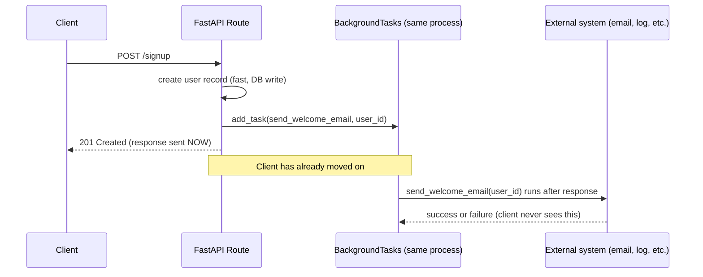

# Background Tasks

## Why This Matters

You now know when to move work outside the request/response cycle ([Sync vs Async](sync-vs-async.md)) and how Python's asyncio lets a single process handle many concurrent I/O-bound operations ([Python asyncio](python-asyncio.md)). The next question is mechanical: given a request that needs to trigger work *after* the response is sent — send a confirmation email, log an analytics event, kick off a cheap cleanup step — what's the simplest tool that does that correctly? FastAPI's `BackgroundTasks` is that tool, and it's genuinely useful for a specific, narrow band of work. It's also one of the most commonly misused features in FastAPI applications, because it's easy to reach for it in situations that actually need the durability guarantees of a real job queue. This chapter draws that line precisely.

## Core Concept

`BackgroundTasks` is a FastAPI feature that lets a route handler schedule a function to run **after the HTTP response has already been sent to the client**, but still within the same server process, using the same event loop and worker that handled the request. It's not a separate system, not a separate process, and not backed by any persistence — it's a thin mechanism for "finish responding first, then run this."

The critical distinction to internalize:

- **In-process background tasks** (`BackgroundTasks`) run inside your web server's own process/event loop. If that process crashes, restarts, or is killed (a deploy, an out-of-memory error, a scale-down event) *after* the response was sent but *before* the task finished, the task is simply gone — there is no record it was ever supposed to run, and nothing retries it.
- **Out-of-process job queues** (job queues and workers — upcoming chapters in this part) persist the work item in an external system (a database table, Redis, RabbitMQ, Kafka) *before* acknowledging it, so a separate worker process can pick it up, retry it on failure, and survive the web server restarting entirely independently.

`BackgroundTasks` trades durability for simplicity. That trade is worth making for low-stakes, best-effort work, and wrong for anything where "this must eventually happen" is a real requirement.

## Mental Model

Think of `BackgroundTasks` as leaving yourself a sticky note on your own desk on your way out the door: "after you finish this call, also water the plant." If you get called away before you get back to your desk — the office catches fire, you get pulled into a different meeting and never return — the sticky note is lost with you. Nobody else sees it, nobody else can act on it, and there's no record it ever existed.

A real job queue is more like handing a written work order to a dispatch office *before* you leave: even if you personally never come back, the work order sits in the dispatch office's system, visible to any available worker, and if the first worker who picks it up drops it, the office can hand it to someone else. That durability — the work order existing independently of the person who created it — is exactly what a job queue adds and `BackgroundTasks` doesn't have.

## How It Works

1. Inside a route handler, you receive a `BackgroundTasks` object (FastAPI injects it as a dependency) and call `.add_task(func, *args, **kwargs)` to register a function to run later.
2. FastAPI builds and sends the HTTP response as normal.
3. **After** the response has been sent to the client (the client does not wait for this step), FastAPI runs each registered task, in the order they were added, on the same event loop that served the request.
4. If the task function is `async def`, it runs as a coroutine on that event loop like anything else, and can itself `await` I/O. If it's a plain synchronous function, FastAPI runs it in a thread pool so it doesn't block the loop.
5. There is no built-in retry, no persistence, no visibility into whether the task succeeded — if you want any of that, you build it yourself (e.g., writing status to a database) or you use a real queue instead.

Because this all happens within the same process that handled the request, a `BackgroundTasks` job is bounded by that process's lifetime. It's appropriate for work that's genuinely optional or idempotent-and-cheap-to-lose, and completes quickly.

## Architecture



Note the arrow order: the response reaches the client *before* the background task even starts running. If the process is killed at the point marked "Note," the welcome email is simply never sent, and nothing in the system knows that.

## Request / Response Example

A signup endpoint that creates a user synchronously (must succeed before responding) and sends a welcome email as best-effort background work:

```http
POST /signup HTTP/1.1
Content-Type: application/json

{ "email": "new.user@example.com", "password": "..." }
```

```http
HTTP/1.1 201 Created
Content-Type: application/json

{ "user_id": 5821, "email": "new.user@example.com" }
```

The `201 Created` response is returned as soon as the user row is committed to the database — the client doesn't wait for the welcome email to actually send. If email delivery fails a few seconds later, the client already has their `201` and has moved on; that's the correct trade-off for a welcome email (nice to have, not blocking, not worth the client waiting on), but it would be the *wrong* trade-off for something like "charge the customer's card" or "reserve inventory," which need the guaranteed-execution semantics of a real queue, not a best-effort background task.

## Code Example

```python
import os
import smtplib
from email.message import EmailMessage
from fastapi import FastAPI, BackgroundTasks
from pydantic import BaseModel, EmailStr

app = FastAPI()

SMTP_HOST = os.environ["SMTP_HOST"]
SMTP_USER = os.environ["SMTP_USER"]
SMTP_PASSWORD = os.environ["SMTP_PASSWORD"]


class SignupRequest(BaseModel):
    email: EmailStr
    password: str


def send_welcome_email(to_address: str) -> None:
    """Synchronous — FastAPI runs this in a thread pool automatically since
    it's not `async def`. Fine for a quick SMTP call; would be wrong for
    anything slow or CPU-heavy, which should go through a real worker."""
    msg = EmailMessage()
    msg["Subject"] = "Welcome!"
    msg["From"] = SMTP_USER
    msg["To"] = to_address
    msg.set_content("Thanks for signing up.")

    # Best-effort: if this raises, the exception is logged by FastAPI's
    # background task runner but the client already has their 201 response
    # and will never see this failure. That's the entire trade-off of
    # BackgroundTasks in one line of code.
    with smtplib.SMTP(SMTP_HOST) as server:
        server.login(SMTP_USER, SMTP_PASSWORD)
        server.send_message(msg)


@app.post("/signup", status_code=201)
def signup(req: SignupRequest, background_tasks: BackgroundTasks):
    # The part that MUST succeed before responding: create the user record.
    user_id = create_user_record(req.email, req.password)  # synchronous, fast

    # The part that's best-effort: schedule it, don't wait for it.
    background_tasks.add_task(send_welcome_email, req.email)

    return {"user_id": user_id, "email": req.email}


def create_user_record(email: str, password: str) -> int:
    # Placeholder for a real database insert (hashed password, etc.).
    return 5821


# CONTRAST — work that needs guaranteed delivery should NOT use
# BackgroundTasks. This is what a real queue interface looks like instead
# (see message-queues.md for the concept, and job-queues.md / workers.md,
# upcoming chapters, for concrete systems like Celery, RabbitMQ, or SQS):
#
# @app.post("/orders/{order_id}/charge", status_code=202)
# async def charge_order(order_id: int, queue: JobQueue = Depends(get_queue)):
#     # Persisted BEFORE responding — survives a server restart, and a
#     # separate worker process retries it on failure.
#     await queue.enqueue("charge_payment", order_id=order_id)
#     return {"order_id": order_id, "status": "queued"}
```

## Production Considerations

- **`BackgroundTasks` does not survive process restarts.** A deploy, a crash, or an autoscaler killing an instance mid-task loses that task permanently and silently — there is no log entry saying "this was supposed to run and didn't" unless you build one yourself.
- **No retries.** If `send_welcome_email` raises because the SMTP server had a transient blip, FastAPI logs the exception (by default) and moves on — nobody retries it.
- **No cross-process visibility.** If you run multiple instances of your API behind a load balancer, a `BackgroundTasks` job only ever runs on the instance that handled the original request — you can't see, cancel, or monitor it from anywhere else.
- **Resource contention with the web server.** Because tasks run on the same process serving live requests, a background task that's accidentally slow or CPU-heavy competes directly for the same resources as your actual request-handling capacity — the opposite of the isolation you get from a separate worker process (see the upcoming `workers.md` chapter).
- **Good fit: fire-and-forget, idempotent, low-stakes work** — logging an analytics event, invalidating a cache key, sending a non-critical notification. **Bad fit: anything requiring guaranteed execution, retries, ordering, or auditability** — payments, inventory updates, anything a compliance or billing system depends on.

## Common Mistakes

- **Using `BackgroundTasks` for work that must not be lost**, like charging a payment or triggering a legally required notification, then being surprised when tasks silently vanish during a routine deploy.
- **Assuming background tasks run "in the background" relative to other requests too.** They share the same process and event loop as live traffic; a slow or blocking background task can degrade response times for unrelated concurrent requests.
- **Putting a blocking synchronous call inside an `async def` background task** — the same event-loop-freezing mistake covered in [Python asyncio](python-asyncio.md) applies here too, since background tasks run on that same loop when defined as coroutines.
- **Not logging or handling exceptions inside the task function**, resulting in failures that are invisible unless someone happens to be watching server logs at the right time.
- **Reaching for `BackgroundTasks` by default instead of evaluating whether the work needs the durability of a real queue** — it's the easiest option, which makes it tempting to over-apply.

## Best Practices

- Use `BackgroundTasks` only for work that is safe to lose occasionally and doesn't need retries: logging, cache invalidation, best-effort notifications, cleanup of temporary resources.
- For anything that must eventually happen — payments, order fulfillment, sending data to a downstream system that expects every event — write it to a durable queue or outbox table *before* responding, and let a separate worker process it. See the upcoming job-queues and workers chapters, and [Message Queues](message-queues.md) for the underlying concept.
- Wrap background task functions in their own try/except and log failures explicitly — don't rely on default framework logging as your only signal.
- Keep background tasks short. If a task is slow enough to noticeably compete with request-handling resources, it belongs in a separate worker process, not the web server.
- Treat `BackgroundTasks` as in-process convenience, not a queue substitute — if you find yourself wanting to check a task's status from a different request or a different server instance, that's the signal you need a real queue.

## AI Engineering Perspective

`BackgroundTasks` shows up constantly in AI-backed APIs for exactly the low-stakes cases it's suited for: logging a request's token usage for cost tracking (see [Part 15 — Production AI Systems](../15-production-ai-systems/README.md)), firing off a non-critical analytics event after a chat completion, or invalidating a semantic cache entry. But it's the wrong tool for the AI workloads that actually take a long time and matter if they fail: ingesting and chunking a large document for [RAG](../16-rag-apis/README.md) (which can take minutes and must not silently vanish), or running a multi-step agent workflow (see [Part 17 — AI Agents & MCP](../17-ai-agents-and-mcp/README.md)) that calls tools, retries on tool failure, and needs an auditable record of what happened. Those belong in a real job queue with a durable worker, following the pattern shown in [`examples/background-jobs/`](../../examples/background-jobs/) — the async document processing pipeline referenced throughout this handbook is built exactly this way, not on `BackgroundTasks`.

## Exercises

**Beginner**
1. List three examples of work in a typical API that would be appropriate for `BackgroundTasks`, and three that would not be, explaining the "must not be lost" distinction for each.
2. In the signup example, what happens to the welcome email if the server process is killed one second after the `201 Created` response is sent but before `send_welcome_email` finishes running?

**Intermediate**
3. Extend the code example so that failures inside `send_welcome_email` are caught and written to a `failed_emails` table (or log line) instead of disappearing silently. Does this fully solve the durability problem? Why or why not?

**Advanced**
4. Design the trade-off analysis you'd present to a team debating whether to use `BackgroundTasks` or a real job queue for "send a webhook notification to a customer's configured URL when their order ships." Consider retry needs, ordering guarantees, and what happens during a deploy.

## Key Takeaways

- `BackgroundTasks` runs scheduled work in-process, after the response is sent, on the same event loop and same server instance that handled the request.
- It has no persistence and no retries — a process restart or crash loses any pending or in-flight background task silently.
- It's the right tool for best-effort, low-stakes, quick work; it's the wrong tool for anything requiring guaranteed execution, retries, or cross-instance visibility.
- Work that must not be lost belongs in a durable queue processed by a separate worker, not in `BackgroundTasks` — see [Message Queues](message-queues.md) and the upcoming job-queues and workers chapters.
- The decision isn't about how "big" the work is — it's about whether losing it occasionally is an acceptable outcome.
