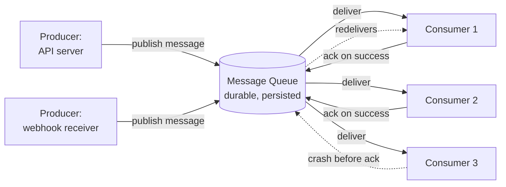

# Message Queues

## Why This Matters

[Background Tasks](background-tasks.md) established a hard limit: in-process background work disappears if the server restarts, and there's no way for a different process — or a different machine entirely — to pick up the slack. Once your system needs work to survive a crash, needs to retry failed operations, needs multiple independent workers pulling from the same backlog, or needs a slow consumer to not take down a fast producer, you need a **message queue**: a durable, external system that sits between the thing that creates work and the thing that does it. This chapter covers the general concept — the same core idea underlies specific systems like RabbitMQ, Kafka, SQS, and the job queues built on top of them, which get their own dedicated chapters later in this part. Understanding the concept first means you'll recognize it correctly no matter which specific technology you end up using.

## Core Concept

A **message queue** is a service that stores messages (units of work or events) sent by one or more **producers**, and makes them available to one or more **consumers**, which process them independently of when or how fast they were produced. The queue itself is the durability boundary: once a producer successfully hands a message to the queue, that message persists there — typically written to disk, often replicated — independent of whether the producer or any consumer is currently running.

This buys you three things that in-process approaches (like `BackgroundTasks`) fundamentally cannot provide:

- **Decoupling.** The producer doesn't need to know anything about how, when, or by what the message will be processed — it just hands it to the queue and moves on. The consumer doesn't need to know anything about what produced the message. Either side can be deployed, scaled, restarted, or replaced independently.
- **Durability.** A message survives in the queue even if every consumer is offline. When a consumer comes back (or a new one starts), the backlog is still there, waiting.
- **Load leveling.** If producers create work faster than consumers can process it, the queue absorbs the burst instead of the burst overwhelming the consumer directly — the queue grows, consumers work through it at their own sustainable pace, and nothing crashes from being hit with a spike all at once.

## Mental Model

A message queue is a post office, not a phone call. A phone call (a direct synchronous API request) requires both parties to be available at the exact same instant — if the person you're calling doesn't pick up, the call simply fails and you have to try again yourself. A post office lets you drop off a letter and walk away — the letter sits securely in the system whether or not the recipient is home right now, and when they do check their mailbox, everything that arrived while they were away is still there, in order, waiting to be opened. If the local post office branch runs out of staff for an afternoon, mail doesn't vanish; it backs up and gets processed once staff is available again — that's load leveling.

The queue is also indifferent to *how many* recipients are checking the same mailbox: you could have one worker or ten workers, all pulling letters from the same backlog, and the post office doesn't care which one processes any given letter, as long as each letter is handled exactly once (or, in the common real-world case, "at least once" — see below).

## How It Works

1. A **producer** creates a message — typically a small, serializable payload (JSON, protobuf, etc.) describing work to do or an event that occurred — and sends it to the queue.
2. The queue **persists** the message (usually to disk, sometimes replicated across multiple nodes) and acknowledges receipt back to the producer. From this point forward, the producer's job is done; it doesn't need to stay running, and it has no further responsibility for the message.
3. One or more **consumers** pull (or are pushed) messages from the queue, process them, and — critically — explicitly **acknowledge** successful processing back to the queue.
4. If a consumer crashes or times out *before* acknowledging a message, the queue makes that message available again (often after a visibility timeout), so another consumer — or the same one, restarted — can retry it.

That last point is where **at-least-once delivery** comes from, and it's the default, expected behavior of most message queues: a message can be delivered and processed more than once if a consumer crashes after doing the work but before sending the acknowledgment. The queue has no way to distinguish "the consumer died before doing the work" from "the consumer did the work but died before acking it" — so it errs toward redelivering, because silently losing a message is almost always worse than processing it twice.

This has a direct design consequence: **consumers must be idempotent** — processing the same message twice must be safe (e.g., "mark order 501 as shipped" is idempotent; "increment shipped_count by 1" is not, if applied twice by accident). "Exactly-once" delivery is extremely hard to guarantee end-to-end in a distributed system and most real systems either don't claim it or achieve an equivalent effect only by combining at-least-once delivery with idempotent consumers — this is worth remembering before trusting a vendor's "exactly-once" marketing claim at face value.

## Architecture



Multiple producers can publish to the same queue without knowing about each other or about the consumers. Multiple consumers can pull from the same queue, spreading load across them (this is how you scale processing throughput — add more consumers). If a consumer crashes before acknowledging (`C3` above), the queue redelivers that message rather than losing it — which is exactly the guarantee `BackgroundTasks` cannot offer.

## Request / Response Example

Consider an endpoint that needs to send a webhook notification to a customer whenever an order ships — work that must not be silently lost, unlike the welcome email in [Background Tasks](background-tasks.md). The API responds immediately after durably enqueueing the work, following the same `202 Accepted` pattern from [Sync vs Async](sync-vs-async.md):

```http
POST /orders/501/ship HTTP/1.1
Content-Type: application/json

{ "carrier": "ups", "tracking_number": "1Z999AA1" }
```

```http
HTTP/1.1 202 Accepted
Content-Type: application/json

{ "order_id": 501, "status": "ship_recorded", "notification": "queued" }
```

The `202 Accepted` here signals something subtly different than in the pure background-task case: the *notification itself* is now durably queued, not just "started." A client (or an internal monitoring system) could separately check delivery status:

```http
GET /orders/501/notifications HTTP/1.1
```

```http
HTTP/1.1 200 OK
Content-Type: application/json

{ "order_id": 501, "webhook_status": "delivered", "attempts": 1 }
```

If the webhook consumer had crashed on the first attempt, `attempts` would show `2`, and `webhook_status` might read `pending` until a retry succeeded — visibility that simply doesn't exist with in-process background tasks.

## Code Example

The example below uses a small abstract `Queue` interface to illustrate the producer/consumer pattern without tying it to a specific product. Real systems typically use RabbitMQ, Kafka, or a managed service like SQS — those get their own dedicated chapters in this part — but the shape of the code stays essentially the same regardless of which one sits underneath.

```python
import os
import json
import asyncio
from dataclasses import dataclass
from fastapi import FastAPI

app = FastAPI()

QUEUE_URL = os.environ["QUEUE_URL"]  # e.g. amqp://... or a Kafka broker list


@dataclass
class Message:
    id: str
    payload: dict


class Queue:
    """A minimal generic interface. A real implementation wraps a client
    library for RabbitMQ/Kafka/SQS — the interface shape (publish / consume
    / ack) is what matters conceptually and stays similar across all of them."""

    async def publish(self, topic: str, payload: dict) -> None:
        raise NotImplementedError

    async def consume(self, topic: str):
        """Yields (message, ack_fn) pairs. The consumer MUST call ack_fn()
        only after successfully processing — never before."""
        raise NotImplementedError


async def get_queue() -> Queue:
    # In real code: connect to QUEUE_URL and return a concrete client.
    ...


# --- Producer side: inside the API request path ---

@app.post("/orders/{order_id}/ship", status_code=202)
async def ship_order(order_id: int, queue: Queue = None):
    queue = queue or await get_queue()
    mark_order_shipped(order_id)  # synchronous, must succeed before responding

    # Publish is a durable write to the queue. Once this call returns
    # successfully, the API server's job is done — it does not need to stay
    # running for the webhook to eventually be delivered.
    await queue.publish(
        topic="order.shipped",
        payload={"order_id": order_id, "attempt": 1},
    )
    return {"order_id": order_id, "status": "ship_recorded", "notification": "queued"}


def mark_order_shipped(order_id: int) -> None:
    ...  # database update


# --- Consumer side: a SEPARATE process, not the API server ---

async def webhook_consumer_loop():
    """Runs in its own worker process (see the upcoming workers.md chapter),
    completely decoupled from the API server's lifecycle."""
    queue = await get_queue()
    async for message, ack in queue.consume(topic="order.shipped"):
        try:
            order_id = message.payload["order_id"]
            await send_customer_webhook(order_id)
            # Only ack AFTER successful processing. If this process crashes
            # before reaching this line, the queue redelivers the message —
            # that's at-least-once delivery, and it's why send_customer_webhook
            # must be safe to run more than once for the same order_id.
            await ack()
        except Exception:
            # Do NOT ack on failure — let the queue's retry/redelivery
            # mechanism (or dead-letter queue, in a real system) handle it.
            log_processing_failure(message)


async def send_customer_webhook(order_id: int) -> None:
    ...  # idempotent HTTP call to the customer's configured webhook URL


def log_processing_failure(message: Message) -> None:
    ...
```

## Production Considerations

- **Idempotency is not optional.** Because at-least-once delivery is the realistic default, every consumer must tolerate processing the same message more than once without corrupting state — use idempotency keys, `UPSERT`-style writes, or "check current state before acting" patterns.
- **Dead-letter queues.** Messages that repeatedly fail processing (a permanently malformed payload, a downstream service that's gone entirely) need somewhere to go besides an infinite retry loop — most production queue systems support routing such messages to a separate "dead letter" queue for manual inspection.
- **Backpressure and consumer scaling.** If producers consistently outpace consumers, the backlog grows unboundedly — monitor queue depth and scale consumer count (or throttle producers) before it becomes a capacity incident, not after.
- **Ordering guarantees vary by system and configuration.** Some queues preserve strict order per key/partition (Kafka, with partitioning); others make no ordering guarantee at all. Never assume ordering unless your specific queue and configuration explicitly guarantees it.
- **Poison messages.** A single malformed message that always crashes the consumer can block an entire queue (or partition) if you don't have a mechanism (dead-lettering, max-retry limits) to route it aside instead of retrying it forever.

## Common Mistakes

- **Acknowledging a message before processing succeeds**, which silently drops work if the consumer then crashes mid-processing — defeating the entire point of using a queue.
- **Writing non-idempotent consumers** ("increment a counter," "append a row unconditionally") and being surprised by duplicate side effects when at-least-once redelivery inevitably happens.
- **Treating a queue as a database.** Queues are for transient work-in-flight, not long-term storage or query access — trying to "look up" arbitrary messages in a queue the way you'd query a table is fighting the tool.
- **Not decoupling producer availability from consumer health.** If publishing to the queue itself blocks on a healthy consumer being available, you've recreated a synchronous dependency and lost the reliability benefit the queue was supposed to provide.
- **No monitoring on queue depth or consumer lag**, so a stuck or crashed consumer fleet goes unnoticed until a customer-facing symptom (e.g., "my webhook never arrived") surfaces the problem hours later.

## Best Practices

- Design every consumer to be idempotent from day one — assume redelivery will happen, because eventually it will.
- Acknowledge only after work is durably completed, never before or "optimistically."
- Configure a dead-letter destination and a max-retry count for every consumer, so a bad message degrades gracefully instead of looping forever.
- Monitor queue depth and consumer lag as first-class production metrics, the same way you'd monitor request latency.
- Keep message payloads small and serializable (IDs and minimal context, not entire large objects) — fetch the full data from its source of truth (a database) inside the consumer if needed, rather than stuffing it all into the message.

## AI Engineering Perspective

Message queues are the backbone of production AI pipelines that can't reasonably run inline in a request. Document ingestion for RAG (see [Part 16 — RAG APIs](../16-rag-apis/README.md)) is a canonical example: a file upload publishes a "process this document" message, and a fleet of consumer workers handles chunking, embedding, and indexing — decoupled from the upload request entirely, and resilient to any single worker crashing mid-document. Multi-step AI agent workflows (see [Part 17 — AI Agents & MCP](../17-ai-agents-and-mcp/README.md)) often use queues to hand off long-running tool executions so an agent orchestrator isn't blocked waiting on a slow external action. And LLM rate-limit management (see [Part 15 — Production AI Systems](../15-production-ai-systems/README.md)) frequently relies on a queue as a natural throttling point: producers enqueue LLM requests as fast as they arrive, while a bounded pool of consumers pulls from the queue at a rate that respects the provider's tokens-per-minute limit, smoothing out bursts that would otherwise trigger `429` errors. This general concept is what job-queues.md, rabbitmq-concepts.md, and kafka-concepts.md (upcoming chapters) build on with concrete, production-grade systems.

## Exercises

**Beginner**
1. Explain, using the post office analogy, why a message queue can keep functioning correctly even when every consumer is temporarily offline, in a way a direct synchronous API call cannot.
2. Give one example of an idempotent consumer operation and one example of a non-idempotent one, and explain what could go wrong if the non-idempotent one is processed twice.

**Intermediate**
3. In the code example, what specifically would go wrong if `await ack()` were moved to right after `await queue.publish(...)` succeeds on the producer side rather than staying in the consumer, after processing? (Hint: think about who is acknowledging what.)

**Advanced**
4. Design a dead-letter strategy for the `order.shipped` webhook consumer: after how many failed attempts should a message be dead-lettered, what should happen to it there, and how would you alert a human that manual intervention is needed?

## Key Takeaways

- A message queue decouples producers from consumers, persists messages durably, and lets a backlog absorb bursts instead of overwhelming consumers directly.
- At-least-once delivery is the realistic default for most queue systems — consumers must be idempotent, because redelivery after a crash is expected behavior, not an edge case.
- Only acknowledge a message after processing has genuinely completed; premature acknowledgment silently loses work exactly the way `BackgroundTasks` does.
- Queues are the durability boundary that in-process approaches like `BackgroundTasks` cannot provide — reach for one when work must survive a crash or be retried.
- This chapter covers the general concept; concrete systems (RabbitMQ, Kafka) and the job-queue/worker patterns built on top of them are covered in upcoming chapters in this part.
