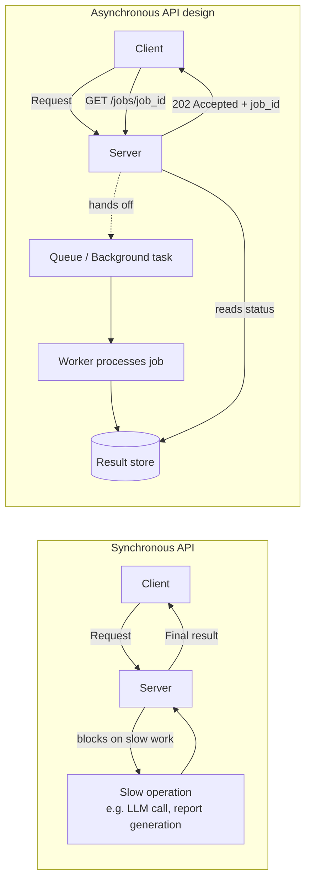

# Sync vs Async

## Why This Matters

Every API you've built so far in this handbook has followed the same shape: a client sends a request, your server does some work, and the response comes back once that work is done. That model — synchronous, blocking, request-in/response-out — is simple to reason about and it's the right default for most endpoints. But it breaks down the moment "some work" takes longer than a client is willing to wait, or longer than your infrastructure is willing to hold a connection open. A request that calls a slow third-party API, processes a large file, sends a batch of emails, or waits on an LLM to generate a long response cannot honestly be modeled as "instant." If you force that work into the synchronous request/response cycle anyway, you get timeouts, exhausted worker pools, and a system that falls over under exactly the load it should be handling gracefully. Understanding sync vs. async — and, more importantly, understanding when to move work *outside* the request cycle entirely — is the foundation for everything else in this part.

## Core Concept

**Synchronous (blocking)** execution means the calling code stops and waits until an operation completes before moving to the next line. If a function makes a network call synchronously, the thread executing that function is idle — doing nothing useful — until the response arrives.

**Asynchronous (non-blocking)** execution means the calling code can hand off a slow operation and continue doing other useful work while it waits, resuming only when the operation finishes (or is explicitly checked on).

It's critical to separate two ideas that get conflated constantly:

1. **Sync vs. async I/O** — a low-level execution model question: does a thread block waiting for a socket/disk/database, or does it yield control so something else can run? This is what [Python asyncio](python-asyncio.md) addresses.
2. **Synchronous vs. asynchronous API design** — a higher-level contract question: does your API return the final result in the same HTTP response, or does it acknowledge the request and let the client check back later? This is what [Background Tasks](background-tasks.md) and [Message Queues](message-queues.md) address.

You can (and often should) have both at once: an API endpoint that's asynchronous in *design* (returns `202 Accepted` immediately) built using an async *I/O* runtime internally so the web server itself stays responsive while background work proceeds.

## Mental Model

Think of a restaurant. A **synchronous** kitchen has one cook who takes an order, walks to the pantry, waits for the delivery truck if an ingredient is missing, cooks the dish start to finish, and only then takes the next order. Customers queue up and wait — some orders are fast, some take forever, and a single slow order stalls everyone behind it.

An **asynchronous** kitchen has a cook who takes an order, starts it, and while something is simmering (not needing active attention), takes the next order instead of standing idle. The cook is still one person doing one thing at a time at any given instant — but they never stand still waiting when there's other work available.

Now separate that from the **API design** question: does the restaurant make you stand at the counter until your food is ready (synchronous API), or does it hand you a buzzer and let you sit down, with the buzzer going off when the food is ready (asynchronous API)? You could have a slow, single-cook kitchen that still hands out buzzers — the *internal* execution model and the *external* contract with the customer are independent decisions.

## How It Works

In a synchronous request/response API, the sequence is:

1. Client sends a request.
2. Server thread/process picks it up and starts executing.
3. Server performs all necessary work — including any slow I/O — while the client's connection stays open.
4. Server returns the final result. Connection closes.

The client is blocked the entire time, and — depending on your server's concurrency model — the *server* may also have a thread or process tied up for the full duration, unable to serve other requests.

An asynchronous API design changes step 3 and 4:

1. Client sends a request.
2. Server validates the request and hands the actual work off (to a background task, a queue, a worker) — this handoff is fast, typically milliseconds.
3. Server immediately responds with an acknowledgment, usually `202 Accepted`, plus a way to check status later (a job ID, a status URL, a webhook).
4. The client polls, subscribes, or gets notified when the work is actually done.

This decouples "how long the client waits for a response" from "how long the work actually takes" — which is the whole point.

## Architecture



The synchronous path is a straight line where the client's wait time equals the work's duration. The asynchronous path splits into two independent timelines: the fast request/acknowledge exchange, and the (potentially much longer) work timeline that the client checks in on separately.

## Request / Response Example

A synchronous endpoint that generates a large report by querying a database and formatting it:

```http
POST /reports HTTP/1.1
Content-Type: application/json

{ "range": "2026-01-01/2026-06-30" }
```

```http
HTTP/1.1 200 OK
Content-Type: application/json

{ "report_id": "rep_9f2", "rows": 48213, "download_url": "https://.../rep_9f2.csv" }
```

If report generation takes 45 seconds, the client's HTTP connection — and likely a reverse proxy's timeout, and a load balancer's timeout — all have to tolerate that. Under load, many concurrent report requests can exhaust your server's worker pool.

The same operation, redesigned asynchronously:

```http
POST /reports HTTP/1.1
Content-Type: application/json

{ "range": "2026-01-01/2026-06-30" }
```

```http
HTTP/1.1 202 Accepted
Content-Type: application/json
Location: /reports/rep_9f2

{ "report_id": "rep_9f2", "status": "pending" }
```

The client then polls a status endpoint:

```http
GET /reports/rep_9f2 HTTP/1.1
```

```http
HTTP/1.1 200 OK
Content-Type: application/json

{ "report_id": "rep_9f2", "status": "completed", "download_url": "https://.../rep_9f2.csv" }
```

`202 Accepted` is the explicit HTTP signal for "your request was valid and I've started work, but it isn't done yet" — distinct from `200 OK` ("here is your finished result") or `201 Created` ("here is the resource you just created, fully formed").

## Code Example

```python
import os
import uuid
from fastapi import FastAPI, BackgroundTasks, HTTPException
from pydantic import BaseModel

app = FastAPI()

# In production this would be Redis/Postgres, not an in-memory dict —
# job state must survive a server restart or a second server instance.
JOB_STORE: dict[str, dict] = {}

DATABASE_URL = os.environ["DATABASE_URL"]  # example of externalized config


class ReportRequest(BaseModel):
    date_range: str


def generate_report(job_id: str, date_range: str) -> None:
    """Runs outside the request/response cycle. This is synchronous, blocking
    work — that's fine here, because nothing is waiting on it in real time."""
    JOB_STORE[job_id]["status"] = "running"
    # Pretend this queries DATABASE_URL and takes real time (I/O + CPU).
    rows = run_slow_query(date_range)
    JOB_STORE[job_id]["status"] = "completed"
    JOB_STORE[job_id]["rows"] = rows


def run_slow_query(date_range: str) -> int:
    # Placeholder for a real, slow database aggregation query.
    return 48213


@app.post("/reports", status_code=202)
def create_report(req: ReportRequest, background_tasks: BackgroundTasks):
    job_id = str(uuid.uuid4())
    JOB_STORE[job_id] = {"status": "pending"}
    # The endpoint returns immediately; generate_report runs after the
    # response is sent. See background-tasks.md for the limits of this
    # approach (in-process, not durable across restarts).
    background_tasks.add_task(generate_report, job_id, req.date_range)
    return {"report_id": job_id, "status": "pending"}


@app.get("/reports/{job_id}")
def get_report(job_id: str):
    job = JOB_STORE.get(job_id)
    if job is None:
        raise HTTPException(status_code=404, detail="Job not found")
    return {"report_id": job_id, **job}
```

## Production Considerations

- **Timeouts cascade.** Reverse proxies, load balancers, and client libraries all have their own default timeouts (often 30–60 seconds). A synchronous endpoint that occasionally takes longer than the *shortest* timeout in that chain will fail unpredictably, even though the server "would have" finished eventually.
- **Worker pool exhaustion.** A synchronous web server (e.g., a fixed pool of WSGI workers) has a hard cap on concurrent requests. Slow synchronous work — even I/O-bound work with nothing CPU-heavy about it — occupies a worker for the entire duration, directly reducing how many *other* requests the server can serve at the same time.
- **Async design doesn't eliminate work, it relocates it.** Moving work to `202 Accepted` + background processing doesn't make the report generate faster; it changes who waits and how. You still need somewhere durable for that work to run — see [Background Tasks](background-tasks.md), and eventually job queues and workers (upcoming chapters in this part) for guaranteed execution.
- **Not everything should be async.** A `GET /users/42` that reads one row from an indexed table should stay synchronous — wrapping fast operations in a job/poll pattern adds latency (a round trip to submit, then a round trip to poll) and complexity for no benefit.

## Common Mistakes

- **Treating "async" as a synonym for "fast."** Making an endpoint asynchronous does not speed up the underlying work — it changes when and how the caller learns the result.
- **Leaving a synchronous endpoint slow "because it works in dev."** A query that takes 200ms against a small local dataset can take 20 seconds against production data volume; the decision to go async should be based on worst-case, production-scale latency, not the happy path.
- **No way to check status.** Returning `202 Accepted` with no `job_id`, `Location` header, or status endpoint leaves the client with no way to know whether — or when — the work finished.
- **Blindly wrapping every endpoint in async processing.** This adds unnecessary polling round trips and operational complexity for work that's already fast and doesn't need it.

## Best Practices

- Set a clear, explicit threshold (e.g., "anything that might exceed 2–3 seconds") for when an endpoint should move to the async pattern instead of guessing case by case.
- Always return a job identifier and a way to check status (`Location` header, status endpoint, or webhook) when responding `202 Accepted`.
- Make status endpoints idempotent and cheap — clients will poll them repeatedly.
- Document expected completion time ranges so client developers know how aggressively to poll (or whether to use a webhook instead — see [Part 9](../09-realtime-and-webhooks/README.md)).
- Keep the "accept the request" path itself fast and synchronous even in an async design — validating input and creating a job record should still be near-instant.

## AI Engineering Perspective

This distinction matters enormously once LLMs enter the picture. A single LLM call can legitimately take many seconds — sometimes tens of seconds for a long generation — which is already borderline for a synchronous HTTP request (see [Part 14 — AI API Engineering](../14-ai-api-engineering/README.md)). Chains of LLM calls (an agent taking multiple tool-calling turns, a RAG pipeline that embeds, retrieves, reranks, and *then* generates — see [Part 16 — RAG APIs](../16-rag-apis/README.md)) can take much longer still. Streaming (covered in Part 14) solves part of this by letting the client see partial output as it's generated, keeping the connection "alive" in the user's perception even though the full generation isn't done. But for genuinely long-running AI workloads — ingesting a large document, running a multi-step agent workflow — streaming isn't enough; you need the same `202 Accepted` + background processing pattern described here, exactly as you would for a slow database report.

## Exercises

**Beginner**
1. Take an existing synchronous endpoint (real or hypothetical) that calls a third-party API. List every timeout in the chain between the client and that third-party API (client library, your server framework, any reverse proxy) that could cause it to fail under slow conditions.
2. Explain, in your own words, why "asynchronous" describes two different things in this chapter — and give one example of each.

**Intermediate**
3. Modify the code example so `GET /reports/{job_id}` returns `202 Accepted` (not `200 OK`) while the job is still pending, and only `200 OK` once it's `completed`. Why might a client library treat those status codes differently?

**Advanced**
4. Design the `202 Accepted` contract for an endpoint that processes an uploaded video file (transcoding, thumbnail generation). What information does the client need in the initial response, and what would you put in the status endpoint's response for each of the states: `queued`, `processing`, `completed`, `failed`?

## Key Takeaways

- Sync vs. async I/O (execution model) and synchronous vs. asynchronous API design (contract) are related but distinct — you can mix either with either.
- Move work out of the request/response cycle when its duration is unpredictable or exceeds what clients and infrastructure timeouts will tolerate — not by default for every endpoint.
- `202 Accepted` plus a status-check mechanism (job ID, `Location` header, polling endpoint, or webhook) is the standard REST pattern for asynchronous API design.
- Making an API asynchronous doesn't make the work itself faster — it changes who waits, and gives you room to add reliability (retries, queues, workers) around that work.
- This chapter sets up the "when to go async" decision; [Python asyncio](python-asyncio.md) and [Background Tasks](background-tasks.md) cover the "how."
