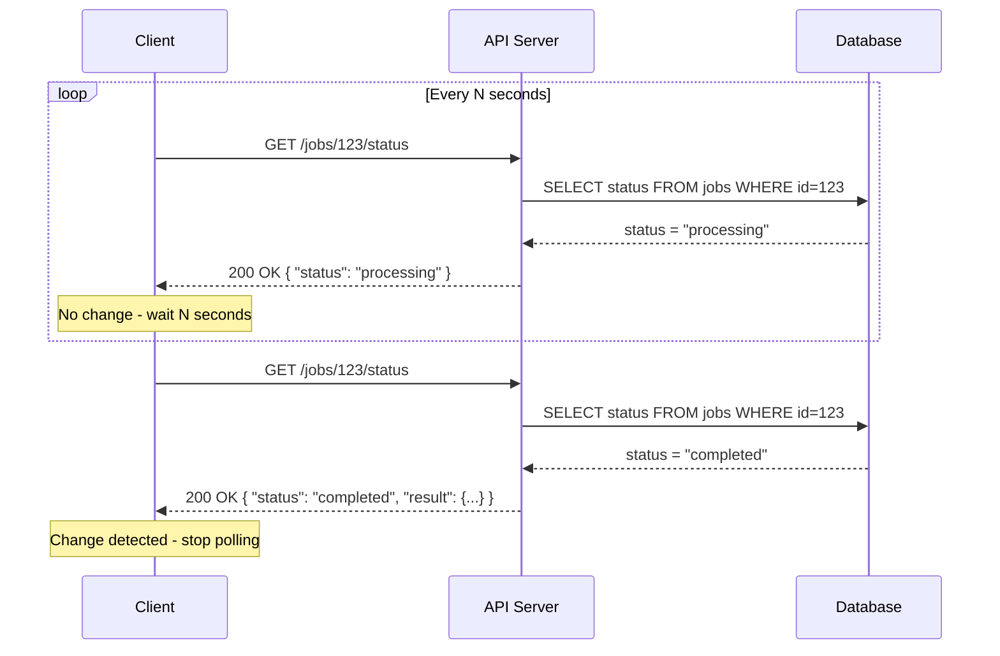

# Polling

## Why This Matters

Not every "real-time" feature needs a persistent connection, a message broker, or a websocket server. Sometimes the simplest possible thing — a client asking "anything new?" over and over — is exactly the right tool, and reaching for something fancier is premature engineering. Polling is the baseline every other real-time pattern in this part gets compared against: [long polling](README.md), [WebSocket](websocket.md), and [Server-Sent Events](server-sent-events.md) all exist specifically to fix problems that plain polling has. You cannot reason well about when to use those tools until you understand exactly what polling costs you — in server load, in staleness, and in wasted requests — and exactly when those costs are acceptable.

## Core Concept

**Polling** is a client repeatedly sending the same request to a server on a fixed interval, asking whether new data is available, with no persistent connection or server-initiated push involved at all. Every poll is a completely ordinary, stateless HTTP request-response cycle — the server has no idea a "poll" is happening; it just sees a `GET` request, same as any other, and either returns fresh data or a "no changes" signal.

Because polling is nothing more than "call a normal endpoint on a timer," it requires zero special infrastructure: no websocket server, no long-lived connections to manage, no message broker. It works through every proxy, firewall, and load balancer that already understands HTTP, and any HTTP client — a browser, a mobile app, a cron job, another backend service — can do it with a `for` loop and a `sleep`.

The entire design problem in polling is choosing the **poll interval**: how often the client asks. That single number controls a direct trade-off between two things you can't have both of for free — freshness and cost.

## Mental Model

Think of polling like repeatedly calling a friend's voicemail to check if they've left you a message, instead of having them call you the moment they have news. Call every 10 seconds and you'll hear about news almost immediately, but you'll burn through your minutes making mostly pointless calls where the answer is "no new messages." Call once an hour and you'll barely use any minutes, but you might sit on important news for up to an hour before you happen to check. There is no interval that is simultaneously free and instant — you are always picking a point on that spectrum, and the "right" interval depends entirely on how urgent the information is and how expensive each call is to make.

## How It Works

1. **Client sends a request** to an endpoint that reports current state (`GET /orders/42/status`) or new items since a marker (`GET /notifications?since=<timestamp_or_id>`).
2. **Server responds immediately**, using ordinary request handling — reading from a database or cache, no waiting, no blocking. If nothing changed, it returns quickly with an empty result or an unchanged status.
3. **Client inspects the response.** If there's new data, it acts on it (updates the UI, processes the item). If not, it does nothing.
4. **Client waits** for the poll interval (say, 5 seconds), then repeats from step 1 — forever, or until some stopping condition (the resource reaches a terminal state, the user navigates away, a max-attempts limit is hit).

Two details separate a well-built poller from a naive one:

- **Passing a cursor** (`since=<last_seen_id>` or `If-Modified-Since`) so the server only needs to answer "what's new since X" rather than the client re-fetching and re-diffing the entire dataset every time.
- **Backing off** the interval — polling faster while a resource is known to be actively changing (e.g., a job is `processing`), then slowing down or stopping once it reaches a stable state (`completed`, `failed`), instead of polling at a fixed rate forever.

## Architecture



The defining feature of this diagram, compared to every other pattern in this part, is that **every arrow starts at the client**. The server never initiates anything — it is purely reactive, which is exactly why polling needs no special server-side infrastructure but also why it can never deliver an update faster than the poll interval allows.

## Request / Response Example

A client polling for the status of an asynchronous job (see [Part 8 — Async Systems](../08-async-systems/README.md) for how such a job gets created and processed in the background):

```http
GET /jobs/123/status HTTP/1.1
Host: api.example.com
Authorization: Bearer sk_live_abc123
```

While the job is still running:

```http
HTTP/1.1 200 OK
Content-Type: application/json
Cache-Control: no-store

{
  "job_id": "123",
  "status": "processing",
  "progress": 42,
  "updated_at": "2026-08-18T10:15:03Z"
}
```

Once the job finishes, the exact same request returns a different body:

```http
HTTP/1.1 200 OK
Content-Type: application/json

{
  "job_id": "123",
  "status": "completed",
  "progress": 100,
  "result_url": "https://api.example.com/jobs/123/result",
  "updated_at": "2026-08-18T10:16:41Z"
}
```

Notice there is nothing "special" about either response — no streaming headers, no persistent connection markers. Any HTTP client, tool, or proxy handles this identically to any other REST call.

## Code Example

Server side: a plain FastAPI endpoint reporting job status — no special handling required, because polling puts all the complexity on the client.

```python
from fastapi import FastAPI, HTTPException
from pydantic import BaseModel

app = FastAPI()

# In real systems this would be a database row, not an in-memory dict.
JOBS: dict[str, dict] = {
    "123": {"status": "processing", "progress": 42},
}


class JobStatus(BaseModel):
    job_id: str
    status: str
    progress: int


@app.get("/jobs/{job_id}/status", response_model=JobStatus)
def get_job_status(job_id: str):
    job = JOBS.get(job_id)
    if job is None:
        raise HTTPException(status_code=404, detail="Job not found")
    return JobStatus(job_id=job_id, status=job["status"], progress=job["progress"])
```

Client side: a poller with a capped, adaptive interval and a hard timeout, so it can never loop forever.

```python
import time
import httpx

def poll_job_status(job_id: str, base_url: str, timeout_seconds: int = 120) -> dict:
    """Poll a job endpoint until it reaches a terminal state.

    Uses a modest backoff so a long-running job doesn't hammer the
    server every second for minutes on end.
    """
    interval = 2.0        # start fast, the job may finish quickly
    max_interval = 10.0   # never wait longer than this between polls
    deadline = time.monotonic() + timeout_seconds

    with httpx.Client(timeout=5.0) as client:
        while time.monotonic() < deadline:
            response = client.get(
                f"{base_url}/jobs/{job_id}/status",
                headers={"Authorization": "Bearer sk_live_abc123"},
            )
            response.raise_for_status()
            data = response.json()

            if data["status"] in ("completed", "failed"):
                return data  # terminal state reached - stop polling

            time.sleep(interval)
            interval = min(interval * 1.5, max_interval)  # gentle backoff

    raise TimeoutError(f"Job {job_id} did not complete within {timeout_seconds}s")
```

## Production Considerations

- **Every poll interval is a bet between staleness and cost.** A 1-second interval on 10,000 concurrent clients is 10,000 requests per second hitting your database, almost all of which return "nothing changed" — that's real infrastructure cost for information nobody needed yet.
- **Use conditional requests where possible.** `ETag` / `If-None-Match` or `Last-Modified` / `If-Modified-Since` let the server return a cheap `304 Not Modified` instead of re-serializing a full payload, reducing bandwidth even when you can't reduce request count.
- **Cache the "no new data" path aggressively.** If many clients poll the same resource, a short-TTL cache (see [Part 7 — Caching & Performance](../07-caching-performance/README.md)) in front of the database can absorb the vast majority of poll traffic.
- **Adaptive/backoff intervals matter at scale.** Polling faster right after an action that's likely to produce a change (e.g., right after submitting a job), then backing off, gives users the *feel* of responsiveness without sustaining a high fixed poll rate indefinitely.
- **Set a hard ceiling.** Client pollers should always have a maximum duration or attempt count — an orphaned browser tab or retry loop that polls forever against a resource that will never change is a silent, ongoing cost.
- **Know when to stop reaching for polling.** If staleness requirements tighten (users need updates within milliseconds, not seconds) or request volume grows large enough that most polls are wasted, that's the signal to move to `long-polling.md` (planned), [WebSocket](websocket.md), or [Server-Sent Events](server-sent-events.md) instead.

## Common Mistakes

- **Polling too fast "just to be safe,"** turning a low-traffic feature into a meaningful chunk of total API load, almost all of it wasted on unchanged data.
- **No backoff or ceiling**, so a client keeps polling every second indefinitely even after a user closes the relevant screen or a resource will never change again.
- **Re-fetching the full dataset on every poll** instead of passing a cursor (`since=`) and having the server return only what changed.
- **Ignoring rate limits.** A tight client-side poll loop can trip your own API's [rate limiting](../06-production-reliability/README.md), turning a status check into a stream of `429` errors.
- **Not handling transient errors.** A single failed poll (network blip, `500`) should not crash the loop — it should be retried, ideally with the backoff strategies covered in [Part 6 — Production Reliability](../06-production-reliability/README.md).

## Best Practices

- Start with polling for any feature where staleness of a few seconds is acceptable — it's the lowest-complexity option and is often genuinely sufficient.
- Return `304 Not Modified` or a minimal "unchanged" payload for the common no-change case to keep responses cheap.
- Use adaptive intervals: fast right after a likely-to-change event, slower as time passes without change.
- Always cap total polling duration and back off on errors.
- Instrument poll endpoints separately from your other traffic so you can see, concretely, what fraction of requests return "nothing changed" — that number tells you whether it's time to move to a push-based pattern.

## AI Engineering Perspective

Polling shows up constantly in AI API engineering wherever work happens asynchronously on the provider's side. Long-running operations — batch inference jobs, fine-tuning runs, large document ingestion for [RAG APIs](../16-rag-apis/README.md) — are frequently exposed as "submit, then poll a status endpoint" rather than a synchronous call, because the underlying work can take minutes or hours. The same trade-offs apply directly: polling a fine-tuning job every second for three hours is wasteful and may hit your own [rate limits](../06-production-reliability/README.md); polling every 30 seconds with backoff is usually indistinguishable in practice while being far cheaper. For token-by-token model output specifically, polling is the wrong tool entirely — that's a genuinely streaming problem, which is why [Server-Sent Events](server-sent-events.md) rather than polling is the standard for streaming LLM responses (see `../14-ai-api-engineering/streaming-llm-responses.md`).

## Exercises

**Beginner**
1. Write a FastAPI endpoint `GET /orders/{id}/status` and a Python client loop that polls it every 3 seconds until the status is `"shipped"`, printing each observed status.

**Intermediate**
2. Add `ETag` support to the status endpoint so unchanged responses return `304 Not Modified`, and update the client to send `If-None-Match` and handle a `304` correctly.

**Advanced**
3. Implement an adaptive poller that starts at a 1-second interval, doubles the interval after each unchanged response (capped at 30 seconds), resets to 1 second whenever a change is observed, and gives up with a clear error after 5 minutes of no terminal state.

## Key Takeaways

- Polling is a client repeatedly issuing ordinary, stateless requests on a timer — no special server infrastructure required.
- The poll interval is a direct trade-off between staleness (how late you learn about changes) and cost (wasted requests when nothing changed).
- Conditional requests (`ETag`/`304`), cursors (`since=`), and adaptive backoff make polling meaningfully cheaper without changing its fundamental architecture.
- Polling is the right default for low-urgency, low-scale needs, and the wrong tool once staleness requirements tighten or wasted-request volume grows — at which point `long-polling.md`, [WebSocket](websocket.md), or [Server-Sent Events](server-sent-events.md) become the better fit.
- Every other real-time pattern in this part exists specifically to remove one of polling's costs — understanding polling well is what makes their trade-offs legible.

---

Next: [Webhooks](webhooks.md) — inverting the direction entirely, where the server calls you the moment something happens instead of you asking. Back to [Part 9 overview](README.md).
