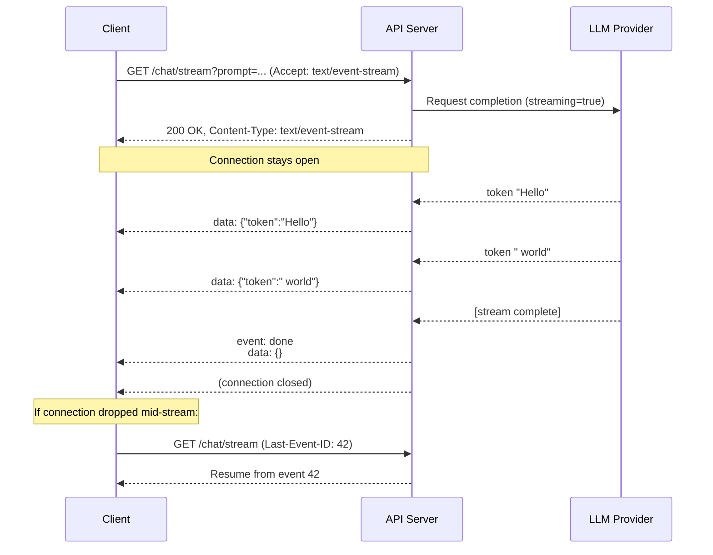

# Server-Sent Events

## Why This Matters

[WebSocket](websocket.md) gives you full bidirectional messaging, but most real-time features don't actually need the client to send anything after the initial request — a live dashboard, a progress indicator, a notification feed, and — the case that matters most for this handbook — a streaming LLM response, are all fundamentally **one-directional**: the server has an ongoing stream of updates, and the client just wants to receive them as they happen. Server-Sent Events (SSE) is the tool built specifically for that shape of problem: streaming, server-to-client, over plain HTTP, with none of WebSocket's protocol upgrade, heartbeat design, or connection-affinity concerns. It's a strong default you should reach for before WebSocket, and it's the mechanism behind how virtually every LLM provider streams chat completions today.

## Core Concept

**Server-Sent Events** is a simple, text-based protocol for a server to push a stream of discrete events to a client over a single, long-lived, ordinary HTTP connection — no protocol upgrade, no special handshake, just a response whose `Content-Type` is `text/event-stream` and whose body never really "ends" until the server decides it should. The client opens a normal HTTP connection (via the standard `EventSource` browser API, or any HTTP client that can read a response incrementally) and the server keeps that response open, writing new `data:`-prefixed lines to it as events occur, flushing each one as it's written rather than buffering the whole response.

Because it's still just HTTP under the hood — a `GET` request and a (very long) response — SSE works through the exact same infrastructure that everything else in this handbook uses: standard proxies, load balancers, HTTP/1.1 or HTTP/2, no special server upgrade logic required. The trade-off for that simplicity is that SSE is strictly one-directional: the client cannot send messages back over the same connection once it's open — if the client needs to send more than its original request, it makes a separate, ordinary HTTP request.

## Mental Model

Think of a normal HTTP response like a letter — sealed, complete, delivered all at once, then the correspondence for that request is over. SSE is like leaving a radio tuned to a live broadcast: you tune in once (open the connection) and the station keeps talking, sending fresh updates whenever it has something to say, and you just listen — you can't talk back on the same channel, but you don't need to reconnect between announcements either. Compare that to [WebSocket](websocket.md), which is a phone call where both people can talk, and to [Polling](polling.md), which is repeatedly calling the station to ask "anything new?" SSE gets the "always listening, no need to ask" benefit of a phone call, for the one-directional case, without needing either side to speak.

## How It Works

1. **Client opens a normal HTTP `GET`** (or `POST`, for cases needing a request body, like an LLM chat completion prompt) with `Accept: text/event-stream`.
2. **Server responds with `Content-Type: text/event-stream`** and keeps the connection open rather than closing it after the first chunk — this is standard HTTP chunked transfer encoding, nothing protocol-special.
3. **Server writes events as plain text, one per group of lines**, each event separated by a blank line. The core format:
   ```
   data: {"token": "Hello"}

   data: {"token": " world"}

   ```
   Optional fields: `event: <name>` (a custom event type, so a client can dispatch different handlers for different kinds of events), `id: <id>` (lets a reconnecting client resume from the last event it saw), and `retry: <ms>` (tells the client how long to wait before auto-reconnecting if the connection drops).
4. **Client processes each event as it arrives**, without waiting for the stream to end — this is what makes SSE feel real-time even though, mechanically, it's a very long HTTP response being read incrementally.
5. **Stream ends** when the server closes the connection (all done) or the client disconnects (user navigated away, cancelled the request).
6. **Built-in reconnection.** The browser's native `EventSource` API automatically reconnects on a dropped connection, and — if the server sent `id:` fields — resumes by sending a `Last-Event-ID` header, letting the server pick up from where it left off. This is a meaningful operational advantage over WebSocket, where reconnection and resumption are entirely the application's responsibility to build.

## Architecture



The important structural detail: only two arrows ever originate from the client — the initial request, and (if needed) a reconnect carrying `Last-Event-ID`. Every actual data event flows one direction, which is exactly the shape of a token-streaming LLM response.

## Request / Response Example

The client's initial request — an ordinary `GET`, just declaring it wants an event stream:

```http
GET /chat/stream?prompt=Explain%20SSE HTTP/1.1
Host: api.example.com
Accept: text/event-stream
Authorization: Bearer sk_live_abc123
```

The server's response — headers sent once, then the body streams indefinitely until the server closes it:

```http
HTTP/1.1 200 OK
Content-Type: text/event-stream
Cache-Control: no-cache
Connection: keep-alive
X-Accel-Buffering: no

id: 1
data: {"delta": "Server-Sent"}

id: 2
data: {"delta": " Events"}

id: 3
data: {"delta": " let a server push"}

event: done
data: {"finish_reason": "stop"}

```

`Cache-Control: no-cache` prevents intermediate caches from buffering the response, and `X-Accel-Buffering: no` disables response buffering in Nginx specifically — a very common gotcha where a proxy buffers the entire response before forwarding it, silently destroying the "streaming" behavior even though the server is writing incrementally.

## Code Example

A FastAPI SSE endpoint streaming tokens from an LLM call, using `StreamingResponse`:

```python
import asyncio
import json
from fastapi import FastAPI
from fastapi.responses import StreamingResponse

app = FastAPI()


async def fake_llm_token_stream(prompt: str):
    """Stand-in for a real LLM provider's streaming API (see llm-apis.md)."""
    tokens = ["Server-Sent", " Events", " stream", " tokens", " incrementally."]
    for i, token in enumerate(tokens, start=1):
        await asyncio.sleep(0.15)  # simulates generation latency per token
        yield i, token


async def sse_event_generator(prompt: str):
    try:
        async for event_id, token in fake_llm_token_stream(prompt):
            payload = json.dumps({"delta": token})
            # The "id:" field lets a reconnecting client resume via
            # Last-Event-ID instead of restarting the whole generation.
            yield f"id: {event_id}\ndata: {payload}\n\n"
        yield "event: done\ndata: {}\n\n"
    except asyncio.CancelledError:
        # Client disconnected mid-stream (e.g., closed the tab).
        # Clean up any upstream resources here if needed, then re-raise.
        raise


@app.get("/chat/stream")
async def chat_stream(prompt: str):
    return StreamingResponse(
        sse_event_generator(prompt),
        media_type="text/event-stream",
        headers={
            "Cache-Control": "no-cache",
            "X-Accel-Buffering": "no",  # disable Nginx response buffering
        },
    )
```

A minimal browser-side consumer using the native `EventSource` API:

```javascript
const source = new EventSource("/chat/stream?prompt=Explain+SSE");

source.onmessage = (event) => {
  const { delta } = JSON.parse(event.data);
  document.getElementById("output").textContent += delta;
};

source.addEventListener("done", () => {
  source.close(); // stop listening once the server signals completion
});

source.onerror = () => {
  // EventSource auto-reconnects on transient errors by default;
  // this fires on unrecoverable failures.
  console.error("stream connection lost");
};
```

## Production Considerations

- **Disable proxy buffering explicitly.** Nginx, and some other reverse proxies, buffer the entire response body by default before forwarding it — which defeats streaming entirely, delivering everything at once instead of incrementally. `X-Accel-Buffering: no` (Nginx) or the equivalent for your proxy is not optional for SSE in production.
- **Set `Cache-Control: no-cache`.** Without it, some caching layers may attempt to cache or replay a streaming response, producing corrupted or stale output for subsequent requests.
- **Handle client disconnects explicitly.** If the client closes the tab or cancels the fetch mid-stream, your server-side generator needs to detect that (an `asyncio.CancelledError` in Python) and stop pulling tokens from the upstream LLM call — otherwise you keep paying for generation nobody is receiving.
- **Long-lived connections still consume a server worker/connection slot**, same concern as WebSocket, though typically for a much shorter duration (seconds to tens of seconds for an LLM response, versus hours for a chat session) — capacity planning still matters for high concurrency.
- **Authentication is a normal header on a normal request**, unlike WebSocket where auth happens once at the handshake — this makes SSE easier to reason about for auth but means every reconnect re-authenticates, which is usually the behavior you want.
- **Use `id:` and support `Last-Event-ID`** if resumability matters for your use case (e.g., don't want to re-run an entire LLM generation from scratch after a network blip) — this is the one piece of extra design work SSE asks of you in exchange for everything else it gives for free.

## Common Mistakes

- **Reaching for WebSocket when the data only flows server-to-client.** If the client's only "message" is the initial request, SSE gets the same real-time experience with far less operational complexity — no heartbeat protocol, no connection-affinity requirement, native browser reconnection.
- **Forgetting to disable proxy/server response buffering**, resulting in a stream that silently behaves like a normal, non-streamed response in production despite working fine locally (where there's no intermediate proxy to buffer it).
- **Not handling client disconnection**, so an abandoned request keeps consuming upstream LLM tokens (and therefore billed cost) after nobody is listening.
- **Sending malformed event framing** — SSE requires a blank line between events; missing it causes clients to merge multiple events into one or fail to parse them at all.
- **Trying to send binary data directly.** SSE is text-only; binary payloads need to be base64-encoded or referenced by URL, unlike WebSocket which natively supports binary frames.

## Best Practices

- Default to SSE for any one-directional, server-to-client streaming need — reserve [WebSocket](websocket.md) for cases that are genuinely bidirectional.
- Always set `Cache-Control: no-cache` and disable proxy buffering explicitly for the streaming endpoint.
- Include `id:` fields and honor `Last-Event-ID` on reconnect if resuming a partial stream has real value (it usually does for anything expensive to regenerate, like an LLM completion).
- Detect and handle client disconnection server-side to avoid wasting upstream compute/cost on abandoned streams.
- Send a clear terminal event (`event: done`) so the client can distinguish "stream finished successfully" from "connection dropped unexpectedly."

## AI Engineering Perspective

SSE is the de facto standard for streaming LLM chat completions, and for good reason: the data flow — model generates tokens, client displays them as they arrive — is purely one-directional, exactly SSE's sweet spot, and it works over the same plain HTTP infrastructure every other endpoint in your API already uses, with no separate WebSocket server or connection-affinity story to build and operate. The deeper mechanics of what actually gets streamed — how tokens map to SSE events, how partial/incomplete JSON in a streamed structured output is handled, how tool-call arguments arrive incrementally — are covered in full in `../14-ai-api-engineering/streaming-llm-responses.md`, which builds directly on the SSE fundamentals in this chapter. The same reasoning extends to [RAG APIs](../16-rag-apis/README.md): streaming retrieval progress or generation tokens back to a client while a RAG pipeline runs is a one-directional server-to-client problem, making it another natural fit for SSE rather than WebSocket (see `streaming-apis.md`, planned, for streaming patterns beyond plain chat completions).

## Exercises

**Beginner**
1. Build a FastAPI SSE endpoint that streams the numbers 1 through 10, one every 500ms, and consume it from the browser using `EventSource`, appending each number to the page.

**Intermediate**
2. Add `id:` fields to each event in the endpoint from Exercise 1, and implement resumability: if a `Last-Event-ID` header is present, the server should resume from `id + 1` instead of starting over from 1.

**Advanced**
3. Wrap a (real or simulated) LLM streaming call in a FastAPI SSE endpoint, ensure the upstream generation is cancelled cleanly if the client disconnects mid-stream, and add a distinct `event: error` type for upstream failures, so the client can distinguish a normal `done` from a failed generation.

## Key Takeaways

- SSE streams events from server to client over a single, plain HTTP connection (`Content-Type: text/event-stream`) — no protocol upgrade, no special handshake, and it's strictly one-directional.
- The format is simple text: `data:` lines per event, separated by blank lines, with optional `id:`, `event:`, and `retry:` fields.
- Native browser support (`EventSource`) includes automatic reconnection and resumption via `Last-Event-ID`, which [WebSocket](websocket.md) does not provide out of the box.
- Proxy/server response buffering is the most common production pitfall — it must be explicitly disabled or the "stream" silently becomes a single buffered response.
- SSE is the standard mechanism for streaming LLM responses because that data flow is one-directional — prefer it over WebSocket whenever the client doesn't need to send messages after the initial request.

---

Related: [WebSocket](websocket.md), [Webhooks](webhooks.md), and the deep dive into `../14-ai-api-engineering/streaming-llm-responses.md`. Back to [Part 9 overview](README.md).
