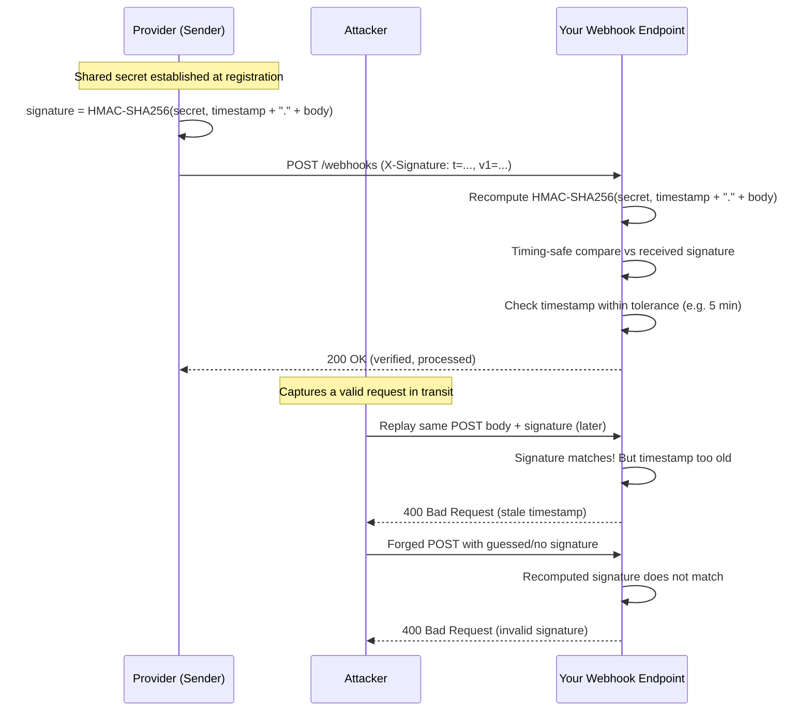

# Webhook Signature Verification

## Why This Matters

Once you expose a [webhook](webhooks.md) endpoint, you've published a public URL that accepts `POST` requests and — without additional protection — will happily act on whatever anyone sends it. There is nothing about the URL itself that proves a request claiming to be `payment.succeeded` from your payment provider actually came from your payment provider; an attacker who finds or guesses that URL can forge the exact same payload and trigger your business logic (mark an order as paid, grant access, send a notification) with a single crafted `curl` command. Signature verification is the mechanism that closes this hole: proof, on every single request, that the payload was produced by someone who holds a shared secret — namely, the real provider — and that it hasn't been tampered with in transit. Skipping it, or implementing it carelessly, is one of the most common and most serious mistakes in webhook-consuming code, precisely because an unverified webhook endpoint often looks and works fine in every test until the day someone deliberately abuses it.

## Core Concept

Webhook signature verification uses **HMAC (Hash-based Message Authentication Code)**: the sender and receiver share a secret (established at webhook registration time, never transmitted with each request), and the sender computes a cryptographic hash of the request body *using that secret as a key*, then sends the hash alongside the payload as a signature header. The receiver recomputes the same hash, independently, using its own copy of the secret and the raw bytes it received, and checks whether the two hashes match. If they match, the receiver has cryptographic proof of two things at once: **authenticity** (only someone holding the secret could have produced that exact hash) and **integrity** (any tampering with the payload in transit would change the hash and cause the comparison to fail).

This is different from just checking an API key or IP address. An API key sent in a header can be intercepted and replayed as-is; HMAC signatures are computed per-request, over the *specific content* of that request, so a signature valid for one payload is meaningless for any other. IP allowlisting is a weaker, purely network-layer check — but providers rotate IP ranges, and IP allowlisting alone gives no protection against payload tampering by a compromised intermediary. Signature verification is the layer that actually answers "did this exact payload come from who it claims to, unmodified?"

## Mental Model

Think of a wax seal on an old letter. Anyone can write a letter and put your rival's name at the bottom — that proves nothing. But a wax seal pressed with your rival's actual signet ring (something only they physically possess) is proof the letter genuinely passed through their hands, and if the seal is broken or doesn't match their ring's exact pattern, you know either it's a forgery or it was tampered with after sealing. The HMAC signature is that wax seal: the shared secret is the signet ring nobody else has, the hash is the wax impression, and checking it means pressing your own copy of the ring into fresh wax and comparing patterns — not just reading a name that anyone could have written.

## How It Works

1. **Shared secret established once, out of band.** When you register a webhook endpoint, the provider generates a secret and shows it to you (once, usually) — you store it securely, typically in a secrets manager or environment variable, never in source control.
2. **Sender computes a signature per request.** Before sending the webhook, the provider computes `HMAC-SHA256(secret, request_body)` — a hash that depends on both the secret and the exact bytes of the payload — and includes it in a header (naming varies: `X-Signature`, `X-Hub-Signature-256`, `Stripe-Signature`).
3. **Sender often includes a timestamp too**, either in the payload or a separate header, and folds it into the signed content (e.g., signing `"{timestamp}.{body}"` instead of just `body`). This is what enables replay protection — covered in step 6.
4. **Receiver recomputes the signature** using its own stored copy of the secret and the *raw* bytes of the request body — not a re-serialized version of the parsed JSON, which can differ in whitespace, key order, or number formatting and would produce a different hash even for "the same" logical payload.
5. **Receiver compares using a timing-safe function**, never `==` or `!=`. A naive string comparison exits as soon as it finds the first mismatched character, meaning the time it takes to fail depends on how many leading characters were correct — an attacker who can measure response timing precisely enough could exploit this to guess the correct signature one byte at a time (a timing attack). A timing-safe comparison (`hmac.compare_digest` in Python) always takes the same amount of time regardless of where the mismatch occurs, eliminating that side channel.
6. **Replay protection via timestamp validation.** Even a perfectly valid, correctly signed webhook payload is dangerous if an attacker captures it in transit and resends it later — the signature would still verify, because nothing about HMAC alone prevents resending the exact same bytes. The fix: the receiver rejects any request whose timestamp is too old (commonly a 5-minute tolerance), so a captured-and-replayed request past that window fails even with a perfectly valid signature.

## Architecture



This diagram shows the two distinct attacks signature verification with a timestamp defends against: a fully forged payload (caught by the signature mismatch) and a captured, legitimately-signed payload resent later (caught by the timestamp check, since the signature alone would otherwise pass).

## Request / Response Example

An inbound webhook carrying a signature that combines a timestamp and an HMAC digest — a common pattern (this mirrors how Stripe structures its `Stripe-Signature` header):

```http
POST /webhooks/payments HTTP/1.1
Host: api.yourapp.com
Content-Type: application/json
X-Signature: t=1755511200,v1=5b3f8a1c9e4d2b7a6f0c1e8d3a9b4c7e2f1a0d8b3c6e9f2a1d4b7c0e3f6a9d2c

{
  "id": "evt_1PqR8sK2LxN9wZ",
  "type": "payment.succeeded",
  "data": { "payment_id": "pay_9F2xLp3Q", "amount": 4999 }
}
```

Here, `t=1755511200` is the Unix timestamp the provider signed alongside the body, and `v1=...` is the resulting HMAC-SHA256 hex digest of `"1755511200.{raw_body}"` keyed with the shared secret. A successful verification simply proceeds to normal processing (`200 OK`, as shown in [Webhooks](webhooks.md)); a failed one should return a `4xx` with no ambiguity about *why*, for debugging, but without leaking the expected signature value:

```http
HTTP/1.1 400 Bad Request
Content-Type: application/json

{ "error": "signature_verification_failed" }
```

## Code Example

A complete, timing-safe verification function with replay protection, plus the FastAPI receiver wiring it together:

```python
import hashlib
import hmac
import os
import time

from fastapi import FastAPI, Header, HTTPException, Request

app = FastAPI()

WEBHOOK_SECRET = os.environ["PAYMENT_WEBHOOK_SECRET"]  # from env, never hardcoded
REPLAY_TOLERANCE_SECONDS = 300  # 5 minutes


def verify_webhook_signature(raw_body: bytes, signature_header: str, secret: str) -> None:
    """Raises ValueError with a specific reason if verification fails.

    signature_header looks like: "t=1755511200,v1=5b3f8a1c..."
    """
    try:
        parts = dict(item.split("=", 1) for item in signature_header.split(","))
        timestamp = int(parts["t"])
        provided_signature = parts["v1"]
    except (KeyError, ValueError):
        raise ValueError("malformed_signature_header")

    # --- Replay protection: reject requests signed too long ago ---
    now = int(time.time())
    if abs(now - timestamp) > REPLAY_TOLERANCE_SECONDS:
        raise ValueError("stale_timestamp")

    # --- Recompute the expected signature over "timestamp.raw_body" ---
    signed_payload = f"{timestamp}.".encode() + raw_body
    expected_signature = hmac.new(
        secret.encode(), signed_payload, hashlib.sha256
    ).hexdigest()

    # --- Timing-safe comparison: NEVER use `==` here ---
    # A plain string comparison leaks timing information about how many
    # leading characters matched, which can be exploited to forge a valid
    # signature byte-by-byte over many requests. compare_digest runs in
    # constant time regardless of where (or whether) a mismatch occurs.
    if not hmac.compare_digest(expected_signature, provided_signature):
        raise ValueError("signature_mismatch")


@app.post("/webhooks/payments")
async def receive_payment_webhook(request: Request, x_signature: str = Header(...)):
    # Read RAW bytes - verifying a re-serialized/re-parsed body would
    # produce a different hash than what the sender actually signed.
    raw_body = await request.body()

    try:
        verify_webhook_signature(raw_body, x_signature, WEBHOOK_SECRET)
    except ValueError as exc:
        # Deliberately vague to the caller; log the specific reason internally.
        raise HTTPException(status_code=400, detail="signature_verification_failed") from exc

    event = await request.json()
    # ... proceed to idempotent processing, as shown in webhooks.md ...
    return {"received": True}
```

## Production Considerations

- **Always read the raw request body for verification**, before any framework-level JSON parsing that might normalize whitespace, key order, or number formatting — signing and verifying must operate on identical bytes.
- **Rotate secrets without downtime.** Support verifying against two secrets simultaneously (current and previous) during a rotation window, so in-flight webhooks signed with the old secret aren't rejected the moment you rotate.
- **Store secrets in a secrets manager or environment variables, never in code or version control** — treat a leaked webhook secret with the same severity as a leaked API key, since it allows an attacker to forge arbitrary events your system will trust.
- **Choose a replay tolerance deliberately.** Too tight (e.g., 10 seconds) causes false rejections from legitimate clock skew or network latency; too loose (e.g., 24 hours) meaningfully weakens replay protection. A few minutes is a common, reasonable middle ground.
- **Log verification failures with enough detail to debug** (which check failed: malformed header, stale timestamp, signature mismatch) internally, while returning a generic error externally — detailed failure reasons in the response can help an attacker iteratively probe your verification logic.
- **Don't rely on IP allowlisting as your only defense.** It's a reasonable *additional* layer, but provider IP ranges change, some legitimate delivery paths go through proxies, and it does nothing to prevent payload tampering by a compromised intermediary — signature verification remains the primary control.

## Common Mistakes

- **Not verifying signatures at all** — building and shipping a webhook receiver that trusts every request that hits the URL, effectively an open door for anyone who discovers the endpoint.
- **Using `==` or `!=` instead of a timing-safe comparison**, introducing a timing side channel that, while hard to exploit, is a real and well-documented class of vulnerability with no reason to accept the risk when `hmac.compare_digest` exists for free.
- **Verifying against a re-parsed/re-serialized body** instead of the raw bytes, causing legitimate requests to fail verification whenever serialization details differ even slightly from what the sender actually signed.
- **No replay protection**, so a captured, perfectly valid, correctly signed request can be resent by an attacker at any later time and will still pass verification.
- **Hardcoding the webhook secret in source code**, or logging it accidentally in debug output — both leak the one piece of information the entire scheme depends on staying secret.
- **Skipping verification "for now" in development and forgetting to add it before production** — a surprisingly common way real systems end up shipping unverified webhook endpoints.

## Best Practices

- Always verify on the raw request body, with `hmac.compare_digest` (or your language's equivalent constant-time comparison), on every single request with no exceptions.
- Include and check a timestamp as part of the signed content to defend against replay attacks, with a tolerance window of a few minutes.
- Store secrets in environment variables or a secrets manager, and support dual-secret verification during rotation.
- Fail closed: any verification error (malformed header, stale timestamp, mismatch) should reject the request with a `4xx`, never proceed "just to be safe" or silently continue.
- Log detailed failure reasons internally, but keep the response to the caller generic and non-specific.

## AI Engineering Perspective

As AI systems increasingly rely on asynchronous webhooks — an LLM provider notifying you a batch job finished, a vector database confirming an ingestion pipeline completed for a [RAG API](../16-rag-apis/README.md), or an agent's long-running tool call reporting its result back — signature verification is the control that keeps those integrations trustworthy. An attacker who can forge a "batch job completed successfully" webhook toward a system that automatically deploys or acts on the result could trigger real, costly actions (deploying an unvalidated model, ingesting attacker-controlled content into a knowledge base) without ever touching your actual provider credentials. The stakes scale with what the webhook is allowed to trigger automatically — and AI pipelines increasingly automate consequential actions (model deployment, data ingestion, spend) based on webhook events, which makes rigorous signature verification, not an afterthought, a load-bearing part of the system's security. See [Part 10 — API Security](../10-api-security/README.md) for the broader security context this fits into, and `../../resources/glossary.md` for related terms like HMAC and replay attack.

## Exercises

**Beginner**
1. Write a Python function that computes an HMAC-SHA256 signature for a given payload and secret, and a second function that verifies it using `hmac.compare_digest`. Confirm it correctly accepts a matching signature and rejects a tampered payload.

**Intermediate**
2. Add timestamp-based replay protection to your verification function from Exercise 1: sign `f"{timestamp}.{body}"` instead of just `body`, and reject any request whose timestamp is more than 5 minutes from the current time.

**Advanced**
3. Implement dual-secret verification supporting a rotation window: given a "current" and "previous" secret, the verifier should accept a valid signature produced by either one, so in-flight webhooks signed just before a rotation aren't rejected. Write a test that simulates rotating the secret mid-stream of incoming webhooks.

## Key Takeaways

- HMAC signature verification proves a webhook payload actually came from the claimed sender and wasn't tampered with in transit — a shared secret you never transmit, used to produce and independently recompute a hash of the exact request bytes.
- Always compare signatures with a timing-safe function (`hmac.compare_digest`), never `==`, to avoid a timing-attack side channel.
- Verify against the raw request body, not a re-parsed/re-serialized version, since serialization differences change the hash.
- A valid signature alone doesn't prevent replay attacks — sign and check a timestamp with a bounded tolerance window to reject captured-and-resent requests.
- Unverified webhook endpoints are a real, common, and serious vulnerability class — every webhook receiver in this handbook's examples (see [Webhooks](webhooks.md) and [`examples/webhooks/`](../../examples/webhooks/)) should perform this check before trusting any payload.

---

Related: [Webhooks](webhooks.md), [Part 10 — API Security](../10-api-security/README.md), [Part 6 — Production Reliability](../06-production-reliability/README.md). Back to [Part 9 overview](README.md).
