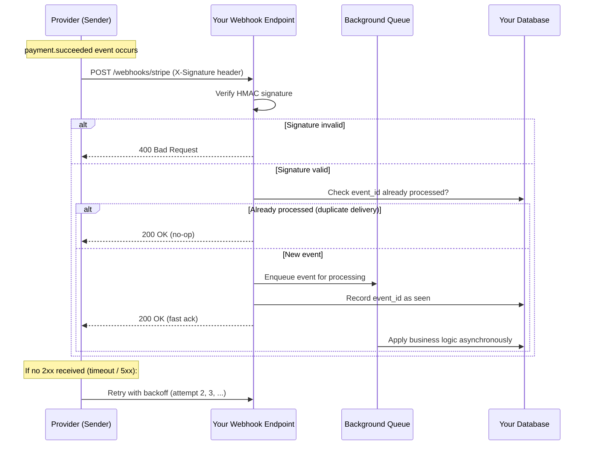

# Webhooks

## Why This Matters

[Polling](polling.md) puts the burden of "did anything happen?" on the client, forever, on a timer, mostly asking a question whose answer is "no." Webhooks flip that entirely: instead of your service repeatedly asking a provider whether something happened, the provider calls *your* API the moment it does. This is how Stripe tells you a payment succeeded, how GitHub tells you a pull request was opened, and how most third-party integrations notify you of events in near real time without you polling anything. But inverting the request direction inverts the trust model too — now you're running a public endpoint that anyone on the internet can attempt to hit, pretending to be that provider, which is precisely why [Webhook Signature Verification](webhook-signature-verification.md) exists as its own chapter. Understanding webhooks properly means understanding both sides: what you owe as a receiver, and what a well-built sender does to make delivery reliable.

## Core Concept

A **webhook** is a reversed API call: instead of you calling an API to fetch data, an external service calls a URL you registered ahead of time, as an HTTP `POST` request, whenever a specific event occurs on their side. You provide the URL (during setup, via a dashboard or a "register webhook" API call); they provide the payload, on their schedule, whenever their event fires.

This reversal has a consequence that trips up almost every new webhook implementer: **your endpoint is now a public HTTP server that must handle unsolicited, un-trusted inbound requests**, exactly like any other endpoint on your API, except the "client" is a system you don't control and can't rate-limit at the source. Everything you already know about designing robust endpoints — input validation, idempotency, fast responses — applies, but with a sharper edge, because a slow or wrong webhook handler affects a payment provider's or messaging platform's opinion of your integration's reliability, not just your own users' experience.

Two properties define whether a webhook system is well-built:

- **Delivery guarantees on the sender's side** — does the provider retry failed deliveries, and how?
- **Idempotency on the receiver's side** — can your handler safely process the same event twice without corrupting state?

## Mental Model

Think of polling as repeatedly calling a delivery company to ask "has my package shipped yet?" A webhook is the delivery company calling *you* the moment it ships — you don't have to ask, but now you need a phone that's always on, that can pick up in under a second, and that won't get flustered if they accidentally call twice about the same package (which does happen — their systems retry when they're not sure the first call got through). If your phone doesn't answer, a good delivery company keeps trying, with growing gaps between attempts, for a while — but eventually gives up and stops trying, which means you also need a way to check for anything you might have missed.

## How It Works

1. **Registration.** You (the receiver) give the provider (the sender) a URL, usually via their dashboard or a `POST /webhooks` management API call, along with which event types you want (`payment.succeeded`, `pull_request.opened`).
2. **Event occurs.** Something happens on the provider's side — a charge completes, an order ships.
3. **Provider sends a `POST`** to your registered URL, with a JSON body describing the event, and (critically) a signature header proving the payload came from them — covered in depth in [Webhook Signature Verification](webhook-signature-verification.md).
4. **Your endpoint responds fast.** You should verify the signature, do the minimum work needed to safely acknowledge the event (e.g., write it to a queue or mark it processed), and return `2xx` — ideally in well under a second. Heavy processing (sending emails, updating multiple systems) belongs in a background job (see [Part 8 — Async Systems](../08-async-systems/README.md)), not inline in the request handler.
5. **Retry on failure.** If your endpoint doesn't respond `2xx` — times out, returns `5xx`, or is unreachable — the provider retries, typically with exponential backoff (see [Part 6 — Production Reliability](../06-production-reliability/README.md)), for a bounded window (minutes to days depending on the provider) before giving up.
6. **Duplicates happen — by design.** Because the provider can't always tell whether their first request actually reached you (a `2xx` response lost in transit still looks like a failure to them), a well-built sender will occasionally redeliver an event your handler already processed. This is not a bug on either side — it's the correct, expected behavior of at-least-once delivery, and it's why your handler must be idempotent. (Duplicate detection strategies are covered in depth in `duplicate-events.md`, planned.)

## Architecture



The key architectural decision visible in this diagram: signature verification and duplicate-checking happen *before* any real work, and the `2xx` acknowledgment is returned as soon as the event is safely queued — not after the business logic finishes.

## Request / Response Example

A payment provider notifying your API that a charge succeeded:

```http
POST /webhooks/payments HTTP/1.1
Host: api.yourapp.com
Content-Type: application/json
X-Webhook-Signature: t=1755511200,v1=5b3f8a1c9e4d2b7a6f0c1e8d3a9b4c7e2f1a0d8b
X-Webhook-Id: evt_1PqR8sK2LxN9wZ

{
  "id": "evt_1PqR8sK2LxN9wZ",
  "type": "payment.succeeded",
  "created_at": "2026-08-18T09:59:58Z",
  "data": {
    "payment_id": "pay_9F2xLp3Q",
    "amount": 4999,
    "currency": "usd",
    "customer_id": "cust_88AeT1"
  }
}
```

A fast, correct acknowledgment — note it says nothing about whether downstream business logic (sending a receipt email, updating an order) has finished, only that the event was safely received:

```http
HTTP/1.1 200 OK
Content-Type: application/json

{ "received": true }
```

If the signature fails verification, the correct response is a `4xx`, which most providers treat as "don't bother retrying, this delivery is malformed" rather than a transient failure worth retrying:

```http
HTTP/1.1 400 Bad Request
Content-Type: application/json

{ "error": "invalid_signature" }
```

## Code Example

A FastAPI receiver that verifies the signature (see [Webhook Signature Verification](webhook-signature-verification.md) for the full HMAC mechanics), deduplicates by event ID, and hands off real work to a background task instead of blocking the response:

```python
import hashlib
import hmac
import os

from fastapi import BackgroundTasks, FastAPI, Header, HTTPException, Request

app = FastAPI()

WEBHOOK_SECRET = os.environ["PAYMENT_WEBHOOK_SECRET"]  # never hardcode secrets

# In production this is a database table or Redis set with a TTL,
# not an in-memory set that resets on every restart.
SEEN_EVENT_IDS: set[str] = set()


def verify_signature(payload: bytes, signature_header: str) -> bool:
    expected = hmac.new(WEBHOOK_SECRET.encode(), payload, hashlib.sha256).hexdigest()
    provided = signature_header.split("v1=")[-1]
    # Timing-safe comparison - see webhook-signature-verification.md for why
    # a plain `==` check here is a real vulnerability.
    return hmac.compare_digest(expected, provided)


def process_payment_event(event: dict) -> None:
    """Runs after the response has already been sent to the provider."""
    # Real work: update order status, send receipt, etc.
    print(f"Processing {event['type']} for {event['data']['payment_id']}")


@app.post("/webhooks/payments")
async def receive_payment_webhook(
    request: Request,
    background_tasks: BackgroundTasks,
    x_webhook_signature: str = Header(...),
    x_webhook_id: str = Header(...),
):
    raw_body = await request.body()

    if not verify_signature(raw_body, x_webhook_signature):
        raise HTTPException(status_code=400, detail="invalid_signature")

    # Idempotency: the provider WILL redeliver this event at least once.
    if x_webhook_id in SEEN_EVENT_IDS:
        return {"received": True, "duplicate": True}

    SEEN_EVENT_IDS.add(x_webhook_id)
    event = await request.json()

    # Do the slow work AFTER responding, so the provider sees a fast 2xx
    # and doesn't time out waiting on downstream systems.
    background_tasks.add_task(process_payment_event, event)

    return {"received": True}
```

## Production Considerations

- **Respond fast, process slow.** Providers enforce timeouts (often 5–30 seconds); exceeding one looks identical to a failure and triggers a retry, even if you eventually would have succeeded. Acknowledge quickly, do real work in a background job or queue (see [Part 8 — Async Systems](../08-async-systems/README.md)).
- **Idempotency is not optional.** Every provider's retry policy guarantees you *will* receive duplicate deliveries eventually — treat "processed twice" as a normal case to design for, not an edge case to hope you never hit. Track a unique event ID and short-circuit on repeats.
- **Verify every request's signature**, on every request, with no exceptions for "trusted" IP ranges alone — see [Webhook Signature Verification](webhook-signature-verification.md) for the full mechanism and why IP allowlisting alone is insufficient.
- **Have a reconciliation path.** Even reliable providers occasionally fail to deliver (network partition during their retry window, endpoint down for an extended maintenance). Expose or consume a "list recent events" API from the provider so you can catch anything missed — webhooks should complement, not fully replace, a way to reconcile state.
- **Log every inbound webhook**, signature verification result included, before doing anything else — this is often your only debugging trail when a provider says "we sent it" and your system shows no record.
- **Return meaningful status codes.** A `2xx` means "stop retrying," a `4xx` typically also means "don't retry, this request was malformed," and a `5xx` or timeout means "please retry" — mixing these up either causes silent data loss (acking something you didn't actually process) or needless retry storms.

## Common Mistakes

- **Doing all business logic synchronously inside the webhook handler**, so a slow downstream call (email provider, database write) causes the provider to time out and retry — sometimes triggering duplicate side effects during the same slow request.
- **Not verifying signatures at all**, or verifying them with a non-timing-safe comparison, leaving the endpoint open to forged requests from anyone who guesses the URL.
- **Assuming exactly-once delivery.** Almost every provider guarantees *at-least-once* delivery, not exactly-once — a handler that isn't idempotent will eventually double-charge, double-send, or double-count something.
- **Trusting the payload's claimed event type without checking the signature first**, allowing an attacker to submit a fabricated `payment.succeeded` event.
- **No dead-letter or manual reconciliation path**, so a webhook that's dropped after all retries are exhausted (e.g., during an extended outage) is silently lost forever with no way to detect or recover it.

## Best Practices

- Always verify the signature before parsing or trusting the payload — see [Webhook Signature Verification](webhook-signature-verification.md).
- Use the provider's event ID as an idempotency key, stored durably (database, not memory) with a TTL matching or exceeding the provider's maximum retry window.
- Return `2xx` as soon as the event is safely queued, not after all downstream processing completes.
- Store raw webhook payloads (even after processing) for a retention window — invaluable for debugging and reconciliation.
- Build or use a provider's "list events" reconciliation API as a safety net for delivery gaps, rather than relying on webhooks as the sole source of truth.

## AI Engineering Perspective

Webhooks are the standard integration point for asynchronous AI workloads whose completion time is unpredictable: a batch inference job, a long-running fine-tune, or an async document-processing pipeline for [RAG APIs](../16-rag-apis/README.md) can take anywhere from seconds to hours, and polling that duration is wasteful (see [Polling](polling.md)). Instead, many AI providers let you register a webhook that fires when the job completes, carrying the result or a pointer to it. The idempotency requirement is especially sharp here: a duplicate "fine-tune completed" webhook that triggers re-deploying a model twice, or a duplicate "batch job done" event that re-processes an entire result set, is a meaningfully more expensive mistake than a duplicate email. AI agent systems (see [Part 17 — AI Agents & MCP](../17-ai-agents-and-mcp/README.md)) also increasingly use webhooks as the mechanism by which a long-running tool call reports its result back asynchronously, rather than holding a connection open for a tool that might take minutes to finish.

## Exercises

**Beginner**
1. Build a FastAPI endpoint `POST /webhooks/test` that logs the headers and JSON body of any request it receives, and use `curl` to simulate an inbound webhook.

**Intermediate**
2. Add signature verification (HMAC-SHA256, secret from an environment variable) and event-ID-based deduplication (in-memory set is fine for the exercise) to the endpoint from Exercise 1.

**Advanced**
3. Design a reconciliation job: given a provider that also exposes `GET /events?since=<timestamp>`, write a scheduled task that compares events your webhook handler has recorded against the provider's event list for the last 24 hours, and reports any gaps.

## Key Takeaways

- A webhook inverts the request direction: the provider calls your API when an event happens, instead of you polling for it.
- Providers guarantee *at-least-once* delivery, with retries and backoff on failure — your handler must be idempotent, because duplicate deliveries are normal, not exceptional.
- Respond fast (verify + queue) and do real processing asynchronously; slow synchronous handlers cause timeouts, which look like failures and trigger unwanted retries.
- Every inbound webhook must have its signature verified before being trusted — see [Webhook Signature Verification](webhook-signature-verification.md) for the mechanics.
- Webhooks work best paired with a reconciliation path (a "list events" API), since even reliable senders occasionally fail to deliver after exhausting retries.

---

See also the runnable example in [`examples/webhooks/`](../../examples/webhooks/). Related: [WebSocket](websocket.md), [Server-Sent Events](server-sent-events.md), [Part 10 — API Security](../10-api-security/README.md). Back to [Part 9 overview](README.md).
