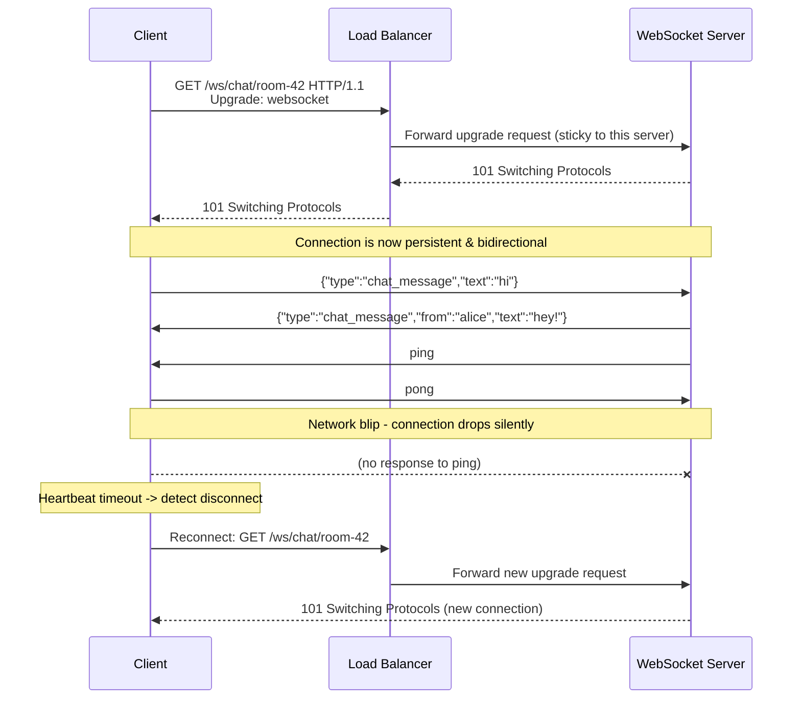

# WebSocket

## Why This Matters

[Polling](polling.md) is client-initiated and one-shot per request. [Webhooks](webhooks.md) are server-initiated but still one-shot per event, over a fresh connection each time, and only make sense when your service has a publicly reachable URL. Neither pattern fits a scenario like a chat application or a multiplayer collaborative editor, where *both* sides need to send arbitrary messages to each other, frequently, with low latency, over what is conceptually one ongoing conversation. WebSocket exists precisely for that case: a single, long-lived, full-duplex connection where either side can send a message at any time without re-establishing anything. It's also one of the most over-used tools in real-time API design — reaching for WebSocket when you only need one-directional server-to-client updates (where [Server-Sent Events](server-sent-events.md) would be simpler and more operationally robust) is a genuinely common and costly mistake, so this chapter is as much about *when not to use it* as how it works.

## Core Concept

**WebSocket** is a protocol (RFC 6455) that starts as an ordinary HTTP request and then **upgrades** into a persistent, bidirectional TCP connection over which both client and server can send discrete messages at any time, in either direction, without the request/response pairing that defines normal HTTP. Once the upgrade completes, HTTP semantics are gone — there's no more "request" and "response," just a raw, framed, two-way message channel that stays open until either side closes it or the underlying connection drops.

This is a fundamentally different model from everything else in this part. Polling and webhooks are both still, structurally, ordinary HTTP requests — a `GET` here, a `POST` there, each independent, each fitting cleanly into existing HTTP infrastructure (load balancers, caches, proxies) with no special handling. A WebSocket connection is a single long-lived stateful resource: it consumes a server-side connection slot, a specific worker or event loop, for as long as it's open — sometimes hours — which has real implications for how you scale and load-balance it (see Production Considerations).

## Mental Model

Think of ordinary HTTP requests, including polling, like exchanging letters through the mail — each letter (request) gets a reply (response), then the transaction is over, and every new letter starts fresh with no assumption the same postal worker handles it. Webhooks are like the other party occasionally mailing you an update on their own schedule, unprompted. WebSocket is a **phone call**: you dial once (the handshake), and then either person can speak at any moment without redialing, the "connection" itself persists as a shared, ongoing context, and — crucially — if the line goes dead, nobody automatically calls back. That last point is the one new engineers most often forget: a phone call that silently drops leaves both sides thinking they're still connected until they try to speak and get nothing back, which is exactly why WebSocket clients need explicit heartbeat and reconnection logic that plain HTTP never required.

## How It Works

1. **Handshake: an HTTP request asking to upgrade.** The client sends a normal-looking HTTP `GET` request, but with an `Upgrade: websocket` header and a `Sec-WebSocket-Key` — a randomly generated value used to prove the server actually understood the WebSocket protocol (not to encrypt anything).
2. **Server accepts: `101 Switching Protocols`.** If the server supports WebSocket at that path, it responds with status `101`, an `Upgrade: websocket` header, and a `Sec-WebSocket-Accept` value computed from the client's key — proof the handshake was understood by a real WebSocket-aware server, not a misconfigured proxy echoing headers back.
3. **Connection persists as a raw TCP stream.** From this point on, both sides exchange **frames** — the protocol's basic unit, which can be text, binary, or one of a few control types (`ping`, `pong`, `close`). There is no more request/response — either side can send a frame whenever it wants.
4. **Application-level messages ride on top of frames.** Most apps send JSON-encoded text frames as their message format (`{"type": "chat_message", "text": "hi"}`), giving structure on top of the raw protocol.
5. **Heartbeats keep the connection honest.** Because TCP connections can silently die (a mobile network switch, a NAT timeout, an idle load balancer closing a connection with no visible error) without either side receiving an explicit close, both client and server typically send periodic `ping`/`pong` control frames — if a pong doesn't come back within a timeout, the side assumes the connection is dead and closes it.
6. **Either side can close explicitly.** A `close` control frame, optionally carrying a status code and reason, ends the connection gracefully.
7. **Reconnection is the client's job.** WebSocket itself has no built-in reconnect — if the connection drops, the client must detect it (failed pong, `onclose` event) and decide whether and how to reconnect, usually with backoff, and often needs to re-sync any state it might have missed while disconnected.

## Architecture



Two things this diagram makes explicit: the load balancer must route the *entire* connection's lifetime to one server (sticky routing, since WebSocket state lives in that one process), and reconnection after a drop is a brand-new handshake, not a resumption of the old one — any messages missed during the gap need to be recovered by the application, not the protocol.

## Request / Response Example

The upgrade handshake, raw:

```http
GET /ws/chat/room-42 HTTP/1.1
Host: api.example.com
Upgrade: websocket
Connection: Upgrade
Sec-WebSocket-Key: dGhlIHNhbXBsZSBub25jZQ==
Sec-WebSocket-Version: 13
Authorization: Bearer sk_live_abc123
```

The server accepting the upgrade:

```http
HTTP/1.1 101 Switching Protocols
Upgrade: websocket
Connection: Upgrade
Sec-WebSocket-Accept: s3pPLMBiTxaQ9kYGzzhZRbK+xOo=
```

After this, there is no more HTTP framing to show — subsequent traffic is WebSocket frames, conventionally illustrated as the JSON payloads they carry:

```json
// Client -> Server
{"type": "chat_message", "room": "room-42", "text": "hi everyone"}

// Server -> Client (broadcast to other room members)
{"type": "chat_message", "room": "room-42", "from": "alice", "text": "hey!"}
```

## Code Example

A FastAPI WebSocket endpoint for a simple chat room, with a heartbeat and per-room broadcast:

```python
import asyncio
import json
from fastapi import FastAPI, WebSocket, WebSocketDisconnect

app = FastAPI()

# Track connections per room. In a multi-process deployment, broadcasting
# across processes requires a shared layer (e.g., Redis pub/sub) - a plain
# in-memory dict only works for a single server instance.
ROOMS: dict[str, set[WebSocket]] = {}


async def broadcast(room: str, message: dict, exclude: WebSocket | None = None):
    dead_connections = []
    for connection in ROOMS.get(room, set()):
        if connection is exclude:
            continue
        try:
            await connection.send_json(message)
        except Exception:
            dead_connections.append(connection)
    for dead in dead_connections:
        ROOMS[room].discard(dead)


@app.websocket("/ws/chat/{room}")
async def chat_room(websocket: WebSocket, room: str):
    await websocket.accept()  # completes the 101 handshake
    ROOMS.setdefault(room, set()).add(websocket)

    try:
        while True:
            # This blocks until a message arrives OR the connection drops.
            raw = await websocket.receive_text()
            data = json.loads(raw)
            await broadcast(room, {"type": "chat_message", "text": data["text"]}, exclude=websocket)
    except WebSocketDisconnect:
        # Client closed, or the connection dropped without a heartbeat pong.
        ROOMS[room].discard(websocket)
```

A minimal client-side reconnect loop (Python, using `websockets`), illustrating that reconnection logic is the client's responsibility, not the protocol's:

```python
import asyncio
import websockets

async def connect_with_retry(url: str, max_backoff: float = 30.0):
    backoff = 1.0
    while True:
        try:
            async with websockets.connect(url, ping_interval=20, ping_timeout=10) as ws:
                backoff = 1.0  # reset after a successful connection
                async for message in ws:
                    print("received:", message)
        except (websockets.ConnectionClosed, OSError):
            print(f"disconnected, retrying in {backoff:.1f}s")
            await asyncio.sleep(backoff)
            backoff = min(backoff * 2, max_backoff)  # exponential backoff
```

## Production Considerations

- **Sticky routing / connection affinity.** Because WebSocket state lives on one specific server process, load balancers must route an established connection's traffic consistently to that process — and horizontal scaling requires either sticky sessions or a shared pub/sub layer (Redis, Kafka) so a message from one connection can reach clients attached to a different server.
- **Connection count is a real resource.** Each open WebSocket ties up a file descriptor and some memory on the server for its entire lifetime — tens of thousands of idle-but-open connections is a capacity planning concern in a way that stateless HTTP requests never are.
- **Heartbeats are mandatory, not optional.** Without `ping`/`pong`, a dead connection (phone switched networks, NAT entry expired) can sit "open" from the server's perspective indefinitely, silently leaking resources and never triggering cleanup.
- **Authentication happens once, at the handshake.** Unlike HTTP, where every request carries its own auth header, a WebSocket connection is typically authenticated only during the initial upgrade — if a user's permissions change or their token expires mid-connection, the server must explicitly re-check and close the connection; it won't happen automatically.
- **Proxies and infrastructure need explicit WebSocket support.** Some older proxies, corporate firewalls, and default load balancer configurations don't pass through the `Upgrade` header correctly — this is a real deployment failure mode worth testing for, not just a theoretical concern.
- **Reconnection must recover missed state.** Since messages sent while disconnected are simply lost (no protocol-level replay), the application layer typically needs a way to resync — e.g., a "give me everything since sequence N" request right after reconnecting.

## Common Mistakes

- **Choosing WebSocket for one-directional server-to-client updates** (a live dashboard, streaming an LLM response) when [Server-Sent Events](server-sent-events.md) would do the same job with less operational complexity — no heartbeat protocol to build, works over plain HTTP infrastructure, automatic browser reconnection.
- **No heartbeat**, leading to "zombie" connections that appear open but are actually dead, wasting server resources and silently dropping messages the server thinks it delivered.
- **No reconnection logic on the client**, so a single network blip permanently ends real-time updates until the user manually refreshes.
- **Treating the connection as a single point of authorization** and never re-checking permissions for the connection's lifetime, even as it stays open for hours.
- **Broadcasting naively across multiple server processes** without a shared layer, so messages only reach clients connected to the same process that received the originating message.

## Best Practices

- Default to [Server-Sent Events](server-sent-events.md) or [webhooks](webhooks.md) unless you genuinely need bidirectional, low-latency, high-frequency messaging in both directions — WebSocket is the right tool for chat, multiplayer, and live collaborative editing, and often the wrong tool for everything else.
- Implement application-level heartbeats (`ping`/`pong`) with a sensible timeout, and treat a missed heartbeat as a disconnect.
- Build client reconnection with exponential backoff, and design the protocol so a client can resync missed state after reconnecting (e.g., a sequence number or "since" cursor).
- Re-validate authorization periodically for long-lived connections, not just at handshake time.
- For multi-instance deployments, route broadcast messages through a shared pub/sub layer (Redis, Kafka) rather than assuming all relevant connections live on the same process.

## AI Engineering Perspective

WebSocket is the right choice for AI features that are genuinely bidirectional and interactive in real time — voice assistants exchanging audio frames continuously in both directions, or a multi-turn agent interface where the user can interrupt an in-progress response. But for the single most common AI streaming use case — a client watching a language model's response arrive token by token — WebSocket is usually more machinery than the problem needs, precisely because that data flow is one-directional (server to client). That's the specific comparison covered in depth in [Server-Sent Events](server-sent-events.md), and it's worth internalizing here: before reaching for WebSocket in an AI product, confirm the client actually needs to send more than an initial request — if it doesn't, SSE is very likely the simpler, more robust choice.

## Exercises

**Beginner**
1. Build a FastAPI WebSocket echo endpoint (`/ws/echo`) that sends back whatever text message it receives, and connect to it with a simple Python client using the `websockets` library.

**Intermediate**
2. Extend the chat room example to support multiple rooms and broadcast messages only to clients in the same room, then write a client that sends a heartbeat ping every 20 seconds and reconnects with exponential backoff if the server stops responding.

**Advanced**
3. Design (in writing or code) how you would scale the chat room server across three server processes behind a load balancer, using Redis pub/sub so a message sent by a client connected to server A reaches a client connected to server B.

## Key Takeaways

- WebSocket upgrades an HTTP request into a persistent, full-duplex connection where either side can send messages at any time — a fundamentally different model from request/response.
- The handshake is a normal HTTP request answered with `101 Switching Protocols`; everything after that is raw framed messages, not HTTP.
- Heartbeats (`ping`/`pong`) and client-side reconnection logic are mandatory, not optional — the protocol does not detect or recover from silent connection drops on its own.
- WebSocket connections are stateful server resources that require sticky routing and, at scale, a shared pub/sub layer for cross-process broadcast.
- Use WebSocket only when you genuinely need bidirectional, low-latency messaging — for one-directional streaming (like LLM output), [Server-Sent Events](server-sent-events.md) is usually the simpler and more robust choice.

---

See also the runnable example in [`examples/websocket/`](../../examples/websocket/). Related: [Webhooks](webhooks.md), [Server-Sent Events](server-sent-events.md). Back to [Part 9 overview](README.md).
