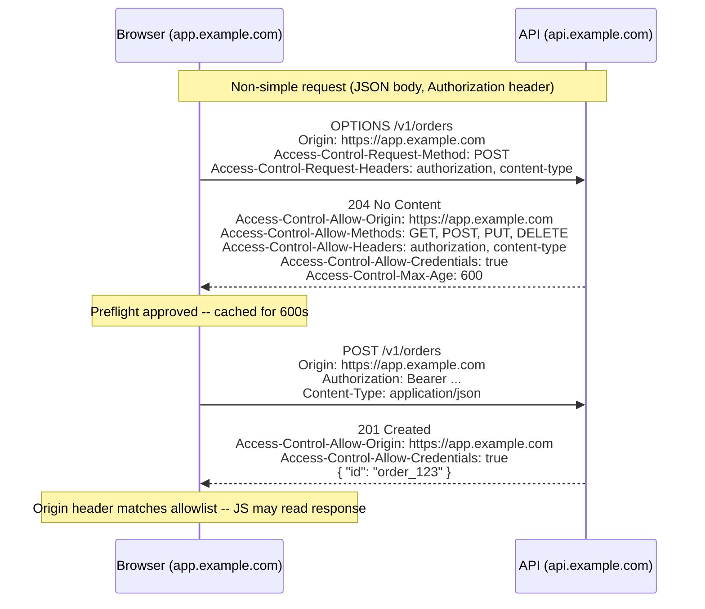

# CORS

## Why This Matters

Browsers enforce a security boundary called the **same-origin policy**: JavaScript running on `https://app.example.com` cannot, by default, read the response of a request it makes to `https://api.other-domain.com`. This is a good default — without it, any malicious website you visit could silently use your logged-in browser session to read your email, your bank balance, or your private API data from every other site you're authenticated to. But it also breaks a completely legitimate and extremely common pattern: a frontend hosted on one origin (or subdomain) calling an API hosted on another. **CORS (Cross-Origin Resource Sharing)** is the mechanism browsers use to let a server explicitly opt back into allowing specific cross-origin requests, on its own terms. Understanding CORS matters not just to make cross-origin calls work, but because a misconfigured CORS policy is one of the most common ways APIs accidentally expose authenticated data to arbitrary third-party websites.

## Core Concept

An **origin** is the combination of scheme + host + port (`https://app.example.com:443` and `http://app.example.com` are different origins). The same-origin policy blocks a script on origin A from reading responses from origin B unless B explicitly says it's allowed to, via CORS response headers. Two important things CORS is *not*:

- CORS is **not** a server-side security control. It is enforced by the browser, on the client side. A non-browser client (`curl`, a backend service, a mobile app) is not restricted by CORS at all — it can call any URL regardless of CORS headers. CORS only protects browser users from malicious *websites*, not your API from malicious *clients* in general.
- CORS does **not** stop the request from being sent. In many cases the request actually reaches your server and your server actually processes it — CORS only controls whether the browser lets the calling JavaScript *read the response*. This distinction matters enormously for state-changing requests and is part of why preflight requests exist for anything beyond the simplest GETs.

The key response header is `Access-Control-Allow-Origin`, which tells the browser which origin(s) are allowed to read the response. Related headers control which HTTP methods, headers, and credentials (cookies) are permitted.

## Mental Model

Think of your API as a building with a front desk. Same-origin policy is the default building policy: "we only let people in who work here (the same origin)." CORS is the front desk maintaining an explicit visitor list: "people from `app.example.com` are pre-approved to pick up documents (read responses), but only for these specific types of requests, and only if they show ID matching what's on the list." The preflight request is the visitor calling ahead to ask "can I come pick up a document with these specific request headers and this method?" before actually showing up — the front desk says yes or no *before* the real visit happens, for anything more sensitive than the simplest walk-in request.

## How It Works

**Simple requests** (GET/HEAD/POST with only a small set of "CORS-safelisted" headers and content types like `application/x-www-form-urlencoded`, `multipart/form-data`, or `text/plain`) skip the preflight — the browser sends the request directly, and inspects `Access-Control-Allow-Origin` on the response before deciding whether JavaScript can read it.

**Non-simple requests** — anything using `PUT`, `DELETE`, `PATCH`, a custom header like `Authorization` or `X-Custom-Header`, or `Content-Type: application/json` (the overwhelming majority of real API traffic) — trigger a **preflight request** first:

1. Before sending the actual request, the browser sends an `OPTIONS` request to the same URL, including `Origin`, `Access-Control-Request-Method`, and `Access-Control-Request-Headers` describing what the real request will look like.
2. The server responds with which origins, methods, and headers it allows, and how long the browser may cache that answer (`Access-Control-Max-Age`).
3. If the preflight response permits the actual request's origin, method, and headers, the browser proceeds to send the real request.
4. If the server's `Access-Control-Allow-Origin` doesn't match, or a required method/header isn't allowed, the browser blocks the request from ever being sent (for a preflighted request) or blocks the response from being read (for a simple request) — and surfaces a CORS error in the console, not a normal HTTP error your application code can catch.

**Credentials** (cookies, HTTP auth) are excluded from cross-origin requests by default. To send them, the client must set `credentials: "include"` (or `withCredentials = true`), *and* the server must respond with `Access-Control-Allow-Credentials: true` *and* a specific origin in `Access-Control-Allow-Origin` — the wildcard `*` is explicitly disallowed by the spec when credentials are involved, precisely because "any origin, with your cookies" is the single most dangerous CORS misconfiguration possible.

## Architecture



## Request / Response Example

Preflight `OPTIONS` request and response for a cross-origin `POST` with a JSON body and an `Authorization` header:

```http
OPTIONS /v1/orders HTTP/1.1
Host: api.example.com
Origin: https://app.example.com
Access-Control-Request-Method: POST
Access-Control-Request-Headers: authorization, content-type
```

```http
HTTP/1.1 204 No Content
Access-Control-Allow-Origin: https://app.example.com
Access-Control-Allow-Methods: GET, POST, PUT, DELETE, OPTIONS
Access-Control-Allow-Headers: Authorization, Content-Type
Access-Control-Allow-Credentials: true
Access-Control-Max-Age: 600
Vary: Origin
```

A misconfigured response that appears to work but is a serious vulnerability (wildcard origin combined with credentials — browsers actually reject this combination outright, but reflecting the request's `Origin` header verbatim achieves the same dangerous effect while passing spec validation):

```http
HTTP/1.1 204 No Content
Access-Control-Allow-Origin: https://evil-attacker-site.example
Access-Control-Allow-Credentials: true
```

If the server reflects *any* incoming `Origin` header back as the allowed origin while also allowing credentials, it has effectively disabled the same-origin policy's protection for every authenticated user of the API.

## Code Example

```python
# main.py
from fastapi import FastAPI
from fastapi.middleware.cors import CORSMiddleware
from pydantic_settings import BaseSettings


class Settings(BaseSettings):
    # An explicit, environment-specific allowlist -- never a wildcard when
    # credentials (cookies/Authorization) are involved.
    allowed_origins: list[str] = [
        "https://app.example.com",
        "https://staging.app.example.com",
    ]


settings = Settings()
app = FastAPI()

app.add_middleware(
    CORSMiddleware,
    allow_origins=settings.allowed_origins,   # explicit allowlist, not "*"
    allow_credentials=True,                    # required for cookie/Authorization-based auth
    allow_methods=["GET", "POST", "PUT", "DELETE"],
    allow_headers=["Authorization", "Content-Type"],
    max_age=600,                               # cache preflight result for 10 minutes
)


# --- NEVER DO THIS ---
# app.add_middleware(
#     CORSMiddleware,
#     allow_origins=["*"],
#     allow_credentials=True,   # the CORS spec forbids this combination, and
#                                # any middleware that lets it through (or that
#                                # reflects the request Origin to fake a wildcard)
#                                # allows any website on the internet to make
#                                # authenticated requests on behalf of your users.
# )


@app.get("/v1/orders")
def list_orders():
    return {"orders": []}
```

## Production Considerations

- **Never combine a wildcard origin with credentials.** If your API needs to serve public, non-authenticated data to any origin (e.g., a public read-only API), `allow_origins=["*"]` with `allow_credentials=False` is fine. The moment cookies or `Authorization` headers matter, the allowlist must be explicit.
- **Maintain a real allowlist per environment**, not a single list shared across dev/staging/prod — a staging origin should never be trusted in production.
- **Set `Vary: Origin`** on responses when the allowed origin varies by request, so caches (CDNs, browser cache) don't serve one origin's CORS-approved response to a different origin.
- **Preflight caching (`Access-Control-Max-Age`) reduces latency** for repeat cross-origin calls but means a change to your CORS policy won't take effect for a cached client until the max-age expires — keep this in mind when rolling out policy changes.
- **CORS is not an access control mechanism.** It stops *browsers* from letting cross-origin JavaScript read responses; it does nothing to stop a direct API call from a script, `curl`, or a server-side integration. Real authorization must still happen via authentication (see [Part 5 — Authentication & Authorization](../05-authentication-authorization/README.md)), not CORS headers.

## Common Mistakes

- **Setting `Access-Control-Allow-Origin: *` on an authenticated endpoint**, or worse, dynamically reflecting the request's `Origin` header as the allowed origin to "make CORS errors go away" — this defeats the same-origin policy for every user.
- **Believing CORS protects the API itself.** A backend-to-backend call, a mobile app, or a script using `curl` bypasses CORS entirely; it is a browser-only protection.
- **Forgetting to allow the specific custom headers the frontend sends** (e.g., `X-Request-ID`), causing preflight to fail and the browser to block the real request — showing up as a confusing "CORS error" in the console rather than a clear 4xx from your application.
- **Not handling the `OPTIONS` method at all**, so the preflight request itself 404s or 405s, blocking every non-simple cross-origin request before it can even be attempted.
- **Assuming a successful preflight means the request is authorized.** Preflight only confirms the browser will attempt the request and be allowed to read the response — actual authentication/authorization still happens in your normal request-handling logic.

## Best Practices

- Maintain an explicit, environment-specific origin allowlist; never use `*` alongside credentials.
- Only allow the methods and headers your API actually needs — don't blanket-allow every method/header "to be safe."
- Set a reasonable `Access-Control-Max-Age` to reduce preflight overhead without making policy changes take unreasonably long to propagate.
- Remember CORS is a browser-side control complementary to, not a substitute for, real server-side authentication and authorization.
- Test cross-origin behavior explicitly in CI/staging with the actual frontend origin, not just `localhost`, since misconfigurations often only surface with the real production origin.

## AI Engineering Perspective

CORS matters directly for browser-based AI applications: a chat UI running in the browser that streams completions from your LLM gateway (see [Part 15 — Production AI Systems](../15-production-ai-systems/README.md)) is making cross-origin calls if the frontend and gateway are on different domains, and streaming responses (see [Streaming LLM Responses](../14-ai-api-engineering/streaming-llm-responses.md) in Part 14) still go through the same preflight rules as any other non-simple request when custom headers like `Authorization` are involved. A specific trap: if your gateway exposes an endpoint that both serves public model metadata (safe to expose broadly) and an authenticated chat-completion endpoint (must be tightly scoped), it's tempting to configure one permissive CORS policy for the whole service — but that permissive policy then applies to the authenticated endpoint too. Scope CORS policy per route group, not globally, when an API mixes public and authenticated AI endpoints.

## Exercises

**Beginner**
1. Explain why a `curl` request to a CORS-protected API succeeds and returns data, while the same request made from browser JavaScript on a different origin is blocked from reading the response.

**Intermediate**
2. Given the FastAPI `CORSMiddleware` configuration in the Code Example, predict whether a request from `https://partner.example.com` (not in `allowed_origins`) will reach your endpoint handler at all, and what the browser will do with the response if it does.

**Advanced**
3. Design a CORS policy for an API that must serve: (a) a public, unauthenticated `/v1/status` endpoint to any origin, and (b) an authenticated `/v1/account` endpoint only to your own first-party frontend origins. Describe how you'd structure the middleware/route configuration so the permissive policy for (a) can never leak onto (b).

## Key Takeaways

- CORS is a browser-enforced relaxation of the same-origin policy — it lets a server opt specific origins into reading its responses; it is not a server-side access control mechanism.
- Non-simple cross-origin requests (custom headers, JSON bodies, non-GET/POST methods) trigger a preflight `OPTIONS` request that must succeed before the real request is even sent.
- Never combine a wildcard `Access-Control-Allow-Origin: *` with `Access-Control-Allow-Credentials: true`, and never dynamically reflect the request's `Origin` header to fake a wildcard — this is the most dangerous and most common CORS misconfiguration.
- CORS does not protect against non-browser clients; real security still depends on authentication and authorization on every request.
- Maintain an explicit, environment-specific origin allowlist and scope CORS policy per route group when public and authenticated endpoints coexist.

See also: [Secrets Management](secrets-management.md), [Input Validation](input-validation.md), [OWASP API Security Top 10](owasp-api-security.md), [Part 5 — Authentication & Authorization](../05-authentication-authorization/README.md), and the [glossary](../../resources/glossary.md).

[← Back to Part 10 — API Security](README.md)
