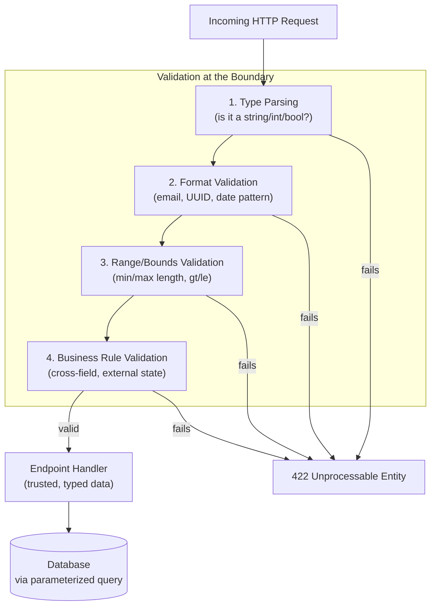

# Input Validation

## Why This Matters

Every request that reaches your API originates outside your control — a browser, a mobile app, a third-party integration, or an attacker's script — and none of them are obligated to send well-formed data. Input validation is the practice of checking, at the boundary of your system, that incoming data is the shape, type, range, and format your application logic actually assumes before that data touches any business logic, database query, or downstream call. Skipping it doesn't just risk crashes on malformed input; it's the root enabler behind [SQL Injection](sql-injection.md), broken business rules (negative prices, impossible dates, orders exceeding stock), and a large share of the categories in the [OWASP API Security Top 10](owasp-api-security.md). Validation is cheap to do correctly and expensive to skip — a single bad assumption about what "a user ID" or "an email" looks like can cascade into data corruption or a security incident far downstream of where the bad data entered.

## Core Concept

**Input validation** is the act of confirming untrusted data conforms to an explicit, positive specification before it's used — as opposed to trying to detect and block "known-bad" patterns after the fact. This distinction is the difference between **allowlisting** and **denylisting**:

- **Allowlisting (positive validation)** defines exactly what is acceptable — "a username is 3–32 characters, alphanumeric plus underscore, matching this pattern" — and rejects anything that doesn't match. This is safe by construction: an attacker cannot invent a new bypass, because the set of accepted values is fixed and enumerable.
- **Denylisting (negative validation)** tries to enumerate and block known-bad inputs — "reject anything containing `<script>` or `DROP TABLE`" — and is inherently incomplete: there is always another encoding, another syntax variant, or another attack technique the denylist didn't anticipate.

Validation should happen **at the boundary** — the moment data enters your system, before it's passed to any business logic — rather than scattered ad hoc throughout the codebase where it's easy to miss a path. In a FastAPI application, Pydantic models are that boundary: a request either successfully parses into a validated model, or the framework rejects it with a structured `422` before your endpoint function's body ever runs.

## Mental Model

Think of input validation like a customs checkpoint at a border, not a police patrol roaming the interior. A checkpoint inspects everything crossing the boundary against a clear, published set of rules — "these categories of goods are permitted, in these quantities, with this documentation" — and nothing gets past it without matching the allowlist. A police patrol, by contrast, is reactive: it drives around looking for things that seem suspicious, which means anything that doesn't look suspicious *this time* gets through, no matter how much it might resemble last year's smuggling technique in a slightly different disguise. Denylisting is the patrol; allowlist validation at the boundary is the checkpoint — and a checkpoint is exponentially easier to reason about because you only ever have to answer "does this match the rule?" rather than "have we thought of every way this could be bad?"

## How It Works

Validation happens in layers, each catching a different class of problem:

1. **Type validation** — is this actually a string, integer, boolean, or the type the field claims to be? (`"abc"` sent where an `int` is expected.)
2. **Format validation** — does this string match the expected format? (a valid email shape, a UUID, an ISO 8601 date.)
3. **Range/bounds validation** — is this numeric value within an acceptable range? (`age` between 0 and 150, `quantity` greater than 0.)
4. **Business rule validation** — does this value make sense in context, even if it's individually well-formed? (an `end_date` after a `start_date`; a `discount_percent` that doesn't exceed 100; a `quantity` that doesn't exceed available stock.)

The first three layers are usually declarative — expressible directly as type annotations and constraints (Pydantic's `Field(gt=0, le=150)`, a regex `pattern`). Business rule validation typically requires custom logic (a Pydantic `@field_validator` or `@model_validator`) because it depends on relationships between fields or on external state (e.g., checking inventory).

**Rejecting invalid input, rather than silently correcting it, is deliberate.** Silently clamping an out-of-range value or stripping "bad" characters can mask a client-side bug or an attack attempt, and produces different data than what the client thinks it sent — better to fail loudly and immediately with a clear error than to let a client believe its request succeeded as intended when the server actually altered it.

## Architecture



## Request / Response Example

A request that fails multiple validation layers at once, and the structured error FastAPI/Pydantic returns:

```http
POST /v1/orders HTTP/1.1
Host: api.example.com
Content-Type: application/json

{
  "product_id": "not-a-uuid",
  "quantity": -5,
  "discount_percent": 150,
  "email": "not-an-email"
}
```

```http
HTTP/1.1 422 Unprocessable Entity
Content-Type: application/json

{
  "detail": [
    {
      "loc": ["body", "product_id"],
      "msg": "Input should be a valid UUID",
      "type": "uuid_parsing"
    },
    {
      "loc": ["body", "quantity"],
      "msg": "Input should be greater than 0",
      "type": "greater_than"
    },
    {
      "loc": ["body", "discount_percent"],
      "msg": "Input should be less than or equal to 100",
      "type": "less_than_equal"
    },
    {
      "loc": ["body", "email"],
      "msg": "value is not a valid email address",
      "type": "value_error"
    }
  ]
}
```

The client receives every violation in one response, at the field level, so it can fix all of them without round-tripping one error at a time.

## Code Example

```python
from datetime import date
from uuid import UUID

from pydantic import BaseModel, EmailStr, Field, field_validator, model_validator


class CreateOrderRequest(BaseModel):
    # Format validation: EmailStr enforces email shape; UUID enforces a
    # valid UUID string, both handled declaratively by Pydantic's type system.
    customer_email: EmailStr
    product_id: UUID

    # Range/bounds validation: declarative constraints, no custom code needed.
    quantity: int = Field(..., gt=0, le=1000)
    discount_percent: float = Field(default=0.0, ge=0, le=100)

    # Allowlist, not denylist: only these exact values are accepted for
    # shipping method -- anything else is rejected outright, rather than
    # trying to detect and block "bad" values.
    shipping_method: str = Field(..., pattern=r"^(standard|express|overnight)$")

    requested_delivery_date: date

    @field_validator("requested_delivery_date")
    @classmethod
    def delivery_date_not_in_past(cls, value: date) -> date:
        # Business rule: format-valid (it IS a real date) but still invalid
        # in context (a date validator alone can't express "must be future").
        if value < date.today():
            raise ValueError("requested_delivery_date cannot be in the past")
        return value


class UpdatePromotionRequest(BaseModel):
    starts_on: date
    ends_on: date

    @model_validator(mode="after")
    def ends_after_starts(self) -> "UpdatePromotionRequest":
        # Cross-field business rule: neither field is invalid on its own,
        # but the relationship between them is what actually matters.
        if self.ends_on <= self.starts_on:
            raise ValueError("ends_on must be after starts_on")
        return self


# --- WEAKER APPROACH: denylist-style manual checks scattered in the handler ---
# def create_order(data: dict):
#     if "<script>" in data.get("customer_email", ""):   # trying to block "bad" input
#         raise ValueError("invalid input")
#     # This catches nothing an attacker hasn't already thought around, and
#     # still leaves quantity, discount_percent, and dates completely unchecked.
```

## Production Considerations

- **Validate at the boundary, not deep in business logic.** If validation is scattered across service functions, it's easy for a new code path to skip it entirely. A framework-level boundary (Pydantic request models) makes validation structurally unavoidable — the endpoint function simply never runs with unvalidated data.
- **Validate on every trust boundary, not just the public API.** Internal service-to-service calls, message queue consumers, and background jobs reading from a database all cross a trust boundary and deserve the same rigor — "it's an internal service" is not a validation exemption.
- **Distinguish input validation from output encoding.** Validating that a string doesn't contain HTML doesn't fully prevent the string from causing harm if it's later rendered unescaped in a browser context — that's a separate concern covered by output encoding, discussed in the planned `xss-and-apis.md` chapter.
- **Fail closed and fail clearly.** Reject invalid input with a specific, field-level error rather than silently coercing or dropping bad fields — silent correction hides bugs and can mask exactly the malformed input you'd want to notice.
- **Validation is not a substitute for parameterized queries or output encoding** — it's one layer in defense in depth alongside them (see [SQL Injection](sql-injection.md)).

## Common Mistakes

- **Validating only on the frontend.** Client-side validation is a UX nicety; a server that trusts it because "the UI already checks this" has no real validation at all, since any client-side check can be bypassed by calling the API directly.
- **Using denylists for security-sensitive checks** (blocking specific "bad" strings or characters) instead of allowlisting the exact accepted shape — denylists are always incomplete against a motivated attacker.
- **Checking type but not range or business rules** — accepting any integer for `quantity` without an upper bound, or any string for `status` without constraining it to the valid set of statuses.
- **Silently clamping or coercing invalid values** ("negative quantity becomes 0") instead of rejecting the request, which hides bugs and can produce results the client never intended.
- **Re-validating inconsistently across multiple entry points** (REST API, admin panel, batch import) with different rules for the same underlying data, allowing invalid data to enter through whichever path has the weakest checks.

## Best Practices

- Validate every field's type, format, and range declaratively wherever possible (Pydantic `Field` constraints, typed enums), reserving custom validators for genuine cross-field/business rules.
- Prefer allowlisting over denylisting for anything security-relevant — define what's acceptable, not what's forbidden.
- Enforce validation at a single, structural boundary (request models) so it can't be accidentally skipped by a new code path.
- Return specific, field-level error messages (as FastAPI/Pydantic do by default) so clients can self-correct without guesswork.
- Apply the same validation rigor to internal/service-to-service inputs and batch/background job inputs, not just the public-facing API.

## AI Engineering Perspective

Input validation takes on an extra dimension in AI-facing APIs: the *shape* of a request (JSON structure, field types) can be perfectly valid while its *content* is adversarial — a prompt injection attempt embedded in a text field, or a request engineered to make an LLM call unexpectedly expensive (a `max_tokens` value set absurdly high, or a document upload sized to blow up token counts during chunking, see [Part 16 — RAG APIs](../16-rag-apis/README.md)). Pydantic-level validation should still enforce the boundaries it can — length limits on prompt fields, allowlisted `model` names rather than accepting any string, bounded `max_tokens` and `temperature` ranges — even though it cannot evaluate semantic intent. Structured output validation (see [Structured Outputs](../14-ai-api-engineering/structured-outputs.md) and [JSON Schemas](../14-ai-api-engineering/json-schemas.md) in Part 14) is the same discipline applied in the *other* direction: validating that what a model *returns* actually matches your schema before your application trusts it, since a model's output is untrusted input to the rest of your system just as much as a user's request body is.

## Exercises

**Beginner**
1. List the four validation layers described in this chapter and give one example field from a `CreateUserRequest` model that would fail at each layer.

**Intermediate**
2. Add a `model_validator` to `CreateOrderRequest` in the Code Example that rejects a request if `discount_percent` is greater than 0 but `shipping_method` is `"overnight"` (a business rule that no single-field validator can express).

**Advanced**
3. Design the validation strategy for a bulk CSV import endpoint that accepts up to 10,000 rows per request. Decide whether to validate all rows before processing any, or process row-by-row and report per-row errors, and justify the trade-off in terms of user experience and partial-failure handling.

## Key Takeaways

- Validate at the boundary, using allowlisting (define what's acceptable) rather than denylisting (try to block what's bad) for anything security-relevant.
- Validation has four layers — type, format, range, and business rules — and only the last typically requires custom validator logic.
- Reject invalid input with clear, specific errors rather than silently coercing or dropping bad values.
- Client-side validation is a UX convenience only; the server must independently validate every request regardless of what the frontend already checked.
- Validation is one layer of defense in depth, working alongside parameterized queries and output encoding, not a replacement for either.

See also: [SQL Injection](sql-injection.md), [CORS](cors.md), [OWASP API Security Top 10](owasp-api-security.md), and the [glossary](../../resources/glossary.md).

[← Back to Part 10 — API Security](README.md)
