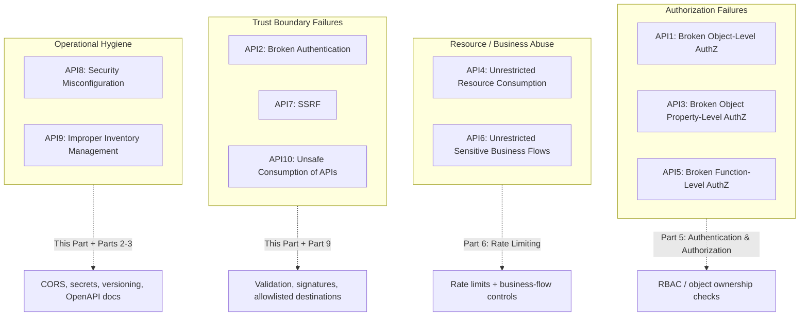

# OWASP API Security Top 10

## Why This Matters

Web application security guidance historically focused on browser-rendered pages — XSS, CSRF, session fixation — but APIs fail in different, API-specific ways: broken authorization on individual objects, endpoints that leak internal implementation details, or business logic flows that have no rate limit at all. The **OWASP API Security Top 10** is a community-maintained, industry-standard list of the most critical and most common API-specific vulnerability categories, and it exists precisely because generic web security checklists miss these patterns. This chapter is a **survey**: it explains each of the 10 categories conceptually and points to the chapter elsewhere in this handbook that covers the concrete defense in depth, so you can use this as a map when reasoning about an API's overall security posture rather than a single vulnerability at a time.

## Core Concept

The OWASP API Security Top 10 (2023 edition) groups API vulnerabilities into ten categories, ranked roughly by prevalence and impact across real-world API breaches:

| # | Category | One-line description |
|---|---|---|
| API1 | Broken Object Level Authorization (BOLA) | A user can access another user's object by changing an ID in the request. |
| API2 | Broken Authentication | Weak, missing, or bypassable authentication lets attackers assume other identities. |
| API3 | Broken Object Property Level Authorization | An endpoint exposes or allows modification of object fields the caller shouldn't see or change. |
| API4 | Unrestricted Resource Consumption | No limits on request volume, payload size, or expensive operations lets one caller exhaust resources. |
| API5 | Broken Function Level Authorization | A user can call an admin/privileged endpoint they shouldn't have access to. |
| API6 | Unrestricted Access to Sensitive Business Flows | An automatable business process (e.g., ticket purchasing) has no protection against abuse at scale. |
| API7 | Server-Side Request Forgery (SSRF) | An API fetches a URL supplied by the client, letting attackers reach internal-only systems. |
| API8 | Security Misconfiguration | Insecure defaults, verbose errors, permissive CORS, or missing hardening expose unnecessary attack surface. |
| API9 | Improper Inventory Management | Undocumented, deprecated, or shadow API versions/endpoints stay reachable and unmonitored. |
| API10 | Unsafe Consumption of APIs | Blindly trusting data or responses from third-party/upstream APIs the way you'd trust user input. |

Most of these categories are not fixed by a single technique — they're addressed by the combination of authentication, authorization, validation, rate limiting, and configuration discipline covered throughout this handbook. This chapter's job is to name each category clearly and connect it to where the deep-dive material lives.

## Mental Model

Think of an API like a large office building with many rooms, each holding different files. **Broken authentication** is a broken front-door lock — anyone can walk in claiming to be anyone. **Broken object-level authorization** is a working front door but no room-level locks — anyone who's in the building can open any filing cabinet just by knowing its drawer number, regardless of whose files are in it. **Broken function-level authorization** is having the "executive suite" door unlocked to any employee, not just executives. **Unrestricted resource consumption** is having no limit on how many photocopies any one visitor can make, so one person can tie up every copier in the building. **Security misconfiguration** is leaving a supply closet door propped open because nobody remembered to close it — not attacked directly, just carelessly exposed. Walking through the Top 10 this way — as different kinds of doors, locks, and open closets in the same building — makes it clear why no single chapter or technique covers all ten; each is a different structural weakness.

## How It Works

Below, each category is explained with its mechanism and where in this handbook the concrete defense lives.

**API1 — Broken Object Level Authorization (BOLA).** The most common and most damaging API vulnerability: an endpoint like `GET /v1/invoices/{id}` checks that the caller is *authenticated*, but not that the caller is *authorized to access this specific invoice*. Changing `{id}` in the URL then returns another user's data. The fix is enforcing object-level ownership checks on every request, not just authentication — see [RBAC](../05-authentication-authorization/rbac.md) and the planned multi-tenant authorization chapter in [Part 5 — Authentication & Authorization](../05-authentication-authorization/README.md).

**API2 — Broken Authentication.** Weak password policies, predictable or non-expiring tokens, missing token validation, or authentication that can be bypassed entirely (e.g., an endpoint that forgets to require auth at all). This category is the direct subject of [Part 5 — Authentication & Authorization](../05-authentication-authorization/README.md) in its entirety — see especially [JWT Deeply Explained](../05-authentication-authorization/jwt-deeply-explained.md) and [Access vs Refresh Tokens](../05-authentication-authorization/access-vs-refresh-tokens.md).

**API3 — Broken Object Property Level Authorization.** Related to but distinct from API1: even when a user is authorized to access an object, a response may expose fields they shouldn't see (an internal `cost_price` alongside the public `price`), or an update endpoint may allow modifying fields it shouldn't (a user PATCHing their own `role` field to `admin`). This is addressed by deliberately designed response models and request models that only expose/accept the intended fields — see response models and request validation in [Part 3 — Building APIs](../03-building-apis/README.md), and [Input Validation](input-validation.md) for the allowlist mindset applied to accepted fields.

**API4 — Unrestricted Resource Consumption.** An API with no limits on request rate, payload size, pagination page size, or expensive query parameters lets any single caller degrade service or drive up cost — particularly dangerous for endpoints that call metered downstream services like LLM providers. This is the direct subject of [Rate Limiting](../06-production-reliability/rate-limiting.md) in [Part 6 — Production Reliability](../06-production-reliability/README.md), and the planned `rate-limit-abuse-protection.md` chapter in this part extends it specifically to abuse scenarios.

**API5 — Broken Function Level Authorization.** Distinct from API1 (which object can I access) — this is about which *actions/endpoints* a role can call at all, such as a regular user successfully calling an admin-only `DELETE /v1/users/{id}` endpoint because the endpoint checks authentication but not role. Addressed by role-based checks enforced consistently across every endpoint — see [RBAC](../05-authentication-authorization/rbac.md).

**API6 — Unrestricted Access to Sensitive Business Flows.** Some endpoints aren't just "expensive" (API4) — they represent a business process valuable to automate abusively, like a limited-inventory purchase flow, a coupon-redemption endpoint, or an account-creation flow abused for spam. Rate limiting alone often isn't enough here; it typically requires business-aware controls (CAPTCHAs, purchase limits per account, anomaly detection) covered conceptually alongside rate limiting and in the planned `rate-limit-abuse-protection.md` chapter.

**API7 — Server-Side Request Forgery (SSRF).** Occurs when an API fetches a URL supplied (directly or indirectly) by the client — e.g., a "fetch this image URL" or webhook-registration feature — and the attacker supplies an internal address (`http://169.254.169.254/...` for cloud metadata, or an internal-only service) instead of a legitimate external URL, using your server as a proxy into your own private network. This is why webhook endpoint URLs, in particular, need strict validation; see the planned `webhook-security.md` chapter and [Input Validation](input-validation.md) for the allowlist principle applied to accepted destinations.

**API8 — Security Misconfiguration.** A catch-all for insecure defaults and missing hardening: permissive CORS policies (see [CORS](cors.md)), verbose error messages that leak stack traces or internal paths, default credentials left unchanged, unnecessary HTTP methods left enabled, or missing security headers. This category overlaps with much of this part directly — [Secrets Management](secrets-management.md) and [CORS](cors.md) are both concrete instances of getting configuration right.

**API9 — Improper Inventory Management.** APIs accumulate old versions, deprecated endpoints, and staging/debug routes that nobody tracks — and unmonitored surface area is exactly where security fixes don't get applied. This is addressed by disciplined [API Versioning](../02-rest-api-design/api-versioning.md) and living, accurate [API Documentation with OpenAPI](../03-building-apis/openapi-documentation.md) in Parts 2 and 3, so every reachable endpoint is a known, tracked one — not a forgotten `v1` route still live behind the current `v3`.

**API10 — Unsafe Consumption of APIs.** The mirror image of most of this list: your own API is often also a *client* of other APIs (payment processors, LLM providers, partner integrations), and those responses are untrusted input too — blindly trusting a third-party API's response schema, following redirects without validation, or not verifying webhook signatures on inbound calls all fall here. See [Webhook Signature Verification](../09-realtime-and-webhooks/webhook-signature-verification.md) in [Part 9 — Real-Time APIs](../09-realtime-and-webhooks/README.md), and [Retries](../06-production-reliability/retries.md)/[Circuit Breakers](../06-production-reliability/circuit-breakers.md) in Part 6 for handling untrusted or unreliable upstream responses defensively.

## Architecture



## Request / Response Example

A concrete API1 (Broken Object Level Authorization) failure — and the correct, authorized response — illustrates why authentication alone is insufficient:

```http
GET /v1/invoices/48291 HTTP/1.1
Host: api.example.com
Authorization: Bearer <valid token for user_id=7712>
```

Vulnerable response — the API confirmed the token is valid, but never checked that invoice `48291` belongs to `user_id=7712`:

```http
HTTP/1.1 200 OK
Content-Type: application/json

{ "id": 48291, "owner_id": 9931, "amount_due": 4820.00 }
```

Correct, authorization-checked response for the same request:

```http
HTTP/1.1 403 Forbidden
Content-Type: application/json

{ "error": "forbidden", "message": "You do not have access to this resource." }
```

## Code Example

```python
from fastapi import APIRouter, Depends, HTTPException, status
from pydantic import BaseModel

router = APIRouter()


class Invoice(BaseModel):
    id: int
    owner_id: int
    amount_due: float


def get_current_user_id() -> int:
    # Placeholder: real implementation validates a JWT/session -- see
    # Part 5 -- and returns the authenticated caller's user ID.
    ...


def fetch_invoice(invoice_id: int) -> Invoice:
    # Placeholder: real implementation queries the database via a
    # parameterized query -- see sql-injection.md.
    ...


# --- API1 VULNERABILITY: authentication without object-level authorization ---
@router.get("/v1/invoices/{invoice_id}")
def get_invoice_unsafe(invoice_id: int, user_id: int = Depends(get_current_user_id)) -> Invoice:
    invoice = fetch_invoice(invoice_id)
    # BUG: confirms the caller is *someone*, never confirms the caller is
    # *this invoice's owner*. Any authenticated user can read any invoice
    # just by guessing/incrementing the ID.
    return invoice


# --- FIX: explicit object-level ownership check on every access ---
@router.get("/v1/invoices/{invoice_id}")
def get_invoice_safe(invoice_id: int, user_id: int = Depends(get_current_user_id)) -> Invoice:
    invoice = fetch_invoice(invoice_id)
    if invoice.owner_id != user_id:
        # Return 404, not 403, in contexts where even confirming the
        # invoice ID exists would leak information -- the right choice
        # depends on your API's threat model.
        raise HTTPException(status_code=status.HTTP_403_FORBIDDEN, detail="forbidden")
    return invoice
```

## Production Considerations

- **BOLA (API1) needs to be checked on every single object-returning or object-modifying endpoint** — it cannot be fixed once globally the way authentication can, because it's inherently about the relationship between a specific caller and a specific object.
- **A security review should walk this list explicitly** against your API's endpoint inventory: for each endpoint, who is authenticated, what object-level checks exist, what resource limits apply, and what it exposes in its response schema.
- **These categories compound.** A single endpoint can fail multiple categories at once — e.g., an admin endpoint (API5) with no rate limit (API4) that also leaks other users' data (API1) on the same response.
- **Treat this list as a checklist, not a one-time audit.** New endpoints are added continuously; API9 (inventory management) exists specifically because coverage decays over time as surface area grows.

## Common Mistakes

- **Equating authentication with authorization** — confirming *who* someone is without confirming *what they're allowed to do or access* (the root cause of API1, API3, and API5).
- **Trusting client-supplied identifiers implicitly**, assuming a user would only ever request their own resources because "why would they type someone else's ID."
- **Treating rate limiting as optional** for endpoints that "aren't public-facing enough to matter," missing API4/API6 exposure on internal-facing or admin endpoints too.
- **Leaving deprecated API versions live and unmonitored** after a new version ships, satisfying API9 by neglect.
- **Trusting third-party API responses and inbound webhooks without validation**, assuming external systems can't be compromised or spoofed (API10).

## Best Practices

- Enforce object-level and function-level authorization checks on every endpoint that returns or modifies a specific resource — never rely on authentication alone.
- Design response and request models deliberately (allowlist which fields are exposed/accepted) rather than serializing entire database rows.
- Apply rate limiting and resource limits to every endpoint, including internal and admin-facing ones, not just the most obviously public ones.
- Validate and allowlist any server-side outbound request destinations (webhook URLs, "fetch this URL" features) to prevent SSRF.
- Keep an accurate, current inventory of every live API version and endpoint via disciplined versioning and OpenAPI documentation, and decommission deprecated versions deliberately rather than letting them linger.

## AI Engineering Perspective

AI-specific APIs map onto this list in ways worth calling out explicitly. **API4 (unrestricted resource consumption)** is especially costly for LLM-backed endpoints, where an unbounded `max_tokens` or unbounded conversation history can turn a single request into a large, metered bill — see the AI Engineering Perspective in [Rate Limiting](../06-production-reliability/rate-limiting.md). **API7 (SSRF)** applies directly to agentic systems and RAG document ingestion (see [Part 16 — RAG APIs](../16-rag-apis/README.md) and [Part 17 — AI Agents & MCP](../17-ai-agents-and-mcp/README.md)) where a model or tool call fetches a URL: if that URL is attacker-influenced (via prompt injection in retrieved content, for example), the same internal-network-access risk applies as any other SSRF vector, just triggered by model output instead of a raw HTTP parameter. **API10 (unsafe consumption of APIs)** is the norm rather than the exception in AI systems that call multiple upstream model providers and tools — every provider response and every tool result an agent consumes should be treated as untrusted, validated input, not as inherently safe because "the call came from our own gateway."

## Exercises

**Beginner**
1. For each of the ten categories, name one HTTP status code an API might correctly return when that category's defense is working as intended (e.g., API1 correctly enforced might return `403` or `404`).

**Intermediate**
2. Take the `get_invoice_unsafe` function in the Code Example and identify which OWASP category it violates. Then identify a second, different endpoint pattern (in your own words) that would violate API5 (Broken Function Level Authorization) instead.

**Advanced**
3. Pick a system design case study from [Part 19 — System Design Case Studies](../19-system-design-case-studies/README.md) (e.g., designing a Payment API) and walk through all ten OWASP categories against it, identifying for each one a specific endpoint or flow in that design where the risk applies and which chapter in this handbook addresses the fix.

## Key Takeaways

- The OWASP API Security Top 10 catalogs API-specific vulnerability patterns that generic web security checklists miss, centered heavily on authorization failures and resource abuse.
- Authentication (who you are) and authorization (what you're allowed to access/do) are different concerns — most of the top categories are authorization failures, not authentication failures.
- No single chapter or technique fixes this list; it maps onto authentication/authorization (Part 5), rate limiting (Part 6), validation and configuration (this part), and API lifecycle discipline (Parts 2–3).
- Treat this list as a recurring checklist against your endpoint inventory, not a one-time audit — new endpoints reopen old categories.
- AI-specific APIs inherit every category and add sharper edges to resource consumption (API4) and unsafe consumption of upstream/model output (API7, API10).

See also: [Secrets Management](secrets-management.md), [CORS](cors.md), [SQL Injection](sql-injection.md), [Input Validation](input-validation.md), [Part 5 — Authentication & Authorization](../05-authentication-authorization/README.md), [Part 6 — Production Reliability](../06-production-reliability/README.md), and the [glossary](../../resources/glossary.md).

[← Back to Part 10 — API Security](README.md)
