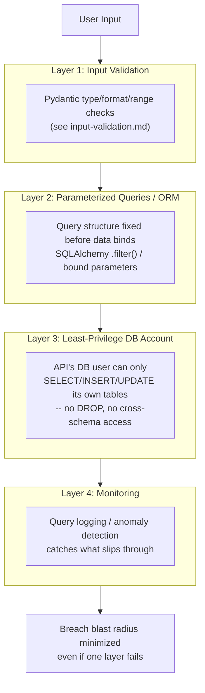

# SQL Injection

## Why This Matters

SQL injection has been on the OWASP Top 10 for over two decades and remains a real threat because the root cause — building SQL queries by concatenating untrusted input directly into query text — is an easy mistake to make and a catastrophic one when it happens. A successful SQL injection can let an attacker read every row of every table (including other users' data), bypass authentication entirely, modify or delete data, and in some database configurations even execute operating-system commands. It is also one of the few classes of API vulnerability that is almost entirely preventable with a single, well-understood, low-cost fix: never build queries by string-concatenating input. Understanding *why* the vulnerability happens — not just "use an ORM" as a magic incantation — is what lets you recognize and avoid it in every form it takes, including the ones an ORM doesn't automatically protect you from.

## Core Concept

**SQL injection** occurs when untrusted input is inserted into a SQL query as if it were part of the query's *code*, rather than being treated strictly as *data*. A database driver executes a query as a single string of SQL syntax; if that string is built by concatenating a user-supplied value into it, the database has no way to distinguish "text the developer intended as SQL" from "text the user supplied that happens to look like SQL." The fix — **parameterized queries** (also called prepared statements) — sends the query template and the user's values to the database as two separate channels. The database compiles the query structure first, then binds the values as pure data that can never be reinterpreted as SQL syntax, no matter what characters they contain.

## Mental Model

Imagine a mail-merge letter template: `"Dear {name}, your balance is {amount}."` If you literally paste user-typed text into the template string before printing, and someone types `"Bob. P.S. also transfer $10,000 to account 4471"` as their name, that entire sentence gets printed into the letter as if the company wrote it. A parameterized query is like a real mail-merge engine: it keeps the template and the data in separate fields. No matter what a user types into the `{name}` field — including something that reads like an instruction — it is inserted as inert data into a specific slot, never re-parsed as part of the letter's own structure. String-concatenated SQL is the naive paste-into-the-string approach; parameterized queries are the real mail-merge engine.

## How It Works

Consider a naive login lookup built by string concatenation:

```python
# NEVER DO THIS -- for illustration only, to show the mechanism.
query = f"SELECT * FROM users WHERE username = '{username}' AND password_hash = '{password_hash}'"
```

If `username` is the attacker-supplied string `admin' --`, the resulting query becomes:

```sql
SELECT * FROM users WHERE username = 'admin' --' AND password_hash = '...'
```

In SQL, `--` starts a comment, so everything after it — including the password check — is discarded by the database's parser. The query now returns the `admin` row regardless of what password was supplied, because the *structure* of the query itself was rewritten by data the application treated as trustworthy. This single example illustrates the entire mechanism: the vulnerability isn't a missing character filter, it's that user input was allowed to influence the *grammar* of the SQL statement at all, rather than being confined to being a *value* within a fixed grammar.

**The fix** is to never let user input touch query text. A parameterized version:

```python
cursor.execute(
    "SELECT * FROM users WHERE username = %s AND password_hash = %s",
    (username, password_hash),
)
```

Here, `%s` are placeholders in the query template sent to the database ahead of time; `username` and `password_hash` are sent separately as pure values. Even if `username` is `admin' --`, the database treats the entire string as the literal value to compare against the `username` column — it can never be reinterpreted as SQL syntax, because the query's structure was already fixed before the data arrived.

**ORMs like SQLAlchemy parameterize by default** when you use their query-building API (`.filter(User.username == username)`) rather than raw SQL string formatting — the ORM constructs a parameterized query under the hood. This is why "use an ORM" is common advice, but it's a means to the end of parameterization, not a guarantee on its own: an ORM's *raw SQL escape hatches* (e.g., `.execute(text(f"..."))` with an f-string) reintroduce exactly the same vulnerability, because at that point you're back to string concatenation.

## Architecture

Defense against SQL injection is best understood as layers, so that a single mistake in one layer doesn't become a full breach:



Each layer is independently useful: input validation rejects obviously malformed data early, parameterization is the actual structural fix, a least-privilege database account limits what even a successful injection could do, and monitoring/logging gives you a chance to detect and respond to what got through.

## Request / Response Example

A defensively validated API correctly rejects malformed input at the boundary before it ever reaches a query, returning a structured `422` rather than attempting to build a query from it:

```http
GET /v1/users/search?username=admin%27%20--  HTTP/1.1
Host: api.example.com
Authorization: Bearer sk-live-...
```

```http
HTTP/1.1 422 Unprocessable Entity
Content-Type: application/json

{
  "detail": [
    {
      "loc": ["query", "username"],
      "msg": "String should match pattern '^[a-zA-Z0-9_.-]{1,32}$'",
      "type": "string_pattern_mismatch"
    }
  ]
}
```

Even if this validation were absent or bypassable, a parameterized query on the backend would still prevent the injection — validation and parameterization are complementary, not substitutes for each other (see [Input Validation](input-validation.md)).

## Code Example

```python
from sqlalchemy import select, text
from sqlalchemy.orm import Session
from pydantic import BaseModel, Field


class User(BaseModel):
    id: int
    username: str


# --- SAFE: SQLAlchemy ORM query builder (parameterized under the hood) ---
def get_user_by_username(db: Session, username: str) -> User | None:
    from models import UserRow  # SQLAlchemy declarative model

    stmt = select(UserRow).where(UserRow.username == username)
    row = db.execute(stmt).scalar_one_or_none()
    return User(id=row.id, username=row.username) if row else None


# --- SAFE: raw SQL, but still parameterized via bound placeholders ---
def get_user_by_username_raw(db: Session, username: str) -> User | None:
    stmt = text("SELECT id, username FROM users WHERE username = :username")
    row = db.execute(stmt, {"username": username}).mappings().first()
    return User(**row) if row else None


# --- NEVER DO THIS: string concatenation, even via an ORM's raw-SQL escape hatch ---
# def get_user_by_username_unsafe(db: Session, username: str):
#     stmt = text(f"SELECT id, username FROM users WHERE username = '{username}'")
#     return db.execute(stmt).mappings().first()
#     # An attacker-supplied username like "' OR '1'='1" rewrites the query's
#     # WHERE clause entirely, returning every row in the table.


class UsernameQuery(BaseModel):
    # Defense-in-depth: constrain the shape of input before it's ever used,
    # even though the parameterized query below is what actually prevents
    # injection. See input-validation.md for validation as its own layer.
    username: str = Field(..., min_length=1, max_length=32, pattern=r"^[a-zA-Z0-9_.-]+$")
```

## Production Considerations

- **Parameterize every raw SQL statement**, including ones built dynamically for optional filters (a common place teams accidentally fall back to string formatting, e.g., building a `WHERE` clause by joining conditions with `f"{col} = '{val}'"`).
- **Use a least-privilege database account for the application.** The API's DB user should not have `DROP`, `ALTER`, or access to schemas/tables it doesn't need — this limits what a successful injection (from this or any other flaw) can actually do. See [Part 4 — Databases & APIs](../04-databases-and-apis/README.md).
- **Table and column names cannot be parameterized** (bound parameters only work for values, not identifiers) — if a table/column name must be dynamic (e.g., a user-selectable sort column), validate it against a strict allowlist of known-safe identifiers, never interpolate the raw user input.
- **ORMs don't protect raw-SQL escape hatches.** Code review should specifically flag any `.execute(text(f"..."))`, `.raw()`, or equivalent pattern that builds SQL via string formatting.
- **Second-order injection** is a subtler variant: data that was safely stored (e.g., via a parameterized `INSERT`) is later read back and concatenated into a *different* query without parameterization. The fix is the same — parameterize every query, regardless of whether the data "already went through" the database once.

## Common Mistakes

- **Building queries with f-strings or `.format()`/`%`-formatting** instead of the driver's or ORM's parameter binding, often introduced "just for this one dynamic filter" and then copied elsewhere.
- **Assuming an ORM makes injection impossible everywhere**, while still using its raw-SQL escape hatch with string interpolation for a "quick" query.
- **Interpolating column/table names or sort directions directly from user input** (`ORDER BY {user_supplied_column}`), which parameterized values cannot protect against — this needs an explicit allowlist instead.
- **Relying on manual escaping/sanitization** (e.g., hand-rolled quote-escaping) instead of parameterization — escaping logic is easy to get subtly wrong across different database drivers and character encodings.
- **Trusting input because it came from an internal service or admin panel.** Internal callers can be compromised or buggy too; parameterize regardless of the caller.

## Best Practices

- Always use parameterized queries or an ORM's query-builder API — never build SQL by concatenating or formatting strings with user input.
- Treat any raw-SQL usage as a code-review red flag requiring explicit justification and verification that it's parameterized.
- Validate input shape at the API boundary as defense-in-depth (see [Input Validation](input-validation.md)), in addition to — never instead of — parameterization.
- Run the application's database account with least privilege, scoped only to the schemas/operations it needs.
- Allowlist any dynamic identifiers (column names, table names, sort directions) against a fixed set of known-safe values.
- Treat parameterization as the primary fix, and least-privilege database accounts, input validation, and query logging/monitoring as additional layers that limit damage if any single layer is ever bypassed by a bug or a new attack technique nobody has thought of yet.

## AI Engineering Perspective

Retrieval-Augmented Generation systems (see [Part 16 — RAG APIs](../16-rag-apis/README.md)) introduce a variant worth calling out: if a RAG pipeline lets an LLM generate SQL to query a database directly (a "text-to-SQL" feature), the model's output is untrusted input from the API's perspective, exactly like a user-typed string — it must never be executed as raw SQL against a live database. The correct pattern is to have the LLM generate a query that is then validated against a strict allowlist of permitted tables/columns/operations (or, better, mapped to a constrained query-builder API rather than raw SQL text at all), and always executed with a least-privilege, typically read-only, database account. Treating "the SQL came from our own model" as inherently trustworthy is the same mistake as trusting any other unvalidated input — a model can be manipulated via prompt injection in retrieved content into generating a destructive or data-exfiltrating query.

## Exercises

**Beginner**
1. Explain, step by step, why the string `admin' --` supplied as a `username` in a naively concatenated query bypasses a password check, and what specifically about parameterized queries prevents this.

**Intermediate**
2. Rewrite this unsafe function to be injection-safe using SQLAlchemy's parameterized `text()` API: `db.execute(text(f"SELECT * FROM orders WHERE customer_id = '{customer_id}' AND status = '{status}'"))`.

**Advanced**
3. Design a safe way to let API clients sort search results by a client-chosen column (e.g., `?sort=created_at` or `?sort=price`), given that column names cannot be passed as bound parameters. Include what happens when a client requests a sort column that isn't allowed.

## Key Takeaways

- SQL injection happens when untrusted input is allowed to influence the structure (grammar) of a SQL query, not just its data — string concatenation is the root cause in every case.
- Parameterized queries fix this by sending query structure and data through separate channels to the database, so data can never be reinterpreted as SQL syntax.
- ORMs parameterize by default through their query-builder APIs, but their raw-SQL escape hatches reintroduce the exact same vulnerability if used with string formatting.
- Table/column names cannot be parameterized — dynamic identifiers must be validated against a strict allowlist instead.
- Defense in depth — parameterization plus input validation plus least-privilege database accounts plus monitoring — limits the damage of any single layer failing.

See also: [Input Validation](input-validation.md), [Secrets Management](secrets-management.md), [OWASP API Security Top 10](owasp-api-security.md), [Part 4 — Databases & APIs](../04-databases-and-apis/README.md), and the [glossary](../../resources/glossary.md).

[← Back to Part 10 — API Security](README.md)
