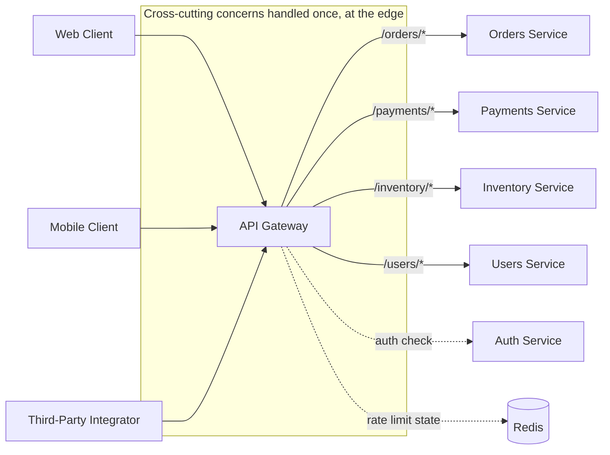

# API Gateway

## Why This Matters

Once you have more than one or two backend services (see `monolith-vs-microservices.md`), every client — a web app, a mobile app, a third-party integrator — is suddenly faced with a hard question: which of the ten services do I call for this feature, and how do I authenticate to each of them individually? Without a gateway, every client ends up embedding a map of your internal service topology, every service ends up re-implementing authentication, rate limiting, and request logging, and changing your internal architecture (splitting a service, merging two, moving one to a new host) breaks every client that hardcoded the old topology. An API gateway exists to fix exactly this: it gives clients one stable address and one contract, while your internal services stay free to change shape behind it.

## Core Concept

An **API gateway** is a single entry point that sits in front of your backend services and handles cross-cutting concerns — authentication, rate limiting, request routing, and often request/response transformation — before forwarding (proxying) each request to the appropriate internal service. Clients talk to the gateway; the gateway talks to your services. The gateway is not a service itself in the business-logic sense — it should not know what an "order" or a "refund" is — it is infrastructure that routes and protects traffic.

This is distinct from a **load balancer**, which distributes traffic across multiple instances of the *same* service (covered in the upcoming `load-balancing.md` chapter). A gateway routes across *different* services based on the request (path, host, headers), and typically adds application-aware behavior — auth, rate limits, request shaping — that a plain load balancer does not.

## Mental Model

Think of an API gateway like the reception desk of a large office building housing many different companies. A visitor doesn't need to know which floor, which department, or which internal phone extension handles their request — they walk up to reception, say who they're here to see, reception checks their ID (authentication), checks whether they're allowed in at all today (rate limiting / authorization), and then directs them to the right office (routing). If the building's tenants reshuffle floors next month, the visitor experience at the front desk doesn't change at all — only reception's internal directory does.

## How It Works

A request arrives at the gateway's public address. The gateway performs, roughly in order:

1. **TLS termination** — decrypts HTTPS so downstream services can often communicate over plain HTTP inside a trusted network.
2. **Authentication** — validates a bearer token, API key, or session cookie (see [Part 5 — Authentication & Authorization](../05-authentication-authorization/README.md)) once, at the edge, rather than in every backend service.
3. **Rate limiting** — enforces per-client or per-key request quotas (see [Part 6 — Production Reliability](../06-production-reliability/README.md)) before any backend service does real work.
4. **Routing** — inspects the path, host, or headers and forwards the request to the correct internal service, using service discovery to find a healthy instance (upcoming `service-discovery.md` chapter).
5. **Optional aggregation/transformation** — combines responses from multiple services into one response, or reshapes a response for a specific client type.
6. **Observability** — logs the request, attaches a request ID that propagates through downstream calls (see [Part 12 — Observability](../12-observability/README.md)), and emits metrics.

Because authentication and rate limiting happen once at the gateway, individual backend services can trust that any request reaching them has already been authenticated — they typically just validate a lightweight internal token or a header the gateway injects, rather than re-implementing full auth logic themselves. This is the primary reason gateways exist: it collapses N services each solving auth/rate-limiting/logging into one place solving it once.

### Gateway vs Backend-for-Frontend (BFF)

A plain API gateway is usually **client-agnostic** — one set of routes and one response shape serves web, mobile, and third-party clients alike. A **Backend-for-Frontend (BFF)** is a variation where you run a *separate* gateway-like layer per client type (a mobile BFF, a web BFF), each tailored to that client's specific needs — a mobile BFF might aggressively aggregate and trim responses to save mobile bandwidth and round trips, while a web BFF might pass through more raw data because the browser has more bandwidth and can do its own client-side composition. The trade-off is real: a BFF per client avoids a single gateway's routes becoming a mess of client-specific conditionals, but it means maintaining multiple gateway layers, which is its own operational cost. Use a plain gateway when your clients have genuinely similar needs; reach for BFFs when a mobile app and a web app need meaningfully different data shapes, payload sizes, or aggregation logic.

## Architecture



Every client goes through the single gateway; internal services never need to be reachable directly from the public internet, and can change, merge, or split without clients noticing, as long as the gateway's public contract stays stable.

## Request / Response Example

A client makes one request to the gateway; the gateway may fan it out internally.

**Client → Gateway:**

```http
GET /api/v1/orders/8821/summary HTTP/1.1
Host: api.example.com
Authorization: Bearer eyJhbGciOi...
```

**Gateway → Orders Service** (internal, after validating the token):

```http
GET /orders/8821 HTTP/1.1
Host: orders.internal.cluster.local
X-Request-Id: 7f1c-...-a92e
X-User-Id: user_4471
```

**Gateway → Payments Service** (internal, in parallel):

```http
GET /payments?order_id=8821 HTTP/1.1
Host: payments.internal.cluster.local
X-Request-Id: 7f1c-...-a92e
```

**Gateway → Client** (aggregated response):

```http
HTTP/1.1 200 OK
Content-Type: application/json
X-RateLimit-Remaining: 412

{
  "order_id": "8821",
  "status": "shipped",
  "items": [{"sku": "ABC-1", "qty": 2}],
  "payment_status": "captured"
}
```

Note the internal requests carry `X-Request-Id` (propagated to every downstream call for distributed tracing) and `X-User-Id` (the gateway already resolved the bearer token into an identity, so the orders service doesn't need to re-validate the JWT itself). The client never sees, and never needs to know, that this one response was assembled from two internal calls.

## Code Example

A minimal illustrative gateway showing routing, auth delegation, and rate limiting — the actual HTTP proxying is simplified for clarity.

```python
import time
from dataclasses import dataclass
from collections import defaultdict

import httpx
from fastapi import FastAPI, Request, HTTPException

app = FastAPI()

# --- Routing table: path prefix -> internal service base URL ---
ROUTES = {
    "/api/v1/orders": "http://orders.internal.cluster.local",
    "/api/v1/payments": "http://payments.internal.cluster.local",
    "/api/v1/inventory": "http://inventory.internal.cluster.local",
}

# --- Simple in-memory token bucket per API key (use Redis in production
# so limits are shared across gateway replicas -- see caching-performance) ---
_rate_state: dict[str, tuple[int, float]] = defaultdict(lambda: (0, time.time()))
RATE_LIMIT_PER_MINUTE = 500


def check_rate_limit(api_key: str) -> None:
    count, window_start = _rate_state[api_key]
    now = time.time()
    if now - window_start > 60:
        count, window_start = 0, now
    if count >= RATE_LIMIT_PER_MINUTE:
        raise HTTPException(status_code=429, detail="rate_limit_exceeded")
    _rate_state[api_key] = (count + 1, window_start)


async def authenticate(request: Request) -> str:
    """Validate the bearer token ONCE, at the gateway, so backend
    services never need to re-implement auth logic themselves."""
    auth_header = request.headers.get("authorization", "")
    if not auth_header.startswith("Bearer "):
        raise HTTPException(status_code=401, detail="missing_bearer_token")
    token = auth_header.removeprefix("Bearer ")
    # In production: verify JWT signature/expiry, or call the auth service.
    user_id = _validate_token_and_get_user_id(token)
    return user_id


def _validate_token_and_get_user_id(token: str) -> str:
    ...  # JWT verification -- see jwt-deeply-explained.md in Part 5
    return "user_4471"


def resolve_service(path: str) -> str:
    """Routing is deliberately dumb: longest matching prefix wins.
    The gateway must NOT contain business logic about what an
    order or a payment *is* -- only where requests for one go."""
    for prefix, base_url in ROUTES.items():
        if path.startswith(prefix):
            return base_url
    raise HTTPException(status_code=404, detail="no_route_for_path")


@app.api_route("/api/v1/{full_path:path}", methods=["GET", "POST", "PUT", "DELETE"])
async def gateway_proxy(full_path: str, request: Request):
    path = f"/api/v1/{full_path}"

    api_key = request.headers.get("x-api-key", "anonymous")
    check_rate_limit(api_key)

    user_id = await authenticate(request)

    base_url = resolve_service(path)
    downstream_path = path.split(base_url, 1)[-1] if base_url in path else path

    async with httpx.AsyncClient(timeout=5.0) as client:
        response = await client.request(
            method=request.method,
            url=f"{base_url}{downstream_path}",
            headers={
                "X-Request-Id": request.headers.get("x-request-id", "generated-id"),
                "X-User-Id": user_id,  # backend trusts this because it came
                                        # from the gateway, not the client
            },
            content=await request.body(),
        )

    return response.json()
```

## Production Considerations

- **The gateway is a single point of failure by design** — every request goes through it, so its own reliability (see [Part 6 — Production Reliability](../06-production-reliability/README.md)) directly caps your entire system's reliability. Run multiple gateway replicas behind a load balancer, keep the gateway itself stateless (push rate-limit and session state to Redis, not local memory), and treat gateway deploys with the same care as any critical-path service.
- **Latency adds up.** Every hop through the gateway (and any aggregation fan-out it does) adds latency on top of the backend service's own latency. Track gateway-added latency (P95/P99, see `latency-and-p95-p99.md` in [Part 7 — Caching & Performance](../07-caching-performance/README.md)) as its own metric, separate from backend service latency.
- **Keep the gateway free of business logic.** It's tempting to add "just one" business rule at the gateway because it's convenient — but every rule added there is now invisible to the team that owns the actual service, and couples an infrastructure component to domain logic that should live in a service.
- **Version the gateway's public contract independently from internal services.** Clients depend on the gateway's routes and response shapes; internal services can be refactored freely as long as the gateway's translation layer absorbs the change.
- **Secure the internal network.** Once a gateway exists, internal services should generally not be reachable directly from the public internet at all — service-to-service authentication (upcoming `service-to-service-authentication.md` chapter) protects the internal hops themselves.

## Common Mistakes

- **Letting the gateway accumulate business logic** over time ("just add this one order-status check here") until it becomes an undocumented, hard-to-change bottleneck that every team is afraid to touch — effectively a second monolith, just one with worse observability than the services behind it.
- **Treating the gateway as infinitely scalable by default** and not load-testing or capacity-planning it — since 100% of traffic flows through it, it needs to be over-provisioned relative to any single backend service.
- **No rate limiting or auth caching**, forcing every single request to make a slow round trip to the auth service, adding latency to every request in the system.
- **Single gateway instance with no redundancy**, turning a routine deploy or a single host failure into a full outage.
- **Hardcoding backend service addresses** instead of using service discovery, making the gateway itself a bottleneck to change whenever a service moves or scales.

## Best Practices

- Run the gateway stateless and horizontally scaled; keep rate-limit counters and session data in a shared store like Redis, not in-process memory.
- Keep routing, auth, and rate limiting in the gateway; keep everything else (business rules, data transformations specific to a domain) in the services that own that domain.
- Propagate a request ID through every downstream call so a single user-facing request can be traced end-to-end (see [Part 12 — Observability](../12-observability/README.md)).
- Consider a BFF layer only when different client types need meaningfully different response shapes or aggregation — not by default.
- Apply the reliability patterns from [Part 6](../06-production-reliability/README.md) — timeouts, retries, circuit breakers — to every downstream call the gateway makes, since a hung call to one backend service should never take down routing to the others.

## AI Engineering Perspective

An **AI Gateway** — a specialized API gateway sitting in front of one or more LLM providers — is one of the most common and well-justified applications of this pattern in modern systems (see [Part 15 — Production AI Systems](../15-production-ai-systems/README.md)). It centralizes exactly the concerns this chapter covers, applied to LLM traffic specifically: authenticating callers, enforcing token-based rate limits (not just request-count limits — see the upcoming token-rate-limits content), routing between multiple model providers, applying prompt or semantic caching, and tracking cost per request. The same warning about business logic creep applies with extra force here: an AI gateway should route and meter LLM calls, not contain prompt engineering or business-specific reasoning about *what* to ask the model — that belongs in the calling service, the same way order logic belongs in the orders service and not in a generic HTTP gateway.

## Exercises

**Beginner**
1. Explain, in your own words, why authentication is usually implemented once at the gateway rather than independently in every backend service. What would break if the gateway forwarded requests without validating the token first?

**Intermediate**
2. Using the `gateway_proxy` code above, add a feature: if the downstream service call times out or returns a 5xx error, the gateway should return a `503` with a clear error body instead of propagating a raw connection error. Where would you add a circuit breaker (see `circuit-breakers.md` in Part 6) to this code, and per what dimension (per-service? per-route?) would you scope it?

**Advanced**
3. A team wants to add order-total calculation logic directly into the gateway "because every client needs it and it saves a round trip." Write a short design note explaining why this is a common anti-pattern, and propose an alternative that keeps the gateway free of business logic while still avoiding an extra client-visible round trip.

## Key Takeaways

- An API gateway centralizes cross-cutting concerns — auth, rate limiting, routing, and sometimes aggregation — so individual services don't each reimplement them.
- A gateway routes across different services; a load balancer distributes traffic across replicas of the same service — they're complementary, not the same thing.
- A Backend-for-Frontend (BFF) is a gateway variant tailored per client type; use it only when clients genuinely need different data shapes, not by default.
- The gateway is a deliberate single point of failure — it must be highly available, stateless, and horizontally scaled, since every request depends on it.
- Keep business logic out of the gateway; it should route and protect traffic, not understand your domain.

See also: [Monolith vs Microservices](monolith-vs-microservices.md), [REST vs gRPC](rest-vs-grpc.md), and the [glossary](../../resources/glossary.md). Service discovery and load balancing (upcoming chapters in this part) are the mechanisms a gateway relies on to find and distribute traffic to healthy backend instances.

[← Back to Part 11 — Microservices & Distributed Systems](README.md)
