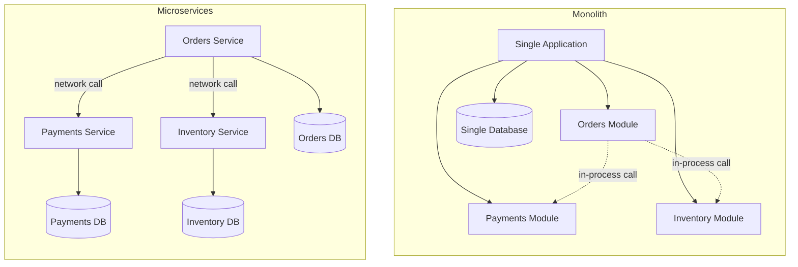

# Monolith vs Microservices

## Why This Matters

This is probably the single most over-hyped decision in backend engineering. A huge fraction of engineering blog posts, conference talks, and job postings treat "microservices" as a synonym for "good architecture" — as if splitting a system into services is an upgrade you install once your team is mature enough. This is wrong, and believing it costs real companies real money. Segment, a well-known infrastructure company, famously split into microservices and then spent significant engineering effort merging back into a monolith because the split added operational overhead without solving the problems they actually had. Shopify runs a monolith (albeit a modularized one) at massive scale. Meanwhile, plenty of companies genuinely need microservices and would be crushed by a single deployable monolith. The honest answer to "should I use microservices?" is "it depends on your team, your domain boundaries, and your organizational structure" — and this chapter tries to give you the actual decision criteria instead of a hype-driven default.

## Core Concept

A **monolith** is a single deployable unit: one codebase, one build, one process (or a small number of horizontally scaled copies of that same process), typically one database. All business logic — orders, payments, inventory, users — lives in one application that gets deployed together.

**Microservices** split a system along business-capability boundaries into multiple independently deployable services, each owning its own data store, each communicating with the others over a network (HTTP, gRPC, or messaging). An "orders service," a "payments service," and an "inventory service" are separate codebases, separate deployments, separate on-call rotations, and separate databases, coordinating via API calls or events.

Neither is "more advanced" than the other. A monolith is not a legacy pattern you graduate out of; it's a valid architecture that many high-scale systems use deliberately. Microservices are not a maturity signal; they are a tool that trades simplicity for independent scalability and deployability — and that trade is not always worth making.

## Mental Model

Think of a monolith like a single restaurant kitchen: one head chef, one set of ovens, one ticket rail. Communication between the grill station and the pastry station is a shout across the room — instant, no protocol needed, but if the grill catches fire, the whole kitchen shuts down, and adding a tenth cook to a kitchen built for four just creates chaos at the pass.

Microservices are like a network of specialized kitchens — a bakery, a butcher, a produce prep facility — each independently run, each able to scale up or change its own process without asking permission from the others. But now every dish requires a delivery truck between kitchens: there's coordination overhead, things can arrive late or damaged in transit, and you need someone whose whole job is managing the logistics between kitchens. If you only have one restaurant's worth of food to make, that logistics overhead is pure waste. If you're feeding a city, it's the only way to scale.

## How It Works

**In a monolith**, when the orders module needs to check inventory, it calls a function in the inventory module — an in-process function call, sub-millisecond, transactionally consistent because it's likely the same database connection and possibly the same SQL transaction. Deploying a bug fix means building and shipping the entire application, even if you only changed one file. Scaling means running more copies of the *entire* app, even if only one part of it (say, the search feature) is under load.

**In microservices**, that same "check inventory" operation becomes a network call — an HTTP or gRPC request to a separate inventory service, which might be down, slow, or on a different version than you expect. You've traded a function call for a distributed systems problem: you now need to think about timeouts, retries, and partial failure (see [Part 6 — Production Reliability](../06-production-reliability/README.md)) for an operation that used to be a guaranteed, synchronous, in-memory call. In exchange, you get independent deployability (ship the inventory service without redeploying orders), independent scalability (scale the inventory service alone if it's the bottleneck), and technology independence (inventory could be Go, orders could be Python).

The most important hidden cost is **data consistency**. In a monolith, "place an order and decrement inventory" can be one ACID database transaction — it either fully succeeds or fully rolls back. In microservices, orders and inventory own separate databases, so that same operation becomes two separate network calls with no shared transaction, opening the door to partial failure: the order is created but the inventory decrement fails. This is precisely the problem the Saga pattern exists to solve — see `saga-pattern.md` — and it does not have a free solution; it only has trade-offs.

## Architecture



The monolith's internal calls and shared database are fast and consistent but couple everything to one deployment. The microservices version decouples deployment and ownership but every dotted line inside the monolith becomes a real network hop with its own failure modes on the right.

### Conway's Law and the "Distributed Monolith" Anti-Pattern

Conway's Law states that systems end up structured to mirror the communication structure of the organization that builds them. This is not a coincidence you can architect your way around — it's a practical constraint. If you have one team of six engineers who all talk to each other daily, splitting the system into twelve microservices doesn't create twelve independent teams; it creates one team that now has to coordinate deployments, versioning, and on-call across twelve codebases, which is strictly more overhead than a monolith for the same amount of actual organizational independence. Microservices pay off when team boundaries already exist and services are split *along those boundaries* — the payments team owns the payments service end-to-end, including its data model, its deploys, and its on-call, and rarely needs to coordinate with the inventory team to ship.

The **distributed monolith** is what happens when a team splits a system into services without actually decoupling anything organizationally or architecturally: multiple services that must always be deployed together (because of shared, unversioned contracts), share a single database (defeating independent data ownership), or require synchronous, chained calls across five services to complete one user request. This gives you all of the operational cost of microservices — network calls, multiple deployments, distributed debugging — with none of the benefit of independent deployability, because nothing can actually ship independently. This is the single most common way microservices projects fail: the decomposition follows a diagram someone drew rather than actual team and domain boundaries.

## Request / Response Example

The same logical operation — "get an order with its current status" — looks very different depending on architecture.

**Monolith** (one process, one call path):

```http
GET /orders/8821 HTTP/1.1
Host: api.example.com
```

```http
HTTP/1.1 200 OK
Content-Type: application/json

{
  "order_id": "8821",
  "status": "shipped",
  "items": [{"sku": "ABC-1", "qty": 2}],
  "payment_status": "captured"
}
```

Internally, one request handler queried the orders table, the payment_status column (or a joined payments table in the *same* database), and returned. One request, one database round trip (or one transaction), no network hops between "services."

**Microservices** (the orders service must call out to the payments service to assemble the same response):

```http
GET /orders/8821 HTTP/1.1
Host: orders.internal.example.com
```

Internally, the orders service now makes a second call:

```http
GET /payments?order_id=8821 HTTP/1.1
Host: payments.internal.example.com
```

```http
HTTP/1.1 200 OK
Content-Type: application/json

{"order_id": "8821", "status": "captured"}
```

...before the orders service can return its own combined response to the original caller. If the payments service is slow or down, the orders service must decide: fail the whole request, return partial data, or serve a cached payment status. That decision did not exist in the monolith version at all.

## Code Example

The clearest way to see the trade-off is in how a single "place order" operation is implemented in each style.

```python
# --- Monolith version: one process, one transaction ---

from sqlalchemy.orm import Session


def place_order_monolith(db: Session, user_id: str, items: list[dict]) -> dict:
    """Everything happens in one ACID transaction. Either it all
    commits, or it all rolls back. No partial-failure state is possible."""
    with db.begin():
        order = create_order_row(db, user_id, items)
        decrement_inventory(db, items)          # same DB, same transaction
        charge_payment_row(db, user_id, order.total)  # same DB, same transaction
    return {"order_id": order.id, "status": "confirmed"}


# --- Microservices version: three network calls, no shared transaction ---

import httpx


async def place_order_microservices(user_id: str, items: list[dict]) -> dict:
    """No single database transaction spans all three services.
    Each call can independently fail, requiring explicit compensation
    logic -- this is the exact problem the Saga pattern addresses."""
    async with httpx.AsyncClient(timeout=3.0) as client:
        order_resp = await client.post(
            "http://orders.internal/orders",
            json={"user_id": user_id, "items": items},
        )
        order = order_resp.json()

        try:
            await client.post(
                "http://inventory.internal/reserve",
                json={"order_id": order["id"], "items": items},
            )
            await client.post(
                "http://payments.internal/charge",
                json={"order_id": order["id"], "user_id": user_id},
            )
        except httpx.HTTPError:
            # We must explicitly undo the order we already created --
            # there is no automatic rollback across services.
            await client.post(
                "http://orders.internal/orders/{}/cancel".format(order["id"])
            )
            raise

    return {"order_id": order["id"], "status": "confirmed"}
```

The monolith version is roughly a third of the code and has no window where the system is in an inconsistent state. The microservices version is more resilient to any *one* service being redeployed independently, but it has introduced a whole new category of bug (partial failure) that didn't exist before.

## Production Considerations

- **Start with a modular monolith when in doubt.** A single deployable with clean internal module boundaries (separate packages/namespaces for orders, payments, inventory, with disciplined internal interfaces) gets you most of the maintainability benefits people associate with microservices, without the network-call tax. You can split modules into real services later, once you know exactly where the boundaries and scaling pressure actually are.
- **Split along team boundaries, not technical layers.** "Auth service, business logic service, database service" is a red flag — that's a monolith cut into pieces by technical layer, and every feature will still require coordinated deploys across all three. A defensible split is "payments service" owned entirely by the payments team, deployed on its own schedule.
- **Only split what actually needs independent scaling or independent release cadence.** If two modules always deploy together and scale together, splitting them into separate services adds latency and operational surface area for zero benefit.
- **Budget for the operational tax up front.** Microservices require service discovery, load balancing, distributed tracing, per-service on-call, API versioning discipline, and typically a platform/DevOps investment (see [Part 18 — Production Architecture](../18-production-architecture/README.md)) that a monolith does not. If your team can't staff that, the "advantages" of microservices will be outweighed by the toil of running them.
- **Revisit the decision as the org grows.** The right architecture at 5 engineers is often wrong at 50, and the right one at 50 is often wrong at 5. Treat this as a decision you'll likely reverse or adjust, not a one-time irreversible bet.

## Common Mistakes

- **Splitting into microservices before there is an organizational reason to** — usually because it seems like the "correct" or "modern" architecture, not because any team, deployment, or scaling pressure demands it.
- **Creating a distributed monolith**: many services that must be deployed together, or that share one database, capturing all the downsides of a network boundary with none of the independent-deployability upside.
- **Cutting service boundaries along technical layers instead of business capabilities** — a "database service" or "utils service" that every other service must call synchronously for basic operations.
- **Ignoring Conway's Law** — designing a service topology that doesn't match how your teams actually communicate and own things, guaranteeing constant cross-team coordination for changes that should be independent.
- **Assuming microservices automatically improve reliability.** They actually introduce new failure modes (partial failures, network partitions, version skew between services) that a monolith never has to deal with — reliability comes from disciplined engineering, not from the topology alone.

## Best Practices

- Default to a modular monolith unless you have a concrete, current reason (team scaling, independent release cadence, genuinely divergent scaling needs) to split.
- When you do split, cut along business capabilities that map to real team ownership, not technical layers.
- Treat "can this service be deployed independently, right now, without coordinating with any other team" as the test for whether a split is real or just a distributed monolith.
- Invest in the supporting platform (service discovery, tracing, on-call tooling — see [Part 12 — Observability](../12-observability/README.md)) *before* or alongside the split, not after you're already in production with ten services and no visibility.
- Re-evaluate architecture decisions periodically; a monolith-to-microservices (or the reverse) migration is a legitimate, sometimes necessary, engineering project — not an admission of failure.

## AI Engineering Perspective

AI systems make this trade-off especially visible because LLM inference workloads have genuinely different scaling and resource characteristics than typical CRUD workloads — GPU-bound, expensive per-request, often needing to scale independently (and very differently, e.g. autoscaling on queue depth rather than CPU) from the rest of the application. This is one of the more legitimate, concrete reasons to split a system: an "AI Gateway" or inference service that fronts LLM calls (see [Part 15 — Production AI Systems](../15-production-ai-systems/README.md) and `api-gateway.md`) is often worth separating from your core CRUD API even in an otherwise-monolithic system, because its scaling profile, cost profile, and failure modes (timeouts, rate limits, token exhaustion) are so different from the rest of the application. But the same warning applies here too: don't split retrieval, chunking, embedding, and generation into five separate microservices just because a RAG architecture diagram shows five boxes (see [Part 16 — RAG APIs](../16-rag-apis/README.md)) — split only where there's a real independent-scaling or independent-team reason, and keep the rest together until there is.

## Exercises

**Beginner**
1. List three concrete signals that would tell you a monolith is becoming a scaling or team-coordination bottleneck. For each, explain what specifically about microservices would address it.

**Intermediate**
2. Take the `place_order_microservices` code example above and identify every point where a partial failure could leave the system in an inconsistent state. What would the monolith version of this code guarantee that the microservices version does not?

**Advanced**
3. A 15-engineer startup with one product and one team is currently running 22 microservices, and every feature requires coordinated PRs across 4-6 of them. Diagnose this using the "distributed monolith" concept from this chapter, and propose a concrete consolidation plan, including what you'd merge and what (if anything) you'd deliberately keep separate.

## Key Takeaways

- Neither monolith nor microservices is inherently "more advanced" — they are different trade-offs between simplicity and independent scalability/deployability.
- Microservices trade in-process function calls and shared transactions for network calls and partial-failure risk; that cost is only worth paying when there's a real organizational or scaling reason to pay it.
- Conway's Law means service boundaries should mirror real team boundaries — splitting along technical layers instead of business capabilities usually produces a distributed monolith.
- A distributed monolith (services that must deploy together or share a database) has all the operational overhead of microservices with none of the independent-deployability benefit.
- Default to a modular monolith; split deliberately, along team and domain boundaries, once you have concrete evidence that independent scaling or independent release cadence is actually needed.

See also: [API Gateway](api-gateway.md), [REST vs gRPC](rest-vs-grpc.md), [Saga Pattern](saga-pattern.md), and the [glossary](../../resources/glossary.md). Service discovery, load balancing, service-to-service authentication, Protocol Buffers, distributed transactions, and event-driven microservices are covered in upcoming chapters in this part.

[← Back to Part 11 — Microservices & Distributed Systems](README.md)
