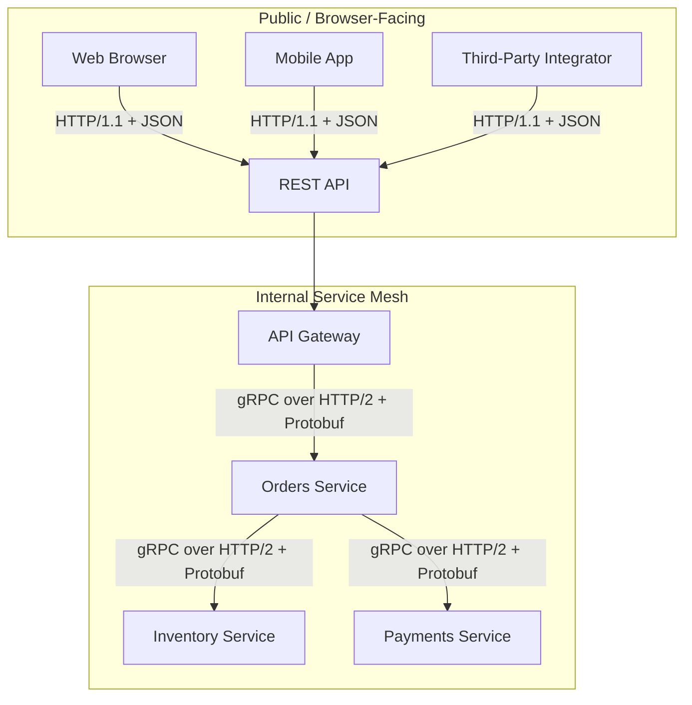

# REST vs gRPC

## Why This Matters

Once you have multiple services calling each other (see `monolith-vs-microservices.md`), you have to pick a protocol for those calls — and it's tempting to reach for whichever one is trendiest rather than the one that fits the actual traffic pattern. gRPC gets pitched as a strictly "faster, more modern" replacement for REST, and REST gets dismissed as legacy. Neither framing is accurate. REST (over HTTP/1.1 + JSON) and gRPC (over HTTP/2 + Protocol Buffers) solve overlapping but genuinely different problems, and picking the wrong one for your situation has real costs — either unnecessary complexity and tooling friction, or genuinely worse performance and weaker streaming support than the problem demands.

## Core Concept

**REST** (Representational State Transfer, see [Part 2 — REST API Design](../02-rest-api-design/README.md)) is an architectural style built on HTTP verbs, URLs-as-resources, and (almost universally in practice) JSON payloads. It's human-readable, works through any browser, proxy, or firewall without special configuration, and has close to universal client support — every language, every platform, every tool (`curl`, Postman, browsers) speaks HTTP and JSON natively.

**gRPC** is a Remote Procedure Call framework built by Google on top of HTTP/2, using **Protocol Buffers (Protobuf)** as its interface definition language and wire format (the upcoming `protocol-buffers.md` chapter covers Protobuf itself in depth). Instead of "resources and verbs," gRPC defines strongly-typed **services and methods** — you call `OrderService.GetOrder(request)` almost like calling a local function, and the framework handles serialization, transport, and deserialization. It compiles a `.proto` schema into typed client and server code in your language of choice, giving you compile-time type safety across service boundaries that REST-over-JSON doesn't provide by default.

Neither is "the modern one." REST is the right default for public, browser-facing, and third-party-integrator APIs. gRPC is the right default for internal, high-throughput, service-to-service calls where both ends are systems you control.

## Mental Model

Think of REST like sending a clearly labeled letter through the postal system: anyone, anywhere, with any mail service can read the address, understand the format, and process it — including systems that have never talked to you before. It's slower and the envelope has some overhead, but the universal compatibility is the entire point.

Think of gRPC like a direct, pre-agreed phone line between two departments in the same company who talk constantly: both sides already know the exact format of what will be said (the `.proto` contract), so they skip the pleasantries and exchange information in a dense, efficient shorthand. It's much faster for the parties who set it up, but a stranger picking up that phone line without the shared shorthand won't understand a word.

## How It Works

**REST over HTTP/1.1 + JSON:** each request opens (or reuses, with keep-alive) a connection, sends a text-based JSON body, and gets a text-based JSON response back. JSON is verbose (field names repeated in every payload, no compact binary encoding) and HTTP/1.1 processes requests on a connection largely one at a time from the client's perspective (pipelining exists but is rarely used in practice), so high-throughput scenarios often need connection pooling across many parallel connections.

**gRPC over HTTP/2 + Protobuf:** HTTP/2 supports true multiplexing — many concurrent requests and responses interleaved over a single TCP connection, eliminating the head-of-line blocking and connection-pool overhead that HTTP/1.1 REST clients deal with. Protobuf encodes messages as compact binary using field numbers instead of repeated string keys, producing payloads that are typically significantly smaller than the equivalent JSON, and both serialization and deserialization are faster because the schema is known ahead of time rather than parsed generically.

gRPC also natively supports four call patterns, where REST really only has one:

- **Unary** — one request, one response (equivalent to a typical REST call).
- **Server streaming** — one request, a stream of responses (e.g., subscribe to price updates for one item).
- **Client streaming** — a stream of requests, one final response (e.g., upload a stream of sensor readings, get a summary back).
- **Bidirectional streaming** — both sides stream independently over one long-lived connection (e.g., a live chat or collaborative editing session).

REST can approximate server streaming with Server-Sent Events or chunked responses (see [Part 9 — Real-Time APIs & Webhooks](../09-realtime-and-webhooks/README.md)), and full bidirectional streaming with WebSocket, but these are add-ons bolted onto HTTP, not something the base REST/JSON style was designed for — gRPC's streaming modes are first-class and built directly into the protocol.

## Architecture



A very common real-world pattern: REST at the edge (broad compatibility for external clients), gRPC internally between services you fully control (performance and type safety where it matters most, and where you don't need browser compatibility).

## Request / Response Example

The same logical call — "get order 8821" — contrasted in both styles.

**REST:**

```http
GET /v1/orders/8821 HTTP/1.1
Host: api.example.com
Accept: application/json
```

```http
HTTP/1.1 200 OK
Content-Type: application/json

{
  "order_id": "8821",
  "status": "shipped",
  "items": [{"sku": "ABC-1", "qty": 2}],
  "total_cents": 4599
}
```

**gRPC** (defined in a `.proto` contract, then called like a typed function — no hand-written URL or JSON parsing):

```protobuf
// orders.proto
syntax = "proto3";

service OrderService {
  rpc GetOrder (GetOrderRequest) returns (Order);
}

message GetOrderRequest {
  string order_id = 1;
}

message Order {
  string order_id = 1;
  string status = 2;
  repeated Item items = 3;
  int32 total_cents = 4;
}

message Item {
  string sku = 1;
  int32 qty = 2;
}
```

The client-side call, once the `.proto` file is compiled into a client stub, looks like an ordinary local function call:

```python
response = order_service_stub.GetOrder(GetOrderRequest(order_id="8821"))
print(response.status)  # "shipped" -- already a typed Python object, not raw JSON
```

There is no visible "HTTP request" in application code at all — the framework handles the wire format, and there's no risk of a typo'd field name silently producing `None` instead of a validation error, because the field is defined in the schema and generated code is statically typed.

## Code Example

A side-by-side of defining the same service both ways, to make the practical difference concrete.

```python
# --- REST version (FastAPI) ---
# Human-readable, works from a browser, curl, or any HTTP client with
# zero special tooling. Field typos in the client are only caught at
# runtime (or not at all, if the field is simply missing).

from fastapi import FastAPI
from pydantic import BaseModel

app = FastAPI()


class Item(BaseModel):
    sku: str
    qty: int


class Order(BaseModel):
    order_id: str
    status: str
    items: list[Item]
    total_cents: int


@app.get("/v1/orders/{order_id}", response_model=Order)
def get_order(order_id: str) -> Order:
    return Order(
        order_id=order_id,
        status="shipped",
        items=[Item(sku="ABC-1", qty=2)],
        total_cents=4599,
    )
```

```python
# --- gRPC version (Python, using code generated from orders.proto) ---
# The message shapes come from the .proto file, not from hand-written
# Pydantic models -- client and server share exactly one source of truth
# for the schema, generated for both sides, in whatever language each
# side is written in.

import grpc
from concurrent import futures
import orders_pb2
import orders_pb2_grpc


class OrderServiceServicer(orders_pb2_grpc.OrderServiceServicer):
    def GetOrder(self, request, context):
        # request.order_id is already a validated, typed string --
        # not a raw dict key that might be missing or misspelled.
        return orders_pb2.Order(
            order_id=request.order_id,
            status="shipped",
            items=[orders_pb2.Item(sku="ABC-1", qty=2)],
            total_cents=4599,
        )


def serve():
    server = grpc.server(futures.ThreadPoolExecutor(max_workers=10))
    orders_pb2_grpc.add_OrderServiceServicer_to_server(
        OrderServiceServicer(), server
    )
    server.add_insecure_port("[::]:50051")
    server.start()
    server.wait_for_termination()
```

The REST version is directly testable with `curl` and readable by any developer without generated code. The gRPC version requires the `.proto` file and a code-generation step for every client language, but gets compile-time type checking and a smaller, faster wire format in return.

## Production Considerations

- **Browser support is gRPC's biggest practical limitation.** Browsers can't speak raw HTTP/2 gRPC directly — gRPC-Web exists as a workaround, but it requires a proxy translation layer and doesn't support all streaming modes, adding real complexity for zero benefit if your actual client is a browser. This alone rules gRPC out for most public, browser-facing APIs.
- **Tooling and debuggability differ sharply.** JSON over HTTP is inspectable with `curl`, browser dev tools, and any HTTP proxy without special setup. Protobuf's binary wire format requires the `.proto` schema and gRPC-aware tooling (like `grpcurl`) to inspect — a real cost during incident debugging if your team isn't used to it.
- **Schema evolution needs discipline in both, but fails differently.** REST/JSON is naturally tolerant of adding new optional fields (old clients ignore unknown fields), but has no compile-time enforcement that a client and server agree on shape at all. Protobuf has strict, well-defined rules for backward/forward-compatible schema changes (never reuse a field number, add new fields as optional, etc.) — get this wrong and you get real deserialization failures, not silent `None`s.
- **Third-party and public-API consumers overwhelmingly expect REST/JSON.** Requiring external partners to generate gRPC client stubs and pull in a `.proto` file is a significant integration burden compared to "we return JSON, here's the OpenAPI spec" — this is the main reason gRPC rarely wins for public APIs regardless of its performance advantages.
- **Load balancing gRPC has different constraints than REST.** Because gRPC multiplexes many calls over one long-lived HTTP/2 connection, naive L4 (connection-level) load balancers can send all traffic from one client to a single backend instance; gRPC generally needs L7-aware or client-side load balancing to distribute properly (the upcoming `load-balancing.md` chapter covers this distinction).

## Common Mistakes

- **Choosing gRPC for a public API** that needs broad client compatibility — browsers, quick third-party integrations, `curl`-based debugging — and then bolting on a gRPC-Web proxy just to make it reachable, adding complexity that plain REST would have avoided entirely.
- **Choosing REST for extremely high-throughput internal service-to-service calls** where JSON's serialization overhead and HTTP/1.1's connection-per-request-ish behavior become a measurable bottleneck, when gRPC's binary framing and HTTP/2 multiplexing would meaningfully help.
- **Mixing REST and gRPC without a clear boundary rule**, so some internal services speak REST and others speak gRPC with no consistent pattern for which is used where, making the system harder to reason about and forcing every service to support both.
- **Treating gRPC as strictly faster without measuring** — the difference is often negligible for small payloads and low request volumes, and not worth the debuggability and tooling cost unless the throughput or latency actually demands it.
- **Ignoring schema evolution discipline in Protobuf** (reusing a field number, changing a field's type) and shipping a breaking change that silently corrupts data for clients on an older generated stub, rather than failing loudly.

## Best Practices

- Default to REST/JSON for anything public-facing, browser-facing, or consumed by external partners — universal compatibility usually outweighs the performance gain.
- Default to gRPC for internal, high-volume service-to-service calls where you control both ends and can manage `.proto` schema evolution and generated-code tooling.
- Don't mix protocols arbitrarily inside your internal service mesh — pick one default and deviate only with a clear, documented reason (e.g., a specific streaming need).
- If you need gRPC's efficiency but also need broad external reach, put a REST-speaking API gateway in front of an internal gRPC mesh (see `api-gateway.md`) rather than exposing gRPC directly to external clients.
- Version `.proto` schemas as carefully as you'd version a REST contract (see `api-versioning.md` in [Part 2](../02-rest-api-design/README.md)) — field number reuse and type changes are silent, hard-to-detect breaking changes.

## AI Engineering Perspective

Most public LLM provider APIs (OpenAI, Anthropic, and similar) are REST/JSON over HTTPS, specifically because their consumer base spans every language, framework, and skill level imaginable — REST's universal compatibility is a feature, not a limitation, for that audience. Internally, though, large-scale AI infrastructure — the calls between a request router, model-serving nodes, and a tokenizer service inside a production inference stack — very often does use gRPC or a similar binary RPC protocol, because those calls are extremely high-volume, low-latency, and entirely within infrastructure the AI platform team controls end-to-end. If you're building an LLM gateway or a multi-provider AI system (see [Part 15 — Production AI Systems](../15-production-ai-systems/README.md)), the same split applies: REST at the public edge for broad client compatibility, and gRPC (or an equivalent efficient internal protocol) between your own gateway and any internal model-routing or provider-abstraction services you run yourself.

## Exercises

**Beginner**
1. List two reasons a browser-based single-page app should almost never call a gRPC service directly, and explain what workaround exists (and its cost) if you had no other choice.

**Intermediate**
2. Take the REST and gRPC `GetOrder` examples above. Sketch what the equivalent server-streaming gRPC method would look like (method signature and message shapes) for "stream order status updates as they change," and explain what the REST equivalent of that feature would require instead.

**Advanced**
3. A team is deciding whether to migrate their internal orders-to-inventory call from REST to gRPC. Traffic is 40,000 requests/second internally, payloads are small (under 1KB), and both services are owned by the same team. Write a short recommendation weighing the concrete performance case against the tooling/debuggability cost, and state what you'd want to measure before committing to the migration.

## Key Takeaways

- REST (HTTP/1.1 + JSON) wins on universal compatibility, human-readability, and tooling — the right default for public and browser-facing APIs.
- gRPC (HTTP/2 + Protobuf) wins on performance, type safety, and native streaming support — the right default for internal, high-throughput service-to-service calls you fully control.
- gRPC's four call patterns (unary, server streaming, client streaming, bidirectional streaming) are first-class; REST approximates streaming with SSE or WebSocket as an add-on.
- Browser support and debugging tooling are gRPC's real practical weaknesses; schema-evolution discipline and per-language client generation are the recurring cost of both, but stricter in Protobuf.
- A common, defensible architecture uses REST at the public edge (often through an API gateway) and gRPC internally between services you own.

See also: [API Gateway](api-gateway.md), [Monolith vs Microservices](monolith-vs-microservices.md), and the [glossary](../../resources/glossary.md). Protocol Buffers are covered in depth in the upcoming `protocol-buffers.md` chapter in this part.

[← Back to Part 11 — Microservices & Distributed Systems](README.md)
