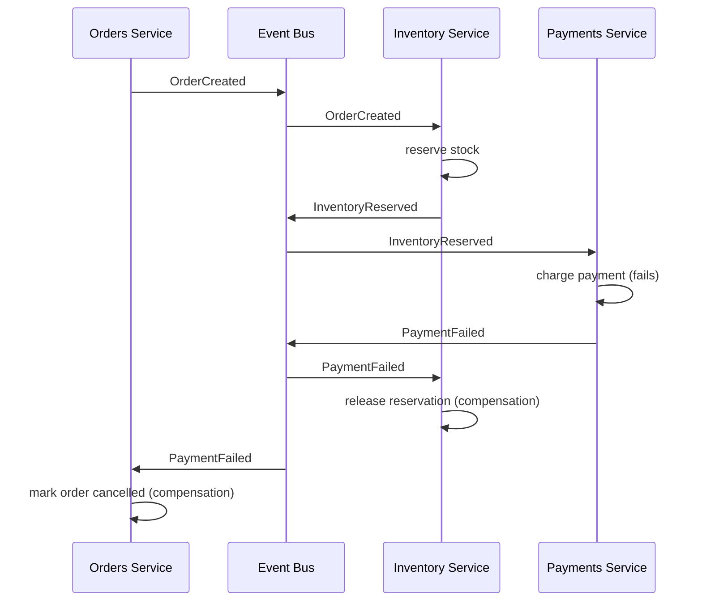
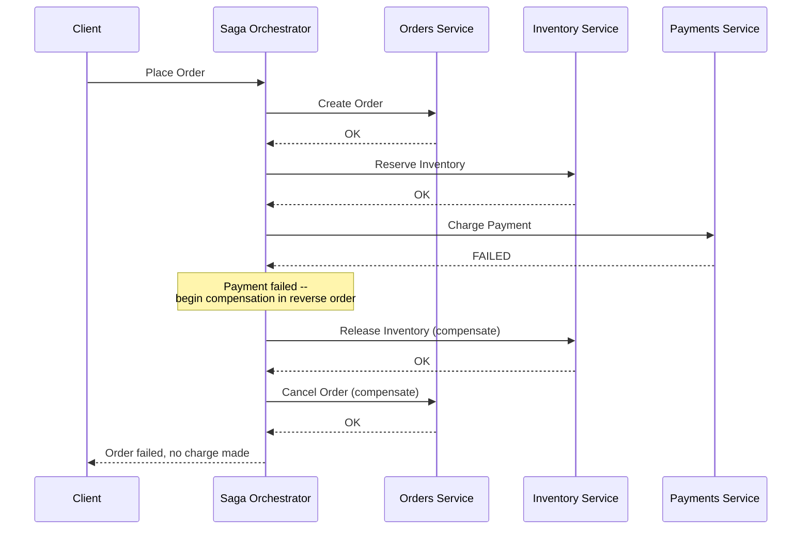

# Saga Pattern

## Why This Matters

In a monolith, "create an order, reserve inventory, charge payment" can be a single ACID database transaction: if any step fails, the whole thing rolls back automatically, and the database guarantees no other request ever sees a half-finished state. Split those three steps across three separately-owned services with three separate databases (see `monolith-vs-microservices.md`), and that guarantee disappears — there is no distributed ACID transaction spanning independent databases in a typical microservices architecture. If the payment charge fails after inventory has already been reserved, nothing automatically undoes the reservation. You either accept that inconsistent states can happen and design deliberately around it, or you build cross-service transactions yourself. The Saga pattern is the standard, deliberate way to do the latter — and understanding it well is what separates "we have microservices" from "we have microservices that don't quietly corrupt data during partial failures."

## Core Concept

A **saga** is a sequence of local transactions across multiple services, where each local transaction updates its own service's database and publishes an event or triggers the next step. If any step fails, the saga runs **compensating transactions** — explicit, application-level "undo" operations — for every step that already succeeded, in reverse order, to bring the overall system back to a consistent state. There is no lock held across the whole sequence and no atomic all-or-nothing guarantee at the database level; consistency is achieved cooperatively, one step and one compensation at a time.

This is fundamentally different from a database transaction's rollback. A database transaction's rollback is automatic and free — the database simply discards uncommitted changes. A saga's compensation is something *you* write, and it can't always perfectly undo a step: you can refund a captured payment, but you can't un-send an email, and you can't guarantee the compensating action itself won't fail. Sagas trade the strong guarantee of atomicity for the ability to compose transactions across independently owned services at all.

## Mental Model

Think of a saga like planning a multi-city trip where each leg is booked with a different, independent airline — no travel agency ties them together into one atomic itinerary. You book flight 1, then flight 2, then flight 3. If flight 3 turns out to be unavailable after you've already booked 1 and 2, there's no single "cancel the whole trip" button — you have to explicitly go back and cancel flight 2, then cancel flight 1, one at a time, using each airline's own cancellation process. If flight 1's airline doesn't offer refunds but only credits, your "compensation" isn't a perfect undo — it's the closest approximation available. This is exactly the situation a saga is in: each step's compensation is a real, separately-executed action with its own possible failure modes, not a free, automatic rollback.

## How It Works

There are two ways to coordinate a saga:

**Choreography** — there is no central coordinator. Each service completes its local transaction and publishes an event; other services subscribe to events relevant to them and react by performing their own local transaction (and possibly publishing their own event in turn). The orders service publishes `OrderCreated`; the inventory service, listening for that event, reserves stock and publishes `InventoryReserved`; the payments service, listening for *that* event, charges the customer. If payment fails, it publishes `PaymentFailed`, and the inventory service, listening for that, releases the reservation. No service needs to know about the whole saga — only the events immediately before and after its own step. This fits naturally with event-driven architectures (see the upcoming `event-driven-microservices.md` chapter and [Part 8 — Async Systems](../08-async-systems/README.md)), keeps services loosely coupled, and scales well for a small number of steps — but the overall saga logic becomes implicit, scattered across every service's event handlers, which makes it genuinely hard to see or debug the full flow in one place as the number of steps grows.

**Orchestration** — a central orchestrator explicitly calls each step in sequence, and explicitly calls the corresponding compensating transaction if a later step fails. The orchestrator holds the saga's state machine — which step is in progress, which steps have completed, what to compensate if the current step fails — in one place. This makes the overall flow easy to read, test, and monitor (you can literally look at the orchestrator's state to answer "where is order 8821's saga right now?"), at the cost of the orchestrator itself becoming a critical, stateful component that needs its own durability (typically backed by a database recording saga step state, so a crashed orchestrator can resume rather than lose track of an in-flight saga).

In both models, the same core requirement holds: **every step must have a defined compensating action**, and **every step (forward and compensating) must be idempotent** — safe to execute more than once — because network failures mean a step's completion signal can be lost, retried, and re-delivered.

## Architecture

Choreography (event-driven, no central coordinator):



Orchestration (a central saga orchestrator explicitly drives every step and compensation):



## Request / Response Example

The messages that flow through an orchestrated saga are typically internal commands and results, not client-facing HTTP — the client only sees the saga's final outcome.

**Client → Orchestrator (starts the saga):**

```http
POST /v1/orders HTTP/1.1
Host: api.example.com
Content-Type: application/json

{"user_id": "user_4471", "items": [{"sku": "ABC-1", "qty": 2}]}
```

**Orchestrator → Inventory Service (step 2 command):**

```json
{
  "saga_id": "saga_9931",
  "step": "reserve_inventory",
  "order_id": "8821",
  "items": [{"sku": "ABC-1", "qty": 2}],
  "idempotency_key": "saga_9931:reserve_inventory"
}
```

**Payments Service → Orchestrator (step 3 result — failure):**

```json
{
  "saga_id": "saga_9931",
  "step": "charge_payment",
  "status": "failed",
  "reason": "card_declined"
}
```

**Orchestrator → Inventory Service (compensating command):**

```json
{
  "saga_id": "saga_9931",
  "step": "release_inventory",
  "order_id": "8821",
  "idempotency_key": "saga_9931:release_inventory"
}
```

**Orchestrator → Client (final response, after compensation completes):**

```http
HTTP/1.1 402 Payment Required
Content-Type: application/json

{
  "order_id": "8821",
  "status": "cancelled",
  "reason": "card_declined",
  "message": "Payment failed. No charge was made and inventory has been released."
}
```

Every command carries `saga_id` (to correlate every step and compensation belonging to the same saga) and an `idempotency_key` (see `idempotency.md` in [Part 6 — Production Reliability](../06-production-reliability/README.md)) — critical, because if the orchestrator's call to release inventory times out and it retries, the inventory service must recognize the retry and not double-release (or worse, error) on an already-released reservation.

## Code Example

A simplified orchestrated saga, showing the step/compensation structure explicitly.

```python
from dataclasses import dataclass
from enum import Enum
from typing import Callable


class SagaStepStatus(Enum):
    PENDING = "pending"
    COMPLETED = "completed"
    COMPENSATED = "compensated"


@dataclass
class SagaStep:
    name: str
    action: Callable[[dict], dict]          # forward step
    compensation: Callable[[dict], None]    # undo action -- must be idempotent


class SagaFailedError(Exception):
    def __init__(self, failed_step: str, reason: str):
        self.failed_step = failed_step
        self.reason = reason
        super().__init__(f"Saga failed at step '{failed_step}': {reason}")


class SagaOrchestrator:
    """Runs steps in order. On failure, compensates every step that
    already succeeded, in REVERSE order -- undo the most recent thing
    first, mirroring how you'd unwind a call stack."""

    def __init__(self, steps: list[SagaStep]):
        self.steps = steps

    def run(self, context: dict) -> dict:
        completed_steps: list[SagaStep] = []

        for step in self.steps:
            try:
                result = step.action(context)
                context.update(result or {})
                completed_steps.append(step)
            except Exception as exc:
                self._compensate(completed_steps, context)
                raise SagaFailedError(step.name, str(exc)) from exc

        return context

    def _compensate(self, completed_steps: list[SagaStep], context: dict) -> None:
        # Reverse order: undo the most recently completed step first.
        for step in reversed(completed_steps):
            try:
                step.compensation(context)
            except Exception:
                # A compensation failure is serious -- it means the system
                # is now in a state nothing can automatically fix. This
                # must be logged/alerted for manual intervention, never
                # silently swallowed.
                _alert_compensation_failed(step.name, context)


def _alert_compensation_failed(step_name: str, context: dict) -> None:
    ...  # page on-call / write to a dead-letter queue for manual review


# --- Defining the order saga ---

def create_order(ctx: dict) -> dict:
    order_id = _orders_client.create(ctx["user_id"], ctx["items"])
    return {"order_id": order_id}


def cancel_order(ctx: dict) -> None:
    # Idempotent: cancelling an already-cancelled order is a no-op, not an error.
    _orders_client.cancel(ctx["order_id"], idempotency_key=f"{ctx['saga_id']}:cancel_order")


def reserve_inventory(ctx: dict) -> dict:
    _inventory_client.reserve(
        ctx["order_id"], ctx["items"],
        idempotency_key=f"{ctx['saga_id']}:reserve_inventory",
    )
    return {}


def release_inventory(ctx: dict) -> None:
    _inventory_client.release(
        ctx["order_id"],
        idempotency_key=f"{ctx['saga_id']}:release_inventory",
    )


def charge_payment(ctx: dict) -> dict:
    charge_id = _payments_client.charge(
        ctx["user_id"], ctx["order_id"],
        idempotency_key=f"{ctx['saga_id']}:charge_payment",
    )
    return {"charge_id": charge_id}


def refund_payment(ctx: dict) -> None:
    if "charge_id" in ctx:  # only refund if a charge actually happened
        _payments_client.refund(
            ctx["charge_id"],
            idempotency_key=f"{ctx['saga_id']}:refund_payment",
        )


order_saga = SagaOrchestrator(steps=[
    SagaStep("create_order", create_order, cancel_order),
    SagaStep("reserve_inventory", reserve_inventory, release_inventory),
    SagaStep("charge_payment", charge_payment, refund_payment),
])

# Usage:
# order_saga.run({"saga_id": "saga_9931", "user_id": "user_4471", "items": [...]})
```

## Production Considerations

- **Every compensation must be idempotent.** Network failures mean a compensating call can be retried after the receiving service already applied it — `release_inventory` called twice must not error or double-release; `refund_payment` called twice must not double-refund. This is not optional; it's the difference between a saga that's actually safe and one that quietly corrupts data during real-world retries.
- **Persist saga state, don't keep it only in memory.** If an orchestrator process crashes mid-saga, it needs to recover exactly where it left off (which steps completed, which compensations are pending) from durable storage — an in-memory-only orchestrator loses track of in-flight sagas on every restart or deploy, leaving orders permanently half-completed.
- **Not every step can be perfectly compensated.** "Send confirmation email" has no real undo. For steps like this, either order them last in the saga (after every reversible step has succeeded) or accept the imperfect compensation (a follow-up "disregard previous email" notice) rather than pretending a clean rollback exists.
- **Choose choreography vs orchestration based on saga complexity, not fashion.** A two- or three-step saga with a small, stable set of participants is often clearer as choreography; a five-plus-step saga, or one that changes participants over time, usually benefits from an explicit orchestrator whose state you can query and monitor directly.
- **Sagas are eventually consistent, not immediately consistent.** Between steps, the system is briefly in a state where inventory is reserved but payment hasn't been confirmed yet — any code reading that state (including other sagas) must be written with that window in mind, not assuming a single atomic transaction just happened. This is the same consideration event-driven microservices deal with broadly (see [Part 8 — Async Systems](../08-async-systems/README.md)).

## Common Mistakes

- **Writing compensating actions that aren't idempotent**, causing double-refunds, double-releases, or errors when a retried compensation hits a step that was already undone.
- **Forgetting a compensation entirely for a step that has side effects** — assuming a step is "harmless" and skipping its undo, only to discover in production that it wasn't.
- **Keeping saga state only in the orchestrator's memory**, so a crash or redeploy mid-saga permanently strands orders in an inconsistent, half-completed state with no record of what still needs to be undone.
- **Treating a saga as if it were an ACID transaction**, i.e., assuming other parts of the system will never observe the intermediate, partially-completed state — they will, and code that reads shared state must account for that window.
- **Using choreography for a large, complex saga** where the overall flow becomes impossible to see or debug because it's scattered across many services' independent event handlers, with no single place to ask "what's the current state of this saga?"

## Best Practices

- Design every forward step and every compensating step to be idempotent from day one, using an idempotency key derived from the saga ID and step name.
- Persist saga/orchestrator state in a durable store so an orchestrator can resume an in-flight saga after a crash or redeploy, rather than losing track of it.
- Order irreversible or hard-to-compensate steps (sending emails, external notifications) last, after every safely-reversible step has already succeeded.
- Log and alert loudly if a compensating transaction itself fails — that's the one failure mode a saga has no further fallback for, and it needs a human.
- Prefer orchestration once a saga exceeds roughly three or four steps, or once you need centralized visibility into in-flight saga state for debugging and monitoring.

## AI Engineering Perspective

Multi-step AI agent workflows (see [Part 17 — AI Agents & MCP](../17-ai-agents-and-mcp/README.md)) run into the exact same problem sagas solve, just with tool calls instead of service calls: an agent might call a "create calendar event" tool, then a "send invite email" tool, then a "book a room" tool, and if the room-booking step fails, something needs to decide whether to undo the calendar event and the email — and how, given that "undo" might not exist for a tool that already sent an email. Treating a multi-step agent plan as a saga — defining an explicit compensating action per tool call where one exists, and accepting (with a warning to the user) where one doesn't — is a far more robust design than either ignoring partial-failure entirely or blocking the whole plan on artificial cross-tool atomicity that doesn't exist. This connects directly to agent security and guardrails (an upcoming chapter in [Part 17](../17-ai-agents-and-mcp/README.md)): a tool without a defined compensating action is a tool whose side effects an agent can create but never cleanly reverse, which should factor directly into whether that tool is safe to call autonomously without human confirmation.

## Exercises

**Beginner**
1. Explain, in plain language, why "just wrap it all in a database transaction" doesn't work once orders, inventory, and payments are three separately-owned services with three separate databases.

**Intermediate**
2. Using the `SagaOrchestrator` code above, add a fourth step, `send_confirmation_email`, positioned last in the saga. Explain in a comment why it belongs at the end rather than earlier, and what its (imperfect) compensation should do if a later step somehow still needed to fail after it.

**Advanced**
3. Design a choreography-based version of the order-payment-inventory saga from this chapter using named events (`OrderCreated`, `InventoryReserved`, `PaymentFailed`, etc.). Identify one specific scenario where debugging "why is this order stuck?" is harder in the choreography version than it would be with an orchestrator holding explicit saga state, and explain why.

## Key Takeaways

- Sagas exist because there is no distributed ACID transaction across independently owned service databases — consistency across services must be achieved cooperatively, through explicit steps and compensations.
- Choreography (event-driven, no central coordinator) suits small, stable sagas; orchestration (a central coordinator driving steps and compensations) suits larger or more complex ones where visibility into saga state matters.
- Every forward step and every compensating action must be idempotent — retries after network failures are a normal, expected occurrence, not an edge case.
- A saga is eventually consistent: the system passes through real, observable intermediate states that other code must be written to tolerate.
- Not every step can be perfectly undone; order hard-to-compensate steps last, and always alert loudly when a compensation itself fails.

See also: [Monolith vs Microservices](monolith-vs-microservices.md), [API Gateway](api-gateway.md), [Part 6 — Production Reliability](../06-production-reliability/README.md) (idempotency), [Part 8 — Async Systems](../08-async-systems/README.md), and the [glossary](../../resources/glossary.md). Distributed transactions and event-driven microservices are covered in more depth in upcoming chapters in this part.

[← Back to Part 11 — Microservices & Distributed Systems](README.md)
