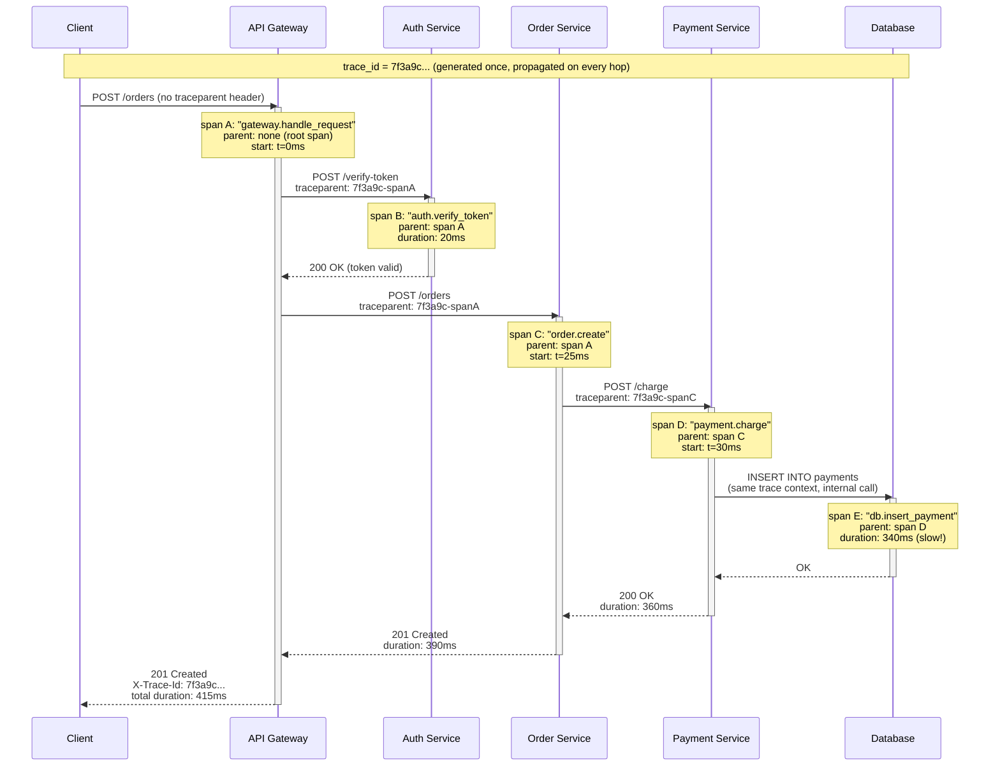

# Distributed Tracing

## Why This Matters

A single user action — "place an order" — might touch five different services before it's done: an API gateway, an auth service, an order service, a payment service, and a database. When that request takes 4 seconds instead of the usual 200ms, or fails outright, logs and metrics from any *one* of those services only show you a fragment of the story. The order service's logs show it called the payment service and waited a long time; the payment service's logs show it processed the charge quickly. Neither one, on its own, tells you where the missing 3.5 seconds actually went. This is the exact problem distributed tracing exists to solve: seeing one request's entire journey across every service it touched, as a single connected picture, instead of piecing it together by hand from a dozen separate log streams. This chapter builds the core vocabulary — traces, spans, and parent/child relationships — and walks through one request traced end to end across multiple services.

## Core Concept

A **trace** represents the complete journey of one request through a distributed system, from the moment it enters (say, at an API gateway) to the moment a response is finally returned. A trace is identified by a single **trace ID** — a unique identifier generated once, at the very start of the request, and passed along to every service that request touches.

A trace is composed of **spans**. A **span** represents one unit of work within that journey — typically one operation in one service, such as "handle POST /orders in the order service" or "query the database for order 8842." Each span records: a name, a start time, a duration, the service that produced it, and (critically) which other span caused it to happen — its **parent span**. A span with no parent is the **root span**, marking the very start of the trace, usually at the edge of the system (the API gateway or load balancer).

This parent/child relationship is what turns a pile of disconnected timing records into a single coherent tree: the root span (API gateway handling the request) has child spans for each downstream call it makes (auth service, order service), and each of *those* spans can have their own children (the order service calling the payment service, the payment service querying its database), recursively, as deep as the request actually goes. Reassembling this tree — using trace ID to know which spans belong together, and parent span ID to know how they nest — is what a tracing backend (Jaeger, Zipkin, Grafana Tempo, or a vendor APM tool) does to render the now-familiar waterfall diagram of a request's full lifecycle.

The upcoming tracing.md chapter covers single-service span instrumentation in more depth, and opentelemetry.md covers the vendor-neutral standard (OpenTelemetry) most modern systems use to generate and export this data consistently. This chapter focuses specifically on the *distributed* problem: how trace context survives crossing a network boundary from one service to another.

## Mental Model

Think of a trace ID as a claim check handed to a package the moment it enters a shipping network, and each span as a scan event at a checkpoint along its route. The package (the request) starts at the origin depot (API gateway), gets a barcode (trace ID) stuck on it, and every single facility it passes through — the regional sorting center (auth service), the local depot (order service), the courier hand-off (payment service) — scans that same barcode and logs how long the package sat there and which prior scan it came from. No individual facility needs to know the package's entire route in advance; each just needs to (a) scan the barcode it was handed, (b) record its own handling time, and (c) pass the *same* barcode along to the next facility. At the end, anyone can pull every scan event with that barcode and reconstruct the package's exact path and dwell time at each stop — which is precisely what a trace visualization does with spans.

## How It Works

The mechanics that make distributed tracing work come down to **context propagation**: passing the trace ID (and current span ID, to be used as the parent for whatever the next service does) across a network call, usually via HTTP headers. The W3C Trace Context standard defines a `traceparent` header for exactly this purpose, formatted roughly as `version-traceid-spanid-flags`.

The sequence for one request looks like this:

1. A request arrives at the edge of the system with no existing trace context. The entry service (API gateway) generates a new trace ID and starts the root span.
2. Before making a downstream call (to the auth service), the gateway starts a **child span** for "call auth service," and injects the trace ID plus this child span's ID into the outgoing request's `traceparent` header.
3. The auth service receives the request, reads the `traceparent` header, and uses it as the parent for its own local span — "handle authenticate request." It does *not* generate a new trace ID; it continues the existing one.
4. If the auth service makes further calls (e.g., to its own database), it repeats the same process one level deeper, and so on for every hop.
5. Each service, independently, exports its completed spans (name, timing, trace ID, span ID, parent span ID) to a tracing backend, usually asynchronously so tracing overhead doesn't add latency to the actual request.
6. The tracing backend groups all spans sharing a trace ID and reconstructs the parent/child tree, rendering it as a waterfall or Gantt-style timeline.

The critical, easy-to-break step is #2/#3: if any service in the chain fails to read the incoming trace header, or fails to forward it on its own outgoing calls, the trace **breaks** at that point — the downstream spans still get recorded, but as an orphaned, disconnected trace with no link back to the original request. This is by far the most common distributed tracing failure in practice, covered further in Common Mistakes below.

## Architecture

The diagram below shows one request — "place an order" — flowing through five hops, all sharing a single trace ID (`trace=7f3a…`), with each span's parent explicitly shown and approximate timing annotated. This is the exact "one request across multiple services" scenario referenced throughout this part.



Reading this trace after the fact, an engineer can immediately see that span E (`db.insert_payment`, 340ms) is responsible for almost all of the request's 415ms total — a fact that would be nearly invisible from the order service's logs alone, which only show "payment service took 360ms," with no visibility into *why*. This is the entire value proposition of distributed tracing: it turns "somewhere downstream got slow" into "this exact database insert, in this exact service, is the bottleneck."

## Request / Response Example

The trace ID propagates as an HTTP header on every internal hop, and is conventionally also returned to the original caller so it can be used to look up the trace later — commonly as `X-Trace-Id` (a simpler, human-facing convention) alongside or instead of the standardized `traceparent`:

```http
POST /orders HTTP/1.1
Host: api.example.com
Content-Type: application/json

{"sku": "WIDGET-9", "quantity": 1}
```

```http
HTTP/1.1 201 Created
Content-Type: application/json
X-Trace-Id: 7f3a9c1e2b4d4f6a9c0e1b2d3f4a5b6c
Traceparent: 00-7f3a9c1e2b4d4f6a9c0e1b2d3f4a5b6c-00f067aa0ba902b7-01

{"order_id": 8842, "status": "confirmed"}
```

An internal hop, from the order service to the payment service, carries the same trace ID forward but with a new parent span ID pointing at the order service's own span:

```http
POST /charge HTTP/1.1
Host: payment-service.internal
Content-Type: application/json
Traceparent: 00-7f3a9c1e2b4d4f6a9c0e1b2d3f4a5b6c-a1b2c3d4e5f60718-01

{"order_id": 8842, "amount_cents": 2999}
```

Returning `X-Trace-Id` to the client matters in practice: when a user reports "my checkout was slow just now," support or engineering can ask for that ID (or find it in a client-side log) and jump directly to the exact trace, instead of searching through logs by approximate timestamp. This is the same correlation-ID idea from logging.md and request-ids.md, extended across service boundaries.

## Code Example

This example shows the propagation mechanics directly, without a full tracing SDK, so the underlying idea is visible: generating a trace ID at the edge, and forwarding it (plus a new parent span ID) on every outgoing call.

```python
import uuid
import time
import httpx
from fastapi import FastAPI, Request

app = FastAPI()


def new_id() -> str:
    return uuid.uuid4().hex


@app.middleware("http")
async def tracing_middleware(request: Request, call_next):
    # If an upstream service already started a trace, continue it.
    # Otherwise, this service is the entry point — start a new trace.
    incoming_trace_id = request.headers.get("x-trace-id")
    trace_id = incoming_trace_id or new_id()
    span_id = new_id()  # this service's own span within the trace

    request.state.trace_id = trace_id
    request.state.span_id = span_id

    start = time.perf_counter()
    response = await call_next(request)
    duration_ms = (time.perf_counter() - start) * 1000

    # Emit the span as a structured log line — in a real system this would
    # go to a tracing backend (Jaeger/Tempo) via an OpenTelemetry exporter,
    # but a structured log line demonstrates the same underlying data.
    print({
        "event": "span_finished",
        "trace_id": trace_id,
        "span_id": span_id,
        "parent_span_id": request.headers.get("x-parent-span-id"),
        "service": "order-service",
        "operation": f"{request.method} {request.url.path}",
        "duration_ms": round(duration_ms, 2),
    })

    response.headers["X-Trace-Id"] = trace_id
    return response


async def call_payment_service(request: Request, order_id: int, amount_cents: int):
    # Propagate trace context on every outgoing call. This is the step
    # that most commonly gets forgotten, breaking the trace — see
    # Common Mistakes.
    async with httpx.AsyncClient(timeout=5.0) as client:
        resp = await client.post(
            "http://payment-service.internal/charge",
            json={"order_id": order_id, "amount_cents": amount_cents},
            headers={
                "X-Trace-Id": request.state.trace_id,
                "X-Parent-Span-Id": request.state.span_id,  # this hop becomes the parent for the next span
            },
        )
        resp.raise_for_status()
        return resp.json()
```

## Production Considerations

- **Sampling is mandatory at scale.** Recording and storing a full trace for every single request becomes prohibitively expensive at high traffic volumes. Production tracing systems typically sample — recording, say, 1–10% of traces in full, plus 100% of traces that hit an error, so rare failures aren't statistically likely to be missed even at a low overall sample rate.
- **Propagation must cross every hop, including message queues and background jobs**, not just synchronous HTTP calls. If an order service publishes a message to a queue that a worker later processes, the trace context needs to travel inside that message payload too, or the trace breaks the moment work becomes asynchronous (see Part 8).
- **Clock skew between services can distort timing.** Spans on different hosts rely on each host's clock; without reasonably synchronized clocks (NTP), a child span can appear to start before its parent, confusing the reconstructed timeline.
- **Tracing overhead is real but usually small** if done via async, batched export rather than a synchronous call to the tracing backend on every request — instrumentation libraries handle this, but home-grown solutions need to replicate it deliberately.
- **OpenTelemetry has become the standard instrumentation layer** for generating this data in a vendor-neutral way, letting you switch tracing backends without re-instrumenting every service — covered in full in opentelemetry.md.

## Common Mistakes

- **Not propagating trace context across a service boundary**, silently breaking the trace at that hop — the most common failure mode, often introduced when a new outgoing call is added to a service and the engineer forgets to copy the trace headers onto it.
- **Generating a new trace ID at every service** instead of continuing the one that arrived, which produces many short, disconnected traces instead of one coherent end-to-end trace.
- **Losing trace context across async boundaries** — message queues, background workers, retried jobs — where the trace header has to be manually carried inside the message payload rather than an HTTP header.
- **Sampling too aggressively without an error-biased strategy**, so the rare, most-important failing requests are exactly the ones that get dropped and never recorded.
- **Treating a trace as a replacement for metrics**, using it to answer "is my system healthy overall" — traces show individual request journeys; distributed-tracing.md complements metrics.md, it doesn't replace the aggregate view.

## Best Practices

- Generate trace context at the earliest possible entry point (API gateway or load balancer) and propagate it unconditionally on every outgoing call your service makes, synchronous or asynchronous.
- Return the trace ID to the client (`X-Trace-Id` or similar) so support and users can supply it when reporting a slow or broken request.
- Instrument the boundaries that matter most first: incoming requests, outgoing HTTP calls, database queries, and message queue publish/consume — not every internal function call.
- Use an error-biased sampling strategy: always record traces for failed requests, and sample a smaller percentage of successful ones.
- Adopt OpenTelemetry's conventions from the start, even before adopting a specific backend, so you're not locked into one vendor's proprietary format.

## AI Engineering Perspective

Distributed tracing becomes especially valuable in AI systems because a single user-facing request can fan out into a surprising number of internal hops that are easy to lose track of: a request to an AI gateway might trigger a cache lookup, a routing decision between providers, a retrieval step against a vector database (see Part 16), and finally the actual LLM call — each with wildly different and unpredictable latency. Without tracing, "why did this chat response take 6 seconds" is nearly unanswerable; with tracing, you can see directly whether it was 5.5 seconds of LLM generation, or 4 seconds of retrieval plus 1.5 seconds of generation, which are entirely different problems requiring entirely different fixes. Tracing also becomes the backbone for connecting a single user-facing AI request to every internal decision it triggered — routing, fallback, retries — a theme covered in full in ai-observability.md.

## Exercises

**Beginner**
1. In your own words, explain the difference between a trace and a span, and describe what a parent/child span relationship represents.
2. Look at the sequence diagram in this chapter and identify which single span is the largest contributor to total request latency. What would you investigate next?

**Intermediate**
3. Extend the code example so that the order service also propagates trace context to a second downstream call (an inventory service), and sketch what the resulting span tree would look like as a Mermaid diagram.

**Advanced**
4. Design a sampling strategy for a system handling 50,000 requests/second where full tracing of every request is too expensive. Specify your sample rate for successful requests, your policy for failed requests, and how you'd guarantee a trace is never lost partway through a multi-service call chain due to sampling decisions being made independently by different services.

## Key Takeaways

- Distributed tracing solves the specific problem of seeing one request's full journey across multiple services, which logs and metrics on any single service cannot show on their own.
- A trace is identified by a single trace ID shared across every service the request touches; a span represents one unit of work, linked to its parent span.
- Trace context must be explicitly propagated (usually via HTTP headers like `traceparent` or `X-Trace-Id`) on every outgoing call — forgetting this is the most common way traces break.
- The worked multi-service example in this chapter shows how tracing pinpoints exactly which hop and which operation is responsible for latency, something aggregate metrics cannot do.
- Sampling, error-biased retention, and propagation across async boundaries (queues, workers) are the production-scale concerns layered on top of the core trace/span model.

Continue to [SLI, SLO, SLA](sli-slo-sla.md), or return to the [Part 12 overview](README.md). See also [Part 11 — Microservices & Distributed Systems](../11-microservices-distributed-systems/README.md) for the architectural context these traces run inside.
