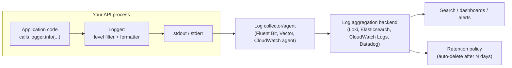

# Logging

## Why This Matters

The first time your API breaks in production at 2 a.m., you will not have a debugger attached to it. You will not be able to step through the request that failed, inspect variables, or reproduce the exact race condition that triggered it. What you will have — if you set things up correctly — is a trail of log lines describing what the system was doing right before it went wrong. Logging is the most basic form of observability, and it's the one every API needs from day one, long before you have metrics dashboards or distributed tracing. Done well, logs let you reconstruct the story of a request after the fact. Done badly — too sparse, too noisy, or leaking secrets — logs become either useless or a liability. This chapter covers how to log with intent: what to capture, what to never capture, and how to structure log output so it's actually usable once your system has more than one server.

## Core Concept

A **log** is a timestamped record of something that happened in your system. Every log line answers, implicitly or explicitly: *when* did this happen, *what* happened, and *how severe* is it. That third question — severity — is handled by **log levels**, a small ordered vocabulary every mainstream logging library shares:

- **DEBUG** — fine-grained diagnostic detail, useful only when actively investigating a problem (e.g., "cache lookup returned miss for key `user:42`"). Usually disabled in production because of volume.
- **INFO** — normal operational events worth recording as a matter of course (e.g., "server started," "order 8842 created"). This is often the production default level.
- **WARNING** — something unexpected happened, but the system recovered or degraded gracefully (e.g., "retrying database connection, attempt 2 of 3").
- **ERROR** — an operation failed and could not complete as intended (e.g., "failed to charge payment for order 8842: gateway timeout"). This usually corresponds to a request the user experienced as broken.
- **CRITICAL / FATAL** — the system itself is in danger or unable to continue (e.g., "cannot connect to primary database, shutting down").

Levels exist so you can filter signal from noise: you leave DEBUG off in production to control volume and cost, but flip it on temporarily while chasing a specific bug. They also let alerting systems key off severity — nobody wants a page at 3 a.m. for an INFO log line, but an ERROR spike absolutely should trigger one.

Equally important as *what level* to log is *what content* to put in the message. A log line's job is to answer a future engineer's question — "what was happening to this request?" — so it should include enough context (which user, which resource, which request) to be useful in isolation, not just "something failed."

## Mental Model

Think of your API as a black box flight recorder on an airplane. You don't review the recording during a normal, uneventful flight — you review it *after* something goes wrong, to reconstruct exactly what happened in the moments leading up to the incident. That reframes two decisions at once: log the things that would matter to an investigator after an incident (not everything you can think of), and never record anything on the flight recorder that would be dangerous if the recorder itself were compromised — passwords, credit card numbers, government ID numbers. A flight recorder that captured every passenger's boarding pass number in plaintext would be a liability, not an asset, the moment someone got access to it who shouldn't have.

## How It Works

Under the hood, a logging call in most languages does roughly the same thing: it constructs a **log record** (timestamp, level, message, and any attached fields), passes it through a **filter** (is this level enabled right now?), formats it (plain text or JSON), and sends it to one or more **handlers** — stdout, a file, a network socket to a log collector. In a containerized production environment, the near-universal pattern is: your application writes logs to stdout/stderr, and something outside the application (a sidecar, a node-level agent like Fluent Bit or Vector, or the container runtime itself) picks those lines up and ships them to a centralized store. Your application should almost never be responsible for opening a network connection to a remote logging service directly — that couples your request-handling code to the availability of a third-party system, and if the log backend is slow or down, a poorly written logging integration can block or even crash your API.

This is also where **structured vs. unstructured logging** first becomes relevant, even though it's covered in full depth in the upcoming structured-logging.md chapter. An unstructured log line looks like free text: `Order 8842 failed to process payment for user 42`. It's readable by a human scrolling a terminal, but a machine has to parse it with regex to extract `order_id` or `user_id` — fragile and slow at scale. A structured log line represents the same event as key-value fields, typically JSON: `{"event": "payment_failed", "order_id": 8842, "user_id": 42, "level": "error"}`. Structured logs are what make log aggregation systems (Elasticsearch, Loki, Datadog, CloudWatch Logs Insights) actually queryable — you can filter and aggregate on `order_id` directly instead of grepping for a substring. As your system grows past a single server, this distinction stops being a nicety and becomes the difference between being able to answer "show me every log line for order 8842 across every service" and not.

## Architecture



The key architectural point: your application only ever talks to stdout. Everything from the collector onward is infrastructure, not application code — which means you can change your entire log aggregation backend without touching a single line of API code, as long as you keep writing structured lines to stdout.

## Request / Response Example

A single incoming HTTP request, logged as it's handled, might produce these lines (shown here as structured JSON — the format this handbook builds toward in structured-logging.md):

```json
{"timestamp": "2026-08-18T09:14:02.114Z", "level": "info", "event": "request_started", "method": "POST", "path": "/orders", "request_id": "a1b2c3d4"}
{"timestamp": "2026-08-18T09:14:02.201Z", "level": "warning", "event": "inventory_low", "sku": "WIDGET-9", "remaining": 2, "request_id": "a1b2c3d4"}
{"timestamp": "2026-08-18T09:14:02.340Z", "level": "error", "event": "payment_gateway_timeout", "order_id": 8842, "gateway": "stripe", "timeout_ms": 3000, "request_id": "a1b2c3d4"}
{"timestamp": "2026-08-18T09:14:02.341Z", "level": "info", "event": "request_completed", "method": "POST", "path": "/orders", "status_code": 502, "duration_ms": 227, "request_id": "a1b2c3d4"}
```

Notice that `request_id` appears on every line. That single shared field is what turns four disconnected log lines into one coherent story — the full chapter on this idea is request-ids.md, but the pattern starts here: never log without a way to correlate related lines.

## Code Example

```python
import logging
import sys
import json
from datetime import datetime, timezone

# A minimal JSON formatter using only the standard library. In real
# projects you'd typically reach for structlog or python-json-logger,
# but seeing the mechanics once, unassisted, is worth it.
class JsonFormatter(logging.Formatter):
    def format(self, record: logging.LogRecord) -> str:
        payload = {
            "timestamp": datetime.fromtimestamp(
                record.created, tz=timezone.utc
            ).isoformat(),
            "level": record.levelname.lower(),
            "message": record.getMessage(),
            "logger": record.name,
        }
        # Any extra fields passed via `logger.info(..., extra={...})`
        # get merged in, which is how we attach request_id, order_id, etc.
        for key, value in record.__dict__.items():
            if key in ("args", "msg", "levelname", "levelno", "pathname",
                        "filename", "module", "exc_info", "exc_text",
                        "stack_info", "lineno", "funcName", "created",
                        "msecs", "relativeCreated", "thread", "threadName",
                        "processName", "process", "name"):
                continue
            payload[key] = value
        return json.dumps(payload)


def configure_logging(level: str = "INFO") -> logging.Logger:
    handler = logging.StreamHandler(sys.stdout)  # always stdout, never a file path
    handler.setFormatter(JsonFormatter())

    logger = logging.getLogger("orders_api")
    logger.setLevel(level)
    logger.addHandler(handler)
    return logger


logger = configure_logging()

# --- usage inside a request handler ---

def handle_create_order(order_id: int, user_id: int, amount_cents: int):
    logger.info(
        "order created",
        extra={"event": "order_created", "order_id": order_id, "user_id": user_id},
    )
    try:
        charge_payment(order_id, amount_cents)
    except PaymentGatewayTimeout:
        # NEVER include the raw card number, CVV, or full auth token here —
        # only identifiers needed to look up the record safely.
        logger.error(
            "payment gateway timeout",
            extra={"event": "payment_gateway_timeout", "order_id": order_id},
        )
        raise


class PaymentGatewayTimeout(Exception):
    pass


def charge_payment(order_id: int, amount_cents: int):
    raise PaymentGatewayTimeout()
```

## Production Considerations

- **Volume has a real dollar cost.** Most log aggregation platforms charge per gigabyte ingested and per day retained. DEBUG-level logging left on in production for a high-traffic endpoint can silently become one of your largest infrastructure line items.
- **Retention policy is a deliberate decision, not a default.** Decide how long logs need to live to be useful for debugging (days to weeks) versus how long they need to live for compliance or audit purposes (sometimes years) — and store those two tiers differently rather than paying premium hot-storage prices for year-old debug logs.
- **Log aggregation is what makes logs useful at scale.** A single server's logs can be tailed with `ssh` and `less`; once you have ten replicas behind a load balancer, an individual server's local log file is nearly useless on its own, because a single user's request could have landed on any of them. Centralizing logs into one searchable backend (introduced at a high level here; the full mechanics belong to the upcoming opentelemetry.md and request-ids.md chapters) is what makes "find everything related to this failed request" possible again.
- **Log at service boundaries, not just on error.** Logging every request's start and end (with duration and status) gives you a baseline of normal behavior, which is what makes anomalies visible — see metrics.md for why this same idea, aggregated statistically, becomes even more powerful.
- **PII and secrets require active governance**, not just good intentions — see Common Mistakes below. Many teams add automated scanning or redaction at the logging-library level specifically because "just don't log secrets" fails in practice once a team has more than a few engineers.

## Common Mistakes

- **Logging secrets and PII.** Passwords, API keys, session tokens, full credit card numbers, and government ID numbers must never appear in logs — logs are typically retained far longer than the original request, replicated to backup systems, and accessible to a wider set of engineers (support, on-call, data teams) than the original data store. A log line like `logger.info(f"login attempt: {username}/{password}")` is a security incident waiting to be discovered, not a debugging convenience.
- **Logging everything at INFO, including high-frequency noise**, which drowns out the signal you actually need during an incident and inflates cost. A health-check endpoint hit every 5 seconds by a load balancer does not need an INFO line per call.
- **Unstructured, inconsistent message formats** (`"Order failed"` in one place, `"order_id=8842 failed"` in another) that make it impossible to reliably search or aggregate later — this is exactly the gap structured-logging.md addresses in depth.
- **No shared identifier across log lines for the same request**, so an engineer investigating an incident can't tell which WARNING and which ERROR belong to the same user action.
- **Swallowing exceptions silently or logging them without a stack trace**, turning a debuggable error into an untraceable mystery.
- **Logging so little that ERROR-level lines are the only evidence a request even happened**, leaving no context for what led up to the failure.

## Best Practices

- Choose a default production log level (usually INFO) and make DEBUG toggleable at runtime for targeted investigation, not left on by default.
- Attach a correlation identifier (request ID) to every log line for a given request — this single habit does more for debuggability than almost anything else in this chapter.
- Treat "what NOT to log" as a first-class design decision: build a habit (and ideally automated checks) for stripping secrets, tokens, and PII before a value ever reaches a log call.
- Log at natural boundaries: request received, request completed, external call made, external call failed, background job started/finished.
- Prefer structured key-value fields over string interpolation from the start, even before adopting a dedicated library — it costs almost nothing up front and pays off the moment you need to search logs at scale.

## AI Engineering Perspective

AI systems raise the stakes on "what NOT to log" considerably. A chat API's request body often *is* the sensitive data — user prompts can contain health information, financial details, or proprietary business content, and naively logging full request/response bodies for debugging purposes can create a much larger compliance surface than a typical CRUD API ever had. At the same time, AI systems benefit enormously from logging *more* structured context per call than a typical REST endpoint: which model served the request, prompt and completion token counts, latency, and whether a fallback provider was used — because unlike a database query, an LLM call's behavior and cost vary meaningfully call to call. The dedicated treatment of this trade-off — logging enough to debug and evaluate quality without over-retaining sensitive prompt content — lives in ai-observability.md.

## Exercises

**Beginner**
1. Take an existing `print()`-based script and convert it to use Python's `logging` module with at least three different log levels used appropriately.
2. List five pieces of information you would never want to appear in a production log line, and explain the real-world consequence if each one leaked.

**Intermediate**
3. Extend the `JsonFormatter` example to redact any field named `password`, `token`, `card_number`, or `ssn` with a fixed placeholder string, even if a developer accidentally passes one in `extra`.

**Advanced**
4. Design a log retention policy for a system with three log levels of sensitivity: routine operational logs, authentication/security-relevant logs, and full request/response payload logs for debugging. Specify retention duration and storage tier for each, and justify the trade-offs.

## Key Takeaways

- Log levels (DEBUG through CRITICAL) let you control volume and route severity to the right audience — humans scrolling, dashboards, and pagers.
- What you log matters as much as how much: capture enough context to reconstruct a request after the fact, but never secrets or PII.
- Structured (key-value/JSON) logging is what makes logs queryable at scale, a theme this chapter introduces and structured-logging.md develops fully.
- A shared correlation identifier across log lines for one request is the single highest-leverage logging habit; request-ids.md covers this in depth.
- Log aggregation moves the "where do I look" problem from individual servers to one searchable system, which is essential once you run more than one instance.

Continue to [Metrics](metrics.md) for the complementary, aggregate view of system health, or return to the [Part 12 overview](README.md).
