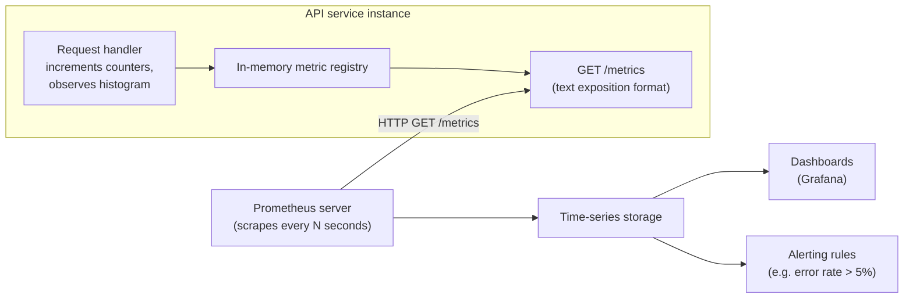
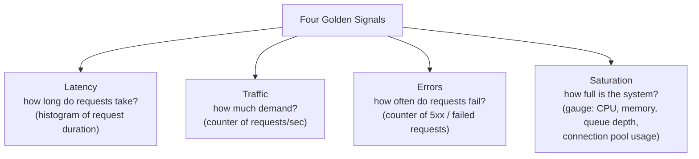

# Metrics

## Why This Matters

Logs are great for answering "what exactly happened to this one request?" — but they're a terrible tool for answering "is my API healthy right now, across all ten thousand requests it served in the last minute?" You would not want to grep ten thousand JSON log lines every time you wanted to know your p99 latency or your current error rate. That's the gap metrics fill: a way to track the aggregate, numerical shape of your system's behavior — cheaply, continuously, and in a form built for dashboards and alerts rather than storytelling. Every production API needs both logs and metrics, for different jobs. This chapter covers what metrics are, the handful of types that cover nearly every use case, and the four categories of signal ("the four golden signals") that tell you, at a glance, whether a service is healthy.

## Core Concept

A **metric** is a numerical measurement of your system, recorded over time, usually with **labels** (also called tags or dimensions) that let you slice it — by endpoint, status code, region, and so on. Unlike a log line, a single metric data point carries almost no context by itself; its value comes from being one point in a time series you can aggregate, graph, and alert on.

There are three metric types that cover almost every practical need:

- **Counter** — a number that only ever goes up (or resets to zero on restart), used for counting occurrences of something: total requests served, total errors, total orders created. You never decrement a counter; if you need something that goes up and down, you want a gauge instead. Rate of change over time (e.g., "requests per second") is derived from a counter by comparing values across a time window.
- **Gauge** — a number that can go up or down, representing a current state: number of active database connections, current queue depth, memory usage in bytes, number of logged-in users right now. A gauge answers "what is the value *right now*," a counter answers "how many times has this happened, ever."
- **Histogram** (and its cousin, the **summary**) — a distribution of observed values bucketed into ranges, most commonly used for request duration. Rather than storing every individual latency value, a histogram counts how many observations fell into buckets like "0–10ms," "10–50ms," "50–100ms," and so on, which lets you later compute percentiles (P50, P95, P99) from the bucket counts. This is the metric type that makes tail-latency analysis possible at low storage cost — see latency-and-percentiles.md for exactly why percentiles matter more than averages.

Metrics are typically collected by a **time-series database** (Prometheus being the dominant open-source choice) that periodically **scrapes** each service for its current metric values, or has metrics **pushed** to it. Because each data point is just a number plus labels plus a timestamp, metrics are extremely cheap to store and query compared to full log lines — which is exactly why they're the right tool for continuous, high-cardinality-in-time (but low-cardinality-in-content) monitoring, while logs remain the right tool for rich, per-event detail.

## Mental Model

If logs are a flight recorder capturing exact events, metrics are the dashboard gauges in the cockpit: airspeed, altitude, fuel level, engine temperature. A pilot doesn't read the flight recorder transcript mid-flight to know if something's wrong — they glance at a small number of gauges that summarize the aircraft's state at a glance, and an alarm sounds if one crosses a dangerous threshold. That's the entire purpose of metrics: cheap, continuous, aggregate signals designed to be watched constantly and alerted on automatically, in exchange for giving up the rich per-event detail that logs provide. You reach for the flight recorder (logs) only after a gauge (metric) tells you something is wrong and you need to know exactly why.

## How It Works

Inside your application, a metrics client library (like `prometheus_client` in Python) keeps counters and histograms in memory, incrementing them as code executes — a counter ticks up once per request, a histogram records one observation per request duration. Your service then exposes an HTTP endpoint, conventionally `/metrics`, that renders the current state of every registered metric as plain text in a well-defined exposition format. A separate system — the Prometheus server, or a managed equivalent — is configured to periodically (e.g., every 15 seconds) send an HTTP GET to that `/metrics` endpoint on every instance of your service and store the resulting numbers as time-series data, tagged with labels including which instance produced them.

This "pull" model (the monitoring system scrapes you, rather than you pushing data out) has an important implication: your application's job is only to track counts and observations in memory and answer a scrape request quickly — it never needs to know where the data ultimately ends up, and a temporarily unreachable metrics backend doesn't block or slow down your actual request-handling code the way a poorly designed logging integration might.

## Architecture



The **four golden signals** (a framework popularized by Google's SRE practice) give you a checklist for what metrics to track on any service, regardless of what it does:



Latency should always be tracked with a histogram, not an average — the same tail-latency argument from Part 7 applies directly here (see latency-and-percentiles.md). Traffic and errors are naturally counters, since you care about rates over time. Saturation is naturally a gauge, since it describes current capacity usage, and it's the leading indicator that predicts the other three signals degrading soon — a connection pool at 95% utilization is a warning that latency and errors are about to spike, even if they haven't yet.

## Request / Response Example

A scrape of a `/metrics` endpoint (Prometheus text exposition format) for a small API might look like this:

```text
# HELP http_requests_total Total number of HTTP requests
# TYPE http_requests_total counter
http_requests_total{method="POST",path="/orders",status="201"} 8421
http_requests_total{method="POST",path="/orders",status="502"} 37

# HELP http_request_duration_seconds Request duration in seconds
# TYPE http_request_duration_seconds histogram
http_request_duration_seconds_bucket{path="/orders",le="0.1"} 7900
http_request_duration_seconds_bucket{path="/orders",le="0.5"} 8390
http_request_duration_seconds_bucket{path="/orders",le="1.0"} 8440
http_request_duration_seconds_bucket{path="/orders",le="+Inf"} 8458
http_request_duration_seconds_sum{path="/orders"} 612.4
http_request_duration_seconds_count{path="/orders"} 8458

# HELP db_connection_pool_in_use Current database connections in use
# TYPE db_connection_pool_in_use gauge
db_connection_pool_in_use{pool="primary"} 18
```

From this one snapshot, a monitoring system can compute error rate (`37 / (8421 + 37)`), approximate P99 latency (interpolating from the bucket boundaries), and saturation (`18` connections in use, compared against pool size) — all without reading a single log line.

## Code Example

```python
from fastapi import FastAPI, Response
from prometheus_client import Counter, Histogram, Gauge, generate_latest, CONTENT_TYPE_LATEST
import time

app = FastAPI()

# Counters: labeled by method/path/status so we can slice by dimension later.
REQUEST_COUNT = Counter(
    "http_requests_total", "Total HTTP requests",
    ["method", "path", "status"],
)

# Histogram: buckets chosen to resolve typical API latency ranges well.
# Poor bucket choices (too coarse) silently destroy your ability to see
# tail latency — see latency-and-percentiles.md.
REQUEST_DURATION = Histogram(
    "http_request_duration_seconds", "Request duration in seconds",
    ["path"],
    buckets=[0.01, 0.05, 0.1, 0.25, 0.5, 1.0, 2.5, 5.0],
)

# Gauge: current in-flight requests, a simple saturation indicator.
IN_FLIGHT = Gauge("http_requests_in_flight", "Requests currently being handled")


@app.middleware("http")
async def metrics_middleware(request, call_next):
    IN_FLIGHT.inc()
    start = time.perf_counter()
    try:
        response = await call_next(request)
    except Exception:
        # Even on an unhandled exception, we must record the request as an
        # error and release the in-flight gauge — otherwise saturation
        # metrics silently drift upward forever after every crash.
        REQUEST_COUNT.labels(request.method, request.url.path, "500").inc()
        raise
    else:
        duration = time.perf_counter() - start
        REQUEST_DURATION.labels(request.url.path).observe(duration)
        REQUEST_COUNT.labels(
            request.method, request.url.path, str(response.status_code)
        ).inc()
        return response
    finally:
        IN_FLIGHT.dec()


@app.get("/metrics")
def metrics():
    # This endpoint is what Prometheus scrapes on a schedule (e.g. every 15s).
    return Response(generate_latest(), media_type=CONTENT_TYPE_LATEST)
```

## Production Considerations

- **Label cardinality is the single biggest operational risk with metrics.** Every unique combination of label values creates a new time series. Labeling a metric with something unbounded — a raw user ID, a full URL with query string, a UUID — can create millions of time series and take down your metrics backend. Use bounded labels (route templates like `/orders/{id}`, not the literal path with the ID substituted in).
- **Metrics are cheap precisely because they discard detail.** A histogram tells you "8,458 requests, P99 around 1 second" but not which specific request was slow or why — for that you still need logs or a trace, which is why metrics, logs, and tracing are complementary, not substitutes for each other.
- **Alert on symptoms (the golden signals), not on causes.** Alert on "error rate > 5% for 5 minutes," not on "CPU usage on host X is high" — the former tells you users are affected; the latter might be a Tuesday.
- **Scrape interval is a trade-off.** Shorter intervals give finer-grained data but cost more storage and scrape load; 15–30 seconds is a common default for request-level services.
- **Saturation metrics are leading indicators.** Watching connection pool usage, queue depth, or memory headroom often gives you warning before latency and error metrics degrade — worth alerting on proactively rather than only reactively.

## Common Mistakes

- **Tracking only averages for latency**, which hides exactly the tail-latency problems that matter most to real users — see latency-and-percentiles.md for the full argument on why P95/P99 tell the truth that averages hide.
- **Using unbounded label values** (raw user IDs, session tokens, full request paths) that blow up cardinality and can crash or bankrupt your metrics backend.
- **Confusing counters and gauges** — using a counter for something that should decrease (like queue depth) makes the metric meaningless, since counters are only ever supposed to increase.
- **Alerting on raw metric values instead of rates or ratios** — "500 errors happened" is meaningless without knowing it's 500 out of 10 requests versus 500 out of 10 million.
- **Treating metrics as a replacement for logs and traces**, then being unable to answer "why" once a metric shows a problem — the three pillars are complementary, and a full incident investigation typically needs all of them (see debugging-production-apis.md).

## Best Practices

- Instrument the four golden signals on every service by default: request rate, error rate, latency histogram, and at least one saturation gauge relevant to that service.
- Always use histograms (not averages) for latency, and always report percentiles derived from them, not just the mean.
- Keep label sets bounded and known in advance; never label with anything a user or attacker controls directly.
- Name metrics consistently (`<subsystem>_<what>_<unit>`, e.g., `http_request_duration_seconds`) so dashboards and alerts remain predictable as your service count grows.
- Pair metrics with logs and traces rather than relying on any single pillar — metrics tell you *that* something's wrong and roughly *how much*; logs and traces tell you *why*.

## AI Engineering Perspective

AI systems need metrics tracked for dimensions that don't exist in a typical CRUD API: tokens consumed (input and output, as counters), cost per request (derived from token counts, often tracked as a counter in cents/dollars), time-to-first-token for streaming responses (a histogram distinct from total request duration), and provider/model-labeled error rates so you can see if one upstream LLM provider is degrading independently of your own service. Saturation for an AI gateway often means "how close am I to my token-per-minute rate limit with this provider," a gauge with no real analogue in traditional API saturation. The dedicated chapter for this — cost tracking, token rate limits, and provider-specific dashboards — is ai-observability.md, and it builds directly on the counter/gauge/histogram vocabulary introduced here.

## Exercises

**Beginner**
1. For a `/login` endpoint, list one counter, one gauge, and one histogram you would want to track, and explain what question each answers.
2. Explain in your own words why an average latency of 80ms can still mean 1% of users are waiting 4 seconds.

**Intermediate**
3. Extend the FastAPI example to add a counter for failed login attempts labeled by failure reason (`invalid_password`, `account_locked`, `rate_limited`), while keeping label cardinality bounded.

**Advanced**
4. Design an alerting policy using only the four golden signals for a payment API: specify the exact metric, threshold, and time window for each of latency, traffic, errors, and saturation, and justify why each threshold was chosen.

## Key Takeaways

- Metrics are cheap, aggregate, continuously-collected numbers — the right tool for "is the system healthy right now," while logs answer "what exactly happened to this one request."
- Counters only increase (rates and totals), gauges move up and down (current state), and histograms capture distributions (essential for latency).
- The four golden signals — latency, traffic, errors, saturation — form a minimum viable health checklist for any service.
- Label cardinality is the most common way metrics systems break in production; keep labels bounded.
- Metrics, logs, and distributed tracing are complementary pillars, not substitutes — see distributed-tracing.md for the third pillar.

Continue to [Distributed Tracing](distributed-tracing.md), or return to the [Part 12 overview](README.md).
