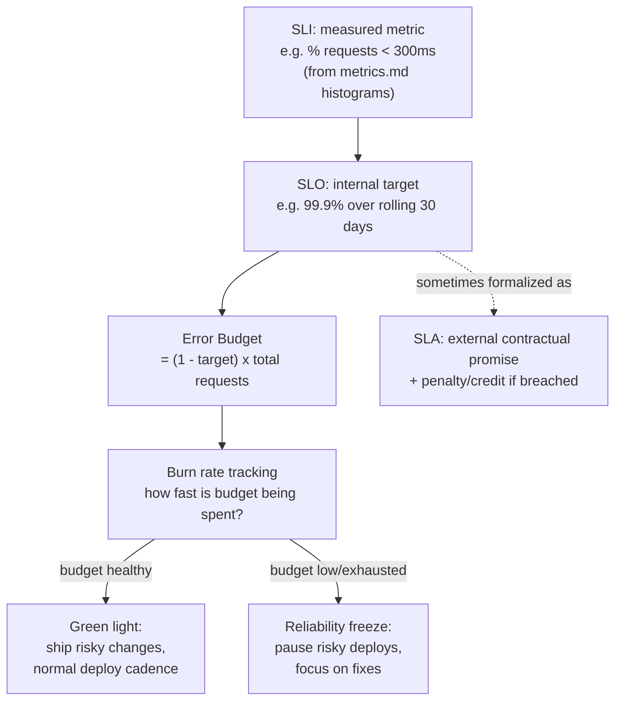

# SLI, SLO, SLA

## Why This Matters

"Make the API more reliable" is not an engineering decision — it's a wish. Reliability work costs real engineering time, and time spent chasing five nines of uptime is time not spent shipping features. Every team eventually needs a precise, shared answer to two questions: *how reliable is our system, actually?* and *how reliable does it need to be?* Without precise answers, reliability conversations turn into arguments based on gut feeling — one engineer thinks a risky deploy is fine, another thinks it's reckless, and there's no shared standard to settle it. SLIs, SLOs, and SLAs are the vocabulary that turns "be more reliable" into a measurable, negotiable, engineering-driven target. This chapter builds that vocabulary precisely, and shows how it's meant to actively drive day-to-day engineering decisions — not sit in a document nobody reads.

## Core Concept

These three terms are related but distinct, and mixing them up is extremely common:

- **SLI (Service Level Indicator)** — a specific, measured metric that reflects some aspect of your service's behavior. Examples: "the percentage of requests that return within 300ms," "the percentage of requests that return a non-5xx status code," "the percentage of messages processed within 60 seconds of being published." An SLI is a number you can actually observe from your metrics.
- **SLO (Service Level Objective)** — a target value or range for an SLI, over a defined time window, that you're committing to internally as an engineering goal. Example: "99.9% of requests will return within 300ms, measured over a rolling 30-day window." An SLO is a goal your team owns and is accountable for meeting.
- **SLA (Service Level Agreement)** — a contractual promise, usually to an external customer, about your SLO, typically with a stated consequence (a service credit, a refund, a penalty) if it's not met. Example: "we guarantee 99.9% uptime per month, or you receive a 10% service credit for that month."

The relationship is a chain of increasing formality and stakes: you *measure* an SLI, you *target* an SLO based on it, and you sometimes *promise* that SLO to a customer as an SLA. Critically, your internal SLO should almost always be stricter than your external SLA — if your SLA promises 99.9% and your internal SLO target is also exactly 99.9%, you have zero margin between "we're meeting our own goal" and "we're in breach of contract with a customer," which is an uncomfortable place to operate from.

The number "99.9%" (or any target below 100%) implies something important: you are explicitly choosing to tolerate some amount of failure. That tolerated amount, expressed as a budget you can spend, is the **error budget** — and it's the mechanism that makes SLOs actually useful for engineering decisions, not just a number on a dashboard.

## Mental Model

Think of an error budget like a bank account you're allowed to draw down over a month. If your SLO is "99.9% of requests succeed, measured over 30 days," that 0.1% of allowed failure is your account balance — a fixed amount of "unreliability" you're permitted to spend before you've broken your promise. Every failed request, every minute of downtime, every risky deploy that causes a blip — these are withdrawals from that account. As long as the balance stays positive, you're free to spend it on things that carry reliability risk in exchange for velocity: shipping a bigger feature faster, trying a risky migration, deploying on a Friday. The moment the balance hits zero, the spending stops — no risky changes, focus shifts entirely to reliability work, until the budget resets at the start of the next window. This reframes reliability from an abstract virtue into a concrete, spendable resource that both engineering and product management can reason about using the same number.

## How It Works

Turning this into an operating mechanism requires a few concrete pieces:

1. **Choose SLIs that reflect user-perceived experience**, not internal implementation details. "CPU usage is below 80%" is not a good SLI — users don't experience CPU usage, they experience slow or failed requests. Good SLIs are typically ratios: `good events / total events` (e.g., requests under 300ms divided by all requests) over a window.
2. **Set the SLO target based on what users actually need**, not on what feels impressive. A background batch-reporting API might be fine at 99% availability; a real-time payment authorization API might need 99.95%. Higher targets cost disproportionately more engineering effort — the difference between 99.9% and 99.99% ("three nines" to "four nines") often means an order of magnitude more investment in redundancy, testing, and operational rigor, for one additional "nine" of reliability.
3. **Compute the error budget** as `1 - SLO target`, applied to your traffic volume over the SLO's time window. At 99.9% over 30 days with, say, 10 million requests, your error budget is 10,000 "failed" request-equivalents (or, phrased as downtime, roughly 43 minutes of full outage-equivalent).
4. **Track budget consumption continuously**, typically via a dashboard showing budget remaining as a percentage, alongside a burn rate — how fast you're consuming it relative to the time remaining in the window.
5. **Define, in advance, what happens when the budget is low or exhausted** — this is the step teams most often skip, and skipping it is exactly what makes an SLO decorative rather than operational. A real error budget policy might state: "when error budget drops below 20% with more than a week left in the window, all non-essential deploys pause and the team's priority shifts to reliability fixes until the budget recovers."

This is the mechanism referenced in this chapter's title: SLOs don't just describe reliability after the fact, they actively gate decisions like "can we ship this risky change this week" — a team with a healthy budget can take on risk; a team that has already burned its budget cannot, regardless of how good the feature is.

## Architecture



The arrow from SLO to SLA is intentionally dashed and one-directional: not every SLO becomes a customer-facing SLA, but every SLA should be backed by an internal SLO with tighter margin — never the other way around.

## Request / Response Example

An internal SLO dashboard's API might expose the current state of a service's error budget as a JSON payload, computed from the underlying SLI (itself built from the histogram and counter metrics covered in metrics.md):

```http
GET /internal/slo/orders-api/availability HTTP/1.1
Host: observability.internal
```

```http
HTTP/1.1 200 OK
Content-Type: application/json

{
  "service": "orders-api",
  "sli": "successful_requests / total_requests",
  "slo_target": 0.999,
  "window_days": 30,
  "current_sli_value": 0.9987,
  "error_budget_total": 10000,
  "error_budget_consumed": 6100,
  "error_budget_remaining_pct": 39.0,
  "burn_rate_last_24h": "2.3x expected",
  "status": "at_risk"
}
```

A `burn_rate` above `1x` means the budget is being consumed faster than a linear pace would allow across the remaining window — this is the number that typically triggers an automated alert or a deploy freeze policy, well before the budget hits zero.

## Code Example

A simplified error budget calculator, built directly on top of the counter metrics from metrics.md — showing how an SLI is derived from raw counts, and how burn rate is computed:

```python
from dataclasses import dataclass
from datetime import datetime, timedelta


@dataclass
class SloConfig:
    name: str
    target: float          # e.g. 0.999 for "99.9%"
    window_days: int


def compute_error_budget(config: SloConfig, total_requests: int) -> dict:
    """
    Given an SLO target and total request volume in the window,
    compute the total error budget in "allowed bad requests".
    """
    allowed_bad_fraction = 1 - config.target
    error_budget_total = int(total_requests * allowed_bad_fraction)
    return {"error_budget_total": error_budget_total}


def compute_sli(good_requests: int, total_requests: int) -> float:
    # Guard against divide-by-zero during low-traffic windows (e.g. a new
    # service, or a quiet overnight period) rather than raising or
    # reporting a misleading 100%/0%.
    if total_requests == 0:
        return 1.0
    return good_requests / total_requests


def burn_rate(
    error_budget_total: int,
    error_budget_consumed: int,
    window_days: int,
    days_elapsed: float,
) -> float:
    """
    Burn rate of 1.0 means budget is being consumed exactly on pace to
    exhaust right at the end of the window. Above 1.0 means it will run
    out early; below 1.0 means it's on track to have budget left over.
    """
    expected_consumed_fraction = days_elapsed / window_days
    expected_consumed = error_budget_total * expected_consumed_fraction
    if expected_consumed == 0:
        return 0.0
    return error_budget_consumed / expected_consumed


def should_freeze_risky_deploys(remaining_pct: float, burn_rate_value: float) -> bool:
    # A concrete, codified error budget policy — this is the piece that
    # makes the SLO operational rather than decorative. Tune thresholds
    # to your own risk tolerance.
    return remaining_pct < 20.0 or burn_rate_value > 3.0


# --- example usage ---
config = SloConfig(name="orders-api-availability", target=0.999, window_days=30)
budget = compute_error_budget(config, total_requests=10_000_000)
sli_value = compute_sli(good_requests=9_987_000, total_requests=10_000_000)
consumed = budget["error_budget_total"] - int((1 - sli_value) * 10_000_000 * -1)  # illustrative
rate = burn_rate(budget["error_budget_total"], 6100, config.window_days, days_elapsed=18)

print(f"SLI: {sli_value:.4%}, burn rate: {rate:.2f}x")
print(f"Freeze risky deploys? {should_freeze_risky_deploys(39.0, rate)}")
```

## Production Considerations

- **SLOs must be reviewed and revised, not set once and forgotten.** A target that made sense at launch may be unrealistically strict or too lax once real traffic patterns and dependencies are understood — revisit SLOs on a regular cadence (quarterly is common).
- **The error budget policy needs organizational buy-in, not just an engineering dashboard.** If a low error budget doesn't actually pause risky launches because product leadership overrides it every time, the SLO has no teeth — the policy has to be agreed upon and honored before the first time it's tested under pressure.
- **Multiple SLOs commonly apply to one service** — availability, latency, and correctness are often tracked as separate SLOs with separate budgets, because a service can be "up" and fast while still returning wrong data.
- **SLAs carry legal and financial weight**, so the SLO backing an SLA needs meaningfully more margin than the promised number, to absorb normal operational variance without breaching a contract.
- **Multi-service dependencies compound.** If your service depends on three others each targeting 99.9%, your own achievable SLO is mathematically capped below 99.9% unless you build in redundancy or graceful degradation for those dependencies — see Part 6's material on graceful degradation and circuit breakers.

## Common Mistakes

- **Confusing an SLI, SLO, and SLA**, e.g., calling a monitored metric an "SLA" — an SLA specifically implies a contractual promise with consequences, which most internal metrics are not.
- **Setting an SLO with no error budget policy behind it**, so it's just a number on a dashboard nobody acts on — this is explicitly called out because it's the single most common way SLO programs fail: measurement without consequence changes nothing.
- **Targeting 100% reliability**, which is not just expensive but actively harmful — a team with zero tolerated failure has zero room to deploy anything, ever, since every deploy carries nonzero risk.
- **Choosing SLIs that don't reflect real user experience** — e.g., server-side "request completed" instead of end-to-end client-perceived success, which can miss failures happening between the client and your edge.
- **Setting the internal SLO equal to the external SLA** rather than strictly tighter, leaving no safety margin between "we're meeting our internal goal" and "we're in breach of a customer contract."

## Best Practices

- Define SLIs as ratios of good events to total events, measured from data you already collect via metrics.md's counters and histograms.
- Set SLO targets based on actual user needs and business context, not round numbers chosen for how they sound.
- Always define an explicit error budget policy alongside the SLO — what specifically happens, and who is responsible for enforcing it, when budget runs low.
- Keep internal SLOs stricter than any externally promised SLA, to preserve a safety margin.
- Revisit SLOs periodically as traffic, architecture, and dependencies change; an SLO set once at launch rarely remains the right target forever.

## AI Engineering Perspective

SLOs for AI-backed features need SLIs that go beyond "did the request return 200 OK," because a technically successful LLM call can still be a bad outcome — slow, wrong, or low quality. Teams running production AI systems often define separate SLOs for availability (did the gateway respond at all), latency (including time-to-first-token for streaming, not just total duration), and increasingly, quality (did the output pass an automated evaluation check), acknowledging that the third dimension has no clean equivalent in traditional API SLOs. Error budgets for AI systems also have to account for upstream provider reliability that you don't control — if your LLM provider itself has an outage, your own SLO is directly capped by theirs, which is exactly why multi-provider fallback architecture (covered in Part 15) is often justified as an SLO-protection mechanism, not just a cost-optimization one. The full treatment of tracking these AI-specific signals lives in ai-observability.md.

## Exercises

**Beginner**
1. Write one SLI, one SLO, and one SLA for a public weather API, and explain in your own words why each is a distinct concept rather than three names for the same thing.
2. If a service has an SLO of 99.95% availability over 30 days and serves 5,000,000 requests in that window, how many "bad" requests does its error budget allow?

**Intermediate**
3. Design an error budget policy (concrete thresholds and concrete actions) for a service with a 99.9% monthly availability SLO, specifying what happens at 50% budget remaining, 20% remaining, and 0% remaining.

**Advanced**
4. A service depends synchronously on three downstream services, each with an independent 99.9% availability SLO. Assuming failures are independent, calculate the mathematical ceiling on this service's own achievable availability, and propose two architectural changes (referencing Part 6 concepts) that could raise that ceiling without improving any individual downstream service's own SLO.

## Key Takeaways

- SLI is a measured metric, SLO is your internal target for that metric, and SLA is a contractual promise (often based on a stricter internal SLO) with consequences if broken — these are three distinct concepts, not synonyms.
- An error budget converts an SLO into a spendable resource: the tolerated amount of failure within a time window, which you can consciously trade for engineering velocity.
- An SLO without an explicit, enforced error budget policy is decorative — the policy is what actually drives decisions like pausing risky deploys.
- Good SLIs reflect real user-perceived experience, expressed as ratios of good events to total events, typically built from the same counters and histograms covered in metrics.md.
- SLOs should be revisited periodically and kept stricter than any externally facing SLA, preserving margin for normal operational variance.

Return to the [Part 12 overview](README.md). See also [Latency and P95/P99](../07-caching-performance/latency-and-percentiles.md) for the percentile concepts that typically underlie latency SLIs, and [AI Observability](../15-production-ai-systems/ai-observability.md) for how these ideas extend to AI-backed features.
