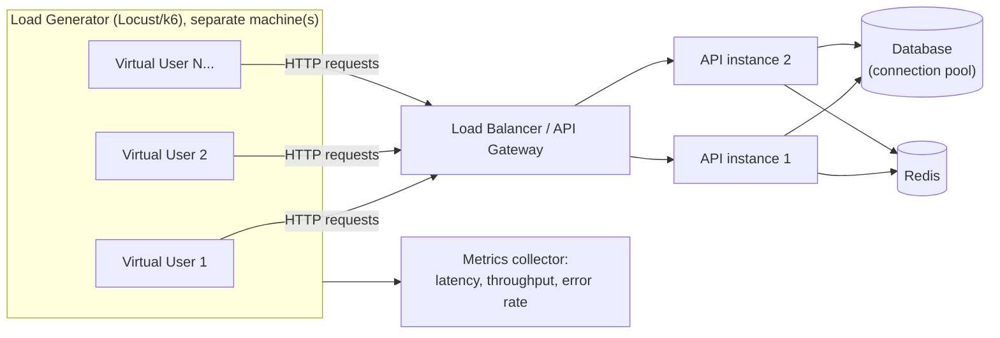
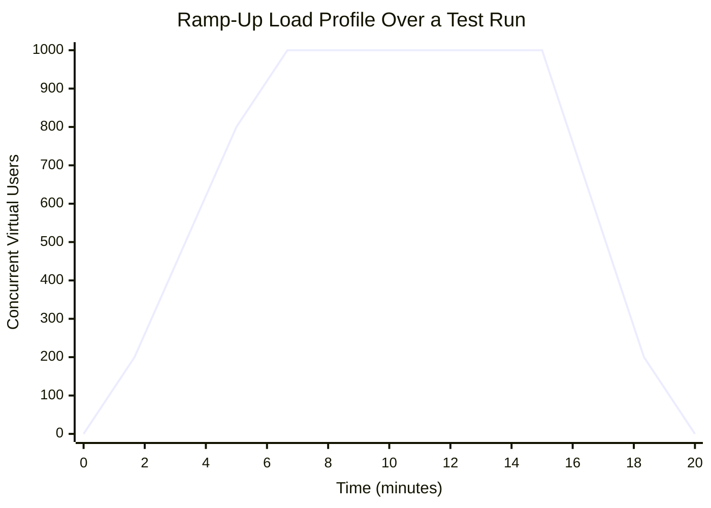

# Load Testing

## Why This Matters

`unit-testing.md` and `integration-testing.md` answer "does my API produce the correct response?" Load testing answers a completely different, equally critical question: "does my API still produce that correct response — quickly enough, and reliably enough — when a thousand users hit it at once?" A functionally perfect endpoint that takes 30 seconds to respond under real traffic, or starts returning 500s once your connection pool is exhausted, is not a working API in any practical sense. Correctness testing and performance testing are orthogonal concerns, and skipping the second one is how teams discover their database connection pool size or their synchronous blocking call (see [Sync vs Async](../08-async-systems/README.md)) the hard way — during a marketing launch or a traffic spike, in production, with real users watching a spinner.

## Core Concept

**Load testing** is the practice of generating traffic against a system to measure how it behaves under a defined level of concurrent usage — typically your expected normal load and your expected peak load — and recording what happens to latency, throughput, and error rate as that load is applied. It answers questions like: "at 500 requests per second, is our P99 latency still under 300ms?" and "does our error rate stay at zero, or does it start climbing?"

Load testing is one member of a small family of related but distinct techniques:

- **Load testing** — realistic expected/peak traffic, checking the system meets its performance targets under conditions it's actually designed for.
- **Stress testing** (`stress-testing.md`, planned) — deliberately exceeding expected capacity to find the breaking point and observe *how* the system fails.
- **Chaos testing** (`chaos-testing-basics.md`, planned) — injecting failures (killed processes, network partitions) rather than just traffic, to test resilience.

This chapter focuses specifically on load testing: traffic at or near real-world levels, used to validate capacity and catch performance regressions before they reach production.

## Mental Model

Think of load testing like a fire-code occupancy test for a building. You don't wait for an actual fire (that's closer to chaos testing) to find out whether the exits are wide enough — you simulate the expected crowd (a concert's worth of people) moving through the doors and measure how long it takes everyone to get out, whether any doorway becomes a bottleneck, and whether the building can comfortably hold its rated capacity without anyone getting crushed at a chokepoint. Load testing does the same thing for your API: it simulates the expected "crowd" of concurrent users and measures whether every "doorway" — your web server's worker pool, your database's connection pool, a downstream API's rate limit — can handle that crowd without becoming a bottleneck.

## How It Works

A load test tool works by simulating many virtual users (VUs) concurrently sending requests to your system, following a defined pattern over time, and then recording every response's outcome. The mechanics generally follow this shape:

1. **Define a scenario** — the sequence of requests a "typical user" makes (e.g., log in, browse products, add to cart, check out), often including realistic think-time between steps rather than firing requests as fast as possible.
2. **Define a load profile** — how many virtual users are active, and how that number changes over the test's duration. A common shape is a **ramp-up**: start at zero, gradually increase concurrent users to a target level, hold steady ("soak"), then ramp down — rather than slamming the target load instantly, which tests a scenario ("instant spike") that's often less representative than gradual real-world growth.
3. **Run distributed load generation.** For meaningful load, the traffic generator itself usually needs to run on separate machines from the system under test — otherwise you're measuring the load generator's own CPU/network limits, not your API's.
4. **Collect metrics per request and in aggregate**: response time (and its percentile distribution, not just the average — see [Latency and P95/P99](../07-caching-performance/latency-and-percentiles.md)), throughput (requests/second successfully completed), and error rate.
5. **Compare results against a target (SLO)** — e.g., "P95 latency under 400ms and error rate under 0.1% at 1,000 requests/second" — and treat any load test that violates the target as a failure, the same way a functional test failure blocks a merge.

Two tools are worth knowing conceptually, even without deep-diving into either's syntax here: **Locust** (Python-based, define user behavior as Python classes/methods, good fit if your team already writes Python) and **k6** (JavaScript-based, scriptable, strong CLI and CI integration, popular for infrastructure-as-code-style load test definitions). Both generate configurable concurrent virtual users against real HTTP endpoints and report the same core metrics described above.

## Architecture





The ramp diagram matters as much as the target-load number itself: a system can survive an instantly-applied 1,000-VU spike differently than a load that ramps there over five minutes — connection pools warm up, caches populate, autoscalers react — so testing only the instant-spike case can hide real gradual-load behavior, and vice versa.

## Request / Response Example

A load test doesn't verify a single request/response pair the way a unit or integration test does — it verifies the *aggregate* behavior of many repetitions of that pair. It's still useful to define the exact request being repeated, since a load test scenario is built from real HTTP calls:

```http
GET /products?category=electronics&page=1 HTTP/1.1
Host: api.example.com
Authorization: Bearer <token>
```

```http
HTTP/1.1 200 OK
Content-Type: application/json

{ "items": [ /* ... */ ], "page": 1, "total_pages": 42 }
```

A Locust scenario expresses this same request, repeated by many concurrent simulated users with think-time between calls:

```python
from locust import HttpUser, task, between

class CatalogBrowsingUser(HttpUser):
    # Simulated think-time between requests, so the test mimics real
    # user pacing instead of firing requests as fast as physically possible.
    wait_time = between(1, 3)

    @task(3)  # weighted: this task runs 3x more often than the one below
    def browse_products(self):
        self.client.get("/products?category=electronics&page=1", name="/products")

    @task(1)
    def view_product_detail(self):
        self.client.get("/products/42", name="/products/[id]")
```

Running `locust -f locustfile.py --headless -u 500 -r 20 --run-time 10m --host https://staging.example.com` simulates ramping up to 500 concurrent users at a rate of 20 new users/second, sustained for 10 minutes, against a staging environment — never production.

## Code Example

Load testing itself isn't pytest code, but a pytest-based *smoke assertion* that a specific endpoint meets a latency budget under a light concurrent load is a useful complement — a fast, CI-friendly early warning before a full Locust/k6 run:

```python
# test_latency_budget.py — a lightweight, CI-friendly latency smoke test,
# NOT a substitute for a real load test with hundreds/thousands of VUs.
import asyncio
import time
import statistics
import httpx
import pytest


BASE_URL = "https://staging.example.com"  # never point this at production


async def _timed_request(client: httpx.AsyncClient, path: str) -> float:
    start = time.perf_counter()
    response = await client.get(path)
    elapsed = time.perf_counter() - start
    assert response.status_code == 200
    return elapsed


@pytest.mark.asyncio
async def test_products_endpoint_meets_latency_budget_under_light_concurrency():
    concurrency = 50  # a light concurrent burst, not a full load test
    async with httpx.AsyncClient(base_url=BASE_URL, timeout=5.0) as client:
        results = await asyncio.gather(
            *[_timed_request(client, "/products?category=electronics") for _ in range(concurrency)]
        )

    results.sort()
    p50 = results[int(len(results) * 0.50)]
    p95 = results[int(len(results) * 0.95)]

    # Assert against an agreed SLO, e.g. from an SLI/SLO doc (see Part 12).
    assert p50 < 0.2, f"P50 latency {p50:.3f}s exceeded 200ms budget"
    assert p95 < 0.5, f"P95 latency {p95:.3f}s exceeded 500ms budget"
```

This kind of test is not a replacement for a dedicated Locust/k6 run against a staging environment at realistic scale — it's a cheap tripwire that can run in CI on every pull request to catch an obvious regression (e.g., an accidentally added N+1 query) before it ever reaches a scheduled full load test.

## Production Considerations

- **Never load test against production** unless it's a deliberately planned, communicated, rate-limited exercise (some mature teams do controlled production load tests, but only with safeguards, off-peak timing, and stakeholder sign-off). By default, load test against a staging or dedicated performance environment that mirrors production's topology and capacity as closely as possible.
- **Watch throughput, latency percentiles, and error rate together, not any single metric alone.** A system can maintain high throughput while P99 latency silently balloons, or maintain good latency while quietly shedding a growing percentage of requests as errors — either alone is a false sense of security.
- **The load generator must not be the bottleneck.** If your load-testing tool is running on an underpowered machine, you'll measure the generator's CPU/network ceiling, not your API's. Distribute load generation across multiple machines for high target throughput.
- **Realistic scenarios matter more than raw request volume.** Hammering a single cached `GET /health` endpoint at huge RPS tells you little about real user behavior; model actual user journeys with realistic think-time and endpoint mix.
- **Connection pool sizes (API-to-database, per [Connection Pooling](../04-databases-and-apis/README.md)) are frequently the first thing to saturate** — a load test that reveals climbing latency at a specific concurrency threshold is often really revealing a fixed pool size, not a raw CPU limit.

## Common Mistakes

- **Load testing against production without authorization**, causing a self-inflicted outage — this is one of the more common and embarrassing production incidents caused by testing itself.
- **Only looking at average latency**, missing that P99 has degraded badly under load while the average still looks acceptable (see [Latency and P95/P99](../07-caching-performance/latency-and-percentiles.md) for why the tail matters).
- **Applying load instantly instead of ramping up**, which can trigger unrealistic cold-start effects (empty caches, cold autoscaler) that don't represent how real traffic actually grows, and can mask or exaggerate genuine capacity limits.
- **Confusing load testing with stress testing** — running a fixed, "safe" load level and declaring the system healthy, without ever pushing past expected peak to find where it actually breaks (that's the specific job of `stress-testing.md`).
- **Not testing error rate under load** — a system that gets faster-looking on paper because it's silently returning cached error responses or timing out client-side before the server even responds is not actually healthy.
- **Ignoring downstream dependencies' capacity** — load testing your API while a third-party payment provider's sandbox has its own, much lower rate limit, causing failures that have nothing to do with your own system's capacity.

## Best Practices

- Define explicit performance SLOs before running the test (e.g., "P95 < 400ms and error rate < 0.1% at 1,000 RPS") so the test has a pass/fail criterion, not just a graph to eyeball.
- Model a realistic mix of endpoints and user behavior, including think-time, rather than a single endpoint hammered at maximum speed.
- Ramp load up gradually and hold at target ("soak") for long enough to see steady-state behavior, not just an instantaneous spike.
- Track throughput, P50/P95/P99 latency, and error rate together, and correlate spikes in any of them with backend metrics (CPU, connection pool usage, queue depth — see [Part 12 — Observability](../12-observability/README.md)).
- Run load tests regularly (e.g., before major releases, or on a schedule) against a staging environment, and treat a regression in the results the same way you'd treat a failing functional test in `cicd-testing-pipelines.md`.

## AI Engineering Perspective

Load testing an AI-backed endpoint has an extra dimension beyond a typical CRUD API: LLM calls (see [Part 14 — AI API Engineering](../14-ai-api-engineering/README.md)) are slow and expensive per request compared to a database query, so "peak concurrent load" for an AI gateway or RAG endpoint (see [Part 16](../16-rag-apis/README.md)) is often gated by the upstream provider's own rate limits (requests-per-minute and tokens-per-minute) long before your own infrastructure becomes the bottleneck. A load test against an AI endpoint should therefore either use a stubbed/mocked model backend to isolate *your* system's capacity (queueing, connection handling, database writes for conversation history) from the provider's, or explicitly budget for provider rate limits and cost when hitting the real API — running 1,000 concurrent virtual users against a live LLM endpoint can rack up a real, sometimes substantial, bill in minutes. Watch an AI-specific metric alongside the usual three: time-to-first-token for streaming responses, since that's often the number that actually determines perceived responsiveness for an AI product, even when total completion time is unavoidably long.

## Exercises

**Beginner**
1. Using the Locust example above, add a second `@task` that simulates a user submitting a search query via `POST /search`, and give it a lower weight than product browsing. Explain why weighting tasks matters for realism.
2. In your own words, explain the difference between throughput and latency, and describe a scenario where throughput stays flat while latency at P99 climbs sharply.

**Intermediate**
3. Design a load profile (ramp-up rate, target concurrent users, hold duration) for testing an API that expects 200 requests/second on a normal day and 5x that during a scheduled sale event. Justify the numbers you pick.

**Advanced**
4. Extend the pytest latency-smoke-test example to run against three different endpoints concurrently (mixed traffic, not just one), and add an assertion on error rate, not just latency. What would you need to add to safely make this test runnable in CI on every pull request without risking a real cost or capacity impact if it targets a real staging environment?

## Key Takeaways

- Load testing measures system behavior under expected/peak realistic traffic — distinct from stress testing (finding the breaking point) and chaos testing (injecting failures), both planned as later chapters in this part.
- Watch throughput, latency percentiles (especially P95/P99, not just the average), and error rate together — any one metric alone can hide a real problem.
- Model realistic user scenarios with think-time and a mix of endpoints, and ramp load up gradually rather than applying it instantly.
- Never load test against production without explicit, controlled authorization; use a dedicated staging/performance environment instead.
- For AI-backed endpoints, provider rate limits and per-call cost often become the binding constraint before your own infrastructure does — plan and budget load tests against LLM APIs accordingly.
</content>
