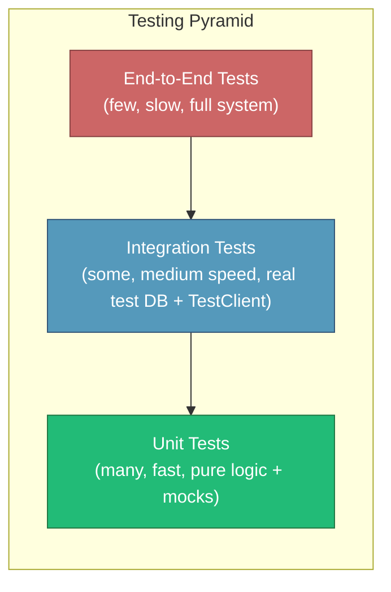
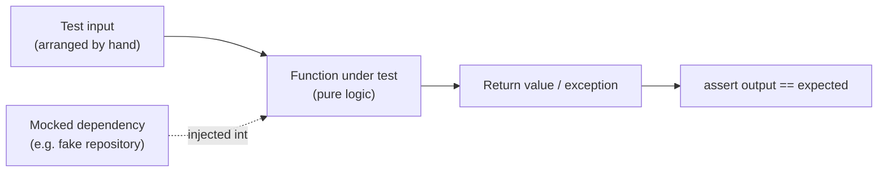

# Unit Testing

## Why This Matters

Every API you ship is, underneath the HTTP plumbing, a collection of plain functions: a function that calculates a discount, a function that validates an email format, a function that decides whether a JWT has expired, a function that computes pagination offsets. If those functions are wrong, it doesn't matter how well-designed your REST endpoints are (see [Part 2 — REST API Design](../02-rest-api-design/README.md)) or how solid your database layer is (see [Part 4 — Databases & APIs](../04-databases-and-apis/README.md)) — the API will return wrong answers. Unit tests are how you pin down the correctness of that logic in isolation, fast, before it ever touches a network socket, a database connection, or a real HTTP request. Get this layer wrong — skip it, or test the wrong things at this layer — and every test suite built on top of it (integration, end-to-end) becomes slower and more brittle than it needs to be, because you end up re-verifying business logic through a full HTTP stack every single time.

## Core Concept

A **unit test** verifies a single unit of behavior — typically one function, method, or small class — in complete isolation from its collaborators: no real database, no real network call, no real filesystem, no real clock (unless mocked). "Isolation" is the defining property, not "small size." A unit test should be:

- **Fast** — milliseconds, not seconds. A suite of a thousand unit tests should run in a few seconds.
- **Deterministic** — the same input always produces the same output, every run, on every machine.
- **Independent** — test order shouldn't matter; test A's outcome cannot affect test B.
- **Isolated from I/O** — no real database, no real HTTP call, no real disk write. Anything that talks to the outside world is either not a unit test, or the dependency is faked/mocked.

The "unit" under test is usually pure or near-pure business logic: pricing calculations, validation rules, state machines, data transformations, authorization decisions. It is emphatically *not* "does FastAPI correctly route a POST request" — that's the framework's job, already tested by the FastAPI/Starlette maintainers, and re-testing it wastes effort you should spend on your own logic.

## Mental Model

Think of your codebase as a factory with many small machines bolted together on an assembly line: one machine calculates tax, another formats an address, another checks whether a discount code is still valid. A unit test takes a single machine off the line, feeds it inputs by hand, and checks the output — without plugging in the rest of the factory. You don't need the conveyor belt (the database), the packaging robot (the HTTP layer), or the shipping dock (the external payment provider) running to know whether the tax-calculation machine adds 8% correctly. That comes later, when you test the whole line together (see [Integration Testing](integration-testing.md) and, eventually, `end-to-end-testing.md`).

This is why unit tests sit at the base of the **testing pyramid**: there should be many of them, they should be cheap to run, and they should catch the majority of logic bugs long before a slower, more expensive integration or end-to-end test ever runs.

## How It Works

Mechanically, a unit test in Python/pytest does three things, often summarized as **Arrange–Act–Assert**:

1. **Arrange** — construct the inputs and any test doubles (stand-ins for real dependencies) the function needs.
2. **Act** — call the function or method under test.
3. **Assert** — check that the output, the raised exception, or the resulting state matches expectations.

The key engineering decision is *what to isolate and how*. Dependencies fall into two categories:

- **Pure logic with no external dependency** — e.g., a function `calculate_discount(price, coupon)` that just does arithmetic. Test it directly with real inputs; no mocking needed.
- **Logic that depends on something external** — e.g., a function that checks a coupon against a database, or calls a payment gateway. Here you replace the real dependency with a **test double**: a `Mock`, `MagicMock`, or a hand-written fake object that mimics the interface but returns canned values instead of doing real I/O. pytest's `pytest-mock` plugin (a thin wrapper over the standard library's `unittest.mock`) is the common tool for this in a FastAPI codebase.

Mocking should target *your own abstraction boundary* — e.g., a `PaymentGateway` interface — not FastAPI's internals or the database driver's internals. If you find yourself mocking three layers deep into a third-party library, that's usually a sign the function under test is doing too much, or that this isn't really a unit-test-shaped problem anymore.

## Architecture





The pyramid shape is deliberate: unit tests should vastly outnumber integration tests, which should outnumber end-to-end tests, because each layer up costs more time to run and more effort to maintain, while catching a narrower, more system-level class of bugs.

## Request / Response Example

Unit tests don't usually exercise HTTP directly, but it's useful to see the contrast: here is the *business logic* that would sit behind an endpoint, tested in isolation, with the endpoint's HTTP contract shown alongside it for context only.

```http
POST /orders/apply-coupon HTTP/1.1
Content-Type: application/json

{ "subtotal_cents": 5000, "coupon_code": "SAVE10" }
```

```http
HTTP/1.1 200 OK
Content-Type: application/json

{ "subtotal_cents": 5000, "discount_cents": 500, "total_cents": 4500 }
```

```python
# The unit test never sends this HTTP request at all — it calls the
# underlying pricing function directly.
def test_apply_percentage_coupon_discounts_subtotal():
    result = apply_coupon(subtotal_cents=5000, coupon=Coupon(code="SAVE10", percent_off=10))
    assert result.discount_cents == 500
    assert result.total_cents == 4500
```

The endpoint's HTTP shape is verified separately, in `integration-testing.md`-style tests. The unit test only cares whether the discount math is correct.

## Code Example

```python
# pricing.py — pure-ish business logic, no FastAPI, no DB import here.
from dataclasses import dataclass


@dataclass
class Coupon:
    code: str
    percent_off: int  # 0-100
    active: bool = True


@dataclass
class PricingResult:
    subtotal_cents: int
    discount_cents: int
    total_cents: int


def apply_coupon(subtotal_cents: int, coupon: Coupon) -> PricingResult:
    if subtotal_cents < 0:
        raise ValueError("subtotal_cents cannot be negative")
    if not coupon.active:
        # Inactive coupons apply zero discount rather than erroring —
        # this is a deliberate business rule, and the test below locks it in.
        discount = 0
    else:
        discount = (subtotal_cents * coupon.percent_off) // 100
    return PricingResult(
        subtotal_cents=subtotal_cents,
        discount_cents=discount,
        total_cents=subtotal_cents - discount,
    )


# coupon_service.py — this one DOES depend on something external: a repository.
class CouponService:
    def __init__(self, repository):
        self._repository = repository  # injected, so it can be swapped in tests

    def price_order(self, subtotal_cents: int, coupon_code: str) -> PricingResult:
        coupon = self._repository.get_by_code(coupon_code)
        if coupon is None:
            raise LookupError(f"Unknown coupon: {coupon_code}")
        return apply_coupon(subtotal_cents, coupon)
```

```python
# test_pricing.py
import pytest
from pricing import apply_coupon, Coupon, PricingResult
from coupon_service import CouponService


# --- Pure logic: no mocking needed at all. ---

def test_apply_coupon_discounts_correctly():
    result = apply_coupon(5000, Coupon(code="SAVE10", percent_off=10))
    assert result == PricingResult(subtotal_cents=5000, discount_cents=500, total_cents=4500)


def test_apply_coupon_with_inactive_coupon_applies_no_discount():
    # Testing the error/edge path, not just the happy path.
    result = apply_coupon(5000, Coupon(code="SAVE10", percent_off=10, active=False))
    assert result.discount_cents == 0


def test_apply_coupon_rejects_negative_subtotal():
    with pytest.raises(ValueError):
        apply_coupon(-100, Coupon(code="X", percent_off=10))


# --- Depends on a repository: mock it out with pytest-mock's `mocker` fixture. ---

def test_coupon_service_prices_order_using_repository(mocker):
    fake_repo = mocker.Mock()
    fake_repo.get_by_code.return_value = Coupon(code="SAVE10", percent_off=10)

    service = CouponService(repository=fake_repo)
    result = service.price_order(subtotal_cents=2000, coupon_code="SAVE10")

    assert result.total_cents == 1800
    # Assert the collaborator was called correctly — but sparingly; over-asserting
    # on *how* a function calls its dependency turns into a brittle, implementation-detail test.
    fake_repo.get_by_code.assert_called_once_with("SAVE10")


def test_coupon_service_raises_for_unknown_coupon(mocker):
    fake_repo = mocker.Mock()
    fake_repo.get_by_code.return_value = None  # simulate "not found"

    service = CouponService(repository=fake_repo)
    with pytest.raises(LookupError):
        service.price_order(subtotal_cents=2000, coupon_code="DOES_NOT_EXIST")
```

Running `pytest -v test_pricing.py` executes all five tests in well under a second, with zero database, zero network, and zero FastAPI app instantiated.

## Production Considerations

- **Unit tests are the foundation your CI pipeline runs first** — they're cheap, so they should fail fast, before slower integration and end-to-end suites even start (see `cicd-testing-pipelines.md`).
- **Coverage numbers are a signal, not a target.** 100% line coverage with tests that only assert `result is not None` gives false confidence; a smaller, behavior-focused suite is more valuable.
- **Keep business logic separate from framework code** specifically so it *can* be unit tested without spinning up FastAPI. Extract logic out of route handlers into plain functions/services — this is a design decision that pays off directly in test speed (see [Part 3 — Building APIs](../03-building-apis/README.md) for project architecture guidance).
- **Mocks drift from reality.** A mock that returns `{"id": 1}` for a repository call keeps passing even if the real repository's return shape changes. Integration tests exist precisely to catch that drift — unit tests alone are not sufficient proof the system works end-to-end.

## Common Mistakes

- **Unit-testing the framework itself** — e.g., writing a test that just asserts FastAPI returns a 422 when a Pydantic field is missing. That's testing Pydantic/FastAPI's own behavior, already covered by their test suites; your time is better spent on your validation *rules*, not the mechanism that enforces them.
- **Testing implementation details instead of behavior** — asserting that a private helper method was called a specific number of times, rather than asserting the observable output is correct. This makes tests break on harmless refactors.
- **Over-mocking**, to the point where the test only proves the mocks were configured correctly, not that the real logic works — e.g., mocking so much of `price_order` that the test could pass even if `apply_coupon` were deleted entirely.
- **No test for the error path** — only testing the discount-applies-correctly case and never the "coupon not found," "negative price," or "already expired" cases, which is exactly where production bugs cluster.
- **Shared mutable state between tests** — a module-level list or dict that one test appends to and another test unexpectedly reads, causing failures that depend on test execution order.

## Best Practices

- One logical assertion focus per test; name tests after the *behavior* being verified (`test_apply_coupon_with_inactive_coupon_applies_no_discount`), not the mechanism.
- Prefer constructing real, simple objects (like `Coupon` above) over mocking everything — mock only true external dependencies (DB, network, filesystem, clock).
- Use dependency injection (constructor or FastAPI's `Depends`, covered in [Part 3](../03-building-apis/README.md)) so real implementations can be swapped for test doubles without monkeypatching internals.
- Test both the happy path and the failure/edge paths for every unit of logic that has more than one possible outcome.
- Keep unit tests fast enough that a developer runs them constantly during development, not just before pushing.

## AI Engineering Perspective

AI-adjacent code has plenty of unit-testable logic hiding beside the non-deterministic parts: token-counting helpers, prompt-template rendering, JSON-schema validation of a tool call's arguments, retry/backoff calculation, and cost-estimation math (see [Part 14 — AI API Engineering](../14-ai-api-engineering/README.md)) are all pure functions you should unit test exactly like `apply_coupon` above. What you should *not* try to unit test is "does the LLM return a sensible answer" — that's not a deterministic unit, and forcing it into a unit test (asserting on exact model output text) produces a flaky, meaningless test. Instead, unit-test the code around the model call: does your function correctly parse a tool-call response into a typed object? Does it correctly compute the estimated cost from a `usage` block? Does your retry logic correctly back off after a `429`? Mock the LLM client the same way you'd mock any other external dependency, and keep the model-quality question in a separate evaluation process, not your pytest suite.

## Exercises

**Beginner**
1. Write a pure function `is_valid_email(email: str) -> bool` using a simple heuristic, then write unit tests covering a valid email, a missing `@`, and an empty string.
2. For the `apply_coupon` function above, add a test for a coupon with `percent_off=100` and one with `percent_off=0`. What edge case does each reveal?

**Intermediate**
3. Extend `CouponService` with a method that also checks an expiry date using an injected `clock` dependency (a callable returning the current time). Write a unit test that mocks the clock to simulate "today is after the coupon's expiry date."

**Advanced**
4. Take a route handler from a FastAPI project you've written (or imagine one) that mixes validation, business logic, and a database call in a single function. Refactor the business logic out into a plain function, then write unit tests for it that require no FastAPI app and no database at all.

## Key Takeaways

- Unit tests verify a single unit of logic in isolation — fast, deterministic, no real I/O — and form the wide base of the testing pyramid.
- Mock only true external dependencies (DB, network, clock); don't mock so aggressively that the test stops proving anything real.
- Don't unit-test the framework (FastAPI/Pydantic's own behavior) — test your business logic, including its error paths, not just the happy path.
- Extracting logic out of route handlers into plain functions is what makes fast, framework-free unit testing possible in the first place.
- Unit tests catch logic bugs cheaply; they cannot prove the whole system works together — that's the job of `integration-testing.md` and beyond.
</content>
