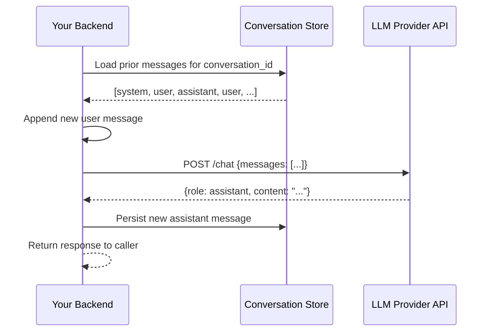

# Chat Completion Architecture

## Why This Matters

Almost every LLM API you'll integrate with — regardless of provider — exposes some version of the same shape: a "chat completion" endpoint that takes a list of messages and returns a new message. If you understand this shape deeply, you can move between providers, debug malformed prompts, and reason about why a model "ignored" an instruction, in minutes instead of hours. If you don't, you'll copy-paste example code from documentation without understanding why the `role` field matters, why system instructions go where they go, or why a "conversation" is really just an array you rebuild and resend every time. This chapter is the schema-level foundation for every other chapter in Part 14.

## Core Concept

A **chat completion request** is an ordered list of **messages**, where each message has a **role** describing who "said" it, and **content**. The API's job is to generate the *next* message in that sequence, playing the `assistant` role. The four roles you'll encounter across providers, sometimes with different exact names, are:

- **`system`** — instructions that set the model's behavior, persona, constraints, and context for the entire conversation. Not something either party "said" in the conversation itself; it's closer to a configuration block. Some providers pass this as a dedicated top-level field instead of a message with `role: system`.
- **`user`** — input from the human (or, in an automated pipeline, from whatever plays the role of "the requester").
- **`assistant`** — prior responses generated by the model. When you send conversation history back, the model's earlier replies must be tagged `assistant` so the model can distinguish "what I said" from "what I was told."
- **`tool`** (sometimes `function`, depending on provider) — the result of a tool/function call the assistant previously requested, fed back in so the model can continue reasoning with that result. Covered in depth in [Tool Calling](tool-calling.md).

The request is **provider-agnostic in shape** but not in exact field names: some providers put `system` outside the `messages` array, some allow multiple system messages interleaved, some name the response field `choices[0].message` (OpenAI-style) versus a top-level `content` array (Anthropic-style). The concept — roles + ordered turns — is what transfers between providers; the JSON schema does not.

## Mental Model

Think of a chat completion request as a **script for a play, handed to an actor who has never seen it before**, and the actor's job is to write the next line. The `system` message is the actor's brief: "you are playing a helpful, concise customer support agent for Acme Corp; never discuss pricing." Each `user` and `assistant` message is a line already performed. The actor reads the entire script from the top every single time before improvising the next line — there's no "the actor remembers act one from yesterday's rehearsal." If you want the actor to know something happened in act one, it needs to be written into the script you hand over.

This mental model explains a common point of confusion: "why did the model contradict what I told it three messages ago?" Usually the answer is that the message array you actually sent didn't contain that instruction anymore — it was truncated, summarized away, or simply never included by whatever code assembled the request.

## How It Works

1. **You assemble a `messages` array** from your persistent conversation state — typically a system message (often only needed once, at the start), followed by alternating `user`/`assistant` turns, with `tool` messages interleaved wherever a tool call happened.
2. **You send the entire array on every request.** There's no "continue this conversation ID" call in the base chat completion contract — some higher-level provider features simulate that (server-side conversation state, in a few providers), but the fundamental primitive is stateless: full history in, one new message out.
3. **The model generates a single new `assistant` message** — text, a tool call request, or both, depending on what you enabled.
4. **You append that new message to your stored history** and, if the model requested a tool call, execute it, append a `tool` result message, and call again — this loop is detailed in [Tool Calling](tool-calling.md).

Ordering matters strictly. Messages are causally ordered — the model conditions each generated token on everything that came before it in the array, in order. Reordering `user` and `assistant` turns, or misattributing a role, will visibly and often badly degrade output quality, because the model is trained on data where role and order carry real meaning (e.g., it's trained to treat `assistant`-authored text differently from `user`-authored text, including being more skeptical of instructions embedded inside `user` content — a property exploited and defended against in prompt-injection scenarios, see [Part 10 — API Security](../10-api-security/README.md)).

## Architecture



Nothing in this diagram is provider-specific — this is the shape every chat completion integration follows, whether it's a simple chatbot or a multi-step agent.

## Request / Response Example

Shown in an Anthropic/OpenAI-style format — exact field names vary by provider:

```http
POST /v1/chat/completions HTTP/1.1
Host: api.llmprovider.example.com
Authorization: Bearer sk-...redacted...
Content-Type: application/json

{
  "model": "large-model-v2",
  "max_tokens": 500,
  "messages": [
    { "role": "system", "content": "You are a concise support agent for Acme Corp. Never discuss internal pricing." },
    { "role": "user", "content": "How do I reset my password?" },
    { "role": "assistant", "content": "Go to Settings > Security > Reset Password." },
    { "role": "user", "content": "That page is blank for me, what now?" }
  ]
}
```

```http
HTTP/1.1 200 OK
Content-Type: application/json

{
  "id": "chatcmpl_9f...",
  "model": "large-model-v2",
  "role": "assistant",
  "content": [
    { "type": "text", "text": "Try clearing your browser cache, or use the mobile app's Settings > Security menu instead." }
  ],
  "stop_reason": "end_turn",
  "usage": { "input_tokens": 96, "output_tokens": 21 }
}
```

Note the fourth message is the *new* input, and everything before it is history you had to resend in full — the response only ever contains the single new `assistant` turn.

## Code Example

```python
from dataclasses import dataclass, field
from typing import Literal

Role = Literal["system", "user", "assistant", "tool"]


@dataclass
class Message:
    role: Role
    content: str


@dataclass
class Conversation:
    """Owns the message history your app resends on every LLM call.
    The LLM provider never stores this for you between calls."""
    system_prompt: str
    messages: list[Message] = field(default_factory=list)

    def add_user(self, text: str) -> None:
        self.messages.append(Message(role="user", content=text))

    def add_assistant(self, text: str) -> None:
        self.messages.append(Message(role="assistant", content=text))

    def to_request_messages(self) -> list[dict]:
        # Most providers accept the system prompt as the first message,
        # or as a separate top-level field -- check your provider's SDK docs.
        return [{"role": "system", "content": self.system_prompt}] + [
            {"role": m.role, "content": m.content} for m in self.messages
        ]


async def call_llm(conversation: Conversation, llm_client) -> str:
    # llm_client is a generic placeholder for whichever provider SDK you use;
    # follow that SDK's current docs for exact method signatures.
    response = await llm_client.messages.create(
        model="large-model-v2",
        max_tokens=500,
        messages=conversation.to_request_messages(),
    )
    reply_text = response.content[0].text
    conversation.add_assistant(reply_text)  # persist so the NEXT call has it
    return reply_text
```

## Production Considerations

- **Every message in history costs input tokens on every subsequent call.** A long-running conversation gets more expensive and slower per turn, not because the model "remembers more," but because you're resending a growing array each time. See [Context Windows](context-windows.md) for truncation/summarization strategies.
- **System prompt drift is a real operational hazard.** If you change the system prompt for a conversation that's already in progress, the model's behavior can shift mid-conversation in visible, confusing ways. Version your system prompts and consider whether to "pin" a conversation to the prompt version it started with.
- **Role misattribution is a silent bug class.** Storing a tool's output or a retrieved document under `role: user` instead of `role: tool` (or clearly delimited system context) can cause the model to treat untrusted external content as if the human said it — relevant to prompt-injection defense, see [Part 10 — API Security](../10-api-security/README.md).
- **Provider migration is a schema-mapping exercise**, not a rewrite, if you built your internal `Conversation` representation provider-agnostic as shown above.

## Common Mistakes

- **Sending only the latest message** and expecting prior context to be "remembered" by the API — it isn't, unless you resend it.
- **Putting instructions in `user` messages instead of `system`**, making them easy for a later user message to override or for injected content to contradict.
- **Never trimming history**, eventually exceeding the context window and getting a hard error mid-conversation (see [Context Windows](context-windows.md)).
- **Mixing up role semantics across providers** when porting code — e.g., assuming every provider accepts multiple `system` messages or the same tool-result role name.
- **Persisting raw provider response objects** instead of a normalized internal message format, which makes switching providers or supporting multiple providers painful.

## Best Practices

- Maintain your own normalized `Conversation`/`Message` representation independent of any single provider's wire format, and convert at the API boundary.
- Keep the system prompt stable per conversation; treat changes to it as a new conversation version, not a silent mutation.
- Persist every message you send and receive, including tool calls and results, for debuggability and auditing.
- Clearly separate trusted instruction content (`system`) from untrusted external content (retrieved documents, tool outputs, user input) even within a single role, using explicit delimiters if the provider doesn't give you a finer-grained role.

## AI Engineering Perspective

The messages array is the substrate that every higher-level AI pattern in this handbook is built on. In [RAG APIs](../16-rag-apis/README.md), retrieved documents are typically injected as part of a `user` message or a dedicated context block — how you attribute that content (as `system` context vs. inline in `user` text) materially affects how much the model trusts versus scrutinizes it. In [AI Agents & MCP](../17-ai-agents-and-mcp/README.md), an agent's entire "trace" of reasoning and tool use is just a longer, more structurally rich version of this same messages array — with more `assistant` (tool-call) and `tool` (tool-result) turns interleaved. Provider differences matter concretely here: OpenAI-style APIs have historically used a `function`/`tool` role plus `tool_call_id` correlation, while Anthropic-style APIs represent tool use and results as typed content blocks within `assistant`/`user` messages — the same concept, different envelope. Building your internal conversation model provider-agnostically from day one is what makes supporting multiple providers (see [Part 15 — Production AI Systems](../15-production-ai-systems/README.md) on multi-provider architecture) tractable instead of a rewrite.

## Exercises

**Beginner**
1. Write out, as JSON, a 5-turn conversation (system, user, assistant, user, assistant) for a recipe-suggestion chatbot. Identify which parts are "history" versus the "new" turn.
2. Explain in your own words why putting an instruction in a `user` message is weaker than putting it in a `system` message.

**Intermediate**
3. Implement the `Conversation` class above with a method `estimate_tokens()` that gives a rough token count (see [Tokens and Tokenization](tokens-and-tokenization.md)) and use it to decide when history needs trimming.

**Advanced**
4. Design a message schema that supports both OpenAI-style (`tool_call_id` correlation) and Anthropic-style (typed content blocks) tool calling, storable in a single database table, without losing information needed to replay a conversation to either provider.

## Key Takeaways

- A chat completion request is an ordered array of role-tagged messages (`system`, `user`, `assistant`, `tool`); the API returns exactly one new `assistant` message.
- The model has no server-side memory of past calls — your application resends the full relevant history every time.
- Role and order carry real semantic weight to the model; misattributing roles degrades quality and can create security issues.
- Building a provider-agnostic internal conversation representation pays off when supporting multiple providers or migrating between them.
- This messages-array shape is the foundation for tool calling, RAG context injection, and agent traces covered later in this part and in Parts 16–17.
