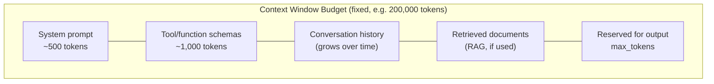

# Context Windows

## Why This Matters

Every LLM has a hard limit on how many tokens it can process in a single call — the **context window**. Unlike a REST API where sending "too much data" usually just means a slower response, exceeding an LLM's context window is a hard failure: the request is rejected, or in some architectures, silently truncated in ways you don't control. As conversations grow, as you inject retrieved documents (RAG), or as agent loops accumulate tool-call history, you will eventually hit this ceiling — often in production, under exactly the workloads that matter most (your power users, your longest sessions). Understanding context windows as a *budget you manage*, not a limit you occasionally bump into, is essential to building anything beyond a single-turn chatbot.

## Core Concept

The **context window** is the maximum number of tokens a model can attend to in one forward pass, and critically, it is **shared between input and output**. If a model has a 200,000-token context window and your input (system prompt + history + retrieved content) consumes 199,900 tokens, you have only 100 tokens of budget left for the response — regardless of what `max_tokens` you request. Exceed the total, and the API returns an error rather than silently proceeding.

Context window size varies significantly by model — from a few thousand tokens on older/smaller models to hundreds of thousands or more on newer large-context models — and it is a property of the *model*, not something you configure per-request. What you *do* control per request is how much of that budget you consume, and that's the real engineering problem: context windows don't grow, but your conversations, retrieved documents, and agent traces do.

## Mental Model

Think of the context window as **the physical size of a whiteboard the model can see**, not an infinite scroll. Every fact, instruction, past turn, retrieved document, and tool result you want the model to consider has to fit, legibly, on that one whiteboard, at the same time — because the model doesn't "remember" what was erased; if it's not currently on the board, it doesn't exist for this call. When the board is full, you cannot write the answer, because there's no space left for the model's own output. This is why "input + output share one budget" surprises people the first time: it's not two separate whiteboards, it's one, and the model's response has to be written in whatever room is left after everything else you wrote.

## How It Works

Concretely, a request fails or gets truncated in one of these ways once you approach the limit:

1. **Hard rejection.** If input tokens alone exceed the context window (or exceed `context_window - max_tokens` you requested), the API returns an error — commonly a 400-class error indicating the request is too large — before any generation happens.
2. **Truncated generation.** If input is within budget but leaves little room, the model may hit `max_tokens` or the context ceiling mid-answer, returning a response with `stop_reason: "max_tokens"` (or equivalent) instead of a natural completion — an incomplete answer that looks finished if you don't check the stop reason.
3. **No automatic summarization.** The API does not intelligently drop or compress old messages for you. If you keep appending to a conversation without pruning, you will eventually cross the limit — the failure is entirely your application's responsibility to prevent.

Because of this, production systems implement one or more **context management strategies**:

- **Truncation** — drop the oldest messages once history exceeds a token budget, usually keeping the system prompt and the most recent N turns. Simple, but loses old context entirely.
- **Sliding window** — a bounded-size truncation variant: always keep only the last K turns (or last N tokens), discarding everything older, often paired with keeping the system prompt pinned.
- **Summarization** — periodically replace older messages with a condensed summary generated by the model itself (an LLM call whose job is "compress this history"), preserving salient facts while shrinking token count. More complex, but retains long-range context better than truncation.
- **Retrieval instead of full history** — rather than keeping full conversation text, store it externally (e.g., in a vector store) and retrieve only the relevant parts per turn — the same pattern used in [RAG APIs](../16-rag-apis/README.md), applied to conversation memory itself.

## Architecture



The engineering task is allocating this fixed-size budget across competing consumers — system prompt and tool schemas are usually near-fixed cost, `max_tokens` for output must be reserved up front, and history/retrieved content are the variable pieces you actively manage.

## Request / Response Example

Shown in an Anthropic/OpenAI-style format — a request that exceeds the context window returns an explicit error rather than a normal response:

```http
POST /v1/messages HTTP/1.1
Host: api.llmprovider.example.com
Authorization: Bearer sk-...redacted...
Content-Type: application/json

{
  "model": "large-model-v2",
  "max_tokens": 1000,
  "messages": [ /* ... 210,000 tokens of history ... */ ]
}
```

```http
HTTP/1.1 400 Bad Request
Content-Type: application/json

{
  "type": "error",
  "error": {
    "type": "invalid_request_error",
    "message": "input length and max_tokens exceed context window of 200000 tokens"
  }
}
```

Compare this to a truncated-but-"successful" response, which is more dangerous because it looks fine at the HTTP level:

```json
{
  "content": [{ "type": "text", "text": "Based on the document, the key findings are: 1) revenue grew" }],
  "stop_reason": "max_tokens",
  "usage": { "input_tokens": 198500, "output_tokens": 1000 }
}
```

An HTTP 200 with a cut-off sentence — the `stop_reason` field is the only signal that the answer is incomplete, and code that doesn't check it will treat this as a normal, complete response.

## Code Example

```python
import tiktoken

encoding = tiktoken.get_encoding("cl100k_base")
CONTEXT_WINDOW = 200_000
RESERVED_FOR_OUTPUT = 1_000  # must match the max_tokens you'll request


def count_tokens(messages: list[dict]) -> int:
    return sum(len(encoding.encode(m["content"])) for m in messages)


def fit_to_context_window(
    system_prompt: str,
    history: list[dict],
    new_message: dict,
    budget: int = CONTEXT_WINDOW - RESERVED_FOR_OUTPUT,
) -> list[dict]:
    """Sliding-window truncation: always keep the system prompt and the
    newest message; drop OLDEST history turns first until we fit the budget."""
    system_tokens = len(encoding.encode(system_prompt))
    new_tokens = len(encoding.encode(new_message["content"]))
    remaining = budget - system_tokens - new_tokens

    kept: list[dict] = []
    # Walk history from newest to oldest, keeping what fits.
    for msg in reversed(history):
        msg_tokens = len(encoding.encode(msg["content"]))
        if msg_tokens > remaining:
            break  # older messages get dropped; consider summarizing instead
        kept.insert(0, msg)
        remaining -= msg_tokens

    return (
        [{"role": "system", "content": system_prompt}]
        + kept
        + [new_message]
    )


async def call_llm_with_budget(system_prompt, history, new_message, llm_client):
    messages = fit_to_context_window(system_prompt, history, new_message)
    response = await llm_client.messages.create(
        model="large-model-v2",
        max_tokens=RESERVED_FOR_OUTPUT,
        messages=messages,
    )
    # ALWAYS check stop_reason -- "max_tokens" means the answer was cut off,
    # not that it finished naturally.
    if response.stop_reason == "max_tokens":
        # log/flag for retry with a larger budget or a follow-up "continue" call
        pass
    return response
```

## Production Considerations

- **Reserve output budget before computing your input budget**, not after — a common bug is computing "how much history fits" using the full context window instead of `context_window - max_tokens`, which then produces a request that fails only sometimes, depending on how long the model's answer happens to be.
- **Always check the stop/finish reason.** An HTTP 200 does not mean the answer is complete; `stop_reason: "max_tokens"` (or your provider's equivalent) means it was cut off.
- **Truncation silently loses information** — a customer support agent that drops the first message in a conversation (where the customer stated their account ID) will re-ask for it later, which reads as broken to the user. Decide deliberately what's safe to drop vs. what must survive (pin critical facts near the system prompt, or extract and re-inject them rather than relying on raw history to carry them).
- **Summarization has its own cost and risk.** Each summarization pass is itself an LLM call with a real cost and its own chance of dropping or distorting details — budget for it and monitor its quality, don't treat it as a free fix.
- **Different models in the same product may have different context windows** — a fallback/routing system (see [Part 15 — Production AI Systems](../15-production-ai-systems/README.md)) that switches models under load must recompute the budget per model, not assume the same limit everywhere.

## Common Mistakes

- **Not tracking cumulative token usage of a growing conversation**, hitting a hard failure only after weeks of the feature working fine in demos with short conversations.
- **Reserving `max_tokens` incorrectly (or not at all)** when computing how much history/context fits, causing intermittent failures tied to how verbose a given answer happens to be.
- **Treating a 200 response as complete** without checking the stop/finish reason, shipping truncated answers to users.
- **Truncating from the wrong end** — e.g., dropping the system prompt or the newest user message instead of the oldest history, which breaks behavior far more severely than losing old context.
- **Re-sending the entire, ever-growing raw conversation forever** with no pruning or summarization strategy at all, until the app fails in production for your longest-lived users.

## Best Practices

- Compute your input token budget as `context_window - max_tokens - safety_margin`, and enforce it before every call.
- Choose a context management strategy deliberately (truncation, sliding window, summarization, or retrieval-based memory) based on how much long-range continuity your use case actually needs.
- Always check the response's stop/finish reason and treat `max_tokens`-truncated output as incomplete, not final.
- Pin genuinely critical facts (user identity, key constraints) near the system prompt or in a dedicated "memory" block that survives truncation, rather than relying on raw scrollback.
- Log input/output token counts per call over time to catch conversations trending toward the limit before they fail.

## AI Engineering Perspective

Context window management is the central design constraint of [RAG APIs](../16-rag-apis/README.md) — the entire point of retrieval is to fit the *most relevant* slice of a much larger knowledge base into a fixed context budget, rather than dumping everything in; chunking strategy, top-k retrieval count, and reranking (see that part's README) are all, at bottom, context-budget decisions. In [AI Agents & MCP](../17-ai-agents-and-mcp/README.md), context windows are the reason long-running agent loops need explicit memory strategies — every tool call and tool result gets appended to the conversation, so an agent that runs 40 tool-calling turns can exhaust even a large context window through accumulated tool output alone, independent of the "real" task complexity; production agent frameworks commonly summarize or discard old tool results while keeping the most recent ones verbatim. Provider nuance matters too: context window size is a marketed, comparable spec across providers, but *effective* usable context (how well a model actually uses information placed in the middle of a very long context, sometimes called the "lost in the middle" effect) can degrade well before the hard token limit — a system that fits within the window is not automatically a system that reasons well over all of it.

## Exercises

**Beginner**
1. Explain why a request with `max_tokens: 4000` sent to a model with a 200,000-token context window fails when input history alone is 199,000 tokens, even though 199,000 is well under 200,000.

**Intermediate**
2. Implement a summarization-based context strategy: when history exceeds a token threshold, call the LLM to summarize the oldest half of the conversation into a short paragraph, replace those messages with the summary, and keep the recent half verbatim.

**Advanced**
3. Design a context budget allocator for an agent loop that must fit: a system prompt, tool schemas for 15 tools, the last 5 tool-call/result pairs verbatim, and a summarized version of everything older — given a fixed context window and a required output reservation. Specify the priority order you'd drop things in under pressure.

## Key Takeaways

- The context window is a single shared token budget for input *and* output — reserve output tokens before computing how much input fits.
- Exceeding it produces a hard error; being close to the edge produces silently truncated output you must detect via the stop/finish reason.
- Truncation, sliding windows, summarization, and retrieval-based memory are the four main strategies for managing growing conversations within a fixed window.
- Always check the stop reason on every response — an HTTP 200 does not guarantee a complete answer.
- Context budgeting is the foundational constraint behind RAG chunking/retrieval design and agent memory strategies in Parts 16–17.
