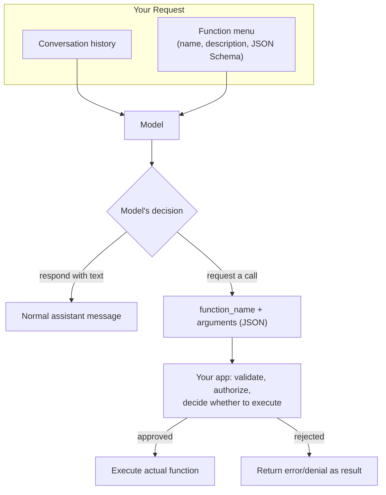

# Function Calling

## Why This Matters

Structured output (previous two chapters) solves "get the model to produce data in a shape I can use." **Function calling** solves a related but distinct problem: "let the model decide, based on the conversation, *which* capability to invoke and with *what* arguments" — without you hardcoding that decision in your application logic. This is the mechanism that turns an LLM from "a thing that writes text" into "a thing that can look up a customer's order, check today's weather, query a database, or trigger a workflow," and it's the conceptual foundation for everything in [Tool Calling](tool-calling.md) and agentic systems in [Part 17](../17-ai-agents-and-mcp/README.md). Understanding it precisely — including the terminology confusion around "function calling" vs. "tool calling" — matters because getting the mental model wrong leads to either over-trusting the model's decisions (executing whatever it "calls" without validation) or under-using the capability (hardcoding logic that the model could have handled more flexibly).

## Core Concept

**Function calling** is a capability where you give the model a **menu of available functions**, each described by a name, a natural-language description, and a JSON Schema for its parameters — and the model, based on the conversation so far, can choose to respond not with text but with a request to invoke one of those functions, including the specific argument values it believes are appropriate. Critically: **the model never actually executes the function.** It only produces a structured description of *which* function it wants called and *with what arguments* — a JSON payload, not a side effect. Your application code is entirely responsible for deciding whether and how to actually execute it, and for feeding the result back in.

This is also where terminology gets genuinely inconsistent across the industry, and it's worth being explicit about it:

- **"Function calling"** was the original term (popularized by early OpenAI API releases) for exactly this capability — one function, one call, one result.
- **"Tool calling"** is the more general, now more common term across most providers, used because the "menu" isn't limited to programmer-defined functions in the narrow sense — it can include broader "tools" like web search, code execution, or file access that a provider might implement server-side, and it better describes the multi-turn, potentially-multiple-tools-per-response reality of modern usage (see [Tool Calling](tool-calling.md) for the full request-execute-respond loop).

In practice today, most providers use "tool calling" as the umbrella term and "function calling" as roughly synonymous or as the specific case of user-defined functions — but you'll still see both terms in documentation, and they refer to fundamentally the same mechanism: schema-described capabilities, model-chosen invocation, application-controlled execution.

## Mental Model

Imagine the model as a **very capable phone operator at a company switchboard**, holding a laminated card listing every department it can transfer a call to — "Billing," "Technical Support," "Sales" — each with a short description of what that department handles and what information it needs from the caller before transferring. The operator listens to the caller (the conversation), decides which department best matches the request, and fills out a transfer slip: "Transfer to Billing, caller's account ID is 4471, issue is a duplicate charge." Critically, **the operator does not walk into the Billing department and resolve the issue themselves** — they hand off a structured transfer slip and their job, for this turn, is done. It's the switchboard system (your application code) that actually routes the call, and it's entirely free to double-check the transfer slip, reject it, ask for missing information, or route somewhere else if something looks wrong — the operator's decision is a strong suggestion backed by training, not an unstoppable command.

## How It Works

1. **You define the function menu** — a list of function names, descriptions, and JSON Schema parameter definitions (see [JSON Schemas](json-schemas.md)) — and include it in your API request alongside the conversation.
2. **The model reads the conversation and the menu**, and during generation, decides between three outcomes: respond normally with text, respond by requesting a single function call, or (in providers/modes that support it) request multiple function calls in one turn.
3. **If it requests a call**, the response contains the function name and a JSON object of arguments — generated using the same structured-output mechanisms covered in [Structured Outputs](structured-outputs.md), because argument generation *is* a structured-output problem.
4. **Your application code receives this request and decides what to do** — this is the critical control point. Production systems should validate arguments against the schema (the model can still produce malformed or semantically wrong arguments), apply authorization checks (does this user/context have permission to call this function with these arguments?), and only then actually execute the underlying code.
5. **The result of execution is fed back to the model** as a new turn in the conversation (commonly with a `tool`/`function` role), and the model continues — this feedback loop, spanning potentially many rounds, is the subject of the next chapter, [Tool Calling](tool-calling.md).

The model's "decision" to call a function is a probabilistic output like any other generation — it's trained on large amounts of data demonstrating when and how to use tools well, but it can still choose the wrong function, invent a function name that doesn't exist in your menu (rare with schema-constrained modes, more common with weaker prompting), or supply arguments that don't make sense given the conversation. None of this should be surprising given everything covered in [LLM APIs](llm-apis.md) about non-determinism — function calling doesn't remove that property, it applies it to a new kind of output.

## Architecture



The arrow from `Call` to `App` is the boundary that matters most in production: the model produces a *request*, and your application is the enforcement point, not a passive pipe.

## Request / Response Example

Shown in an Anthropic/OpenAI-style format — exact field names (`tools` vs `functions`, `tool_use` vs `function_call`) vary by provider and API version:

```http
POST /v1/messages HTTP/1.1
Host: api.llmprovider.example.com
Authorization: Bearer sk-...redacted...
Content-Type: application/json

{
  "model": "large-model-v2",
  "max_tokens": 300,
  "tools": [{
    "name": "get_order_status",
    "description": "Look up the current status of a customer order by order ID.",
    "input_schema": {
      "type": "object",
      "properties": {
        "order_id": { "type": "string", "description": "The order ID, e.g. ORD-48213." }
      },
      "required": ["order_id"]
    }
  }],
  "messages": [
    { "role": "user", "content": "Where is my order ORD-48213?" }
  ]
}
```

```http
HTTP/1.1 200 OK
Content-Type: application/json

{
  "content": [{
    "type": "tool_use",
    "id": "toolu_01Pq",
    "name": "get_order_status",
    "input": { "order_id": "ORD-48213" }
  }],
  "stop_reason": "tool_use"
}
```

Note there's no order status data in this response at all — the model has only requested that your code look it up. The actual lookup, and sending the result back, is covered in [Tool Calling](tool-calling.md).

## Code Example

```python
from pydantic import BaseModel, ValidationError

FUNCTION_MENU = [{
    "name": "get_order_status",
    "description": "Look up the current status of a customer order by order ID.",
    "input_schema": {
        "type": "object",
        "properties": {"order_id": {"type": "string"}},
        "required": ["order_id"],
    },
}]


class GetOrderStatusArgs(BaseModel):
    order_id: str


async def handle_model_response(response, current_user, llm_client):
    """Given a model response, decide whether to execute a requested function call."""
    for block in response.content:
        if block.type != "tool_use":
            continue  # plain text content, nothing to execute

        if block.name != "get_order_status":
            # Model referenced a function not in our menu -- never blindly
            # dispatch on the name string alone.
            raise ValueError(f"Unknown function requested: {block.name}")

        # Validate arguments against our own schema, not just trust the model.
        try:
            args = GetOrderStatusArgs.model_validate(block.input)
        except ValidationError as e:
            return {"error": f"Invalid arguments: {e}"}

        # Authorization check: does this user own this order? Never skip this
        # just because "the model decided to call it" -- the model has no
        # concept of your authorization rules.
        if not await user_owns_order(current_user, args.order_id):
            return {"error": "Not authorized to view this order"}

        # Only now do we actually execute real, side-effecting logic.
        status = await lookup_order_status(args.order_id)
        return {"order_id": args.order_id, "status": status}

    return None  # no function call requested this turn


async def user_owns_order(user, order_id: str) -> bool:
    # Real implementation: query your orders table / authorization service.
    ...


async def lookup_order_status(order_id: str) -> str:
    # Real implementation: query your orders service.
    ...
```

## Production Considerations

- **The model's function-call request is an untrusted input, not a command.** Validate arguments against your schema and re-check authorization every time, exactly as you would for any externally supplied input to your backend — the fact that "the AI decided this" doesn't grant it elevated trust.
- **Function names and descriptions are effectively part of your prompt.** A poorly described function increases the chance the model picks the wrong one or supplies nonsensical arguments — invest in these the same way you'd invest in [JSON Schemas](json-schemas.md) descriptions.
- **Every function in the menu costs input tokens on every call**, even turns where none get invoked (see [Tokens and Tokenization](tokens-and-tokenization.md)) — a large menu of rarely-used functions is a recurring, often-overlooked cost.
- **The model can request a function that doesn't exist, or exists but shouldn't be reachable in this context** (e.g., an admin-only function surfaced to a regular user's conversation because the menu wasn't scoped per-role) — scope the menu you send per request context, don't send a single global menu to every conversation regardless of caller permissions.
- **Function-calling reliability is sensitive to sampling settings** — as with structured outputs generally, lower temperature typically produces more reliable, consistent function selection and argument generation.

## Common Mistakes

- **Executing a requested function without validating arguments**, trusting that schema-constrained generation makes malformed arguments impossible — it reduces but does not eliminate the risk.
- **Skipping authorization checks** because "the model chose to call this," conflating a model's decision with a verified, authorized user action.
- **Sending every available function to every conversation** regardless of the user's role or the conversation's context, inflating token cost and increasing the chance of an inappropriate function being selected.
- **Confusing "function calling" and "tool calling" as different mechanisms** rather than recognizing them as the same underlying capability with different terminology and, in modern usage, tool calling as the broader umbrella.
- **Writing vague function descriptions** ("does stuff with orders") and being surprised when the model calls the wrong function or supplies wrong arguments.

## Best Practices

- Treat every function-call request from the model as untrusted input: validate its arguments against a real schema and enforce authorization before execution, every time.
- Scope the function menu per request context (user role, conversation state) rather than sending a single global list to every call.
- Write clear, specific function names and descriptions — this is prompt engineering, not just interface documentation.
- Keep the menu as small as the task requires; prune unused or rarely-relevant functions to control token cost and reduce the chance of misselection.
- Log every function-call request the model makes, whether or not you executed it, for debugging and for building a dataset of real usage patterns.

## AI Engineering Perspective

Function calling is the mechanism by which an LLM stops being a text generator and becomes a component that can drive real application behavior — which is exactly why the validation-and-authorization discipline in this chapter isn't optional polish, it's the security boundary of your entire AI-integrated system (see [Part 10 — API Security](../10-api-security/README.md) on treating model output as untrusted). In [AI Agents & MCP](../17-ai-agents-and-mcp/README.md), function calling is the atomic operation that agent loops are built from — an "agent" is, at its simplest, a loop that repeatedly offers a function menu, executes whatever's requested, feeds the result back, and repeats until the model stops requesting calls; the Model Context Protocol (MCP) standardizes how that menu itself (tools, resources, prompts) is discovered and described across different clients and servers, building directly on the function-definition concepts in this chapter. In [RAG APIs](../16-rag-apis/README.md), retrieval is very often implemented as a function call itself (`search_documents(query, filters)`) rather than a fixed pre-processing step, letting the model decide *when* retrieval is actually needed for a given user question rather than always retrieving unconditionally — a pattern sometimes called "agentic RAG." Provider nuance: parallel function calling (the model requesting multiple calls in a single turn) is supported by some providers and not others, and where supported, changes your execution code from "handle one call" to "handle a batch, possibly with dependencies between them" — check current provider docs before assuming single-call semantics.

## Exercises

**Beginner**
1. Define a simple function menu with one function (`get_weather(city: str)`) and, without an actual LLM call, write out by hand what a model's `tool_use`/`function_call` response JSON should look like for the input "What's the weather in Lisbon?"

**Intermediate**
2. Implement `handle_model_response` from the code example for two functions instead of one, including per-function argument validation and a clear error path for an unrecognized function name.

**Advanced**
3. Design a per-role function menu system: given a user's role (`guest`, `member`, `admin`), determine which subset of a larger function catalog gets sent to the model on each request, and explain how you'd prevent a `guest`-scoped conversation from ever executing an `admin`-only function even if the model somehow requested it.

## Key Takeaways

- Function calling lets the model choose which predefined capability to invoke and with what arguments — but the model only requests the call; your application decides whether to execute it.
- "Function calling" and "tool calling" refer to the same core mechanism; "tool calling" has become the more common umbrella term across providers.
- Every function-call request is untrusted input: validate arguments against a schema and enforce authorization before executing anything, regardless of how the request was generated.
- Function menus cost tokens on every call and should be scoped to what's actually relevant and permitted for the current context.
- This mechanism is the atomic building block of agent loops (Part 17) and agentic retrieval patterns (Part 16) — understanding it precisely here pays off directly in both.
