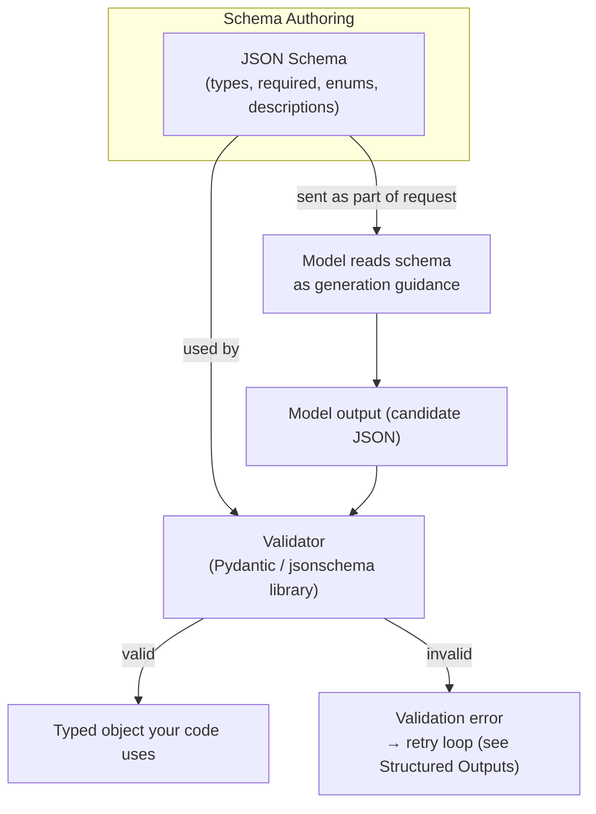

# JSON Schemas

## Why This Matters

[Structured Outputs](structured-outputs.md) established that you need a schema to constrain and validate LLM output. This chapter goes one level deeper: **JSON Schema** is the actual specification you'll use to define that shape, and it's also the specification LLM providers use under the hood for tool/function definitions and schema-constrained decoding modes. A poorly designed schema doesn't just fail to validate correctly — it actively confuses the model into producing worse output, because the schema itself is part of what the model reads and reasons about, not a passive downstream filter. Writing good LLM-facing JSON Schemas is a distinct skill from writing good REST API request schemas, even though the underlying spec is identical.

## Core Concept

**JSON Schema** is a declarative, JSON-based vocabulary for describing the shape, types, and constraints of JSON data: object properties and their types, which fields are required, allowed value ranges, string patterns, enums, and nested structures. It's the same specification used broadly across the API world — for OpenAPI request/response definitions (see [Part 3 — Building APIs](../03-building-apis/README.md)) and for validating webhook payloads (see [Part 9](../09-realtime-and-webhooks/README.md)) — which is exactly why LLM providers adopted it for tool schemas and structured-output modes rather than inventing something new: it's a spec both machines and (crucially, for LLMs) a huge amount of training data already understand.

In the LLM context, a JSON Schema serves **two audiences simultaneously**, which is the key thing that differs from a typical backend validation schema:

1. **The validator** (your code, e.g., Pydantic) — mechanically checks whether a given JSON object conforms.
2. **The model itself** — reads the schema, including field names, types, and (critically) `description` fields, as part of its input, and uses that information to *decide what to generate*. A vague or ambiguous schema doesn't just risk passing invalid data through a lenient validator — it actively increases the odds the model generates the wrong thing in the first place.

This dual audience is why schema design for LLMs has different priorities than schema design for, say, validating a form submission from a known frontend: field *descriptions* and *naming clarity* carry real weight, because they're effectively part of the prompt.

## Mental Model

Think of a JSON Schema sent to an LLM as **a job requisition form**, not just a data-shape contract. A backend validator only cares that the form is filled out with the right field types in the right places — it doesn't care if the job title is ambiguous. But the "worker" filling out the form (the model) reads every label and instruction on it before acting. A field named `amt` with no description will get filled in with the model's best guess at what "amt" means — maybe the total, maybe a single line item, maybe a percentage — because the schema didn't disambiguate. A field named `total_amount_usd` with a description "the final total amount due, in US dollars, including tax" gets the model reliably filling in what you actually meant, because you did the work of writing an unambiguous requisition rather than a cryptic one.

## How It Works

A JSON Schema for an LLM tool or structured-output response typically specifies:

- **`type`** — `object`, `array`, `string`, `number`, `integer`, `boolean`, or `null`.
- **`properties`** — for objects, the named fields and their own sub-schemas.
- **`required`** — which properties must be present; omitted optional fields should have sensible handling on your side (default value, or explicit "not provided" semantics — LLMs sometimes fill in optional fields with plausible-but-invented values if the schema doesn't make omission clearly acceptable).
- **`enum`** — a fixed set of allowed values, extremely useful for classification-style outputs (far more reliable than asking the model to "pick one of: A, B, C" in free text).
- **`description`** — free-text guidance attached to the schema or individual fields; this is the single highest-leverage part of an LLM-facing schema, because it's the part that most directly steers the model's generation, not just the validator's acceptance criteria.
- **Constraints** — `minimum`/`maximum` for numbers, `minLength`/`maxLength`/`pattern` for strings, `minItems`/`maxItems` for arrays. Provider support for enforcing these *during generation* (versus only validating after the fact) varies — treat them as helpful hints to the model and validate them independently regardless.

When you validate the model's output, you run this same schema (or an equivalent typed model, like a Pydantic class) against the actual JSON received — the schema is authored once and used on both the "steer the model" side and the "check the model's work" side.

## Architecture



The same artifact — one schema — feeds both the generation-steering path and the post-hoc validation path, which is why investing in schema clarity pays off twice.

## Request / Response Example

Shown in an Anthropic/OpenAI-style format — a tool schema doubling as a structured-output contract:

```http
POST /v1/messages HTTP/1.1
Host: api.llmprovider.example.com
Authorization: Bearer sk-...redacted...
Content-Type: application/json

{
  "model": "large-model-v2",
  "max_tokens": 200,
  "tools": [{
    "name": "classify_support_ticket",
    "description": "Classify a customer support ticket for routing.",
    "input_schema": {
      "type": "object",
      "properties": {
        "category": {
          "type": "string",
          "enum": ["billing", "technical_issue", "account_access", "feature_request", "other"],
          "description": "The single best-fit category for this ticket."
        },
        "urgency": {
          "type": "string",
          "enum": ["low", "medium", "high"],
          "description": "How time-sensitive the issue is for the customer."
        },
        "summary": {
          "type": "string",
          "maxLength": 200,
          "description": "One-sentence neutral summary of the customer's issue, for the support queue view."
        }
      },
      "required": ["category", "urgency", "summary"]
    }
  }],
  "tool_choice": { "type": "tool", "name": "classify_support_ticket" },
  "messages": [{ "role": "user", "content": "My card was charged twice for the same order and I need this fixed today." }]
}
```

```http
HTTP/1.1 200 OK
Content-Type: application/json

{
  "content": [{
    "type": "tool_use",
    "name": "classify_support_ticket",
    "input": {
      "category": "billing",
      "urgency": "high",
      "summary": "Customer was double-charged for one order and needs same-day resolution."
    }
  }],
  "stop_reason": "tool_use"
}
```

Notice how `enum` on `category` and `urgency` eliminates an entire class of failure — the model literally cannot (in a schema-constrained mode) output a category outside the fixed set, versus free-text classification where "billing issue" vs. "Billing" vs. "billing_problem" are all plausible variants you'd otherwise have to normalize.

## Code Example

```python
from enum import Enum
from pydantic import BaseModel, Field


class Category(str, Enum):
    billing = "billing"
    technical_issue = "technical_issue"
    account_access = "account_access"
    feature_request = "feature_request"
    other = "other"


class Urgency(str, Enum):
    low = "low"
    medium = "medium"
    high = "high"


class TicketClassification(BaseModel):
    category: Category
    urgency: Urgency
    # `description` in Field() becomes part of the JSON Schema Pydantic
    # generates -- and that schema is what you send to the LLM, so writing
    # a clear description here directly improves model output quality.
    summary: str = Field(
        max_length=200,
        description="One-sentence neutral summary of the customer's issue, for the support queue view.",
    )


def to_tool_schema(model: type[BaseModel]) -> dict:
    # Pydantic can emit a JSON Schema directly; most provider SDKs accept
    # this shape (or a very close variant) as a tool `input_schema`.
    return model.model_json_schema()


# Validating a model response against this same schema:
def validate_classification(raw_output: dict) -> TicketClassification:
    # Raises pydantic.ValidationError on any type/enum/length mismatch --
    # catch this in your retry loop (see Structured Outputs).
    return TicketClassification.model_validate(raw_output)
```

## Production Considerations

- **Descriptions are not documentation, they're prompt engineering.** Treat every `description` field as text the model will act on, and iterate on wording the same way you'd iterate on a prompt — vague descriptions produce vague or inconsistent field values.
- **Prefer `enum` over free-text string fields wherever the set of valid values is genuinely fixed.** This eliminates an entire normalization problem (typos, casing, synonyms) at the source instead of downstream.
- **Keep schemas as flat and minimal as the task allows.** Deeply nested, highly optional schemas are harder for both the model to fill correctly and for you to validate meaningfully — every optional field is a place the model might invent a value rather than clearly omitting it.
- **Version your schemas.** If you change a tool's `input_schema` (renaming a field, changing an enum's allowed values), old stored data or in-flight conversations referencing the old shape can become inconsistent — treat schema changes with the same discipline as [API versioning](../02-rest-api-design/README.md) for a public REST contract.
- **Provider-side constraint enforcement is inconsistent.** Some numeric/string constraints (`minimum`, `pattern`) may be enforced only loosely or not at all during generation depending on provider and mode — always validate independently in your own code regardless of what the provider claims to enforce.

## Common Mistakes

- **Cryptic or abbreviated field names** (`amt`, `qty`, `flg`) with no description, leaving the model to guess intent — and different runs may guess differently.
- **Overly permissive schemas** (everything optional, string types for what should be enums) that validate almost anything, defeating the purpose of constraining output in the first place.
- **Copy-pasting a REST API's internal database schema directly as an LLM tool schema**, including internal-only fields, without considering that every field and description is now something the model reads and potentially reasons (or hallucinates) about.
- **Not testing the schema against edge-case inputs** — ambiguous or missing information in the source text — where a well-designed schema and prompt should make the model default sensibly (e.g., omit an optional field) rather than invent a plausible-looking but false value.
- **Forgetting that schema changes need migration handling**, breaking older stored records or in-flight conversations that assumed the previous field set.

## Best Practices

- Write field-level `description`s as if you were briefing a new, competent teammate who has never seen your codebase — assume no shared context.
- Use `enum` for any field with a genuinely fixed value set; it's more reliable than free text and eliminates normalization work.
- Keep required fields minimal and meaningful; make truly optional fields optional in a way that gives the model explicit permission to omit them rather than guess.
- Generate schemas from a single source of truth (e.g., a Pydantic model) so the schema sent to the LLM and the schema used to validate its response can never drift apart.
- Version tool/output schemas explicitly, and handle old-schema data gracefully during migrations.

## AI Engineering Perspective

JSON Schema is the shared language across nearly every AI system in this handbook. In [RAG APIs](../16-rag-apis/README.md), schemas define both the structured query understanding step (turning free text into filters/parameters for retrieval) and citation-annotated response formats. In [AI Agents & MCP](../17-ai-agents-and-mcp/README.md), the **Model Context Protocol** standardizes exactly this pattern at the protocol level — MCP tools, resources, and prompts are described using JSON Schema so that any MCP-compatible client and any MCP-compatible model can interoperate without custom integration code per tool; understanding JSON Schema deeply here directly transfers to understanding MCP tool definitions in that part. A subtlety worth internalizing: because the schema is read by the model, larger toolsets with many verbosely-described schemas consume real input tokens on every call (see [Tokens and Tokenization](tokens-and-tokenization.md)) — there's a genuine trade-off between schema clarity (longer descriptions, better model behavior) and token cost (shorter descriptions, cheaper and faster calls) that production systems have to tune deliberately, especially in agent systems that hold many tool schemas in context simultaneously.

## Exercises

**Beginner**
1. Take a vague schema field (`{"type": "string"}` named `status`) and rewrite it with a clear `description` and, if applicable, an `enum`. Explain what ambiguity you removed.

**Intermediate**
2. Define a Pydantic model for a "meeting summary" structured output (attendees, action items, decisions) with field-level descriptions, generate its JSON Schema, and use it as a tool definition in a mock LLM request.

**Advanced**
3. Design a versioning strategy for a tool schema used by a long-running agent (Part 17): the schema needs to change (a field renamed, a new required field added) without breaking conversations that are mid-flight when the change ships. Specify how you'd detect and handle old-schema tool calls already in a stored conversation.

## Key Takeaways

- JSON Schema is the shared specification for LLM tool definitions, structured-output modes, and validation — the same spec used in OpenAPI and webhook payloads elsewhere in this handbook.
- Unlike a typical backend validation schema, an LLM-facing schema is read by the model itself — field names and descriptions actively steer generation, not just gate validation.
- Prefer `enum` over free text for fixed value sets, and write descriptions as if briefing a new teammate with no shared context.
- Always validate independently in your own code — provider-side constraint enforcement during generation is inconsistent and should not be trusted alone.
- The same schema discipline underlies MCP tool definitions in Part 17 and structured retrieval/response formats in RAG systems in Part 16.
