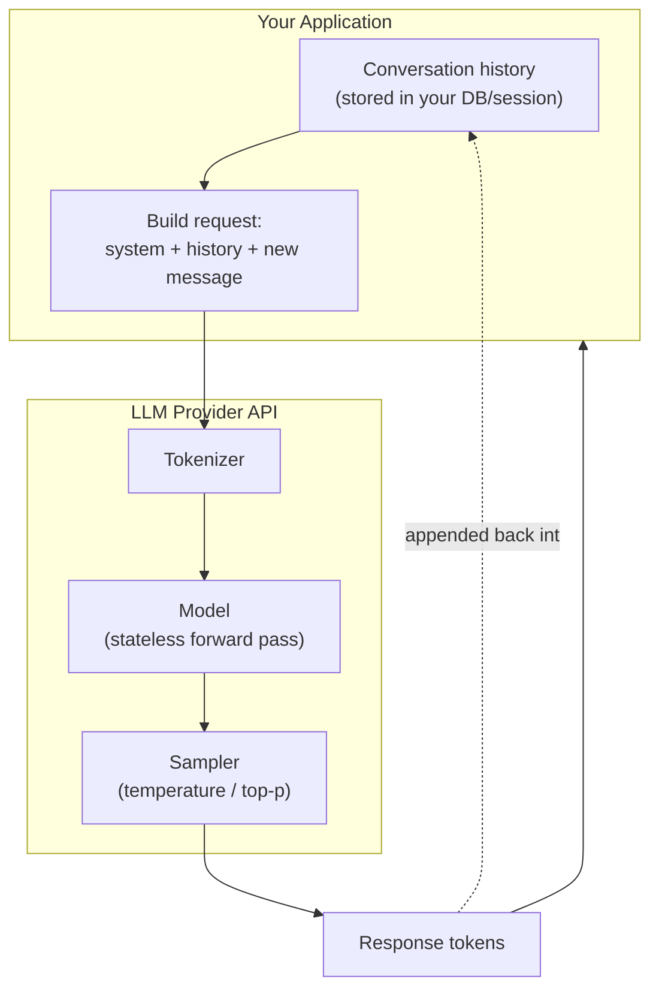

# LLM APIs

## Why This Matters

By the time you reach this chapter, you already know how to design and consume a REST API: send a request, get a deterministic response, done. LLM APIs look identical on the wire — they're HTTP endpoints that accept JSON and return JSON — but they break almost every assumption you've built up about how APIs behave. The same request can return a different response every time. A single call can cost real money in a way a `GET /users/42` never does. Latency is measured in seconds, not milliseconds, and scales with how much text goes in and out. If you treat an LLM API like a normal CRUD endpoint — call it synchronously, assume identical inputs give identical outputs, ignore the cost per call — you will build something that is slow, expensive, and impossible to test reliably. This chapter establishes the mental model for everything else in Part 14: what an LLM API actually is, and precisely which REST assumptions no longer hold.

## Core Concept

An **LLM API** is an HTTP interface to a large language model: you send it a sequence of tokens (usually wrapped as structured "messages"), and it returns a sequence of tokens generated one at a time, each one conditioned on everything before it. That's the entire contract. Everything else — chat history, "sessions," "assistants," "conversations" — is a convention built on top of that contract by the caller, not a feature of the model itself.

Three properties define how an LLM API differs from a typical backend API:

- **Non-determinism.** Even at fixed input, the model can produce different output on different calls, because generation involves sampling from a probability distribution over the next token (see [Temperature and Sampling](temperature-and-sampling.md)). A REST endpoint returning a user record from a database is idempotent by nature; an LLM completion endpoint is not, unless you explicitly constrain it to be.
- **Cost and latency scale with content, not just with "a request happening."** A `GET` request to a database costs roughly the same whether it returns 10 rows or 100. An LLM call's cost and latency scale near-linearly with the number of tokens processed — both what you send in (input/prompt tokens) and what the model generates (output tokens). A long conversation history or a large document in the prompt makes every subsequent call slower and more expensive, even if the user's actual question is one sentence.
- **The model is stateless; the conversation is not.** The model itself has no memory between API calls — it doesn't "remember" your last message. Every call is a fresh forward pass over whatever tokens you send it. Anything that looks like memory (a multi-turn chat, an agent that "remembers" earlier tool results) is state your application maintains and re-sends on every single call, in full, as part of the input tokens.

## Mental Model

Think of an LLM API less like a database and more like a very well-read, very literal-minded ghost who has total amnesia between conversations. Every time you "talk" to it, you have to hand it a full transcript of everything relevant so far — who said what, any rules it should follow, any facts it needs — because the moment the call ends, it forgets everything. It will read that entire transcript again from scratch, then write the next line, and it might phrase that next line slightly differently even if you hand it the exact same transcript twice, because it's not retrieving a memorized answer — it's generating a plausible continuation token by token.

This reframes a lot of API design decisions. "Remembering a conversation" is not a feature the API gives you — it's a client-side responsibility: storing message history and replaying it on every call. "Reducing latency" isn't about a faster database index — it's about sending fewer tokens or generating fewer tokens. "Getting consistent output" isn't about caching a deterministic function — it's about constraining a probabilistic one.

## How It Works

At the mechanical level, a call to an LLM API does the following:

1. **Tokenization.** Your input (system instructions, conversation history, the current user message) is converted into tokens — subword units, not words (see [Tokens and Tokenization](tokens-and-tokenization.md)).
2. **Forward pass / autoregressive generation.** The model computes a probability distribution over the entire vocabulary for "what token comes next," samples one token according to that distribution and your sampling parameters, appends it to the sequence, and repeats — one token at a time — until it produces a stop token, hits a configured stop sequence, or reaches the maximum output length.
3. **Detokenization and response assembly.** The generated tokens are converted back into text (or into a structured response, if you requested [Structured Outputs](structured-outputs.md) or [Tool Calling](tool-calling.md)) and returned to you, either all at once or incrementally via streaming (see [Streaming LLM Responses](streaming-llm-responses.md)).

Because generation happens one token at a time and each token depends on the ones before it, the total latency of a non-streamed call is roughly proportional to the number of output tokens — this is fundamentally different from a database query, whose latency is largely independent of the size of the *response* once the query plan is fixed. Doubling the length of the answer you ask for roughly doubles the wall-clock time you wait.

## Architecture



The critical thing this diagram makes visible: the model box has no arrow looping back into itself carrying memory. State only persists because your client appends the response to `H` and sends the whole thing again next time.

## Request / Response Example

Shown in an Anthropic/OpenAI-style format — exact field names vary by provider, but the shape is representative of most chat completion APIs:

```http
POST /v1/messages HTTP/1.1
Host: api.llmprovider.example.com
Authorization: Bearer sk-...redacted...
Content-Type: application/json

{
  "model": "large-model-v2",
  "max_tokens": 300,
  "temperature": 0.7,
  "messages": [
    { "role": "user", "content": "Summarize the following in one sentence: ..." }
  ]
}
```

```http
HTTP/1.1 200 OK
Content-Type: application/json

{
  "id": "msg_01Ab...",
  "model": "large-model-v2",
  "role": "assistant",
  "content": [
    { "type": "text", "text": "The article describes..." }
  ],
  "stop_reason": "end_turn",
  "usage": {
    "input_tokens": 842,
    "output_tokens": 27
  }
}
```

Notice the `usage` block — this is the billing artifact. There is no equivalent field on a typical `GET /orders/42` response, because that endpoint's cost isn't metered per call in the same way.

## Code Example

```python
import os
import httpx
from fastapi import FastAPI, HTTPException
from pydantic import BaseModel

app = FastAPI()

# Never hardcode credentials — read from environment/secret manager.
LLM_API_KEY = os.environ["LLM_API_KEY"]
LLM_ENDPOINT = "https://api.llmprovider.example.com/v1/messages"


class SummarizeRequest(BaseModel):
    text: str


@app.post("/summarize")
async def summarize(req: SummarizeRequest):
    # Always set an explicit timeout — LLM calls can legitimately take
    # many seconds, but a hung connection should not hang your request forever.
    async with httpx.AsyncClient(timeout=30.0) as client:
        try:
            resp = await client.post(
                LLM_ENDPOINT,
                headers={"Authorization": f"Bearer {LLM_API_KEY}"},
                json={
                    "model": "large-model-v2",
                    # ALWAYS set max_tokens explicitly. Omitting it risks the
                    # model generating up to the provider's default/maximum,
                    # which directly inflates latency and cost.
                    "max_tokens": 300,
                    "temperature": 0.3,
                    "messages": [
                        {"role": "user", "content": f"Summarize: {req.text}"}
                    ],
                },
            )
            resp.raise_for_status()
        except httpx.TimeoutException:
            raise HTTPException(status_code=504, detail="LLM provider timed out")
        except httpx.HTTPStatusError as e:
            raise HTTPException(status_code=502, detail=f"LLM provider error: {e}")

    data = resp.json()
    # Real code should follow the current provider SDK's response shape;
    # this is illustrative of the pattern, not a specific vendor's exact API.
    return {"summary": data["content"][0]["text"], "usage": data["usage"]}
```

## Production Considerations

- **Cost is a first-class metric, not an afterthought.** Every call has a dollar cost proportional to input + output tokens. Log `usage.input_tokens` / `usage.output_tokens` per request the same way you'd log response time, and attribute cost to the feature or user that triggered it. See [Part 15 — Production AI Systems](../15-production-ai-systems/README.md) for cost tracking at scale.
- **Latency budgets need to account for generation length**, not just network round-trip. A request asking for a 2,000-token answer will take meaningfully longer than one asking for 50 tokens, regardless of infrastructure.
- **Never call an LLM API synchronously without a timeout.** Providers can and do have latency spikes; a blocking call with no timeout can exhaust your web server's worker pool under load.
- **Rate limits are usually token-based, not just request-based** — providers commonly cap both requests-per-minute and tokens-per-minute, so a handful of very large requests can exhaust your quota as fast as many small ones.
- **Non-determinism breaks naive caching and testing.** You cannot assert `response == expected_string` in a test suite the way you would for a deterministic endpoint; you need semantic or schema-based assertions instead.

## Common Mistakes

- **Forgetting `max_tokens`**, letting the model generate up to the provider's ceiling — a silent, recurring cost and latency bug that's easy to miss until the bill arrives.
- **Treating the model as having memory.** Sending only the newest user message and expecting the model to recall an earlier turn it was never shown in *this* call.
- **Assuming identical inputs give identical outputs**, then building logic (or tests) that break the moment temperature is nonzero.
- **Calling the LLM API inline in a hot, latency-sensitive request path** (e.g., inside a request that must return in under 200ms) without considering async processing or background jobs (see [Part 8 — Async Systems](../08-async-systems/README.md)).
- **Not distinguishing input vs. output token costs**, which are frequently priced differently — some providers charge more per output token than input token, so verbose generations are disproportionately expensive.

## Best Practices

- Always set `max_tokens` explicitly, sized to the actual expected answer length.
- Set connection and read timeouts on every LLM HTTP call, and handle timeout/5xx errors distinctly from "the model refused to answer."
- Log token usage per call, and consider setting per-user or per-endpoint cost budgets.
- Treat conversation state as your application's responsibility: store it durably (e.g., in Postgres, per [Part 4](../04-databases-and-apis/README.md)), and reconstruct the exact message list you send on every call.
- Design your API surface so LLM calls that don't need a live user waiting can go through a background worker/job queue rather than blocking a web request.

## AI Engineering Perspective

Everything in Parts 14–17 is a variation on this same core contract: stateless model, caller-managed state, cost-and-latency-per-token. In [RAG APIs](../16-rag-apis/README.md), the "state" you inject per call grows to include retrieved documents, which is exactly why chunking and context budget management become critical — you're paying token cost for every retrieved chunk on every call. In [AI Agents & MCP](../17-ai-agents-and-mcp/README.md), an agent's "memory" across many tool-calling turns is, again, just conversation history your orchestration code re-sends each time — which is why long-running agents are especially prone to blowing through context windows and costing far more than a single chat turn. Provider-specific nuances matter here too: some providers offer prompt caching (see [Part 15](../15-production-ai-systems/README.md)) to discount repeated prefix tokens across calls, which only helps if you understand that the "statelessness" is at the API contract level, not necessarily at the infrastructure level underneath it.

## Exercises

**Beginner**
1. Make the same LLM API call twice with identical input and `temperature` set above 0. Compare the two outputs. Then set `temperature` to 0 and repeat — what changes?
2. Write down, in your own words, why an LLM API call's latency is not well-approximated by a fixed "network round trip" the way a typical REST GET request's latency is.

**Intermediate**
3. Extend the FastAPI example to log `usage.input_tokens` and `usage.output_tokens` to a structured log line, and compute an estimated dollar cost using a hypothetical per-token price.

**Advanced**
4. Design a conversation storage schema (tables/fields) for a chat application that needs to reconstruct the exact message list to send to the LLM API on every turn, including system prompt versioning. What happens to old conversations if you change the system prompt?

## Key Takeaways

- LLM APIs share HTTP/JSON mechanics with REST APIs but differ fundamentally in non-determinism, per-token cost, and statelessness of the model itself.
- Conversation "memory" is entirely client-managed: you resend the full relevant history on every call.
- Latency and cost scale with input and output token counts, not with "a request happening," which changes how you budget and design around LLM calls.
- Always set explicit `max_tokens` and timeouts — omitting either is a common and expensive production mistake.
- This chapter's model (stateless model, caller-managed state, metered tokens) underlies every later chapter in this part, and reappears in RAG and agent systems in Parts 16–17.
