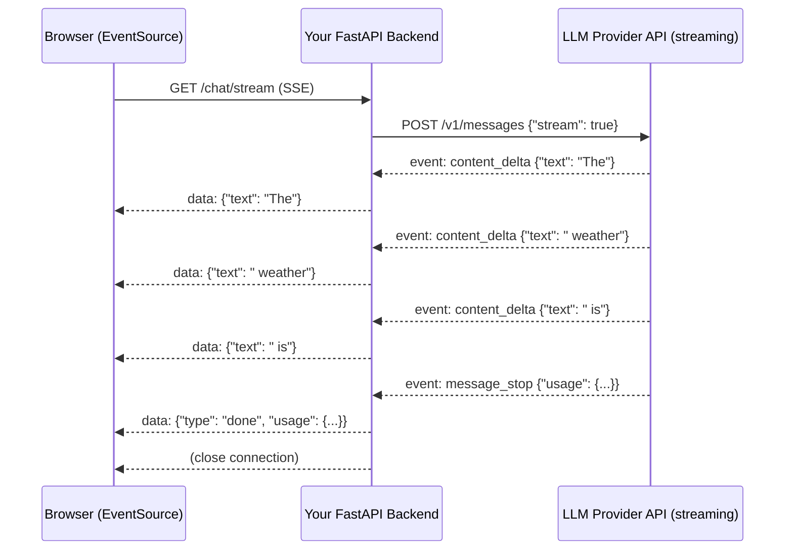

# Streaming LLM Responses

## Why This Matters

You already established in [LLM APIs](llm-apis.md) that generation latency scales with output length, because tokens are produced one at a time, autoregressively. A non-streamed response to a 500-token answer means your user (or your downstream service) waits for the *entire* generation to finish before seeing a single character — potentially many seconds of a blank loading spinner. **Streaming** exposes those tokens as they're generated, instead of buffering the whole response server-side and delivering it in one shot. This isn't a cosmetic UX nicety — it's often the difference between a chat product that feels responsive and one that feels broken, and it introduces real engineering complexity: partial JSON that isn't yet parseable, partial tool-call arguments, connection handling, and backpressure, all of which this chapter covers concretely.

## Core Concept

**Streaming** delivers an LLM's output incrementally, as a sequence of discrete events, over a single long-lived HTTP connection — most commonly using **Server-Sent Events (SSE)**, a simple, unidirectional, text-based streaming protocol built on plain HTTP (see [Part 9 — Real-Time APIs](../09-realtime-and-webhooks/README.md) for SSE fundamentals). Instead of one JSON body returned after generation completes, the server sends a series of small events — typically one per token or small token chunk — each carrying a fragment of the response, until a final event signals completion.

The core trade-off streaming introduces: you get **first-token latency** (time to the very first visible output) dramatically lower than **total completion latency** (time until the full answer is done), at the cost of needing to handle output as an *incremental, partial* stream rather than a single, complete, parseable object. This especially complicates any use case involving [Structured Outputs](structured-outputs.md) or [Tool Calling](tool-calling.md), where the "complete" response is what your validator needs — a stream of JSON fragments is, by definition, invalid JSON at every point except the very end.

## Mental Model

Think of a non-streamed LLM call like ordering a meal and being told **you'll receive the entire order at once, once every dish is fully plated** — you wait, staring at the kitchen door, with zero feedback until everything arrives together. Streaming is like a **tasting-menu service**: each course arrives the moment it's ready, so you're never staring at an empty table, even though the whole meal still takes the same total time to prepare. The kitchen (the model) isn't cooking any faster — the total time to have everything is unchanged — but your *experience* of waiting is transformed, because you have something to engage with almost immediately.

This mental model also explains why streaming complicates structured output: if the "meal" is actually one dish that only makes sense assembled (a single JSON object), getting it "course by course" means you're holding half-plated food that isn't edible yet — you have to wait for the whole dish before you can act on it, even if you're watching it arrive piece by piece.

## How It Works

1. **Client sends a request with a streaming flag** (commonly `"stream": true`) instead of the default buffered mode.
2. **Server keeps the HTTP connection open** and, as the model generates each token (or small batch of tokens), immediately serializes and sends an SSE event — typically formatted as `data: {...}\n\n`, where the JSON payload describes an incremental delta (a text fragment, a partial tool-call argument chunk, or a control event like "message started" / "message complete").
3. **Client reads events as they arrive**, appending each fragment to a growing buffer, and can render/act on partial content incrementally (e.g., displaying text as it's typed out).
4. **A final event signals completion** — carrying the stop/finish reason and, often, the final `usage` token counts (which frequently aren't known until generation actually finishes).
5. **The connection closes** (or the client closes it) once the terminal event is received.

For **tool calls specifically**, streaming delivers the function name and arguments incrementally too — meaning your client receives arguments as a growing string of JSON that is *not valid JSON* until the final chunk arrives. Production streaming clients that need the complete tool call (which is almost always — you can't safely execute a tool from a half-formed arguments object) must **buffer tool-call argument fragments separately from any user-facing text stream**, and only attempt to parse/validate once an explicit "tool call complete" signal arrives, exactly as you would validate a non-streamed structured output (see [Structured Outputs](structured-outputs.md)).

**Backpressure** matters here too: if your client (or a downstream consumer, like a browser rendering text) can't keep up with the rate of incoming events, buffered events pile up in memory. Well-behaved streaming clients apply backpressure by not requesting/reading faster than they can process, and well-behaved servers respect standard TCP flow control rather than assuming the client can always keep pace.

## Architecture



Your backend here acts as a **relay**, translating the provider's stream into your own SSE event format for the browser — this indirection is deliberate: it lets you normalize event shapes across providers, inject your own events (progress updates during a tool-calling loop, for instance), and avoid exposing raw provider payloads (and API keys) directly to the client.

## Request / Response Example

Shown in an Anthropic/OpenAI-style format — exact SSE event names and payload shapes vary by provider:

```http
POST /v1/messages HTTP/1.1
Host: api.llmprovider.example.com
Authorization: Bearer sk-...redacted...
Content-Type: application/json
Accept: text/event-stream

{
  "model": "large-model-v2",
  "max_tokens": 100,
  "stream": true,
  "messages": [{ "role": "user", "content": "Say hello in three languages." }]
}
```

```http
HTTP/1.1 200 OK
Content-Type: text/event-stream

event: message_start
data: {"id": "msg_03Tw", "model": "large-model-v2"}

event: content_block_delta
data: {"delta": {"type": "text_delta", "text": "Hello"}}

event: content_block_delta
data: {"delta": {"type": "text_delta", "text": " (English), Bonjour"}}

event: content_block_delta
data: {"delta": {"type": "text_delta", "text": " (French), Hola (Spanish)."}}

event: message_delta
data: {"stop_reason": "end_turn", "usage": {"input_tokens": 12, "output_tokens": 18}}

event: message_stop
data: {}
```

Each `content_block_delta` is a small text fragment; concatenating all of them in order reconstructs the full response text — but no single event is a complete, parseable answer on its own.

## Code Example

```python
import os
import json
import httpx
from fastapi import FastAPI
from fastapi.responses import StreamingResponse

app = FastAPI()
LLM_API_KEY = os.environ["LLM_API_KEY"]
LLM_ENDPOINT = "https://api.llmprovider.example.com/v1/messages"


async def stream_llm_events(prompt: str):
    """Relay the provider's SSE stream to our own client as normalized SSE
    events. Buffers nothing beyond the current chunk for TEXT content --
    but see the tool-call note below for why that's NOT safe for tool args."""
    async with httpx.AsyncClient(timeout=httpx.Timeout(connect=10.0, read=60.0, write=10.0, pool=10.0)) as client:
        async with client.stream(
            "POST", LLM_ENDPOINT,
            headers={"Authorization": f"Bearer {LLM_API_KEY}", "Accept": "text/event-stream"},
            json={
                "model": "large-model-v2",
                "max_tokens": 500,
                "stream": True,
                "messages": [{"role": "user", "content": prompt}],
            },
        ) as response:
            response.raise_for_status()
            async for line in response.aiter_lines():
                if not line.startswith("data:"):
                    continue
                payload = line.removeprefix("data:").strip()
                if not payload:
                    continue
                event = json.loads(payload)
                delta = event.get("delta", {})
                if delta.get("type") == "text_delta":
                    # SSE wire format: "data: <json>\n\n"
                    yield f"data: {json.dumps({'text': delta['text']})}\n\n"
            yield f"data: {json.dumps({'type': 'done'})}\n\n"


@app.get("/chat/stream")
async def chat_stream(prompt: str):
    return StreamingResponse(
        stream_llm_events(prompt),
        media_type="text/event-stream",
        headers={"Cache-Control": "no-cache", "X-Accel-Buffering": "no"},
    )


# --- Buffering tool-call arguments correctly (do NOT parse mid-stream) ---
async def collect_streamed_tool_call(event_stream) -> dict:
    """Tool-call arguments arrive as incremental JSON string fragments.
    They are NOT valid JSON until the final fragment arrives -- buffer
    everything and parse ONCE, at completion, never per-chunk."""
    name = None
    args_buffer = ""
    async for event in event_stream:
        if event["type"] == "tool_use_start":
            name = event["name"]
        elif event["type"] == "tool_use_delta":
            args_buffer += event["partial_json"]  # accumulate, do not parse yet
        elif event["type"] == "tool_use_stop":
            break
    return {"name": name, "arguments": json.loads(args_buffer)}  # parse once, validate after
```

## Production Considerations

- **First-token latency and total latency are different metrics — measure both.** Streaming primarily improves perceived responsiveness (first-token latency); it does not reduce the total time or cost of generation, which is unchanged.
- **Reverse proxies and load balancers can buffer SSE responses by default**, silently defeating streaming (the client still waits for the whole response, just from your infrastructure instead of the provider). Explicitly disable proxy buffering for streaming endpoints (e.g., `X-Accel-Buffering: no` for nginx) and verify end-to-end in a production-like environment, not just locally.
- **Never parse partial JSON mid-stream** for structured output or tool calls — buffer the full fragment sequence and parse/validate only once a completion signal is received, exactly as shown in `collect_streamed_tool_call` above.
- **Dropped connections mid-stream are a normal failure mode**, not an edge case — a user closing a browser tab, a mobile network hiccup, or a proxy timeout will interrupt streams regularly at scale. Handle client disconnects by cancelling the underlying provider request (to avoid paying for generation nobody will see) and ensure partial state doesn't corrupt anything you're persisting.
- **Billing and final `usage` counts often only arrive in the terminal event**, not incrementally — don't try to reconstruct token usage from counting text deltas yourself; wait for and use the authoritative final event.
- **Backpressure**: if downstream consumers (e.g., a slow websocket-to-browser bridge) can't keep up, an unbounded internal buffer of streamed chunks becomes a memory-growth risk under load — apply bounded queues and drop-or-slow-upstream strategies deliberately rather than buffering unboundedly.

## Common Mistakes

- **Attempting `json.loads()` on each individual streamed chunk** of a structured/tool-call response, which fails on every chunk except the very last one.
- **Not disabling proxy/gateway buffering**, resulting in a "streaming" endpoint that still delivers everything at once from the client's perspective, defeating the entire purpose.
- **Not handling client disconnects**, leaving the upstream LLM request running (and billing) to completion even though nobody will ever receive the output.
- **Assuming streaming reduces total cost or generation time** — it changes the delivery pattern, not the underlying compute or token economics.
- **Forgetting a heartbeat/keep-alive for long gaps between tokens**, allowing intermediate proxies or load balancers to time out an idle-looking connection even though generation is still in progress.

## Best Practices

- Stream text responses whenever a human is waiting synchronously — the perceived responsiveness improvement is substantial and nearly free to implement.
- Buffer tool-call/structured-output fragments fully and parse/validate exactly once, at the completion signal — never attempt incremental JSON parsing.
- Explicitly disable response buffering at every layer between your server and the client (reverse proxy, CDN, load balancer) and verify streaming actually works end-to-end in your real deployment topology.
- Propagate client disconnects to cancel the upstream provider request, avoiding paying for generation with no recipient.
- Use the terminal event's authoritative `usage` data for billing/logging, not a client-side reconstruction from counting deltas.

## AI Engineering Perspective

Streaming interacts with nearly every other chapter in this part: with [Tool Calling](tool-calling.md), a multi-iteration agent loop can stream the *text* portions of each turn to the user for responsiveness while still fully buffering each tool call's arguments before execution — meaning a single agent response to the user might interleave several streamed text segments with silent (buffered, non-streamed-to-the-user) tool-execution steps in between. In [RAG APIs](../16-rag-apis/README.md), streaming is what makes retrieval-augmented answers feel fast despite the added latency of a retrieval step before generation even starts — showing retrieved-source indicators or a "searching..." state while retrieval runs, then streaming the generated answer once retrieval completes, is a common pattern for absorbing that extra latency into a still-responsive UX. In [AI Agents & MCP](../17-ai-agents-and-mcp/README.md), streaming becomes essential for observability of long-running agents — surfacing intermediate steps ("calling `search_orders`...", "checking inventory...") as streamed status events lets a user see progress through a multi-minute agent run instead of staring at a blank screen, which is as much a trust and UX requirement as a technical one for agentic products. See the runnable example at [`examples/llm-streaming/`](../../examples/llm-streaming/) for a complete FastAPI SSE streaming endpoint.

## Exercises

**Beginner**
1. Using the code example's `stream_llm_events`, explain what would go wrong if you tried to call `json.loads()` on each `data:` payload's `text` field individually and concatenate the *parsed* results, versus concatenating the raw text first and treating the whole thing as one string.

**Intermediate**
2. Add a heartbeat event (e.g., a comment line `: keep-alive\n\n`) to the `stream_llm_events` generator, sent every 15 seconds of no real content, to prevent idle-timeout disconnects during long gaps between tokens.

**Advanced**
3. Design a streaming architecture for an agent endpoint that must: stream text tokens to the client as they're generated, but fully buffer and validate each tool call before executing it, and emit a distinct SSE event type for "tool call started," "tool call result," and "final answer token" so the client can render a rich, step-by-step UI. Specify your SSE event schema.

## Key Takeaways

- Streaming delivers output incrementally over a long-lived SSE connection, dramatically improving perceived (first-token) latency without changing total generation time or cost.
- Text can be safely rendered incrementally as it arrives; structured output and tool-call arguments must be fully buffered and parsed/validated only once, at completion — never parse partial JSON.
- Infrastructure (reverse proxies, load balancers) can silently buffer streaming responses unless explicitly configured not to — verify streaming works end-to-end in your real deployment, not just locally.
- Handle client disconnects by cancelling the upstream provider call, and use the terminal event's authoritative usage data for billing.
- Streaming is foundational UX infrastructure for agent loops and RAG systems in Parts 16–17, where multi-step latency makes responsive, incremental feedback especially important.
