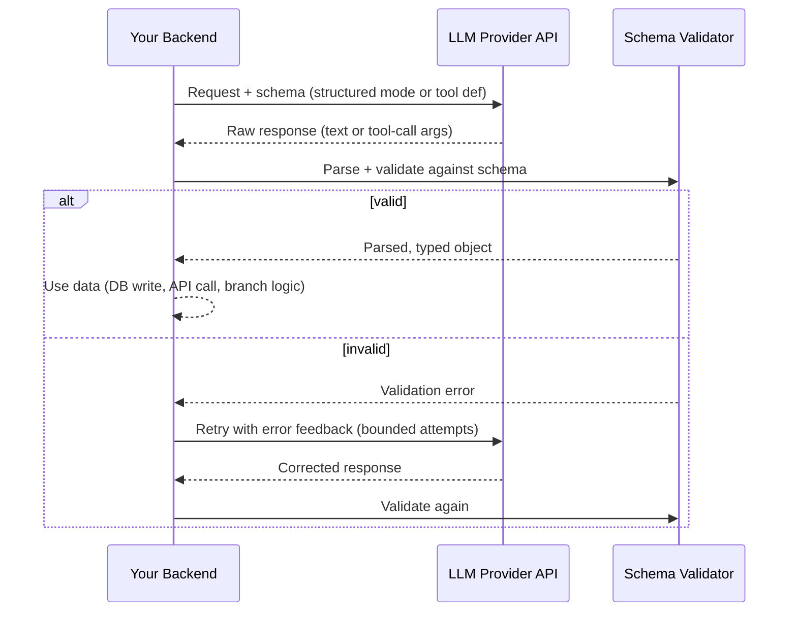

# Structured Outputs

## Why This Matters

The moment you want to do anything beyond "show the model's text response to a human" — populate a database record, call another API with extracted fields, branch your application logic on a classification — you need the LLM's output to be **reliable, machine-parseable data**, not prose. This is harder than it sounds. LLMs are trained primarily to produce fluent natural language, and "please respond only with valid JSON matching this exact schema" is a constraint layered on top of that, not the model's native mode. Naively asking for JSON in a prompt and calling `json.loads()` on the response is one of the most common sources of silent production failures in AI-integrated systems: extra prose before the JSON, trailing commas, unescaped quotes, or a field that's the wrong type. This chapter covers why structured output is hard and the real techniques for getting it reliably.

## Core Concept

**Structured output** means constraining an LLM's response to conform to a predefined schema — a JSON object with specific fields and types, an enum value from a fixed set, or a set of function-call arguments — rather than free-form text. There are three tiers of reliability, roughly in increasing order of robustness:

1. **Prompt-only ("please output JSON")** — you ask nicely in the prompt and hope. The least reliable approach; the model can add explanatory text, use inconsistent formatting, or subtly deviate from the schema, especially on longer or more complex outputs.
2. **Schema-constrained decoding** — some providers offer a mode (often called "JSON mode" or "structured output mode") where you supply a JSON Schema and the provider's inference engine *constrains the token sampling itself* so that only tokens which keep the output valid against the schema are ever considered. This moves validity enforcement from "the model tries hard" to "the decoding process cannot produce invalid tokens," and is meaningfully more reliable.
3. **Tool-calling-as-structured-output** — instead of asking the model to write JSON as its answer text, you define a "tool" (see [Tool Calling](tool-calling.md)) whose input schema *is* your desired output shape, and prompt the model to "call" that tool with the extracted data. Because tool-calling is a first-class trained capability in modern models (with its own schema-validation machinery on the provider side), this is often the most reliable way to get structured data out of an LLM in practice, even when you never intend to actually "execute" the tool — you're using the tool-calling mechanism purely as a structured-output channel.

Regardless of which tier you use, **validation and retry remain necessary**. No current technique offers an unconditional 100% guarantee across every provider and model, and schema-shape validity doesn't guarantee semantic correctness (the JSON can be perfectly valid and still contain a hallucinated or wrong value).

## Mental Model

Think of asking an LLM for structured output like asking a very articulate but occasionally over-eager person to **fill out a paper form** instead of writing a letter. Prompt-only JSON is like just telling them "please format your answer as a form" — most of the time they will, but sometimes they'll add a cover note, misspell a field label, or write "N/A" in a field that was supposed to be a number. Schema-constrained decoding is like handing them an actual form with fixed boxes — they physically cannot write outside the number box a letter, only digits fit. Tool-calling-as-structured-output is like handing them a specific department's official intake form, one they've filled out thousands of times in training and are drilled to fill out correctly, whose fields you defined yourself. In all three cases, though, you should still have someone check the form for a plausible, complete answer before filing it — that's your validation-and-retry layer.

## How It Works

The end-to-end structured-output pipeline, regardless of which tier you use, looks like this:

1. **Define the schema** — typically as JSON Schema (see [JSON Schemas](json-schemas.md)), describing field names, types, required fields, and constraints (enums, min/max, string patterns).
2. **Send the schema to the model** — either embedded in the prompt/system message, passed via a dedicated structured-output API parameter, or expressed as a tool definition, depending on which tier and provider you're using.
3. **Model generates output** conforming (with varying strength of guarantee) to the schema.
4. **Parse the raw output.** For prompt-only or standard text responses, this means extracting the JSON substring from the response text (models frequently wrap JSON in prose or code fences even when asked not to) before calling a JSON parser.
5. **Validate against the schema** using a real validation library (e.g., Pydantic in Python) — checking types, required fields, and any semantic constraints you can express (value ranges, enum membership).
6. **On validation failure, retry** — typically by sending the validation error back to the model as a new turn ("your last response failed validation: missing field `email`. Please correct and resend.") and asking it to regenerate, rather than blindly retrying the identical request.
7. **Cap retries** and have an explicit failure path (return an error to the caller, fall back to a default, or escalate to a human) — an unbounded retry loop against a paid API is both a cost risk and a latency risk.

## Architecture



The validator is not optional infrastructure — it's the component that turns "the model tried to give us JSON" into "we have a typed object we can trust enough to act on."

## Request / Response Example

Shown in an Anthropic/OpenAI-style format using tool-calling as the structured-output channel — exact field names vary by provider:

```http
POST /v1/messages HTTP/1.1
Host: api.llmprovider.example.com
Authorization: Bearer sk-...redacted...
Content-Type: application/json

{
  "model": "large-model-v2",
  "max_tokens": 300,
  "tools": [{
    "name": "extract_invoice",
    "description": "Extract structured invoice data",
    "input_schema": {
      "type": "object",
      "properties": {
        "vendor": { "type": "string" },
        "total_amount": { "type": "number" },
        "currency": { "type": "string", "enum": ["USD", "EUR", "GBP"] },
        "line_items": {
          "type": "array",
          "items": { "type": "object", "properties": {
            "description": { "type": "string" }, "amount": { "type": "number" }
          }, "required": ["description", "amount"] }
        }
      },
      "required": ["vendor", "total_amount", "currency"]
    }
  }],
  "tool_choice": { "type": "tool", "name": "extract_invoice" },
  "messages": [{ "role": "user", "content": "Invoice from Acme Supplies: $482.50 USD, item: office chairs $482.50" }]
}
```

```http
HTTP/1.1 200 OK
Content-Type: application/json

{
  "content": [{
    "type": "tool_use",
    "id": "toolu_01Xy",
    "name": "extract_invoice",
    "input": {
      "vendor": "Acme Supplies",
      "total_amount": 482.5,
      "currency": "USD",
      "line_items": [{ "description": "office chairs", "amount": 482.5 }]
    }
  }],
  "stop_reason": "tool_use"
}
```

Forcing `tool_choice` to the specific tool guarantees the model responds with (its attempt at) that structured shape rather than free text — this is the tool-calling-as-structured-output pattern in action.

## Code Example

```python
import json
from pydantic import BaseModel, ValidationError


class LineItem(BaseModel):
    description: str
    amount: float


class Invoice(BaseModel):
    vendor: str
    total_amount: float
    currency: str
    line_items: list[LineItem] = []


def extract_json_from_text(text: str) -> str:
    # Models sometimes wrap JSON in prose or code fences even when told not to.
    # This is a defensive extraction, not a substitute for real validation.
    start = text.find("{")
    end = text.rfind("}")
    if start == -1 or end == -1:
        raise ValueError("No JSON object found in model output")
    return text[start:end + 1]


async def extract_invoice(raw_text: str, llm_client, max_retries: int = 2) -> Invoice:
    messages = [
        {"role": "user", "content": f"Extract invoice data as JSON: {raw_text}"}
    ]
    for attempt in range(max_retries + 1):
        response = await llm_client.messages.create(
            model="large-model-v2",
            max_tokens=300,
            temperature=0,  # low temperature: we want reliable structure, not variety
            messages=messages,
        )
        raw = response.content[0].text
        try:
            json_str = extract_json_from_text(raw)
            data = json.loads(json_str)
            return Invoice.model_validate(data)  # raises ValidationError on schema mismatch
        except (ValueError, json.JSONDecodeError, ValidationError) as e:
            if attempt == max_retries:
                raise RuntimeError(f"Failed to extract valid invoice after {max_retries} retries") from e
            # Feed the error back to the model instead of blindly retrying identical input.
            messages.append({"role": "assistant", "content": raw})
            messages.append({
                "role": "user",
                "content": f"That response was invalid: {e}. Return ONLY corrected valid JSON matching the schema.",
            })
    raise AssertionError("unreachable")
```

## Production Considerations

- **Never treat LLM output as valid JSON without parsing and validating it.** Even schema-constrained modes are provider features with their own edge cases and version-specific behavior — validate defensively regardless of which tier you use.
- **Bound your retry loop.** Each retry is a full additional paid API call with its own latency; an unbounded "keep retrying until valid" loop is both a cost and latency risk under load, and should have a hard cap plus an explicit failure path.
- **Schema validity is necessary, not sufficient.** A perfectly schema-valid response can still contain a hallucinated value (an invented invoice total, a wrong-but-plausible field). Structured output solves the *shape* problem, not the *truthfulness* problem — pair it with domain-specific sanity checks where accuracy matters (e.g., cross-check extracted totals against line-item sums).
- **Log both raw model output and validation failures.** When validation fails, you need the raw text to debug why — silently discarding failed attempts makes production issues nearly impossible to diagnose after the fact.
- **Structured-output feature support and exact syntax vary significantly by provider and even by model version** — always check current provider docs rather than assuming a JSON-mode parameter name or tool-forcing syntax is portable.

## Common Mistakes

- **Calling `json.loads()` directly on raw model output** without stripping surrounding prose, code fences, or handling parse errors — this fails the moment the model adds even one sentence of preamble.
- **Treating a successful schema validation as proof of correctness**, skipping any check on whether the extracted values are actually plausible or consistent with the source text.
- **Using high temperature for extraction tasks**, increasing the rate of malformed or inconsistent structured output (see [Temperature and Sampling](temperature-and-sampling.md)).
- **Retrying with the exact same prompt** instead of including the validation error, which often produces the same invalid output again.
- **No retry cap**, letting a persistently malformed response loop indefinitely and rack up cost.

## Best Practices

- Prefer tool-calling-as-structured-output or a provider's native schema-constrained mode over prompt-only JSON requests whenever available — they're materially more reliable.
- Always validate with a real schema/type library (e.g., Pydantic) rather than ad hoc key-checking.
- Use low temperature for structured-extraction tasks.
- Bound retries (2–3 attempts is typical), feed the validation error back into the retry prompt, and define an explicit terminal failure behavior.
- Log raw model responses alongside validation outcomes for debugging and for building a regression test set of tricky inputs.

## AI Engineering Perspective

Structured output is the connective tissue between "an LLM said something" and "a system can act on it," and it shows up constantly across the rest of this handbook. In [RAG APIs](../16-rag-apis/README.md), structured output is used both for query understanding (turning a user's free-text question into a structured search/filter request) and for citation-tagged answers (returning an answer plus which source chunks it drew from, as a schema field rather than embedded prose). In [AI Agents & MCP](../17-ai-agents-and-mcp/README.md), tool-calling-as-structured-output *is* the agent loop's core mechanism — every "decision" an agent makes about which action to take is, mechanically, a structured-output problem wearing a different name; the reliability techniques in this chapter (schema validation, bounded retries, low temperature) apply directly to agent tool-selection steps, where a malformed tool call can otherwise crash or stall an entire multi-step workflow. Provider nuance is significant here: some providers' schema-constrained modes guarantee syntactic validity but not necessarily adherence to every constraint (e.g., `enum` restrictions or `minItems`) at the same strength — always test your specific schema against your specific provider/model combination rather than assuming uniform guarantees.

## Exercises

**Beginner**
1. Write a prompt asking an LLM to return a person's name and age as JSON, without using any structured-output feature. Run it 10 times and count how many outputs fail `json.loads()` due to extra text or formatting issues.

**Intermediate**
2. Implement the `extract_invoice` retry loop above end-to-end against a real or mocked LLM client, and add a unit test that simulates a validation failure on the first attempt and success on the second.

**Advanced**
3. Design a structured-output pipeline for a customer support ticket classifier that must output one of five fixed categories plus a confidence-relevant field, comparing the reliability trade-offs of prompt-only JSON vs. tool-calling-as-structured-output, and specifying what your system does when validation fails after the retry cap is exhausted.

## Key Takeaways

- Getting reliable structured data from an LLM ranges from unreliable (prompt-only JSON) to more reliable (schema-constrained decoding) to often-most-reliable (tool-calling-as-structured-output) — but none is an unconditional guarantee.
- Validation with a real schema/type library is mandatory regardless of technique; never assume LLM output is valid JSON.
- Schema validity proves shape correctness, not truthfulness — a hallucinated value can still pass validation.
- Retry loops must be bounded, should feed the validation error back to the model, and need an explicit failure path.
- Tool-calling-as-structured-output is the same mechanism that powers agent decision-making in Part 17 — mastering it here pays off directly there.
