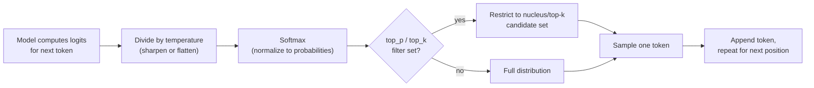

# Temperature and Sampling

## Why This Matters

You'll frequently see `temperature: 0.7` in example code with no explanation, and it's tempting to leave it at whatever the default is and move on. But sampling parameters are the single biggest lever you have over *how* an LLM generates text — and getting them wrong produces two very different, very real production failure modes: outputs that are boringly repetitive and unhelpful (temperature too low for a creative task), or outputs that are inconsistent, hallucination-prone, and fail structured-output validation unpredictably (temperature too high for a task requiring precision). Understanding what's actually happening mechanically when you set these parameters — not just "higher means more random" — lets you tune them deliberately instead of by trial and error.

## Core Concept

When a model generates the next token, it doesn't just pick "the best" token — it computes a **probability distribution over its entire vocabulary** for what could come next, and then **samples** from that distribution according to a chosen strategy. The parameters you control shape that sampling:

- **Temperature** — scales the "sharpness" of the probability distribution before sampling. Low temperature (near 0) sharpens the distribution toward the highest-probability tokens, making output more deterministic and "safe." High temperature (approaching or above 1) flattens the distribution, giving lower-probability tokens a real chance of being picked, producing more varied, sometimes surprising output. At `temperature: 0`, generation becomes (near-)deterministic — always or almost always picking the single highest-probability token (this is often called **greedy decoding**).
- **Top-p (nucleus sampling)** — instead of considering the full vocabulary, restrict sampling to the smallest set of tokens whose cumulative probability reaches `p` (e.g., `top_p: 0.9` means "only sample from the smallest group of tokens that together account for 90% of the probability mass"), then sample from that restricted set (optionally with temperature still applied). This adapts the candidate pool size to the situation: when the model is very confident, the nucleus is small even at high `p`; when it's uncertain, the nucleus is larger.
- **Top-k** — a simpler, cruder cousin: restrict sampling to only the `k` highest-probability tokens, regardless of their actual probability mass, then sample from those.

These parameters interact — many APIs let you set temperature and top-p simultaneously, and providers differ on exactly how they compose. The practical guidance is simpler than the mechanics suggest: usually you tune *one* primary knob (most commonly temperature) and leave the others at sensible defaults, rather than fighting all three at once.

## Mental Model

Picture the model, at each step, holding a **weighted lottery** over every possible next token — common, sensible continuations get many tickets; rare or nonsensical ones get very few, but not zero. **Temperature** is a dial that either concentrates all the tickets into the top few candidates (low temperature — the lottery is rigged toward the obvious winner) or spreads tickets out more evenly across many candidates (high temperature — even long-shot tickets get drawn sometimes). **Top-p** changes the rule of the lottery itself: instead of "any ticket in the bin," it says "only tickets belonging to entries that together make up the top 90% of ticket-holders are even in the bin" — trimming away the longest of long shots before the draw happens, so you get variety without truly absurd outliers.

At `temperature: 0`, there's effectively no lottery — you always hand the prize to whichever entry has the most tickets. This is why `temperature: 0` is the closest thing to "deterministic" an LLM API offers, but it is usually *not* perfectly deterministic in practice: floating-point non-associativity across different hardware/batch configurations on the provider's infrastructure can still produce tiny variations, so treat `temperature: 0` as "very low variance," not as a cryptographic guarantee of identical output every time.

## How It Works

1. The model produces **logits** — raw, unnormalized scores for every token in the vocabulary, representing "how likely is this token to come next" given everything seen so far.
2. Logits are divided by the temperature value and passed through a **softmax** function to convert them into a proper probability distribution. Dividing by a small temperature (e.g., 0.2) exaggerates differences between logits before softmax, concentrating probability on the top candidates; dividing by a large temperature (e.g., 1.5) shrinks those differences, flattening the distribution.
3. If **top-p** or **top-k** is set, the distribution is further restricted to a candidate subset before sampling — this is a separate filtering step from temperature, applied to the same underlying distribution.
4. A token is **sampled** (a weighted random draw) from the resulting distribution, appended to the sequence, and the process repeats for the next token.

This means temperature and top-p don't change *what the model "knows"* — they change how much randomness is injected into which token gets picked, given the model's existing confidence. A model that's very confident about the next token (a sharply peaked distribution) will behave similarly across a range of temperatures; a model that's genuinely uncertain (a flat distribution, common at points requiring creative or open-ended continuation) will show much more visible variation as you change temperature.

## Architecture



This loop runs once per output token — sampling parameters affect every single token generated, not just an overall "style" choice made once per request.

## Request / Response Example

Shown in an Anthropic/OpenAI-style format — exact parameter names and defaults vary by provider:

```http
POST /v1/messages HTTP/1.1
Host: api.llmprovider.example.com
Authorization: Bearer sk-...redacted...
Content-Type: application/json

{
  "model": "large-model-v2",
  "max_tokens": 200,
  "temperature": 0.9,
  "top_p": 0.95,
  "messages": [
    { "role": "user", "content": "Write three creative taglines for a coffee subscription box." }
  ]
}
```

```http
HTTP/1.1 200 OK
Content-Type: application/json

{
  "content": [{ "type": "text", "text": "1. Wake Up to Wonder.\n2. Your Morning, Reimagined.\n3. Brewed for the Curious." }],
  "stop_reason": "end_turn",
  "usage": { "input_tokens": 21, "output_tokens": 24 }
}
```

Running this exact request again with the same `temperature: 0.9` would very likely produce *different* taglines — that's the intended behavior for a creative task, not a bug. Contrast with a data-extraction request, where you'd set `temperature: 0` and expect near-identical output run to run.

## Code Example

```python
import os

# Task-appropriate temperature presets -- centralize these instead of
# scattering magic numbers like `temperature: 0.9` across the codebase.
TEMPERATURE_PRESETS = {
    "extraction": 0.0,     # structured data extraction: want determinism
    "classification": 0.0, # picking from a fixed set of labels
    "summarization": 0.2,  # mostly faithful, slight room for phrasing variety
    "chat": 0.7,           # conversational, natural variety
    "brainstorm": 1.0,     # maximum creative variety
}


async def generate(task: str, prompt: str, llm_client):
    temperature = TEMPERATURE_PRESETS.get(task, 0.7)
    response = await llm_client.messages.create(
        model="large-model-v2",
        max_tokens=500,
        temperature=temperature,
        messages=[{"role": "user", "content": prompt}],
    )
    return response.content[0].text


# Example: verifying near-determinism at temperature 0 for a critical path,
# such as structured extraction feeding a downstream system.
async def extract_with_consistency_check(prompt: str, llm_client, retries: int = 1):
    results = []
    for _ in range(retries + 1):
        text = await generate("extraction", prompt, llm_client)
        results.append(text)
    if len(set(results)) > 1:
        # Even at temperature 0, outputs diverged -- log this, it can indicate
        # provider-side non-determinism or an ambiguous prompt worth revisiting.
        print("Warning: outputs diverged at temperature 0", results)
    return results[0]
```

## Production Considerations

- **Match temperature to the task, not to a single global default.** A structured-extraction endpoint and a creative-writing endpoint in the same product should almost never share the same temperature setting.
- **Low temperature reduces but does not eliminate non-determinism.** Don't build logic (including tests) that assumes byte-identical output at `temperature: 0` — assert on structure/semantics, not exact string equality, unless the provider explicitly guarantees determinism (most don't).
- **High temperature increases the rate of malformed structured output.** If you're asking for [Structured Outputs](structured-outputs.md) or [Tool Calling](tool-calling.md), high temperature makes schema-invalid or hallucinated field values more likely — these tasks generally want low temperature regardless of how "creative" the rest of your product is.
- **Temperature does not fix factual accuracy.** Lowering temperature makes the model more likely to output its *most probable* continuation, not its *most correct* one — a confidently wrong answer at high temperature is often still confidently wrong at low temperature, just more consistently so.
- **A/B and evaluation pipelines need to account for sampling variance.** If your eval harness runs a prompt once and treats the result as representative, a nonzero temperature can make evaluation noisy and misleading; consider running multiple samples for tasks where temperature > 0.

## Common Mistakes

- **Using the default temperature everywhere** without considering whether the task needs determinism (extraction, classification) or variety (brainstorming, creative writing).
- **Assuming `temperature: 0` means perfectly reproducible output** across calls, retries, or even provider infrastructure changes, and building strict equality tests on top of that assumption.
- **Treating temperature as a fix for hallucination or factual errors** rather than what it actually controls: sampling variance, not truthfulness.
- **Tuning temperature, top-p, and top-k all simultaneously** without understanding how they interact, leading to output behavior that's hard to reason about or reproduce.
- **Using high temperature for tool-calling or JSON-generating requests**, increasing the rate of malformed function-call arguments that then fail validation downstream.

## Best Practices

- Set temperature deliberately per use case, and document *why* — extraction/classification near 0, general chat in a moderate range, creative tasks higher.
- Prefer adjusting temperature over top-p/top-k as your primary tuning knob unless you have a specific reason to need nucleus sampling's adaptive behavior.
- For anything feeding structured parsing (JSON, function calls), default to low temperature and pair it with schema validation regardless (see [Structured Outputs](structured-outputs.md)) — sampling settings reduce but never eliminate the need to validate.
- When comparing prompts or models in an evaluation pipeline, either fix temperature to 0 for a fair, low-variance comparison, or run multiple samples per condition if you specifically want to measure variance.

## AI Engineering Perspective

Sampling parameters interact directly with the other systems covered in this handbook. In [Structured Outputs](structured-outputs.md) and [Tool Calling](tool-calling.md), low temperature is close to mandatory — you're asking the model to produce syntactically exact output (valid JSON, correct argument types), and higher sampling variance directly increases parse/validation failure rates that your retry logic then has to absorb. In [RAG APIs](../16-rag-apis/README.md), temperature affects how liberally the model paraphrases versus stays close to retrieved source text — a low temperature setting is often preferred for factual QA over retrieved documents specifically to reduce the model's tendency to embellish beyond what was retrieved. In [AI Agents & MCP](../17-ai-agents-and-mcp/README.md), the temperature used for the "decide which tool to call" step is usually kept low for reliability, while a downstream "summarize the result for the user" step in the same agent loop might reasonably use a higher temperature — meaning a well-built agent doesn't use one global temperature, it uses different sampling settings per *step* of its own internal pipeline. Provider nuance: some providers expose only temperature, some expose temperature and top-p and let you combine them, and a few providers recommend against setting both simultaneously — always check current provider docs rather than assuming settings compose the same way everywhere.

## Exercises

**Beginner**
1. Send the same prompt to an LLM API three times at `temperature: 1.0`, then three times at `temperature: 0`. Compare the variance in outputs. Explain the difference in terms of the probability distribution being sampled.

**Intermediate**
2. Build a small harness that sends a structured-extraction prompt (e.g., "extract name and age as JSON") at three different temperatures and measures the JSON-parse-success rate at each, over 20 runs per temperature.

**Advanced**
3. Design a per-step sampling configuration for a multi-stage agent pipeline (tool selection → tool execution → response summarization), justifying the temperature and top-p choice for each stage based on whether it needs determinism or variety.

## Key Takeaways

- Temperature scales how sharply the model's next-token probability distribution is sampled; top-p and top-k restrict the candidate pool before sampling.
- Low temperature approximates determinism (greedy decoding) but is not a strict guarantee; high temperature increases variety and the rate of malformed structured output.
- Temperature does not improve factual accuracy — it controls sampling variance, not truthfulness.
- Match sampling settings to the task: near-zero for extraction/classification/tool-calling, moderate-to-high for open-ended or creative generation.
- Well-built multi-step AI systems (RAG, agents) often use different sampling settings per internal step, not one global temperature for the whole pipeline.
