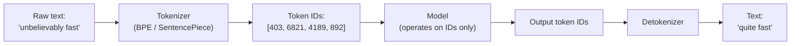

# Tokens and Tokenization

## Why This Matters

Every dimension you care about as an API engineer — cost, latency, whether a request fits, rate limits — is measured in **tokens**, not characters and not words. If your mental model is "the price is per word" or "the limit is number of characters," you will consistently mis-estimate cost, get surprised by rate limit errors, and write context-truncation logic that either wastes budget or cuts things off too aggressively. Tokens are the actual unit of currency and capacity for every LLM API, and understanding how tokenization works — not just that it exists — is what lets you estimate and control both.

## Core Concept

A **token** is the atomic unit an LLM actually processes — not a character, not a word, but a chunk of text produced by a **tokenizer** using a scheme called **subword tokenization** (commonly a variant of Byte-Pair Encoding, BPE, or SentencePiece). Common English words are often a single token (`"the"`, `"cat"`). Less common words, made-up words, code identifiers, and non-English text are frequently split into multiple sub-word tokens (`"tokenization"` might become `"token"` + `"ization"`; `"unbelievably"` might become `"un"` + `"believ"` + `"ably"`).

The rough, commonly cited heuristic for English prose is **~4 characters per token**, or **~0.75 tokens per word** — but this is only a rule of thumb. It breaks down badly for:

- **Code**, where punctuation-dense, non-natural-language text tokenizes less efficiently (more tokens per character).
- **Non-English languages**, especially non-Latin scripts, which can require significantly more tokens per "word" than English, because most tokenizers are trained on English-majority corpora.
- **Rare identifiers, UUIDs, and random strings**, which tokenize into many small pieces since the tokenizer has never seen them as a common unit.
- **Numbers**, which are often tokenized digit-by-digit or in small groups, not as whole numbers — this matters if you're asking a model to do arithmetic or count things.

## Mental Model

Think of tokenization like a courier service that only accepts packages built from a **fixed catalog of pre-made boxes** (the vocabulary — typically 30,000 to 200,000+ entries depending on the model). Common shapes ("the," "and," "-ing") have a dedicated box ready to go. Anything that doesn't match a common box gets broken down into the smallest set of catalog boxes that reconstructs it — which is why an uncommon word costs *more boxes* (tokens) than a common one of the same character length. You're not billed per letter or per word; you're billed per box, and the courier's catalog was fixed once, at training time, and doesn't adapt to your specific text.

This is also why token counts are surprising in both directions: `"ChatGPT"` might be one or two tokens (if it's common in training data), while a random hex string like `"a83fce91b2"` might be six or more, because the tokenizer has never seen that exact substring often enough to warrant its own catalog entry.

## How It Works

1. **Vocabulary construction (offline, at training time).** The model's tokenizer is trained on a large text corpus using an algorithm like BPE: start with individual bytes/characters, then iteratively merge the most frequent adjacent pairs into new tokens, building up a fixed vocabulary of the most useful chunks — common whole words, common subwords, and individual bytes as a fallback for anything unrecognized.
2. **Encoding (at request time).** When you send text to the API, the tokenizer greedily matches the longest known vocabulary entries against your input, left to right (the exact matching algorithm varies), producing a sequence of token IDs — integers indexing into the vocabulary.
3. **Model processing.** The model operates entirely on token IDs, not text — its input and output are both sequences of integers, and it has no character-level or word-level "view" of the text as such except through what tokenization exposed to it.
4. **Decoding.** Output token IDs are mapped back to their text fragments and concatenated to reconstruct human-readable text.

Because tokenization happens *before* billing and rate-limit accounting, `usage.input_tokens` and `usage.output_tokens` (from [LLM APIs](llm-apis.md)) are counted in these tokenizer units, not characters or words — which is why two prompts of equal character length can have meaningfully different costs.

## Architecture



The model never sees your literal characters — everything it reasons over and everything it generates is mediated by this tokenizer boundary, which is also exactly where cost and context-window accounting happen.

## Request / Response Example

Token counts are returned in the `usage` field of a chat completion response (shown in an Anthropic/OpenAI-style format — exact field names vary by provider):

```http
POST /v1/messages HTTP/1.1
Host: api.llmprovider.example.com
Authorization: Bearer sk-...redacted...
Content-Type: application/json

{
  "model": "large-model-v2",
  "max_tokens": 50,
  "messages": [
    { "role": "user", "content": "Translate 'good morning' into three languages." }
  ]
}
```

```http
HTTP/1.1 200 OK
Content-Type: application/json

{
  "id": "msg_02Kd...",
  "content": [{ "type": "text", "text": "Spanish: Buenos días\nFrench: Bonjour\nGerman: Guten Morgen" }],
  "stop_reason": "end_turn",
  "usage": { "input_tokens": 14, "output_tokens": 17 }
}
```

Fourteen input tokens for a nine-word sentence, seventeen output tokens for a fairly short three-line answer — illustrating that token count tracks the tokenizer's actual segmentation, not a simple word count.

## Code Example

```python
import os
import tiktoken  # a widely used open-source BPE tokenizer library;
                  # your provider may publish its own tokenizer or only an estimate

# Use a tokenizer's encoding as a LOCAL ESTIMATE before sending a request.
# It will rarely be pixel-perfect for every provider/model, but it's far more
# accurate than a "characters / 4" guess, and it's free -- no API call needed.
encoding = tiktoken.get_encoding("cl100k_base")


def estimate_tokens(text: str) -> int:
    return len(encoding.encode(text))


def estimate_request_cost(
    messages: list[dict],
    expected_output_tokens: int,
    price_per_1k_input: float,
    price_per_1k_output: float,
) -> float:
    input_tokens = sum(estimate_tokens(m["content"]) for m in messages)
    input_cost = (input_tokens / 1000) * price_per_1k_input
    output_cost = (expected_output_tokens / 1000) * price_per_1k_output
    return round(input_cost + output_cost, 6)


if __name__ == "__main__":
    convo = [
        {"role": "system", "content": "You are a concise assistant."},
        {"role": "user", "content": "Explain tokenization in two sentences."},
    ]
    cost = estimate_request_cost(
        convo, expected_output_tokens=80,
        price_per_1k_input=0.003, price_per_1k_output=0.015,
    )
    print(f"Estimated cost: ${cost}")
```

## Production Considerations

- **Pre-flight token estimation prevents surprise failures.** Estimating token count before sending a request lets you decide to truncate, summarize, or reject oversized input *before* paying for a failed or truncated call.
- **Rate limits are frequently expressed as tokens-per-minute (TPM)**, not just requests-per-minute — a handful of large requests can exhaust a TPM quota just as fast as many small ones. Track cumulative token usage, not just request counts, in your rate-limit logic (see [Part 6 — Production Reliability](../06-production-reliability/README.md)).
- **Non-English and code-heavy workloads cost more than English prose of similar apparent length.** If your product serves multiple languages or handles source code, budget accordingly — the "4 characters per token" heuristic will underestimate cost.
- **Tokenizers differ by model family**, and sometimes by model version within a provider. A token-count estimate computed with the wrong tokenizer library can be meaningfully off; treat local estimates as approximations, and rely on the API's returned `usage` for ground truth billing/accounting.

## Common Mistakes

- **Estimating cost or context usage by character or word count** instead of actual tokens, leading to underestimated bills and unexpected context-window overflows.
- **Assuming numbers tokenize as whole units**, then being surprised when a model miscounts digits or mishandles large numbers in arithmetic — this is a tokenization artifact, not just a "reasoning" limitation.
- **Ignoring tokenizer differences across models** when porting prompt-length logic from one provider/model to another.
- **Not accounting for the tokens consumed by the `system` prompt, tool schemas, and message-formatting overhead** — the actual token cost of a request is more than just "the words the user typed."

## Best Practices

- Use a local tokenizer library to estimate token counts before sending requests, especially for user-supplied or highly variable-length text.
- Log actual `usage.input_tokens` / `usage.output_tokens` from every response, and periodically compare against your local estimates to catch drift.
- Budget separately for system prompts, tool/function schemas, and conversation history — all consume input tokens even though they aren't the "visible" user question.
- When cost matters, prefer models/tokenizers efficient for your dominant content type (e.g., don't assume an English-tuned model's token efficiency transfers to a codebase-heavy or multilingual workload).

## AI Engineering Perspective

Token accounting is the hidden cost driver behind almost every architecture decision in Parts 15–17. In [RAG APIs](../16-rag-apis/README.md), the chunk size you choose for document ingestion is fundamentally a tokenization decision — chunks are usually sized in tokens, not characters, precisely because retrieval budgets and context windows are token-denominated (see [Context Windows](context-windows.md)). In [AI Agents & MCP](../17-ai-agents-and-mcp/README.md), every tool schema you register with the model consumes input tokens on *every single call* in that conversation — a large toolset with verbose schemas can silently become one of the largest token costs in an agent loop, even before any tool is actually called. Provider-specific nuance matters too: some providers offer prompt caching that discounts repeated-prefix tokens (see [Part 15 — Production AI Systems](../15-production-ai-systems/README.md)), which changes the economics of large, mostly-static system prompts and tool definitions — but only if you understand tokens well enough to structure prompts so the cacheable prefix is actually stable across calls.

## Exercises

**Beginner**
1. Take a sentence in English and the same sentence translated into a non-Latin-script language. Run both through a tokenizer (e.g., `tiktoken`) and compare token counts. What does the difference tell you about cost for multilingual products?

**Intermediate**
2. Write a function that estimates whether a given conversation (list of messages) plus a planned `max_tokens` output will fit inside a stated context window, using a local tokenizer.

**Advanced**
3. Design a token-budget allocator for a RAG-style request: given a fixed context window, a system prompt, conversation history, and N retrieved chunks of varying token length, decide how many chunks to include and whether to truncate history, prioritizing recency and relevance.

## Key Takeaways

- Tokens, not characters or words, are the real unit of cost, latency, and capacity for LLM APIs.
- Subword tokenization means common words are cheap (one token) while rare words, code, numbers, and non-English text are often split into several tokens.
- The "~4 characters per token" heuristic is a rough English-prose estimate, not a reliable rule for code, numbers, or other languages.
- Always estimate token counts locally before sending large or variable-length requests, and log actual usage from responses for ground truth.
- Token accounting underlies context-window budgeting, chunking strategy in RAG, and tool-schema cost in agents — it's foundational to the rest of this part.
