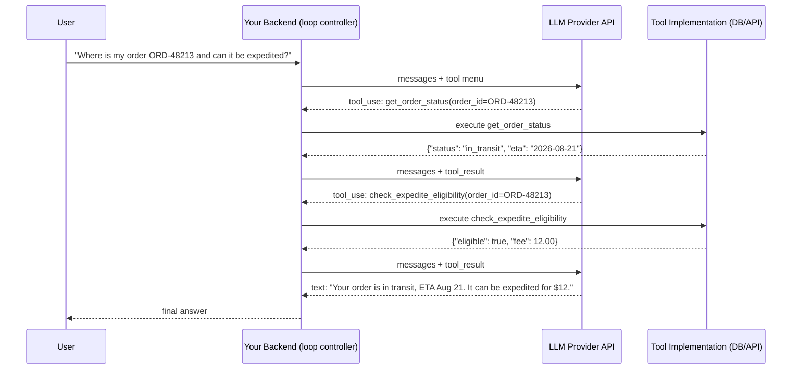

# Tool Calling

## Why This Matters

[Function Calling](function-calling.md) covered the mechanism by which a model requests a single capability invocation. In real systems, you rarely stop at one call — a model might need to look up an order, then check inventory, then draft a response, each step informed by the previous one's result. **Tool calling** is the full, often multi-turn loop: define tools, let the model request one, execute it, feed the result back, and let the model continue — possibly requesting another tool, possibly several turns later. This loop is the actual runtime architecture behind every "AI agent" you've heard about, and building it correctly — with proper error handling, bounded iteration, and result formatting — is the difference between a demo that works once and a production system that survives a malformed tool result, a slow downstream API, or a model that gets stuck in a loop.

## Core Concept

The **tool-calling loop** is a control-flow pattern: your application repeatedly calls the LLM API, inspects whether the response requests a tool call, executes that tool if so, appends the result as a new message, and calls the API again — continuing until the model responds with a final text answer (no further tool call requested) or you hit a stopping condition (iteration limit, timeout, explicit termination logic). Each iteration is a normal, stateless chat completion call as described in [Chat Completion Architecture](chat-completion-architecture.md) — there is no special "session" API for this; the looping and state management is entirely your application's responsibility.

The key architectural elements:

- **Tool definitions** — the menu of available tools, per [Function Calling](function-calling.md), typically re-sent on every iteration of the loop (since each call is stateless).
- **The dispatch step** — your code matching the model's requested tool name to actual executable logic, with validation and authorization (as covered in the previous chapter).
- **Result formatting** — the tool's output has to be serialized back into the conversation as a message the model can read, usually tagged with a `tool`/`function` role and correlated to the specific call via an ID the provider assigned.
- **Loop termination** — deciding when to stop: the model stops requesting tools and returns text (the common, successful case), you hit a maximum iteration count (a safety bound against runaway loops), or an unrecoverable error occurs.

## Mental Model

Picture a **relay conversation between two collaborators who can't directly touch each other's work**: the model is a strategist who can say "I need the current inventory count for SKU-4471 before I can answer" but cannot check the database itself. Your application is the only one with hands — it hears the request, goes and checks the actual inventory system, and reports back exactly what it found, in writing, as if handing over a note. The strategist reads the note and either says "great, here's my final answer" or "now I also need to check the shipping estimate" — another note goes out, another note comes back. This can go back and forth several times before the strategist has everything needed to give a final answer. Nobody in this exchange has memory beyond what's literally written on the notes passed so far — which is why, mechanically, each round is really a fresh chat completion call carrying the entire note history so far, not a persistent "session" with the model.

## How It Works

1. **Initialize** the conversation with the user's request and the tool menu.
2. **Call the LLM API.** Inspect the response: does it contain a tool-call request, plain text, or both (some providers allow the model to include reasoning/text alongside a tool call in the same turn)?
3. **If a tool call is requested:**
   a. Validate and authorize the request (per [Function Calling](function-calling.md)).
   b. Execute the underlying function — this may itself be a slow operation (a database query, another API call, a long-running job) and should have its own timeout.
   c. Serialize the result — success or error — into a `tool` role message, correlated to the request via whatever ID the provider assigned to that specific call.
   d. Append both the model's tool-call message and your tool-result message to the conversation history.
   e. **Loop**: call the LLM API again with the updated history, so the model can react to the result.
4. **If plain text is returned** with no tool call requested, the loop ends — this is the model's final answer.
5. **Bound the loop.** Cap the number of iterations (e.g., 10) to prevent a pathological case where the model keeps requesting tools indefinitely, and handle the "hit the cap" case explicitly (return a partial answer, an error, or escalate) rather than looping forever.

A subtlety worth calling out: **tool execution errors should usually be fed back to the model as a result, not raised as an exception that kills the loop.** If a downstream API returns a 404 for an order ID the model guessed wrong, the most useful behavior is often to tell the model "order not found" as the tool result and let it decide what to do next (ask the user to clarify, try a different lookup) — exactly how a competent assistant would react to a failed lookup rather than crashing.

## Architecture



Two full tool-calling rounds before a final text answer — each round is a complete, independent chat completion call carrying the growing history, exactly as described in [Chat Completion Architecture](chat-completion-architecture.md).

## Request / Response Example

Shown in an Anthropic/OpenAI-style format — the second call in the loop, after executing the first requested tool:

```http
POST /v1/messages HTTP/1.1
Host: api.llmprovider.example.com
Authorization: Bearer sk-...redacted...
Content-Type: application/json

{
  "model": "large-model-v2",
  "max_tokens": 300,
  "tools": [ /* same tool menu as the first call */ ],
  "messages": [
    { "role": "user", "content": "Where is my order ORD-48213 and can it be expedited?" },
    { "role": "assistant", "content": [
        { "type": "tool_use", "id": "toolu_01Pq", "name": "get_order_status", "input": { "order_id": "ORD-48213" } }
    ]},
    { "role": "user", "content": [
        { "type": "tool_result", "tool_use_id": "toolu_01Pq", "content": "{\"status\": \"in_transit\", \"eta\": \"2026-08-21\"}" }
    ]}
  ]
}
```

```http
HTTP/1.1 200 OK
Content-Type: application/json

{
  "content": [{
    "type": "tool_use",
    "id": "toolu_02Rs",
    "name": "check_expedite_eligibility",
    "input": { "order_id": "ORD-48213" }
  }],
  "stop_reason": "tool_use"
}
```

Note the `tool_use_id` / `tool_result` correlation — this is how the model knows which of its (potentially several) tool requests a given result answers, especially important once you support multiple tool calls per turn.

## Code Example

```python
import asyncio
import json
from typing import Callable, Awaitable

MAX_ITERATIONS = 10
TOOL_TIMEOUT_SECONDS = 15

# A registry mapping tool name -> (async callable, arg validator)
ToolHandler = Callable[[dict], Awaitable[dict]]
TOOL_REGISTRY: dict[str, ToolHandler] = {}


def register_tool(name: str):
    def decorator(fn: ToolHandler):
        TOOL_REGISTRY[name] = fn
        return fn
    return decorator


@register_tool("get_order_status")
async def get_order_status(args: dict) -> dict:
    order_id = args["order_id"]  # in production, validate with Pydantic first
    # ... real lookup here ...
    return {"status": "in_transit", "eta": "2026-08-21"}


async def execute_tool_call(name: str, args: dict) -> dict:
    handler = TOOL_REGISTRY.get(name)
    if handler is None:
        return {"error": f"Unknown tool: {name}"}
    try:
        # Always bound tool execution -- a slow downstream call shouldn't
        # hang the whole agent loop indefinitely.
        return await asyncio.wait_for(handler(args), timeout=TOOL_TIMEOUT_SECONDS)
    except asyncio.TimeoutError:
        return {"error": "Tool call timed out"}
    except Exception as e:
        # Feed the error back to the model as a result, don't crash the loop.
        return {"error": f"Tool execution failed: {e}"}


async def run_tool_loop(initial_messages: list[dict], tools_schema: list[dict], llm_client) -> str:
    messages = list(initial_messages)

    for iteration in range(MAX_ITERATIONS):
        response = await llm_client.messages.create(
            model="large-model-v2",
            max_tokens=500,
            tools=tools_schema,
            messages=messages,
        )

        tool_calls = [b for b in response.content if b.type == "tool_use"]
        if not tool_calls:
            # No tool requested -- the model gave a final text answer.
            return response.content[0].text

        # Record the model's tool-call turn, then execute each requested call.
        messages.append({"role": "assistant", "content": response.content})
        results = []
        for call in tool_calls:
            result = await execute_tool_call(call.name, call.input)
            results.append({
                "type": "tool_result",
                "tool_use_id": call.id,
                "content": json.dumps(result),
            })
        messages.append({"role": "user", "content": results})

    # Hit the iteration cap without a final answer -- fail explicitly rather
    # than silently returning nothing.
    raise RuntimeError(f"Tool loop did not converge after {MAX_ITERATIONS} iterations")
```

## Production Considerations

- **Bound the loop, always.** Without a hard iteration cap, a model stuck in a tool-call cycle (e.g., repeatedly re-checking the same thing due to a confusing tool result) can generate unbounded cost and latency.
- **Every tool execution needs its own timeout**, independent of the outer HTTP request timeout — a hung downstream dependency inside one loop iteration shouldn't be able to hang the entire user-facing request.
- **Feed tool errors back as results, not exceptions.** A model that receives a clear "order not found" result can often recover gracefully (ask a clarifying question); a model whose loop crashes on the first tool failure cannot.
- **Log every iteration**: which tool was called, with what arguments, what result (or error) came back, and how long it took. Multi-turn tool loops are hard to debug after the fact without a full trace — this is where [observability](../12-observability/README.md) practices (structured logging, tracing, request IDs) become essential, not optional.
- **Cost compounds across iterations.** Each loop iteration is a full chat completion call, resending the entire growing history — a 6-iteration tool loop costs roughly 6x the input tokens of the final message alone, since earlier turns get resent every time (see [Tokens and Tokenization](tokens-and-tokenization.md) and [Context Windows](context-windows.md)).
- **Concurrent/parallel tool calls need careful handling** if your provider supports multiple tool requests in one turn — execute them concurrently where safe and independent, but watch for calls with implicit ordering dependencies that shouldn't run in parallel.

## Common Mistakes

- **No iteration cap**, allowing a pathological loop to run indefinitely and rack up cost.
- **Raising an exception on tool failure that kills the entire loop**, instead of returning a structured error result the model can react to.
- **Forgetting to append the model's own tool-call message to history** before appending the result — the result message is meaningless to the model without the preceding request it's answering.
- **Not correlating tool results to the correct call ID** when handling multiple tool calls in one turn, causing the model to misattribute which result answers which request.
- **Treating the loop as a single request/response** in your API design (e.g., a synchronous HTTP handler with no streaming or progress indication) when a multi-iteration tool loop can easily take many seconds to tens of seconds — see [Streaming LLM Responses](streaming-llm-responses.md) for surfacing progress to users during long loops.

## Best Practices

- Set a sane, explicit `MAX_ITERATIONS` and handle the "cap exceeded" case as a first-class outcome, not an afterthought.
- Give every tool execution its own timeout, shorter than your overall request timeout.
- Return structured errors from tool execution rather than raising, so the model can incorporate the failure into its reasoning.
- Log a full structured trace of every loop iteration (tool name, arguments, result, latency) for debugging and cost attribution.
- For loops that may take more than a second or two, consider streaming progress or intermediate status to the caller rather than leaving them waiting on a single blocking response (see [Streaming LLM Responses](streaming-llm-responses.md)).

## AI Engineering Perspective

The tool-calling loop described in this chapter is, almost verbatim, the runtime architecture of an "AI agent" — [Part 17 — AI Agents & MCP](../17-ai-agents-and-mcp/README.md) builds directly on top of this loop, adding concerns like longer-horizon planning, memory across many more iterations, and multi-agent coordination, but the core mechanism (call model → maybe get a tool request → execute → feed back → repeat) is exactly what's shown here. The Model Context Protocol (MCP) standardizes the *tool discovery and definition* side of this loop — instead of hardcoding your tool menu, an MCP client can query an MCP server for its available tools' schemas at connection time, making the loop controller in this chapter's code example generic over any MCP-compliant tool source rather than a fixed registry. In [RAG APIs](../16-rag-apis/README.md), retrieval-as-a-tool-call is a specific, common instance of this exact loop — `search_documents` is just another tool in the menu, and "agentic RAG" is precisely this loop with retrieval as one of potentially several available tools, letting the model decide whether and when to retrieve rather than retrieving unconditionally on every turn. Provider nuance: how parallel tool calls, tool-result formatting, and stop reasons are represented differs enough between providers that a production tool-loop controller is usually worth writing against your own normalized internal representation (per [Chat Completion Architecture](chat-completion-architecture.md)) rather than coupling directly to one provider's exact response shape.

## Exercises

**Beginner**
1. Trace through the sequence diagram in this chapter by hand: write out, turn by turn, what `messages` contains after each step of the loop for the order-status-and-expedite example.

**Intermediate**
2. Extend the `run_tool_loop` code example to log a structured record (tool name, arguments, result, duration_ms) for every iteration, and add a second tool (`check_expedite_eligibility`) to the registry.

**Advanced**
3. Design a tool loop that supports parallel tool calls in a single turn (multiple `tool_use` blocks in one response), executing independent calls concurrently while respecting an explicit dependency (e.g., tool B needs tool A's result) declared alongside the tool menu. Explain how you'd detect and prevent a request for tool B before tool A has completed.

## Key Takeaways

- Tool calling is a multi-turn loop your application controls: call the model, execute any requested tool, feed the result back, repeat until a final text answer or a stopping condition.
- Each loop iteration is a full, stateless chat completion call resending the entire growing history — cost and latency compound with more iterations.
- Bound the loop with a hard iteration cap, and give every tool execution its own timeout independent of the outer request.
- Feed tool errors back to the model as structured results rather than raising exceptions that kill the loop — this lets the model recover gracefully.
- This loop is the literal runtime architecture behind AI agents (Part 17) and agentic RAG (Part 16) — everything in those parts builds on the pattern shown here.
