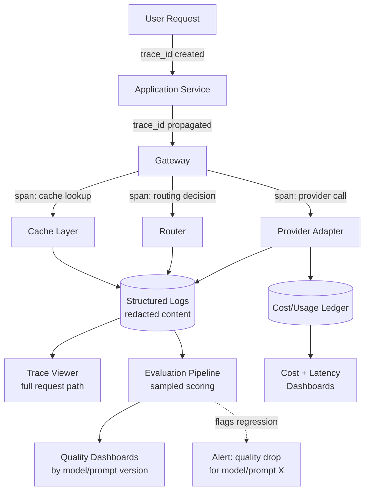

# AI Observability

## Why This Matters

Traditional observability (see [Part 12 — Observability](../12-observability/README.md)) answers questions like "was this request successful, how long did it take, and what did the logs say happened." Those questions still matter for AI systems, but they're not sufficient: a chat completion can return `200 OK` in 400ms and still be a bad answer — hallucinated, off-topic, or subtly wrong in a way no HTTP status code captures. AI observability extends standard observability with the AI-specific dimensions that determine whether a system is actually working: what was the exact prompt, what did the model actually say, how much did it cost, which provider/model served it, and — the hardest and most distinctive part — was the output actually *good*. Without this, teams find out a feature has been quietly producing poor answers only when a customer complains, weeks after a prompt change or provider switch introduced the regression.

## Core Concept

AI observability layers on top of the standard three pillars (logs, metrics, traces — see [Part 12](../12-observability/README.md)) with AI-specific concerns:

- **Tracing an LLM call through the system** — connecting a user-facing request to every internal gateway decision it triggered: routing choice, cache hit/miss, retries, fallback, and the final provider call, all under one request ID (see [Request IDs](../12-observability/README.md)).
- **Logging prompts and responses safely** — capturing enough to debug and evaluate quality, without leaking sensitive user data into logs that have broader access or longer retention than the original conversation.
- **Evaluation / quality monitoring** — systematically checking whether outputs meet quality expectations, not just whether the call succeeded technically. This is the dimension with no equivalent in traditional API observability.
- **Cost and latency dashboards** — the operational view built on the [Cost Tracking](cost-tracking.md) ledger and standard latency percentiles ([Latency and P95/P99](../07-caching-performance/README.md)), specifically broken down by model/provider/feature since those are the levers you actually control.

## Mental Model

Think of AI observability as the difference between a **factory quality-control line** and a simple pass/fail conveyor sensor. A sensor that only checks "did the box make it to the end of the line without falling off" (did the HTTP request succeed) tells you almost nothing about whether what's *inside* the box is correct. A real QC line samples actual products, checks them against a spec, tracks defect rates over time by production batch (model/provider/prompt version), and flags a shift line-by-line if defect rates spike — which is exactly the shape LLM evaluation and quality monitoring needs to take, because "the API call succeeded" and "the product is good" are genuinely different questions for AI systems in a way they mostly aren't for traditional CRUD APIs.

## How It Works

1. **Every request gets a trace ID** that follows it end-to-end: from the originating application service, through the gateway's cache check, routing decision, provider call (and any retries/fallback), back to the caller. Standard distributed tracing tooling ([OpenTelemetry](../12-observability/README.md)) applies directly — LLM calls are just another span type.
2. **Structured logs capture the AI-specific fields** on that span: provider, model, capability tier, token usage, cost, cache status, latency, and (subject to redaction policy) the prompt and response content or a reference to where they're safely stored.
3. **Sensitive content is redacted or tokenized before long-term storage.** Full prompts/responses might be needed for debugging a specific incident but shouldn't sit unredacted in a general-access log aggregator indefinitely — see Production Considerations.
4. **Evaluation runs as an ongoing process**, not a one-time check: a sample of production responses (or all responses, for lower-volume features) is scored against quality criteria — automated checks (format validity, presence of required elements, a smaller "judge" model scoring the response against a rubric) and periodic human review — with scores tracked over time per prompt version, model, and provider.
5. **Dashboards aggregate all of this** — cost and latency from the ledger (see [Cost Tracking](cost-tracking.md)), quality scores from evaluation, cache-hit rates from [Prompt Caching](prompt-caching.md) and [Semantic Caching](semantic-caching.md) — sliced by the dimensions that matter for decisions: per feature, per model, per provider, over time.

## Architecture



## Request / Response Example

A structured log entry emitted by the gateway for a single LLM call — this is the atomic observability record everything else (traces, dashboards, evaluation sampling) is built from:

```json
{
  "trace_id": "trace_8f2c1a9e",
  "span": "provider_call",
  "timestamp": "2026-08-18T15:04:11Z",
  "tenant_id": "acme_corp",
  "feature": "support_chat_summarizer",
  "provider": "provider_b",
  "model": "provider-b-balanced-v1",
  "cache_status": "miss",
  "routing_reason": "primary_healthy",
  "input_tokens": 812,
  "output_tokens": 34,
  "cost_usd": 0.0041,
  "latency_ms": 640,
  "prompt_ref": "s3://logs-redacted/prompts/trace_8f2c1a9e.json",
  "prompt_pii_redacted": true
}
```

An evaluation record produced by the quality-monitoring pipeline, linked back to the same trace:

```json
{
  "trace_id": "trace_8f2c1a9e",
  "eval_type": "automated_judge",
  "rubric": "summary_accuracy_v3",
  "score": 0.86,
  "flags": [],
  "judge_model": "provider-a-reasoning-v1",
  "scored_at": "2026-08-18T15:04:45Z"
}
```

## Code Example

```python
import hashlib
import json
import re
import time
from dataclasses import dataclass, field


# --- Redaction: never let raw PII sit in general-access logs ---

_EMAIL_RE = re.compile(r"[\w.+-]+@[\w-]+\.[\w.-]+")
_PHONE_RE = re.compile(r"\b\d{3}[-.\s]?\d{3}[-.\s]?\d{4}\b")


def redact(text: str) -> str:
    """Best-effort redaction for structured logs. Not a substitute for a
    proper PII-detection pipeline in regulated domains — see
    ../10-api-security/README.md."""
    text = _EMAIL_RE.sub("[redacted-email]", text)
    text = _PHONE_RE.sub("[redacted-phone]", text)
    return text


@dataclass
class LLMCallLog:
    trace_id: str
    tenant_id: str
    feature: str
    provider: str
    model: str
    cache_status: str
    input_tokens: int
    output_tokens: int
    cost_usd: float
    latency_ms: int
    prompt_redacted: str
    response_redacted: str


def build_call_log(trace_id: str, tenant_id: str, feature: str, provider: str,
                    model: str, cache_status: str, prompt: str, response: str,
                    input_tokens: int, output_tokens: int, cost_usd: float,
                    latency_ms: int) -> LLMCallLog:
    return LLMCallLog(
        trace_id=trace_id,
        tenant_id=tenant_id,
        feature=feature,
        provider=provider,
        model=model,
        cache_status=cache_status,
        input_tokens=input_tokens,
        output_tokens=output_tokens,
        cost_usd=cost_usd,
        latency_ms=latency_ms,
        prompt_redacted=redact(prompt),
        response_redacted=redact(response),
    )


# --- Lightweight automated evaluation: a "judge" checks a rubric ---

@dataclass
class EvalResult:
    trace_id: str
    score: float
    flags: list[str] = field(default_factory=list)


async def judge_response(trace_id: str, prompt: str, response: str,
                          judge_generate_fn) -> EvalResult:
    """Uses a separate, typically cheaper or more consistent model as a
    'judge' to score response quality against a rubric. This is sampled
    (e.g. 5-10% of traffic, or 100% for low-volume/high-stakes features),
    not run on every request, to control its own cost."""
    judge_prompt = (
        "Score this AI assistant response from 0.0 to 1.0 for accuracy and "
        "relevance to the question. Respond with only a number.\n\n"
        f"Question context: {prompt}\n\nResponse: {response}"
    )
    raw_score = await judge_generate_fn(judge_prompt)
    try:
        score = max(0.0, min(1.0, float(raw_score.strip())))
    except ValueError:
        score = 0.0
        flags = ["judge_parse_failure"]
        return EvalResult(trace_id=trace_id, score=score, flags=flags)

    flags = ["low_quality"] if score < 0.6 else []
    return EvalResult(trace_id=trace_id, score=score, flags=flags)


class QualityTracker:
    """Aggregates eval scores per (feature, model) so a regression in a
    specific model/prompt combination is visible, not buried in an
    overall average."""

    def __init__(self):
        self._scores: dict[tuple[str, str], list[float]] = {}

    def record(self, feature: str, model: str, score: float) -> None:
        self._scores.setdefault((feature, model), []).append(score)

    def average(self, feature: str, model: str) -> float:
        scores = self._scores.get((feature, model), [])
        return sum(scores) / len(scores) if scores else 0.0
```

## Production Considerations

- **Redact before you store, not after.** Once unredacted prompt content lands in a shared log aggregator with broad access and long retention, treating it as sensitive after the fact requires a retroactive cleanup, which is far harder than never writing it that way to begin with. See [Part 10 — API Security](../10-api-security/README.md).
- **Sampling is necessary at scale, but sample deliberately.** Evaluating 100% of a high-volume feature's traffic with an LLM judge can itself become a meaningful cost line (see [Cost Tracking](cost-tracking.md)); sample a representative fraction, but always evaluate 100% of flagged or user-reported-bad responses.
- **Automated judges have their own failure modes** — they can be miscalibrated, biased toward verbose answers, or simply wrong. Periodically validate judge scores against human review on a subset, the same way you'd validate any model in production.
- **Trace context must propagate through the entire fallback and retry chain** (see [Fallback Systems](fallback-systems.md)) — a request that failed over from provider A to provider B should appear as one coherent trace, not two disconnected log lines that require manual correlation during an incident.

## Common Mistakes

- **Treating HTTP success as feature success.** A `200 OK` with a hallucinated or off-topic answer looks identical to a correct answer in every metric except a quality score you specifically chose to measure.
- **Logging raw, unredacted prompts and responses by default**, creating a PII exposure surface that grows with every feature added, often discovered during a security review rather than designed against from the start.
- **No link between cost/latency dashboards and quality dashboards** — a routing change that cut cost 40% but also quietly dropped quality scores 15% looks like an unambiguous win if you're only watching the cost dashboard.
- **Running evaluation as a one-time launch check** instead of an ongoing process — prompt, model, and provider changes happen continuously in production, and quality can regress silently with any of them.

## Best Practices

- Propagate one trace ID through the entire request path — application service, gateway, cache, router, provider call, and any fallback — using standard tracing tooling ([OpenTelemetry](../12-observability/README.md)).
- Redact PII from prompts/responses before they reach general-access logs; keep an audit-controlled, short-retention path for full content when a specific incident genuinely requires it.
- Run continuous, sampled evaluation against a defined rubric, tracked per feature and per model/provider, not just at launch.
- Put cost, latency, and quality on the same dashboard views, sliced by the same dimensions (feature, model, provider) — decisions made looking at only one of the three are frequently wrong.

## AI Engineering Perspective

In agent loops (see [Part 17 — AI Agents & MCP](../17-ai-agents-and-mcp/README.md)), a single user-facing trace can fan out into dozens of internal LLM call spans across planning, tool calling, and synthesis steps — tracing needs to preserve the *hierarchy* (which sub-calls happened during which reasoning step), not just a flat list of calls, or debugging a bad agent outcome becomes reconstructing the sequence by hand from timestamps. In RAG pipelines (see [Part 16 — RAG APIs](../16-rag-apis/README.md)), evaluation needs to separately assess retrieval quality (were the right documents found) and generation quality (was the answer good given what was retrieved) — a bad final answer caused by poor retrieval looks identical, from the generation model's perspective, to a bad final answer caused by a weak model, and conflating the two in evaluation makes it impossible to tell which part of the pipeline actually needs fixing.

## Exercises

**Beginner:** Design the structured log schema you'd emit for every LLM call in your own system, listing every field and which ones need redaction before long-term storage.

**Intermediate:** Using `QualityTracker` above, design an alert condition that fires when a specific `(feature, model)` pair's rolling average score drops more than 15% compared to its trailing 7-day baseline.

**Advanced:** Design an evaluation sampling strategy that increases sampling rate automatically after a routing or prompt-version change (see [Model Routing](model-routing.md)), then decays back to a lower steady-state sampling rate once the new configuration has enough data to be confident it's not regressing quality.

## Key Takeaways

- AI observability extends standard tracing/logging/metrics with AI-specific dimensions: full request tracing through cache/route/fallback decisions, safely redacted prompt/response logging, ongoing quality evaluation, and combined cost+latency+quality dashboards.
- HTTP success does not imply output quality — evaluation is the dimension with no equivalent in traditional API observability and can't be skipped.
- Redact sensitive content before storage, not after, and treat prompt/response logs as a security-sensitive surface from the start.
- Cost, latency, and quality should be reviewed together — optimizing one in isolation frequently trades away another without anyone noticing until later.
