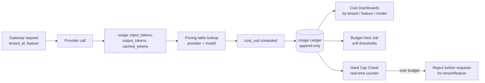

# Cost Tracking

## Why This Matters

Traditional API infrastructure costs are mostly fixed and predictable: you provision servers, you pay roughly the same amount whether traffic is light or heavy that day, and a bad month looks like a 20% overage, not a 20x one. LLM costs are the opposite: they scale directly and immediately with usage, per token, and a single bug — an infinite retry loop, an agent stuck reasoning in circles, a prompt that accidentally includes an entire document on every turn — can turn a $200/day feature into a $20,000/day feature before anyone notices, because nothing about the system *looks* broken from the outside. Cost tracking is the practice of making AI spend visible, attributable, and boundable in real time, rather than discovered a month later on an invoice.

## Core Concept

Cost tracking has three layers:

- **Calculation** — computing the dollar cost of each individual request from its token usage and the target model's per-token pricing (input and output priced separately, and often at meaningfully different rates).
- **Attribution** — tagging that cost with who or what caused it: tenant/customer, internal team, feature/product surface, and sometimes individual end user — so spend isn't just one opaque provider invoice line but a breakdown you can act on.
- **Enforcement** — using that attributed cost data to drive budget alerts and hard caps, so a runaway feature or tenant is throttled or cut off automatically rather than discovered after the bill arrives.

This chapter is deliberately adjacent to, but distinct from, [Token Rate Limits](token-rate-limits.md): rate limiting protects *provider capacity* in real time; cost tracking protects *your budget* over longer windows (per-request, daily, monthly) and answers a different question — not "can we make this call right now" but "should we, given what it costs and who's paying."

## Mental Model

Think of cost tracking as the **metered utility bill** for your AI features, the way a business tracks electricity or cloud compute cost per department. Nobody would run a factory floor without submetering machines to know which line is burning the most power — yet many teams run LLM features with zero per-feature cost visibility, discovering only via the aggregate monthly invoice that "something" got expensive. Submetering (attribution) is what turns "our AI bill went up" into "the document-summarization feature's cost tripled after last Tuesday's prompt change" — an actionable finding instead of a mystery.

## How It Works

1. Every provider response includes token usage (input and output tokens, sometimes cached-token counts separately — see [Prompt Caching](prompt-caching.md)). The gateway reads this from the normalized `GenerationResponse` (see [Multi-Provider Architecture](multi-provider-architecture.md)).
2. A **pricing table**, keyed by provider and model, converts token counts into a dollar cost. This table must be kept current — providers change prices, and old cached prices silently produce wrong cost reports.
3. The gateway attaches **attribution metadata** already present on the request (`tenant_id`, `feature`, optionally `user_id`) to the computed cost, and writes one usage/cost record per request to a **usage ledger** — typically an append-only log or time-series table, not just an aggregate counter, so you can later slice by any dimension without having pre-decided the slicing at write time.
4. **Dashboards** aggregate the ledger by tenant, feature, model, and time window, surfacing trends (see [AI Observability](ai-observability.md) for how this connects to broader monitoring).
5. **Budget alerts and caps** run against the same ledger: a background job (or real-time counter, for hard caps) checks cumulative spend against configured thresholds and either notifies (soft alert) or actively rejects further requests for that tenant/feature (hard cap) until the window resets or a human intervenes.

## Architecture



## Request / Response Example

An internal cost report entry the gateway writes to the usage ledger per request — this is the atomic unit everything else (dashboards, alerts, caps) is built from:

```json
{
  "timestamp": "2026-08-18T14:32:07Z",
  "tenant_id": "acme_corp",
  "feature": "support_chat_summarizer",
  "provider": "provider_b",
  "model": "provider-b-balanced-v1",
  "input_tokens": 812,
  "output_tokens": 190,
  "cached_input_tokens": 640,
  "cost_usd": 0.00201
}
```

A budget-cap rejection returned to the caller once a tenant's configured monthly ceiling is hit — a clear, actionable error rather than a silent throttle:

```http
HTTP/1.1 402 Payment Required
Content-Type: application/json

{
  "error": "budget_exceeded",
  "message": "Tenant 'acme_corp' has exceeded its configured monthly AI budget ($500.00).",
  "current_spend_usd": 501.24,
  "budget_usd": 500.00,
  "resets_at": "2026-09-01T00:00:00Z"
}
```

## Code Example

```python
from dataclasses import dataclass
from datetime import datetime, timezone


@dataclass(frozen=True)
class ModelPricing:
    # Prices are illustrative placeholders, per 1,000 tokens — actual
    # provider pricing changes over time; never hardcode this without a
    # process to keep it current.
    input_per_1k: float
    output_per_1k: float
    cached_input_per_1k: float = 0.0  # discounted rate for prompt-cache hits


PRICING_TABLE: dict[tuple[str, str], ModelPricing] = {
    ("provider_a", "provider-a-small-v1"): ModelPricing(0.15, 0.60, 0.015),
    ("provider_a", "provider-a-balanced-v2"): ModelPricing(1.00, 3.00, 0.10),
    ("provider_b", "provider-b-balanced-v1"): ModelPricing(1.20, 3.50, 0.12),
    ("provider_b", "provider-b-reasoning-v1"): ModelPricing(5.00, 15.00, 0.50),
}


def calculate_cost_usd(
    provider: str,
    model: str,
    input_tokens: int,
    output_tokens: int,
    cached_input_tokens: int = 0,
) -> float:
    pricing = PRICING_TABLE.get((provider, model))
    if pricing is None:
        raise ValueError(f"No pricing entry for {provider}/{model} — refusing to guess cost")

    billable_input = max(0, input_tokens - cached_input_tokens)
    cost = (
        billable_input / 1000 * pricing.input_per_1k
        + cached_input_tokens / 1000 * pricing.cached_input_per_1k
        + output_tokens / 1000 * pricing.output_per_1k
    )
    return round(cost, 6)


@dataclass
class UsageRecord:
    timestamp: str
    tenant_id: str
    feature: str
    provider: str
    model: str
    input_tokens: int
    output_tokens: int
    cached_input_tokens: int
    cost_usd: float


class UsageLedger:
    """Minimal in-memory stand-in for what would be a durable, append-only
    store (e.g. a Postgres table or a stream into a data warehouse) in
    production. Real-time budget checks would query a fast aggregate
    (e.g. a Redis counter per tenant per billing window) rather than
    scanning this ledger on every request."""

    def __init__(self):
        self._records: list[UsageRecord] = []
        self._tenant_totals: dict[str, float] = {}

    def record(self, tenant_id: str, feature: str, provider: str, model: str,
               input_tokens: int, output_tokens: int, cached_input_tokens: int = 0) -> UsageRecord:
        cost = calculate_cost_usd(provider, model, input_tokens, output_tokens, cached_input_tokens)
        record = UsageRecord(
            timestamp=datetime.now(timezone.utc).isoformat(),
            tenant_id=tenant_id,
            feature=feature,
            provider=provider,
            model=model,
            input_tokens=input_tokens,
            output_tokens=output_tokens,
            cached_input_tokens=cached_input_tokens,
            cost_usd=cost,
        )
        self._records.append(record)
        self._tenant_totals[tenant_id] = self._tenant_totals.get(tenant_id, 0.0) + cost
        return record

    def tenant_spend(self, tenant_id: str) -> float:
        return self._tenant_totals.get(tenant_id, 0.0)

    def check_budget(self, tenant_id: str, budget_usd: float) -> bool:
        """Hard cap check — call BEFORE making a request, not just after
        recording it, so spend never exceeds the configured ceiling."""
        return self.tenant_spend(tenant_id) < budget_usd
```

## Production Considerations

- **Check budgets before the call, not just after.** A ledger that only reports spend after the fact can tell you *that* you overspent, but only a pre-call check against a fast, real-time counter can actually prevent it.
- **Keep the pricing table current and auditable.** Provider price changes are common; version the pricing table with effective dates so historical cost reports remain accurate even after prices change.
- **Cached and non-cached tokens are often priced very differently** (see [Prompt Caching](prompt-caching.md)) — a cost calculation that ignores cache hits will overstate spend and mislead both dashboards and budget alerts.
- **Attribution granularity is a trade-off.** Per-user attribution gives the finest-grained accountability but adds storage and query cost at scale; most teams start at tenant+feature granularity and add per-user only where it's actually actionable (e.g. abuse detection, usage-based billing).

## Common Mistakes

- **No cost ceiling at all**, so a bug (retry loop, runaway agent, oversized context) can produce genuinely unbounded spend before a human notices — the single most common and most expensive AI production incident.
- **Computing cost only in aggregate**, with no per-tenant/per-feature breakdown, so a spend spike can't be traced back to its cause without manually correlating logs after the fact.
- **Hardcoded, stale pricing** that silently produces wrong cost reports for months after a provider price change.
- **Ignoring cached-token discounts in cost calculations**, making optimizations like prompt caching look less valuable than they actually are on the dashboard, which discourages further investment in exactly the optimization that would help most.

## Best Practices

- Implement a hard budget cap per tenant (and ideally per feature) as a real-time pre-call check, in addition to after-the-fact reporting.
- Tag every gateway request with attribution metadata (`tenant_id`, `feature`) at the source — retrofitting attribution onto historical logs is far harder than requiring it up front.
- Alert on cost *rate of change*, not just absolute thresholds — a feature whose cost triples week over week is worth investigating even if it's still under the absolute budget.
- Review the pricing table on a recurring schedule (e.g. monthly) against current provider documentation, not just when someone notices a discrepancy.

## AI Engineering Perspective

Agent loops (see [Part 17 — AI Agents & MCP](../17-ai-agents-and-mcp/README.md)) are the highest-risk surface for runaway cost, because an agent that gets stuck in a reasoning or tool-calling loop can generate an unbounded number of LLM calls with no natural request boundary the way a single chat turn has — cost tracking for agents needs a per-run cumulative budget (not just per-request), enforced as a hard stop the agent framework checks between steps. In RAG pipelines (see [Part 16 — RAG APIs](../16-rag-apis/README.md)), cost attribution should separate the embedding cost (often driven by ingestion volume, a largely fixed and predictable cost) from the generation cost (driven by query volume and retrieved-context size, which is far more variable) — conflating them into one "RAG feature cost" number hides which side of the pipeline is actually driving spend changes.

## Exercises

**Beginner:** Using `calculate_cost_usd` above, compute the cost of a request with 5,000 input tokens (3,000 of which are cache hits) and 300 output tokens against `provider-b-balanced-v1`.

**Intermediate:** Extend `UsageLedger` to support a per-feature (not just per-tenant) budget check, and explain how you'd structure the underlying storage so both checks stay fast at high request volume.

**Advanced:** Design a real-time hard-cap enforcement mechanism using a Redis counter (see [Redis](../07-caching-performance/redis.md)) that stays consistent under high concurrency — i.e., two simultaneous requests near the budget ceiling shouldn't both be allowed through due to a race condition.

## Key Takeaways

- Cost tracking has three layers: calculating per-request cost from token usage, attributing it to tenant/feature/user, and enforcing budgets via alerts and hard caps.
- LLM costs scale directly with usage and can spike unboundedly from bugs — a hard, real-time budget cap is not optional for production systems.
- Cache-hit discounts materially affect cost calculations and should be reflected accurately, not ignored.
- Attribution metadata must be captured at the source (on each gateway request), because retrofitting it later is far more expensive.
