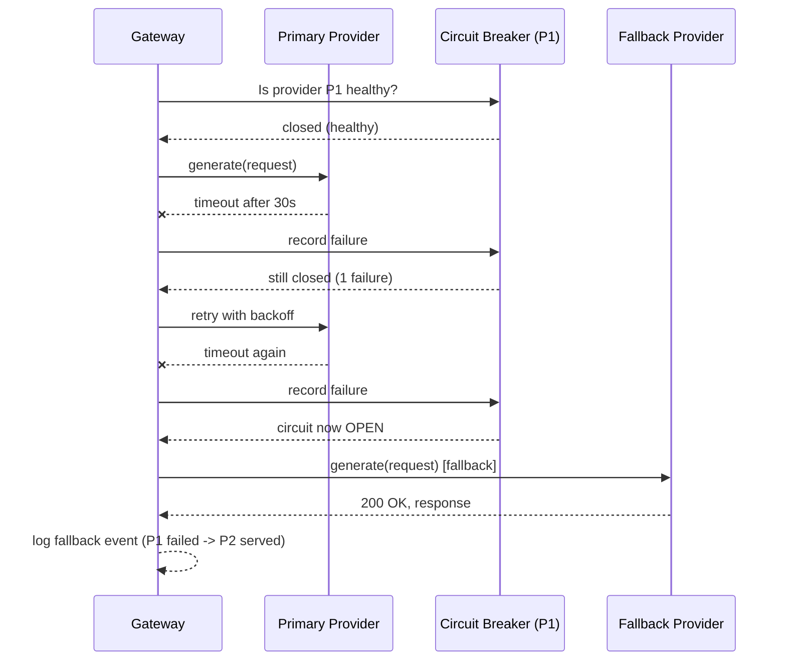

# Fallback Systems

## Why This Matters

LLM providers go down. Not hypothetically — every major provider has had multi-hour outages, regional degradations, and periods of severely elevated latency, often without much advance warning. Unlike a typical internal microservice outage, you usually can't fix a provider outage yourself; you can only route around it. A production AI feature that has no fallback path treats every provider incident as a full outage of your own feature, even when a perfectly capable second option was one HTTP call away. Fallback systems are what turn "the provider is down" from an incident into a non-event.

This builds directly on [Part 6 — Production Reliability](../06-production-reliability/README.md), especially [Retries](../06-production-reliability/retries.md) and [Circuit Breakers](../06-production-reliability/circuit-breakers.md) — fallback for LLM calls is the same reliability discipline, applied to a category of dependency (model providers) that fails more often, more unpredictably, and more expensively than a typical internal service dependency.

## Core Concept

A fallback system defines what happens **after** a routing decision (see [Model Routing](model-routing.md)) fails to produce a usable response — whether from a timeout, a 5xx, a rate limit (429), or a malformed response. It has three components:

- **A fallback chain** — an ordered list of alternative `(provider, model)` pairs to try if the primary choice fails, distinct from (but informed by) the routing policy's candidate list.
- **A circuit breaker per provider** — tracking recent failure rates so the system stops sending traffic to a clearly-failing provider instead of paying the timeout cost on every single request during an outage (see [Circuit Breakers](../06-production-reliability/circuit-breakers.md)).
- **A degradation policy** — what "falling back" actually means for the user: a different provider serving the *same* model tier, a cheaper/faster model serving a *lower-quality but still useful* answer, a cached/stale response, or, as a last resort, a clear error asking the user to retry.

The key design decision is: **what do you fall back to, and does the user or system notice a quality difference?** Falling back from your `reasoning` tier to another provider's `reasoning`-tier model is nearly invisible. Falling back from `reasoning` to `fast` is a real quality trade-off that should be a conscious, logged decision — not something that happens silently and gets discovered later via a spike in user complaints.

## Mental Model

Think of a fallback chain like an **aircraft's backup systems**, not like blind retrying. If the primary hydraulic system fails, the aircraft doesn't just try the same broken system again and again — it switches to a backup system with a known, understood capability profile (possibly slightly reduced), and the flight crew is explicitly informed which system is now active. Nobody is surprised mid-flight that "we're now running on backup," and the ground crew has full visibility into which system was active during the flight, after the fact. Silent, uninstrumented fallback is the AI-systems equivalent of the backup system engaging without anyone in the cockpit knowing.

## How It Works

1. The router hands off a request to the top candidate; the adapter attempts the call (see [Multi-Provider Architecture](multi-provider-architecture.md)).
2. If the call fails with a **retryable** error (timeout, 5xx, 429) and the provider's circuit is still closed, apply a bounded retry with exponential backoff and jitter first — see [Retries](../06-production-reliability/retries.md) — since many failures are transient and resolve within a second or two.
3. If retries are exhausted, or the error is clearly not transient (e.g. repeated timeouts within the last N seconds), record a failure against that provider's circuit breaker and move to the **next candidate in the fallback chain**.
4. The circuit breaker per provider tracks recent failure rate; once it trips **open**, subsequent requests skip that provider entirely (no wasted timeout) until a **half-open** probe request succeeds, per the standard circuit breaker pattern.
5. If every candidate in the chain fails, the system returns a clear, typed error to the caller — never a silent empty or malformed response — so upstream code (or the end user) can react appropriately (e.g. "try again in a moment" vs. quietly showing broken output).
6. Every fallback event — which provider failed, why, what it fell back to — is logged and counted, feeding both alerting and cost/quality dashboards (see [AI Observability](ai-observability.md)).

## Architecture



## Request / Response Example

A 429 from the primary provider, and the gateway's internal decision log entry showing the fallback that followed — this is the kind of record that should exist for every fallback event:

```http
HTTP/1.1 429 Too Many Requests
Retry-After: 12
Content-Type: application/json

{
  "error": { "type": "rate_limit_error", "message": "Requests per minute limit exceeded" }
}
```

The gateway's response to the *original caller*, after successfully falling back — the caller sees a normal 200, with fallback metadata attached for observability, not as something it needs to handle specially:

```http
HTTP/1.1 200 OK
Content-Type: application/json

{
  "content": "...",
  "usage": { "input_tokens": 180, "output_tokens": 95 },
  "routing": {
    "provider": "provider_b",
    "model": "provider-b-balanced-v1",
    "fallback": {
      "occurred": true,
      "primary_provider": "provider_a",
      "primary_failure_reason": "rate_limited",
      "attempts": 2
    }
  }
}
```

## Code Example

```python
import asyncio
import random
import time
from dataclasses import dataclass, field
from enum import Enum

from multi_provider_architecture import (  # see multi-provider-architecture.md
    ProviderAdapter,
    GenerationRequest,
    GenerationResponse,
    ProviderTimeout,
    ProviderRateLimited,
    ProviderUnavailable,
)


class CircuitState(Enum):
    CLOSED = "closed"
    OPEN = "open"
    HALF_OPEN = "half_open"


@dataclass
class CircuitBreaker:
    """Per-provider circuit breaker. See also
    ../06-production-reliability/circuit-breakers.md for the general pattern."""
    failure_threshold: int = 5
    recovery_timeout_seconds: float = 30.0
    state: CircuitState = CircuitState.CLOSED
    consecutive_failures: int = 0
    opened_at: float | None = None

    def record_success(self) -> None:
        self.consecutive_failures = 0
        self.state = CircuitState.CLOSED
        self.opened_at = None

    def record_failure(self) -> None:
        self.consecutive_failures += 1
        if self.consecutive_failures >= self.failure_threshold:
            self.state = CircuitState.OPEN
            self.opened_at = time.monotonic()

    def allow_request(self) -> bool:
        if self.state == CircuitState.CLOSED:
            return True
        if self.state == CircuitState.OPEN:
            if time.monotonic() - self.opened_at >= self.recovery_timeout_seconds:
                self.state = CircuitState.HALF_OPEN
                return True  # allow exactly one probe request through
            return False
        return True  # HALF_OPEN: allow the probe


class FallbackExecutor:
    """Tries each adapter in the given order, with bounded retries per
    adapter and a circuit breaker that skips known-unhealthy providers."""

    def __init__(self, adapters: list[ProviderAdapter], max_retries_per_adapter: int = 1):
        self.adapters = adapters
        self.max_retries_per_adapter = max_retries_per_adapter
        self.breakers: dict[str, CircuitBreaker] = {a.name: CircuitBreaker() for a in adapters}

    async def generate_with_fallback(self, request: GenerationRequest) -> GenerationResponse:
        last_error: Exception | None = None

        for adapter in self.adapters:
            breaker = self.breakers[adapter.name]
            if not breaker.allow_request():
                continue  # circuit open — skip without paying a timeout cost

            for attempt in range(self.max_retries_per_adapter + 1):
                try:
                    response = await adapter.generate(request)
                    breaker.record_success()
                    return response
                except ProviderRateLimited as e:
                    breaker.record_failure()
                    last_error = e
                    break  # don't retry the same provider — go to next candidate
                except (ProviderTimeout, ProviderUnavailable) as e:
                    breaker.record_failure()
                    last_error = e
                    if attempt < self.max_retries_per_adapter:
                        # Exponential backoff with jitter before retrying
                        # the SAME provider once — see retries.md.
                        delay = (2 ** attempt) * 0.5 + random.uniform(0, 0.25)
                        await asyncio.sleep(delay)
                        continue
                    break  # exhausted retries for this provider — fall through

        # Every candidate failed or was circuit-open — surface a clear error.
        raise RuntimeError(f"All providers exhausted; last error: {last_error!r}")
```

## Production Considerations

- **Bound total fallback latency.** A chain of three providers, each with a 30-second timeout and a retry, can take over a minute to fail end-to-end — often worse for the user than failing fast. Set an aggressive overall deadline for the whole fallback chain, not just per-provider timeouts.
- **Don't retry non-idempotent side effects blindly.** If the generation call is one step in a larger workflow that already committed something (e.g., sent a partial response, charged a user), make sure fallback retries are safe to repeat — see [Idempotency](../06-production-reliability/README.md).
- **Fallback across capability tiers is a product decision, not just an engineering one.** Silently downgrading from `reasoning` to `fast` under load can produce materially worse answers; make this an explicit, monitored policy rather than an implicit side effect of "whatever's healthy."
- **Circuit breaker state should be shared across gateway replicas** (e.g. via Redis) in a horizontally scaled deployment — otherwise each replica independently rediscovers a provider outage, multiplying wasted timeout cost across your fleet.

## Common Mistakes

- **Retrying indefinitely against a provider that's clearly down**, burning latency budget and sometimes making the provider's outage worse (retry storms).
- **No circuit breaker**, so every single request pays the full timeout cost against a dead provider for the entire duration of an outage.
- **Falling back silently without logging**, so a multi-hour incident where "80% of traffic secretly ran on the backup model" is discovered weeks later during a cost or quality review, not during the incident.
- **Treating all failures as equivalent.** A 429 (provider is fine, just rate-limiting you) should route to a different provider immediately, not retry the same one — retrying into a rate limit just makes it worse.

## Best Practices

- Use retries for transient failures against the *same* provider, and reserve the fallback chain for either exhausted retries or clearly non-transient failures (429, prolonged 5xx).
- Give every fallback event a distinct log/metric so dashboards can show "% of traffic served by fallback" as a first-class reliability signal, not just an implementation detail.
- Cap the total end-to-end latency budget for a request across the entire fallback chain, and fail fast with a clear error once that budget is exhausted.
- Periodically test the fallback path deliberately (e.g. chaos-testing the primary provider's adapter — see [Part 13 — API Testing](../13-api-testing/README.md)) — an untested fallback path is a fallback path you can't trust during a real incident.

## AI Engineering Perspective

In an [agent loop](../17-ai-agents-and-mcp/README.md), a single failed step can be far more expensive to fall back on than a single chat completion, because the agent may have already accumulated significant context (prior tool results, reasoning steps) that a fallback model needs to re-process — falling back mid-agent-run is not "just retry the last call," it needs to preserve accumulated state across the provider switch. In [RAG pipelines](../16-rag-apis/README.md), fallback for the *embedding* call is a distinct and often overlooked concern: falling back to a different embedding model mid-pipeline can produce vectors that aren't comparable to what's already stored in your vector database (see [Part 16 — RAG APIs](../16-rag-apis/README.md)), so embedding fallback usually needs its own, more conservative policy than generation fallback — sometimes "queue and retry later" is safer than "switch models transparently."

## Exercises

**Beginner:** Draw the fallback chain you'd configure for the `balanced` capability tier using the routing table from [Model Routing](model-routing.md), and explain the order you chose.

**Intermediate:** Extend `FallbackExecutor` to distinguish between "circuit open, skip silently" and "all circuits open, hard failure," emitting a specific log event for each case.

**Advanced:** Design a policy for cross-tier fallback (e.g., `reasoning` falls back to `balanced` after N total failures across the `reasoning` chain) including how you'd flag these responses so downstream evaluation can separate "answered by primary tier" from "answered by degraded tier" in quality metrics.

## Key Takeaways

- Fallback systems handle what happens after a routing choice fails — retries for transient errors, then an ordered chain of alternative providers, backed by per-provider circuit breakers.
- Bound total fallback latency; a long chain of slow timeouts can be worse for the user than failing fast.
- Falling back across capability tiers (not just across providers at the same tier) is a quality trade-off and should be an explicit, monitored decision.
- Every fallback event must be logged — invisible fallback becomes an invisible, undebuggable quality or cost regression.
