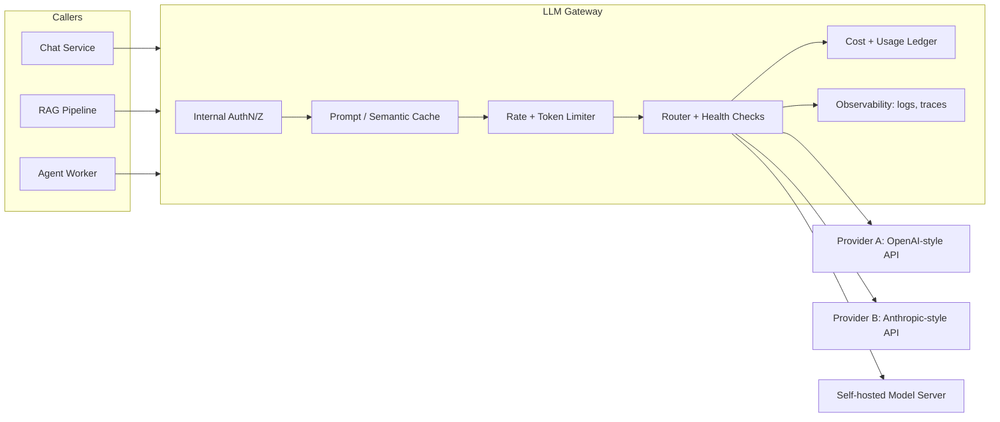

# LLM Gateways

## Why This Matters

The first time a team ships one feature that calls an LLM provider directly from application code, it works fine. The second and third features do the same thing, each with their own copy-pasted API key handling, retry logic, and error parsing. By the fifth feature, nobody can answer basic questions that matter to the business: how much did we spend on AI last month? Which team is burning the budget? What happens when the provider has an outage? Is anyone logging prompts for debugging, or did that only happen in the one service the original author still maintains?

An **LLM gateway** is the fix: a single internal service that every part of your system calls instead of calling model providers directly. It is the same idea as an API Gateway (see [Part 11 — Microservices & Distributed Systems](../11-microservices-distributed-systems/README.md)) applied specifically to AI traffic, and it exists because LLM calls have operational properties — highly variable latency, per-token cost, provider-specific rate limits, frequent provider outages, and non-deterministic output — that are expensive to solve correctly once, and *very* expensive to solve incorrectly N times across N services.

## Core Concept

An LLM gateway is an internal API that sits between your application services and external (or self-hosted) model providers. Application code sends it a provider-agnostic request — "generate a completion for these messages, using a model tier I specify" — and the gateway handles everything provider-specific: authentication, request/response translation, routing, rate limiting, retries, fallback, caching, cost accounting, and logging.

Concretely, a gateway is responsible for some subset of:

- **Abstraction** — one internal request/response shape regardless of which provider ultimately serves it (see [Multi-Provider Architecture](multi-provider-architecture.md)).
- **Routing** — deciding *which* model and provider handles a given request (see [Model Routing](model-routing.md)).
- **Resilience** — falling back to another provider or model when the first choice fails (see [Fallback Systems](fallback-systems.md)).
- **Rate and token limiting** — protecting both your budget and the provider's limits (see [AI Rate Limits](ai-rate-limits.md) and [Token Rate Limits](token-rate-limits.md)).
- **Cost accounting** — attributing spend to the team, user, or feature that caused it (see [Cost Tracking](cost-tracking.md)).
- **Caching** — avoiding redundant provider calls (see [Prompt Caching](prompt-caching.md) and [Semantic Caching](semantic-caching.md)).
- **Observability** — one place to trace, log, and evaluate every AI call in the system (see [AI Observability](ai-observability.md)).

## Mental Model

Think of the LLM gateway the way you think of a company's central **procurement department** rather than letting every employee independently negotiate with vendors and expense whatever they buy. Any employee (application service) who needs a "widget" (a completion) files a standard request through procurement. Procurement decides which supplier (provider) to use today based on price, stock, and reliability; negotiates the contract terms (API keys, rate limits) once; keeps one ledger of what was spent and by whom; and has a backup supplier ready if the primary one is out of stock. Employees never need to know the supplier's paperwork — they just get their widget, or a clear reason why they didn't.

## How It Works

1. A client service (a FastAPI backend, a background worker, an agent loop) sends a request to the gateway's internal endpoint — typically something like `POST /v1/generate` — with a normalized payload: messages, a requested "capability tier" (e.g. `fast`, `balanced`, `reasoning`) rather than a hardcoded model name, and metadata such as `tenant_id` and `feature` for cost attribution.
2. The gateway authenticates the *internal* caller (service-to-service auth, see [Part 5 — Authentication & Authorization](../05-authentication-authorization/README.md)) — separately from the *external* provider credentials it manages on the caller's behalf.
3. The gateway checks caches (exact-match prompt cache and/or semantic cache) before doing any provider work.
4. The gateway's router picks a provider and model based on the routing policy, current provider health, and load.
5. The gateway translates the normalized request into that provider's exact wire format, calls it, and translates the response back into the normalized shape.
6. If the call fails or times out, the gateway retries and/or falls back according to policy, rather than surfacing the failure to the caller immediately.
7. The gateway records usage (tokens in/out, latency, cost, cache hit/miss) and returns the normalized response to the caller.

Crucially, none of the calling services need to know any of this happened. They sent one request and got one response; the resilience, routing, and accounting are invisible to them.

## Architecture



The important structural detail: application services only ever talk to the box labeled "LLM Gateway." Every provider integration, every credential, every routing decision lives behind that single boundary.

## Request / Response Example

Internal, normalized gateway request from an application service — note this looks nothing like any single provider's raw API:

```http
POST /v1/generate HTTP/1.1
Host: llm-gateway.internal
Authorization: Bearer <internal-service-token>
Content-Type: application/json

{
  "tenant_id": "acme_corp",
  "feature": "support_chat_summarizer",
  "capability": "balanced",
  "max_tokens": 400,
  "messages": [
    { "role": "system", "content": "Summarize the ticket in 2 sentences." },
    { "role": "user", "content": "<ticket transcript>" }
  ]
}
```

Normalized response, with the provider that actually served it exposed as metadata for debugging and cost tracking, not as something the caller has to branch on:

```http
HTTP/1.1 200 OK
Content-Type: application/json

{
  "content": "Customer cannot log in after a password reset; issue traced to a stale session cookie. Recommended clearing cookies, which resolved it.",
  "usage": { "input_tokens": 812, "output_tokens": 34 },
  "provider": "provider_a",
  "model": "provider-a-balanced-v2",
  "cache": "miss",
  "cost_usd": 0.0041,
  "latency_ms": 640
}
```

## Code Example

A minimal gateway entrypoint showing the normalized request model and the shape of the internal handler. This intentionally omits routing/fallback/rate-limit *implementation* — those are covered in depth in their own chapters — to keep the gateway's own responsibility clear.

```python
import os
import time
from dataclasses import dataclass
from typing import Literal

from fastapi import FastAPI, HTTPException
from pydantic import BaseModel

app = FastAPI(title="Internal LLM Gateway")

Capability = Literal["fast", "balanced", "reasoning"]


class Message(BaseModel):
    role: Literal["system", "user", "assistant"]
    content: str


class GenerateRequest(BaseModel):
    tenant_id: str
    feature: str
    capability: Capability = "balanced"
    max_tokens: int = 500
    messages: list[Message]


class GenerateResponse(BaseModel):
    content: str
    usage: dict
    provider: str
    model: str
    cache: Literal["hit", "miss"]
    cost_usd: float
    latency_ms: int


@app.post("/v1/generate", response_model=GenerateResponse)
async def generate(req: GenerateRequest) -> GenerateResponse:
    start = time.monotonic()

    # 1. Cache lookup (prompt/semantic) would happen here — see prompt-caching.md
    #    and semantic-caching.md. Omitted for brevity.

    # 2. Rate/token budget check for this tenant — see ai-rate-limits.md and
    #    token-rate-limits.md. Raising 429 here protects both our spend and
    #    the provider's own limits.
    if not _tenant_has_budget(req.tenant_id):
        raise HTTPException(status_code=429, detail="Tenant token budget exceeded")

    # 3. Route + call with fallback — see model-routing.md and fallback-systems.md.
    result = await _route_and_call(req)

    # 4. Record cost/usage for the dashboards in cost-tracking.md.
    _record_usage(req.tenant_id, req.feature, result)

    latency_ms = int((time.monotonic() - start) * 1000)
    return GenerateResponse(**result, latency_ms=latency_ms)


def _tenant_has_budget(tenant_id: str) -> bool:
    # Placeholder — real implementation checks a Redis-backed counter.
    return True


async def _route_and_call(req: GenerateRequest) -> dict:
    # Placeholder — real implementation lives in the router (model-routing.md).
    return {
        "content": "...",
        "usage": {"input_tokens": 0, "output_tokens": 0},
        "provider": "provider_a",
        "model": "provider-a-balanced-v2",
        "cache": "miss",
        "cost_usd": 0.0,
    }


def _record_usage(tenant_id: str, feature: str, result: dict) -> None:
    # Placeholder — real implementation writes to the usage ledger.
    pass
```

## Production Considerations

- **The gateway becomes a single point of failure for every AI feature you have.** Treat it like any other tier-0 service: multiple replicas, health checks, load balancing, and its own SLOs (see [Part 12 — Observability](../12-observability/README.md)).
- **Latency budget.** A gateway hop adds network latency on top of an already-slow LLM call. Keep the gateway's own processing (auth, cache lookup, routing decision) in the single-digit milliseconds; don't let it become the bottleneck.
- **Streaming has to be a first-class citizen**, not an afterthought — most production LLM features stream tokens to the end user, and the gateway needs to proxy a stream through its own layers (cache, accounting) without buffering the entire response first, or you reintroduce the latency you built the gateway to avoid.
- **Version your internal contract.** The normalized request/response shape will change as you add capabilities (tool calling, multimodal input). Treat it like any other API you version (see [Part 2 — REST API Engineering](../02-rest-api-design/README.md)).
- **Don't let the gateway become a dumping ground for feature-specific logic.** Prompt templates and business logic belong in the calling service; the gateway's job is providers, routing, resilience, and accounting — not "how to write a good ticket summarizer."

## Common Mistakes

- **Skipping the gateway for "just one quick feature."** That one exception becomes the thing nobody can find when auditing spend or debugging an incident six months later.
- **Building the gateway to only support one provider "for now."** If it doesn't abstract the provider from day one, every caller ends up coupled to provider-specific fields anyway, defeating the purpose (see [Multi-Provider Architecture](multi-provider-architecture.md)).
- **No internal authentication on the gateway** because "it's internal." Internal-only is a network assumption, not a security control — a compromised service inside your network can still exhaust your provider spend if the gateway trusts any caller unconditionally.
- **Treating the gateway as purely infrastructure with no product ownership.** Someone needs to own routing policy, cost budgets, and provider relationships — a gateway with no owner drifts into an unmaintained bottleneck.

## Best Practices

- Define the normalized request/response schema first, before wiring up any provider — it's your actual product surface.
- Make `capability` (fast/balanced/reasoning) or similar an explicit, versioned concept rather than a raw model name, so routing changes don't require every caller to redeploy.
- Emit structured logs and metrics per request from inside the gateway (tenant, feature, provider, model, tokens, cost, latency, cache status) — this is the dataset every later chapter in this part builds on.
- Load-test the gateway itself under realistic concurrency; its cache, rate limiter, and routing logic all need to behave correctly under load, not just correctness under a single request.

## AI Engineering Perspective

In a RAG pipeline (see [Part 16 — RAG APIs](../16-rag-apis/README.md)), the gateway is typically called twice per user query: once for the embedding call and once for the generation call, each with different capability needs and cost profiles — the gateway's routing and cost-tracking layers need to distinguish these as different "features" even though they're one logical request from the user's point of view. In an agent loop (see [Part 17 — AI Agents & MCP](../17-ai-agents-and-mcp/README.md)), a single user turn can trigger many gateway calls in sequence as the agent reasons and calls tools — this is exactly the scenario where per-request provider outages and cost blowouts compound fastest, making the gateway's fallback and budget-enforcement layers load-bearing rather than optional. A reference implementation lives in [`examples/llm-gateway/`](../../examples/llm-gateway/), and [Project 8 — Multi-Provider LLM Gateway](../../projects/08-llm-gateway/) walks through building one incrementally.

## Exercises

**Beginner:** Draw the request/response contract for your own internal `/v1/generate` endpoint, listing every field you'd need for cost attribution alone.

**Intermediate:** Take two different LLM provider SDKs' documentation and write down every field name that differs between them for an equivalent request (model name, message roles, max tokens, stop sequences). This is the exact list your gateway's adapters need to reconcile.

**Advanced:** Design the gateway's internal API versioning strategy: how would you add multimodal (image) input support to the normalized schema without breaking every existing caller?

## Key Takeaways

- An LLM gateway is a single internal API that all application code calls instead of talking to model providers directly.
- It centralizes abstraction, routing, resilience, rate/token limiting, cost accounting, caching, and observability — problems that are expensive to solve correctly once but disastrous to solve inconsistently across many services.
- The gateway becomes a critical-path, tier-0 service and must be engineered (and monitored) accordingly.
- Every other chapter in this part is a component that plugs into the gateway described here.
