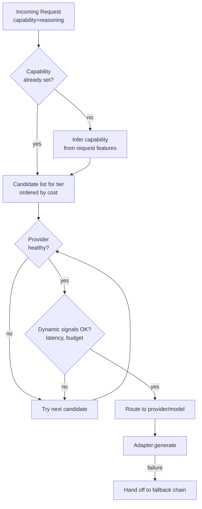

# Model Routing

## Why This Matters

Once you have more than one provider or model behind your gateway (see [Multi-Provider Architecture](multi-provider-architecture.md)), someone — or something — has to decide, for every single request, which model actually handles it. Do it wrong and you either overpay (sending simple classification requests to your most expensive reasoning model) or underdeliver (sending a complex multi-step reasoning task to a cheap, fast model that gets it wrong). Model routing is the decision layer that makes this choice automatically, based on policy rather than whatever model name a developer happened to hardcode into a prompt file eighteen months ago.

This is a genuinely different problem from traditional load balancing. A traditional load balancer treats backend instances as interchangeable — any healthy instance can serve any request equally well. LLMs are not interchangeable: different models have different capabilities, cost, latency, and failure profiles, so routing decisions are as much about *quality and cost trade-offs* as they are about *availability*.

## Core Concept

Model routing is the logic, inside the gateway, that maps an incoming normalized request to a specific `(provider, model)` pair. Routing strategies generally combine several signals:

- **By cost** — sending requests to the cheapest model that meets a minimum quality bar for the task, since cost scales linearly (or worse) with token volume and adds up fast at production scale.
- **By task complexity** — a capability tier (`fast`, `balanced`, `reasoning`) chosen by the caller, or inferred automatically, determines which model class is eligible at all.
- **By latency requirement** — user-facing, synchronous requests (e.g. autocomplete) route to low-latency models; batch or background requests can route to slower, higher-quality models.
- **By provider health** — a provider currently degraded or rate-limiting you gets deprioritized or skipped, independent of cost/complexity considerations (this overlaps heavily with [Fallback Systems](fallback-systems.md), which is what happens *after* a routing choice fails).

Routing can be **static** (a fixed mapping, e.g. `capability=fast → provider_a/small-model`, configured and deployed like any other config) or **dynamic** (the router evaluates real-time signals — current provider latency, error rate, queue depth, remaining budget — and picks per-request). Most production systems start static and add dynamic elements incrementally, because dynamic routing adds real complexity and its own failure modes (a router that's "smart" but buggy is worse than a router that's simple and predictable).

## Mental Model

Think of the router as a **hospital triage desk**, not a random dispatcher. A patient (request) arrives with symptoms (task complexity, latency needs). Triage doesn't send everyone to the most senior surgeon "to be safe," nor does it send everyone to the fastest available doctor regardless of severity — it matches the case to the appropriate level of care, and it also knows in real time which doctors are currently unavailable, overloaded, or on break (provider health), rerouting around them without the patient having to know any of that happened.

## How It Works

1. The router receives a normalized request with a **capability tier** (explicit from the caller, or classified automatically from the request — e.g., a short factual question maps to `fast`, a multi-step coding task maps to `reasoning`).
2. It looks up the **candidate list** of `(provider, model)` pairs eligible for that tier, ordered by policy priority (usually cost-ascending, with quality/latency constraints already baked into which models are even in the tier's candidate list).
3. It filters candidates by **current health** — providers that are open-circuit (see [Fallback Systems](fallback-systems.md) and [Part 6 — Circuit Breakers](../06-production-reliability/circuit-breakers.md)) or currently rate-limited are skipped.
4. It optionally applies **dynamic signals** — e.g., route away from a provider whose rolling p95 latency has spiked, or away from one where the tenant's token budget for that provider is nearly exhausted.
5. It picks the top remaining candidate and hands the request to that provider's adapter. If that call fails, control passes to the fallback chain (a distinct but closely related concern, covered next).

A subtlety worth internalizing: routing decides the *first choice*; fallback decides *what happens when the first choice fails*. Conflating them leads to routers that retry blindly instead of routing intelligently, and to fallback logic that ignores the original routing policy (e.g. falling back from a cheap model straight to the most expensive one, defeating the cost policy that routing was trying to enforce).

## Architecture



## Request / Response Example

A caller can pass an explicit capability, or let the router infer one — both are valid inputs to the same routing decision:

```http
POST /v1/generate HTTP/1.1
Content-Type: application/json

{
  "capability": "reasoning",
  "messages": [
    { "role": "user", "content": "Given this schema, write a migration that backfills..." }
  ]
}
```

The gateway's response includes which model was actually chosen, so callers and dashboards can observe routing decisions without guessing:

```http
HTTP/1.1 200 OK
Content-Type: application/json

{
  "content": "...",
  "usage": { "input_tokens": 210, "output_tokens": 340 },
  "routing": {
    "requested_capability": "reasoning",
    "provider": "provider_b",
    "model": "provider-b-reasoning-v1",
    "candidates_skipped": [
      { "provider": "provider_a", "model": "provider-a-reasoning-v1", "reason": "circuit_open" }
    ]
  }
}
```

## Code Example

```python
import time
from dataclasses import dataclass, field
from typing import Literal

Capability = Literal["fast", "balanced", "reasoning"]


@dataclass
class RouteCandidate:
    provider: str
    model: str
    cost_per_1k_input_tokens: float
    cost_per_1k_output_tokens: float


# Static policy: candidates ordered cost-ascending per tier. This table is
# config, not code — in production it typically lives outside the deploy.
ROUTING_TABLE: dict[Capability, list[RouteCandidate]] = {
    "fast": [
        RouteCandidate("provider_a", "provider-a-small-v1", 0.15, 0.60),
        RouteCandidate("provider_b", "provider-b-small-v1", 0.20, 0.80),
    ],
    "balanced": [
        RouteCandidate("provider_a", "provider-a-balanced-v2", 1.00, 3.00),
        RouteCandidate("provider_b", "provider-b-balanced-v1", 1.20, 3.50),
    ],
    "reasoning": [
        RouteCandidate("provider_b", "provider-b-reasoning-v1", 5.00, 15.00),
        RouteCandidate("provider_a", "provider-a-reasoning-v1", 6.00, 18.00),
    ],
}


class ProviderHealthTracker:
    """Tracks a rolling error rate per provider; used to skip unhealthy
    providers before even attempting a call. Complements — does not
    replace — the circuit breaker used during the call itself
    (see ../06-production-reliability/circuit-breakers.md)."""

    def __init__(self, window_seconds: float = 60.0, error_threshold: float = 0.5):
        self.window_seconds = window_seconds
        self.error_threshold = error_threshold
        self._events: dict[str, list[tuple[float, bool]]] = {}

    def record(self, provider: str, success: bool) -> None:
        now = time.monotonic()
        events = self._events.setdefault(provider, [])
        events.append((now, success))
        cutoff = now - self.window_seconds
        self._events[provider] = [e for e in events if e[0] >= cutoff]

    def is_healthy(self, provider: str) -> bool:
        events = self._events.get(provider, [])
        if len(events) < 5:
            return True  # not enough data to judge — assume healthy
        error_rate = sum(1 for _, ok in events if not ok) / len(events)
        return error_rate < self.error_threshold


def select_route(
    capability: Capability,
    health: ProviderHealthTracker,
    exclude_providers: set[str] | None = None,
) -> RouteCandidate | None:
    """Returns the first healthy, non-excluded candidate for the requested
    tier, in policy (cost) order. Returns None if every candidate is
    unavailable — the caller then decides whether to widen the tier or fail."""
    exclude_providers = exclude_providers or set()
    for candidate in ROUTING_TABLE[capability]:
        if candidate.provider in exclude_providers:
            continue
        if not health.is_healthy(candidate.provider):
            continue
        return candidate
    return None
```

## Production Considerations

- **Routing policy is a business decision, not just an engineering one** — the trade-off between "cheapest model that's good enough" and "best possible answer" should be owned by product/eng together, and revisited as provider pricing and quality change.
- **Automatic capability inference is risky.** Misclassifying a complex request as `fast` produces a wrong or low-quality answer silently — no error is raised, so this failure mode is invisible unless you're actively evaluating output quality (see [AI Observability](ai-observability.md)). Many production systems prefer explicit, caller-specified capability tiers precisely to avoid this.
- **Routing decisions must be logged per request** — "why did this request go to provider B instead of A" is one of the first questions asked during a cost spike or quality regression.
- **Avoid routing based on stale health data.** A provider that was unhealthy two minutes ago may have recovered; expire health signals aggressively enough that recovery is detected within your acceptable blast-radius window.

## Common Mistakes

- **Hardcoding model names in application code** instead of routing by capability tier — this is precisely the coupling the gateway and router exist to remove.
- **Routing purely by cost with no quality floor**, silently degrading user-facing output because "the cheap model was healthy."
- **No visibility into routing decisions**, so a cost spike or quality complaint can't be traced back to "we started routing this feature to a different model last Tuesday."
- **Conflating routing with fallback logic** in one tangled function, making both hard to reason about and test independently.

## Best Practices

- Keep the routing table declarative and easy to change without a full redeploy (config service, feature flags, or a database-backed policy).
- Always log the full routing decision, including candidates skipped and why — this data feeds both cost dashboards and incident postmortems.
- Start with static, capability-tier routing; add dynamic health/latency-based routing only once you have the observability to trust the signals it's reacting to.
- Set an explicit quality floor per tier (backed by evaluation data, not vibes) before optimizing further for cost within that tier.

## AI Engineering Perspective

In an [agent loop](../17-ai-agents-and-mcp/README.md), individual steps often have very different complexity — a planning step might need `reasoning`, while a tool-argument-formatting step is trivially `fast`. Routing per-step, rather than using one capability for the entire agent run, is one of the highest-leverage cost optimizations available in agentic systems, but it requires the agent framework to actually tag each internal call with the right capability rather than defaulting everything to one model. In [RAG pipelines](../16-rag-apis/README.md), routing decisions typically differ sharply between the embedding call (almost always routed to the cheapest available embedding model, since embedding quality differences are usually secondary to retrieval-pipeline quality) and the final generation call (where routing by complexity of the retrieved context, not just the user's question, often matters — a query needing synthesis across ten retrieved chunks may deserve a stronger model than one answered from a single clear passage).

## Exercises

**Beginner:** Design a routing table (like `ROUTING_TABLE` above) for three capability tiers, using two providers you're aware of, choosing a reasonable cost-ascending order for each tier.

**Intermediate:** Extend `select_route` to also consider a per-tenant remaining token budget (see [Token Rate Limits](token-rate-limits.md)), skipping a candidate whose provider the tenant has already exhausted budget for.

**Advanced:** Design an automatic capability-classification step that uses a small, fast model to estimate task complexity before routing — and describe how you'd evaluate whether this classifier is actually saving cost without degrading quality.

## Key Takeaways

- Model routing decides which `(provider, model)` handles each request, based on cost, task complexity, latency needs, and provider health.
- Routing is distinct from fallback: routing picks the first choice; fallback handles what happens when that choice fails.
- Static, capability-tier-based routing is a safer starting point than fully dynamic routing, which requires trustworthy real-time signals to avoid making things worse.
- Every routing decision should be logged — it's essential data for cost attribution, quality debugging, and incident response.
