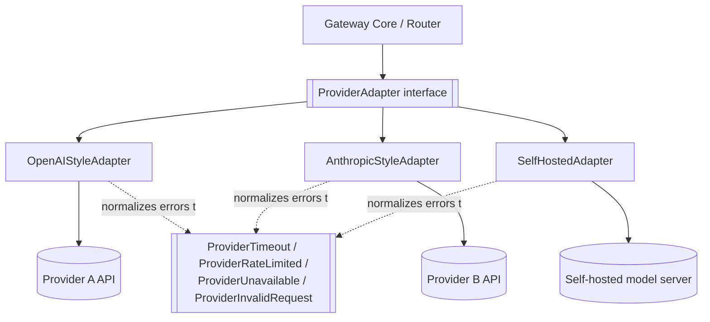

# Multi-Provider Architecture

## Why This Matters

Every LLM provider's API is shaped slightly differently — different field names, different ways of representing a system prompt, different token-usage reporting, different error codes for the same underlying problem. If your application code calls a provider's SDK directly, every one of those differences leaks into your business logic. Switching providers, adding a second provider for fallback, or A/B testing two models becomes a rewrite instead of a configuration change. Multi-provider architecture is the discipline of building one internal abstraction that hides those differences, so the rest of your system — and the [LLM gateway](llm-gateways.md) that sits in front of providers — only ever speaks one dialect.

This matters even if you only use one provider today. Providers have outages, deprecate models, change pricing, and sometimes fail entire regions for hours. Teams that hard-code a single provider's SDK into their core logic discover, during an outage, that "switch providers" is a multi-day engineering project instead of a config change.

## Core Concept

Multi-provider architecture is built on the **adapter pattern**: define one internal interface that represents "what a completion request/response looks like," then write one small adapter class per provider that translates between the internal shape and that provider's actual wire format. Application code, routing logic, and the rest of the gateway only ever interact with the internal interface — never with a provider SDK directly.

The two things every adapter must normalize are:

- **Request normalization** — mapping an internal `GenerationRequest` (messages, capability, max tokens, temperature, tools) into whatever shape the target provider expects (some put `system` outside `messages`, some use `max_tokens`, others `max_output_tokens`, tool-calling schemas differ subtly between providers).
- **Response normalization** — mapping the provider's raw response (which may nest content differently, use different stop-reason vocabularies, or report usage under different field names) back into one internal `GenerationResponse` shape that the rest of the system consumes.

## Mental Model

Think of adapters as **electrical plug adapters** for international travel. Your appliance (application code) has one plug shape it was built with — the internal interface. Every country's wall socket (provider API) has a different physical shape, voltage quirk, and connector convention. You don't redesign the appliance for every country you visit; you carry a small adapter per socket type, and the appliance never knows the difference. If a socket in a hotel room stops working, you don't rebuild your appliance — you plug into a different socket with a different adapter.

## How It Works

1. Define an internal, provider-agnostic data model: `GenerationRequest` (messages, capability tier, max tokens, temperature, tool definitions) and `GenerationResponse` (content, usage, stop reason, raw provider metadata for debugging).
2. Define an abstract adapter interface — typically one async method, `generate(request) -> response`, plus a `health_check()` method used by the router (see [Model Routing](model-routing.md)) and [Fallback Systems](fallback-systems.md).
3. Implement one concrete adapter class per provider. Each adapter:
   - Translates the internal request into the provider's exact JSON body and headers.
   - Calls the provider's HTTP API (or SDK).
   - Catches provider-specific exceptions/HTTP status codes and translates them into a small set of internal exception types (`ProviderTimeout`, `ProviderRateLimited`, `ProviderUnavailable`, `ProviderInvalidRequest`) so upstream code doesn't need to know each provider's error vocabulary.
   - Translates the raw response back into `GenerationResponse`, including computing token usage in the internal shape even if the provider reports it differently (e.g. `prompt_tokens`/`completion_tokens` vs `input_tokens`/`output_tokens`).
4. Register adapters in a registry keyed by provider name, so the router can look one up dynamically rather than importing provider-specific code directly.

The subtlety that trips people up: normalization is not just field renaming. Providers differ in *behavior*, not just *shape* — e.g., how they truncate on `max_tokens`, whether they support multiple system messages, how they represent a refusal. A good adapter layer documents these behavioral differences instead of silently papering over them, because silent papering-over produces bugs that only show up when you're routed to the "other" provider under load.

## Architecture



Application and routing code never appears below the `ProviderAdapter interface` line — that boundary is the entire point of the pattern.

## Request / Response Example

Internal normalized request, as constructed by the gateway before being handed to an adapter:

```json
{
  "capability": "balanced",
  "max_tokens": 300,
  "temperature": 0.3,
  "messages": [
    { "role": "system", "content": "You are a terse API documentation assistant." },
    { "role": "user", "content": "Explain idempotency keys in two sentences." }
  ]
}
```

What the `OpenAIStyleAdapter` sends on the wire (field names illustrative):

```json
{
  "model": "gpt-style-balanced",
  "max_tokens": 300,
  "temperature": 0.3,
  "messages": [
    { "role": "system", "content": "You are a terse API documentation assistant." },
    { "role": "user", "content": "Explain idempotency keys in two sentences." }
  ]
}
```

What the `AnthropicStyleAdapter` sends for the *same* internal request — note `system` moves out of `messages` entirely:

```json
{
  "model": "claude-style-balanced",
  "max_tokens": 300,
  "temperature": 0.3,
  "system": "You are a terse API documentation assistant.",
  "messages": [
    { "role": "user", "content": "Explain idempotency keys in two sentences." }
  ]
}
```

Both responses get normalized back into the same internal shape regardless of which provider answered:

```json
{
  "content": "An idempotency key lets a client safely retry a request without it being applied twice...",
  "usage": { "input_tokens": 41, "output_tokens": 38 },
  "stop_reason": "end_turn",
  "provider": "provider_b",
  "model": "claude-style-balanced"
}
```

## Code Example

```python
import os
from abc import ABC, abstractmethod
from dataclasses import dataclass, field
from typing import Literal

import httpx


class ProviderError(Exception):
    """Base class for normalized provider errors."""


class ProviderTimeout(ProviderError):
    pass


class ProviderRateLimited(ProviderError):
    def __init__(self, retry_after_seconds: float | None = None):
        self.retry_after_seconds = retry_after_seconds
        super().__init__("Provider rate limited the request")


class ProviderUnavailable(ProviderError):
    pass


@dataclass
class GenerationRequest:
    messages: list[dict]          # [{"role": "system"|"user"|"assistant", "content": str}]
    max_tokens: int = 500
    temperature: float = 0.7


@dataclass
class GenerationResponse:
    content: str
    input_tokens: int
    output_tokens: int
    stop_reason: str
    provider: str
    model: str


class ProviderAdapter(ABC):
    """Every provider integration implements this — nothing outside the
    adapter layer should import a provider SDK directly."""

    name: str
    model_name: str

    @abstractmethod
    async def generate(self, request: GenerationRequest) -> GenerationResponse: ...

    @abstractmethod
    async def health_check(self) -> bool: ...


class OpenAIStyleAdapter(ProviderAdapter):
    name = "provider_a"

    def __init__(self, model_name: str, base_url: str, client: httpx.AsyncClient):
        self.model_name = model_name
        self.base_url = base_url
        self.client = client
        # Never hardcode secrets — always read from environment/secret manager.
        self.api_key = os.environ["PROVIDER_A_API_KEY"]

    async def generate(self, request: GenerationRequest) -> GenerationResponse:
        body = {
            "model": self.model_name,
            "max_tokens": request.max_tokens,
            "temperature": request.temperature,
            "messages": request.messages,  # this provider keeps system in messages
        }
        try:
            resp = await self.client.post(
                f"{self.base_url}/v1/chat/completions",
                json=body,
                headers={"Authorization": f"Bearer {self.api_key}"},
                timeout=30.0,
            )
        except httpx.TimeoutException as e:
            raise ProviderTimeout() from e

        if resp.status_code == 429:
            retry_after = resp.headers.get("Retry-After")
            raise ProviderRateLimited(float(retry_after) if retry_after else None)
        if resp.status_code >= 500:
            raise ProviderUnavailable(f"status={resp.status_code}")
        resp.raise_for_status()

        data = resp.json()
        choice = data["choices"][0]
        usage = data["usage"]
        return GenerationResponse(
            content=choice["message"]["content"],
            input_tokens=usage["prompt_tokens"],
            output_tokens=usage["completion_tokens"],
            stop_reason=choice["finish_reason"],
            provider=self.name,
            model=self.model_name,
        )

    async def health_check(self) -> bool:
        try:
            resp = await self.client.get(f"{self.base_url}/v1/models", timeout=5.0)
            return resp.status_code == 200
        except httpx.HTTPError:
            return False


class AnthropicStyleAdapter(ProviderAdapter):
    name = "provider_b"

    def __init__(self, model_name: str, base_url: str, client: httpx.AsyncClient):
        self.model_name = model_name
        self.base_url = base_url
        self.client = client
        self.api_key = os.environ["PROVIDER_B_API_KEY"]

    async def generate(self, request: GenerationRequest) -> GenerationResponse:
        # This provider expects system prompt OUTSIDE the messages array —
        # this is exactly the kind of behavioral difference the adapter exists to hide.
        system_msgs = [m["content"] for m in request.messages if m["role"] == "system"]
        other_msgs = [m for m in request.messages if m["role"] != "system"]

        body = {
            "model": self.model_name,
            "max_tokens": request.max_tokens,
            "temperature": request.temperature,
            "system": "\n".join(system_msgs) if system_msgs else None,
            "messages": other_msgs,
        }
        try:
            resp = await self.client.post(
                f"{self.base_url}/v1/messages",
                json=body,
                headers={"x-api-key": self.api_key},
                timeout=30.0,
            )
        except httpx.TimeoutException as e:
            raise ProviderTimeout() from e

        if resp.status_code == 429:
            raise ProviderRateLimited()
        if resp.status_code >= 500:
            raise ProviderUnavailable(f"status={resp.status_code}")
        resp.raise_for_status()

        data = resp.json()
        return GenerationResponse(
            content=data["content"][0]["text"],
            input_tokens=data["usage"]["input_tokens"],
            output_tokens=data["usage"]["output_tokens"],
            stop_reason=data["stop_reason"],
            provider=self.name,
            model=self.model_name,
        )

    async def health_check(self) -> bool:
        try:
            resp = await self.client.get(f"{self.base_url}/v1/health", timeout=5.0)
            return resp.status_code == 200
        except httpx.HTTPError:
            return False


# A simple registry the router looks up adapters from — see model-routing.md.
ADAPTER_REGISTRY: dict[str, ProviderAdapter] = {}


def register_adapter(adapter: ProviderAdapter) -> None:
    ADAPTER_REGISTRY[adapter.name] = adapter
```

## Production Considerations

- **Adapters must normalize errors, not just successes.** A router or fallback system that has to special-case each provider's exception types has effectively re-leaked the abstraction it was supposed to remove.
- **Token counting differs across providers** even for equivalent text, because each provider uses its own tokenizer. Never assume token counts are directly comparable across providers — recompute cost per provider using that provider's own reported usage.
- **Keep raw provider responses available for debugging**, even though callers see the normalized shape — attach the raw payload as metadata on the internal response object so you can diagnose provider-specific weirdness without losing normalization for the common path.
- **Version adapters independently of the gateway.** A provider changing their API is a localized adapter change, not a gateway-wide deploy, if the abstraction boundary is respected.

## Common Mistakes

- **Leaky abstractions**: exposing a provider-specific field "just this once" in the internal schema because a feature needs it. This defeats the entire pattern within a quarter.
- **Assuming behavioral parity.** Two providers accepting the same JSON shape does not mean they behave the same way — e.g., one might silently truncate over-length input while another rejects it with a 400. Test each adapter's edge-case behavior explicitly, don't assume.
- **Sharing one HTTP client/connection pool misconfigured for all providers**, so a slow provider's connection pool exhaustion starves requests to a healthy provider. Give each adapter its own client/pool.
- **No health check implementation**, forcing the router to discover a dead provider only via failed user-facing requests instead of proactively.

## Best Practices

- Design the internal `GenerationRequest`/`GenerationResponse` shape first, based on what your product actually needs — not based on whichever provider you integrated first.
- Write adapter-level tests against recorded real responses (fixtures) for each provider, so provider API changes surface as test failures, not production incidents.
- Keep the internal error taxonomy small and meaningful (timeout, rate-limited, unavailable, invalid-request) — this is exactly what [Fallback Systems](fallback-systems.md) and [Model Routing](model-routing.md) branch on.
- Log which adapter served every request, always — see [AI Observability](ai-observability.md).

## AI Engineering Perspective

Tool/function calling (see [Part 14 — AI API Engineering](../14-ai-api-engineering/README.md)) is one of the hardest things to normalize across providers, because tool schemas, tool-call response shapes, and multi-turn tool-result formats differ meaningfully — not just cosmetically — between providers. If you're building an [agent loop](../17-ai-agents-and-mcp/README.md) on top of a multi-provider gateway, invest early in a normalized tool-calling representation in your adapter layer, because retrofitting it after agents are already coupled to one provider's tool-call format is expensive. In [RAG pipelines](../16-rag-apis/README.md), the embedding-generation call is a *second* interface that also needs its own adapter abstraction (dimensions, batch limits, and normalization conventions differ by provider) — don't assume your chat-completion adapter pattern automatically covers embeddings too.

## Exercises

**Beginner:** List three fields that differ in name or structure between two real LLM provider APIs you're aware of (from documentation), and write the internal normalized field name you'd choose for each.

**Intermediate:** Implement a third adapter (e.g., for a self-hosted, OpenAI-compatible inference server) against the `ProviderAdapter` interface above, including its own error normalization.

**Advanced:** Design how you'd normalize streaming responses (token-by-token) across two providers with different chunk formats, without buffering the whole response — sketch the internal streaming interface.

## Key Takeaways

- Multi-provider architecture uses the adapter pattern: one internal request/response shape, one small adapter class per provider.
- Adapters normalize both data shape (field names) and behavior (errors, truncation, stop reasons) — shape-only normalization is a leaky abstraction.
- A small, shared internal error taxonomy (timeout, rate-limited, unavailable, invalid) is what makes routing and fallback logic provider-agnostic.
- This layer is what makes [Model Routing](model-routing.md) and [Fallback Systems](fallback-systems.md) possible without provider-specific branching in business logic.
