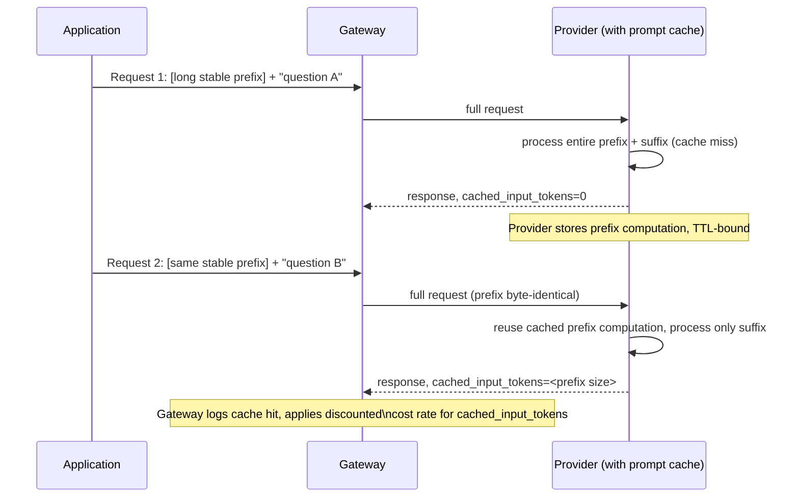

# Prompt Caching

## Why This Matters

Many production LLM prompts repeat a large, unchanging block of context on every single call: a long system prompt, a set of few-shot examples, a large document being repeatedly questioned, or an entire tool/API schema definition. Without caching, the provider re-processes that entire unchanging prefix from scratch on every request — paying (and charging you) full price and full latency for work that produced an identical result last time and the time before that. Prompt caching is a provider-level feature that recognizes a repeated prefix and skips re-processing it, cutting both cost and latency for exactly this common pattern.

This is distinct from — and complementary to — [Semantic Caching](semantic-caching.md), which caches whole *responses* by similarity of meaning. Prompt caching caches *partial input processing* by exact prefix match, and is provider-managed rather than something you build yourself.

## Core Concept

Prompt caching works at the level of the model's internal computation, not at the level of your application code. LLMs process input through many layers of attention over the token sequence; a large fraction of that computation for a given prefix produces intermediate state that is identical every time that exact prefix appears at the start of a request. Providers that support prompt caching detect a **repeated prefix** across requests (usually requiring an exact match up to some token boundary, sometimes explicitly marked by you) and reuse the cached intermediate computation instead of recomputing it, for a **substantial cost discount on the cached portion** (commonly a large fraction off the normal input-token price) and **materially lower latency** on the cached portion.

The key constraints that shape how you design prompts for it:

- **The cached portion must be a prefix** — content that appears at the *start* of the input and stays byte-for-byte identical across calls. Content after the cached prefix (the variable, per-request part) is processed normally.
- **Caches have a short TTL** (commonly minutes, provider-dependent) — this is a performance optimization for bursty, repeated traffic against the same context, not a durable long-term store.
- **Cache hits require exact matches.** Reordering messages, changing whitespace, or inserting a single token before the cached block invalidates the cache for that request.

## Mental Model

Think of prompt caching like a **restaurant kitchen that pre-chops its mise en place**. If every dish on the menu starts with the same base sauce, a kitchen that re-makes the base sauce from raw ingredients for every single order is wasting enormous time and ingredients. A well-run kitchen prepares the shared base once, keeps it ready in a warm station, and only does the dish-specific finishing work per order. The base sauce is the stable prefix (system prompt, long context document); the finishing work is the variable suffix (the user's actual question). If a cook changes the base recipe even slightly, though, the pre-made batch is now wrong and has to be redone from scratch — which is exactly why even tiny changes to the "stable" prefix invalidate the cache.

## How It Works

1. You structure your request so the **stable, reusable content comes first**: system instructions, a large reference document, few-shot examples, tool schema definitions — anything identical across many calls in a short window.
2. The **variable content comes last** — the actual user question or per-call input that differs every time.
3. On the first call with a given prefix, the provider processes it normally and (depending on the provider) stores the resulting intermediate state, keyed by the exact prefix, for a limited TTL.
4. On subsequent calls with the **identical** prefix within that TTL, the provider detects the match, skips recomputing the cached portion, and only processes the new suffix — returning both a cost saving and a latency saving, reported back to you via the response's usage field (e.g. a `cached_input_tokens` count, distinct from regular `input_tokens`).
5. Your gateway should log the cache-hit ratio and reflect the discounted rate in cost calculations (see [Cost Tracking](cost-tracking.md)) — treating cached and non-cached input tokens identically in cost reporting overstates your actual spend and understates the value of designing prompts this way.

## Architecture



## Request / Response Example

Two requests sharing an identical, large stable prefix (a product knowledge base excerpt) with only the trailing user question changing:

```json
{
  "model": "provider-b-balanced-v1",
  "messages": [
    { "role": "system", "content": "You are a support agent. Reference material:\n<8,000 tokens of product documentation, identical across requests>" },
    { "role": "user", "content": "How do I enable two-factor authentication?" }
  ]
}
```

Response usage on the second (and subsequent) calls sharing that prefix shows the cache hit explicitly:

```json
{
  "content": "Go to Settings > Security > Two-Factor Authentication and follow the setup prompt.",
  "usage": {
    "input_tokens": 8024,
    "cached_input_tokens": 8000,
    "output_tokens": 18
  }
}
```

Only 24 "fresh" input tokens (the actual user question plus minor formatting) were billed and processed at full rate; the remaining 8,000 were served from the provider's prompt cache at a steep discount.

## Code Example

```python
from dataclasses import dataclass


@dataclass
class PromptParts:
    stable_prefix: str   # system instructions + reference material — must be
                          # byte-identical across calls to hit the cache
    variable_suffix: str  # the actual per-request user input


def build_cache_friendly_messages(parts: PromptParts) -> list[dict]:
    """The ordering here is deliberate and load-bearing: stable content
    MUST come first and MUST be constructed identically every time (no
    timestamps, no randomly-ordered dict keys, no per-request formatting
    differences) or every call becomes a cache miss."""
    return [
        {"role": "system", "content": parts.stable_prefix},
        {"role": "user", "content": parts.variable_suffix},
    ]


def cache_hit_ratio(input_tokens: int, cached_input_tokens: int) -> float:
    if input_tokens == 0:
        return 0.0
    return cached_input_tokens / input_tokens


class PromptCacheMetrics:
    """Aggregates cache-hit stats per stable-prefix "template" so you can
    see which prompts are actually benefiting from caching in production."""

    def __init__(self):
        self._hits: dict[str, list[float]] = {}

    def record(self, template_id: str, input_tokens: int, cached_input_tokens: int) -> None:
        ratio = cache_hit_ratio(input_tokens, cached_input_tokens)
        self._hits.setdefault(template_id, []).append(ratio)

    def average_hit_ratio(self, template_id: str) -> float:
        ratios = self._hits.get(template_id, [])
        return sum(ratios) / len(ratios) if ratios else 0.0


# Anti-pattern to avoid: inserting a timestamp or request ID into the
# "stable" prefix breaks caching entirely, even though it looks harmless.
def BAD_build_messages(parts: PromptParts, request_id: str) -> list[dict]:
    prefix = f"[request {request_id}]\n{parts.stable_prefix}"  # DON'T DO THIS
    return [
        {"role": "system", "content": prefix},  # now unique every call — 0% cache hit rate
        {"role": "user", "content": parts.variable_suffix},
    ]
```

## Production Considerations

- **Ordering discipline is everything.** Any code path that reorders messages, reformats the stable content, or injects per-request metadata into the prefix silently destroys your cache-hit rate — this is easy to break accidentally during refactors and hard to notice without explicit metrics.
- **TTLs mean cache benefit depends on traffic pattern.** A prefix reused by ten different requests within a two-minute window benefits enormously; the same prefix used once every twenty minutes may never hit the cache at all. Prompt caching pays off most for high-frequency, shared-context workloads (support bots referencing the same knowledge base, RAG systems reusing a system prompt across many queries).
- **Not all providers expose the same caching model** — some cache automatically based on prefix matching, others require you to explicitly mark cache breakpoints in the request. Check each provider's actual mechanism in your [Multi-Provider Architecture](multi-provider-architecture.md) adapters rather than assuming uniform behavior.
- **Track cache-hit ratio as a first-class metric**, not just an incidental cost line — a prompt template whose hit ratio degrades over time (e.g. because someone added dynamic content to the "stable" prefix) is a regression worth alerting on.

## Common Mistakes

- **Putting the variable content first and stable content last**, which makes every request a full cache miss regardless of how much genuinely stable content exists.
- **Embedding timestamps, request IDs, or randomly-ordered data structures into the "stable" prefix**, invalidating the cache without anyone noticing why performance/cost regressed.
- **Assuming prompt caching is free storage with no TTL** and relying on it as if it were a durable cache — it's a performance optimization for near-term repeated traffic, not [Semantic Caching](semantic-caching.md)'s longer-lived response store.
- **Not reflecting cached-token discounts in cost calculations** (see [Cost Tracking](cost-tracking.md)), which both overstates real spend and hides the ROI of investing in cache-friendly prompt design.

## Best Practices

- Structure prompts as `[stable prefix][variable suffix]` deliberately, and treat that ordering as an API contract your codebase must not violate.
- Keep reference material (documentation excerpts, tool schemas, few-shot examples) in a dedicated, version-controlled constant rather than reconstructing it dynamically per request, to guarantee byte-for-byte stability.
- Monitor cache-hit ratio per prompt template and alert on regressions.
- For workloads with bursty, clustered traffic against the same context (e.g. many users asking about the same document within a short window), prompt caching often delivers a bigger win than semantic caching — evaluate both, don't assume one subsumes the other.

## AI Engineering Perspective

RAG pipelines (see [Part 16 — RAG APIs](../16-rag-apis/README.md)) are close to the ideal use case for prompt caching when the *same* retrieved context serves multiple related queries in a short window (e.g., a user asking several follow-up questions about the same document) — but note that RAG's retrieved context normally changes per query based on what's retrieved, so the cacheable prefix is usually the system prompt and tool/schema definitions, not the retrieved chunks themselves, unless you deliberately structure retrieval to reuse a stable context window across a session. In agent loops (see [Part 17 — AI Agents & MCP](../17-ai-agents-and-mcp/README.md)), the system prompt and tool definitions are typically identical across every step of a run and often across many runs, making them prime prompt-caching candidates — but the accumulating conversation/tool-result history breaks the "identical prefix" requirement as soon as it grows, so caching benefit in agents is usually concentrated in the fixed system/tools prefix, not the growing history tail.

## Exercises

**Beginner:** Rewrite a prompt that currently puts a per-request timestamp before a large system prompt so the timestamp no longer breaks prompt caching.

**Intermediate:** Using `PromptCacheMetrics` above, design a dashboard query that would flag a prompt template whose average cache-hit ratio dropped by more than 30% week over week.

**Advanced:** Design a request-batching or request-scheduling strategy that deliberately clusters requests sharing the same stable prefix closer together in time, to maximize cache-hit rate for a workload where requests currently arrive with random inter-arrival times.

## Key Takeaways

- Prompt caching is a provider-level optimization that reuses cached computation for an identical, repeated prefix, cutting cost and latency on that portion.
- It requires strict prefix stability — stable content first, variable content last, byte-for-byte identical across calls — or the cache never hits.
- Caches are short-TTL performance optimizations for near-term repeated traffic, not a durable store — that's what [Semantic Caching](semantic-caching.md) is for.
- Cache-hit ratio should be tracked as a first-class metric and reflected accurately in cost calculations.
