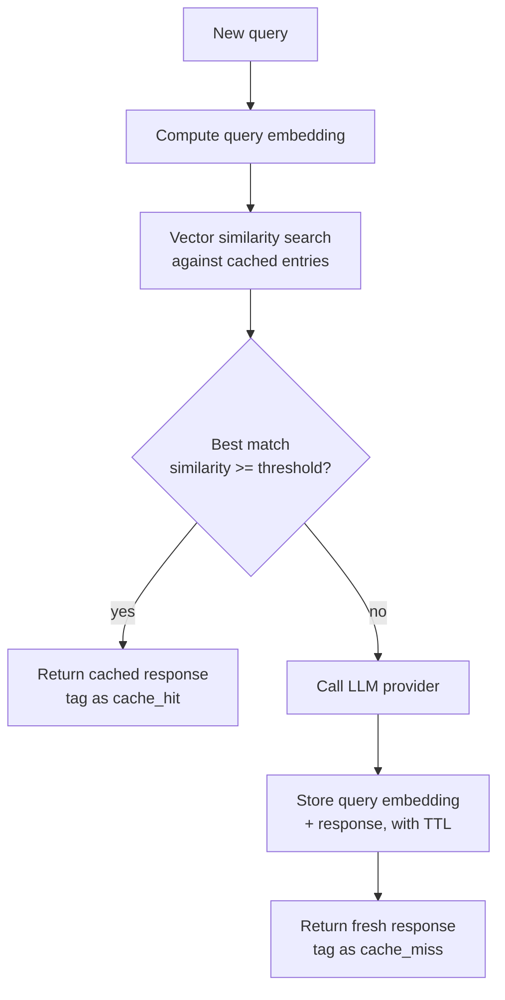

# Semantic Caching

## Why This Matters

Traditional caching (see [Part 7 — Caching & Performance](../07-caching-performance/README.md), especially [Cache-Aside](../07-caching-performance/cache-aside.md)) matches on exact keys: the same input produces a cache hit only if it's byte-for-byte identical to a previous request. That works well for a URL or a database query, but it works poorly for natural-language input, because two users asking "How do I reset my password?" and "What's the process to change my password?" are asking the *same question* in different words — an exact-match cache treats them as completely unrelated and misses both times, forcing a full, paid LLM call for a question that's effectively already been answered. Semantic caching closes this gap by matching on **meaning**, not exact text, using embeddings to measure similarity between the new query and previously cached queries.

Semantic caching is the highest-leverage LLM cost optimization for workloads with genuinely repeated *intent* — FAQ-style chat, common support questions, RAG queries about the same document set — but it introduces a correctness risk that exact-match caching doesn't have: a cache can return a *plausible but wrong* answer if similarity is miscalibrated, which is a fundamentally different failure mode than a cache miss.

## Core Concept

A semantic cache stores past query/response pairs along with an **embedding vector** representing the query's meaning. On a new query, the system:

1. Computes the new query's embedding.
2. Searches the cache for previously stored embeddings within some **similarity threshold** (commonly cosine similarity above a tuned cutoff, e.g. 0.92-0.97 depending on tolerance for near-misses).
3. If a sufficiently similar cached entry exists, returns its stored response directly — skipping the LLM call entirely.
4. If not, calls the LLM normally and stores the new query/response/embedding pair for future lookups.

The similarity threshold is the central tuning knob and a direct trade-off: **too loose** (low threshold) returns wrong answers for queries that are only superficially related ("how do I delete my account" vs. "how do I delete a project" might embed closely enough to falsely match at a loose threshold); **too tight** (high threshold) rarely hits, giving you exact-match caching's poor hit rate with embedding-computation overhead added on top for no benefit.

## Mental Model

Think of a semantic cache like an **experienced reference librarian**, not a filing cabinet. A filing cabinet (exact-match cache) only finds a document if you ask for it by its precise title. A good librarian, asked "do you have anything about how photosynthesis works," recognizes that's the same underlying need as someone who earlier asked "how do plants make energy from sunlight," even though the words don't match — and hands over the same book. But a librarian who's too eager to generalize might also hand you a book about *cellular respiration* because it sounds related, when it actually answers a different question — that's exactly the false-positive risk semantic caching has to be tuned against.

## How It Works

1. **Embedding generation**: every incoming query is converted into a vector using an embedding model (see [Embedding APIs](../16-rag-apis/README.md) in Part 16) — typically the same embedding model consistently, since vectors from different models aren't comparable.
2. **Similarity search**: the new embedding is compared against stored cache entries using cosine similarity (or another distance metric), typically backed by a vector index for performance at scale rather than a linear scan (see [Vector Database APIs](../16-rag-apis/README.md)).
3. **Threshold decision**: if the best match's similarity exceeds the configured threshold, it's a hit — return the cached response, tagged clearly as a cache hit so downstream logging and cost tracking can distinguish it from a fresh generation.
4. **Miss handling**: below threshold, call the LLM, then store the new query embedding and response for future lookups, usually with a TTL (see [TTL](../07-caching-performance/README.md)) so stale answers eventually expire.
5. **Invalidation and staleness control**: unlike exact-match caching, semantic cache entries need explicit safeguards against being served for queries where the "same meaning" assumption breaks down — see Production Considerations below.

## Architecture



## Request / Response Example

Gateway response for a semantic cache hit — note it looks identical in shape to a fresh response, but with cache metadata making the source explicit for observability and cost tracking:

```json
{
  "content": "Go to Settings > Security > Reset Password, then follow the email link to set a new password.",
  "usage": { "input_tokens": 0, "output_tokens": 0 },
  "cache": {
    "type": "semantic",
    "status": "hit",
    "matched_query": "What's the process to change my password?",
    "similarity": 0.951
  },
  "cost_usd": 0.0
}
```

For comparison, a cache miss that fell through to a real provider call:

```json
{
  "content": "You can update your billing address under Account > Billing...",
  "usage": { "input_tokens": 58, "output_tokens": 22 },
  "cache": { "type": "semantic", "status": "miss" },
  "cost_usd": 0.00019
}
```

## Code Example

```python
import math
import time
from dataclasses import dataclass


def cosine_similarity(a: list[float], b: list[float]) -> float:
    dot = sum(x * y for x, y in zip(a, b))
    norm_a = math.sqrt(sum(x * x for x in a))
    norm_b = math.sqrt(sum(y * y for y in b))
    if norm_a == 0 or norm_b == 0:
        return 0.0
    return dot / (norm_a * norm_b)


@dataclass
class CacheEntry:
    query_text: str
    embedding: list[float]
    response: str
    stored_at: float
    ttl_seconds: float

    def is_expired(self) -> bool:
        return (time.monotonic() - self.stored_at) > self.ttl_seconds


class SemanticCache:
    """Naive linear-scan implementation for illustration. Production
    systems back this with a proper vector index (e.g. pgvector, a
    dedicated vector DB — see ../16-rag-apis/README.md) once entry count
    grows past what a linear scan can serve within latency budget."""

    def __init__(self, similarity_threshold: float = 0.93, default_ttl_seconds: float = 3600):
        self.similarity_threshold = similarity_threshold
        self.default_ttl_seconds = default_ttl_seconds
        self._entries: list[CacheEntry] = []

    def lookup(self, query_embedding: list[float]) -> CacheEntry | None:
        self._entries = [e for e in self._entries if not e.is_expired()]  # lazy eviction

        best_entry: CacheEntry | None = None
        best_score = -1.0
        for entry in self._entries:
            score = cosine_similarity(query_embedding, entry.embedding)
            if score > best_score:
                best_score = score
                best_entry = entry

        if best_entry is not None and best_score >= self.similarity_threshold:
            return best_entry
        return None

    def store(self, query_text: str, query_embedding: list[float], response: str,
              ttl_seconds: float | None = None) -> None:
        self._entries.append(CacheEntry(
            query_text=query_text,
            embedding=query_embedding,
            response=response,
            stored_at=time.monotonic(),
            ttl_seconds=ttl_seconds or self.default_ttl_seconds,
        ))


async def get_response_with_semantic_cache(
    query_text: str,
    embed_fn,          # async fn: str -> list[float]
    generate_fn,        # async fn: str -> str
    cache: SemanticCache,
    cacheable: bool = True,
) -> tuple[str, bool]:
    """Returns (response, was_cache_hit). `cacheable=False` MUST be honored
    for time-sensitive or personalized queries — see Common Mistakes."""
    if not cacheable:
        return await generate_fn(query_text), False

    query_embedding = await embed_fn(query_text)
    hit = cache.lookup(query_embedding)
    if hit is not None:
        return hit.response, True

    response = await generate_fn(query_text)
    cache.store(query_text, query_embedding, response)
    return response, False
```

## Production Considerations

- **Never cache time-sensitive or personalized queries.** "What's my account balance," "what time is it," "what's today's date," or anything referencing the current user's private state must bypass semantic caching entirely (`cacheable=False` in the example above) — a semantically similar cached answer for a different user or an earlier time is simply wrong, not just stale.
- **Threshold tuning needs real evaluation, not a guess.** Build a labeled set of query pairs that *should* match and pairs that *should not*, and tune the threshold against precision/recall on that set — see [Part 13 — API Testing](../13-api-testing/README.md) for evaluation methodology, and [AI Observability](ai-observability.md) for monitoring hit quality in production.
- **TTL matters more than it does for prompt caching** (see [Prompt Caching](prompt-caching.md)) — semantic cache entries can live for hours or days, so facts that change over that window (pricing, policies, product features) risk being served stale well past the point they became wrong.
- **Vector search cost and latency grow with cache size** — a linear scan is fine for a few hundred entries, but production-scale semantic caches need a real vector index, and that index itself has infrastructure cost that should be weighed against the LLM cost it's saving.

## Common Mistakes

- **Caching personalized responses as if they were generic** — the single most damaging semantic caching bug, silently leaking one user's data-shaped answer to another user's similar-sounding question.
- **Setting the similarity threshold too low to chase a higher hit rate**, producing confidently wrong answers that are far more damaging to trust than an honest cache miss would have been.
- **No expiry on cached entries for content that changes over time**, serving outdated pricing, policy, or feature information long after it stopped being true.
- **Conflating semantic caching with prompt caching** — they solve different problems (matching *meaning* of full queries across users vs. reusing *partial computation* of an identical prefix) and are frequently used together, not as substitutes for each other.

## Best Practices

- Build an explicit "cacheable" classification into your request pipeline — mark queries as cacheable only when they're general-knowledge, non-personalized, and not time-sensitive.
- Tune the similarity threshold against a real evaluation set, and re-tune whenever you change the embedding model.
- Set TTLs based on how quickly the underlying facts can change — hours for volatile content, longer for genuinely stable reference material.
- Log every semantic cache hit with the matched query and similarity score, so a bad-answer incident can be traced back to a specific over-eager match and used to recalibrate the threshold.

## AI Engineering Perspective

Semantic caching is a natural complement to [RAG pipelines](../16-rag-apis/README.md), where many users often ask semantically similar questions against the same document corpus — but it interacts with retrieval in a subtle way: if you cache the *final generated answer*, a cache hit skips retrieval entirely, which is efficient but means the cache can go stale the moment the underlying documents are updated, unless cache invalidation is tied to document ingestion events. In agent contexts (see [Part 17 — AI Agents & MCP](../17-ai-agents-and-mcp/README.md)), semantic caching is generally safer applied to individual sub-steps with well-defined, stateless inputs (e.g., "classify this ticket's category") than to entire agent runs, since a full run's outcome typically depends on accumulated conversational state and tool results that make "semantically similar starting query" a poor proxy for "will produce the same correct outcome."

## Exercises

**Beginner:** List three query types from a support chatbot that should never be marked `cacheable=True`, and explain the failure mode for each if they were cached.

**Intermediate:** Using `SemanticCache` above, write a small evaluation harness that computes precision and recall for a set of labeled query pairs at three different threshold values, and pick the threshold that best balances them.

**Advanced:** Design an invalidation strategy that ties semantic cache entries to the source documents they were derived from (in a RAG context), so that updating a document proactively invalidates any cached answers that depended on it, rather than relying on TTL expiry alone.

## Key Takeaways

- Semantic caching matches queries by embedding similarity, not exact text, catching the common case where different phrasings ask the same underlying question.
- The similarity threshold is the central trade-off between cache-hit rate and the risk of returning a confidently wrong answer for a superficially similar but different question.
- Personalized and time-sensitive queries must be excluded from semantic caching entirely — a similarity match doesn't imply the same correct answer applies.
- It complements, rather than replaces, [Prompt Caching](prompt-caching.md), and pairs especially well with RAG workloads that see repeated user intent.
