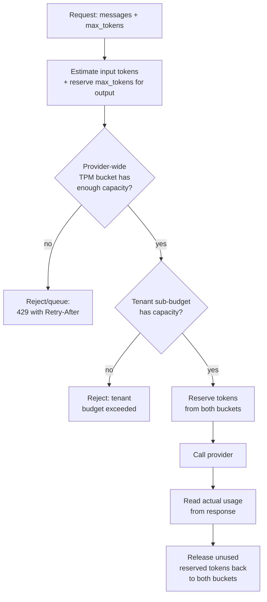

# Token Rate Limits

## Why This Matters

A team can pass every request-count rate limit test (see [AI Rate Limits](ai-rate-limits.md)) and still get hammered with 429s in production, because LLM providers usually enforce a **second, independent** limit: tokens per minute (TPM). Ten requests per minute sounds tiny — until each request carries an 8,000-token document as context, at which point ten requests can burn through a TPM limit that would comfortably support a thousand short chatbot messages. Token-rate limits are the dominant constraint for most real production AI workloads, precisely because token volume — not request count — is what actually costs the provider (and you) compute and money.

This is the limit that makes AI rate limiting different from ordinary API rate limiting: a traditional REST API rate limiter only needs to count requests, because requests are roughly fungible in cost. LLM requests are wildly non-fungible — a request can range from a few dozen tokens to hundreds of thousands, and your limiter has to account for that.

## Core Concept

**Tokens per minute (TPM)** limits cap the total number of tokens — input plus output, and sometimes counted separately — you can push through a provider in a rolling window, independent of how many individual requests that represents. This means:

- A single very large request (e.g., a long document summarization) can consume a meaningful fraction of your entire per-minute budget by itself.
- Many small requests and a few large requests can hit the exact same TPM ceiling through completely different traffic patterns, so you can't reason about TPM by request count alone.
- Because output tokens are generated (and billed/limited) as the model runs, and you don't know the exact output length in advance, TPM budgeting has an inherent estimation problem: you must reserve capacity for output *before* you know how much will actually be used.

The engineering task is fundamentally a **budgeting problem across many concurrent users/tenants sharing one provider-wide token budget** — not just a single global counter, but usually a two-level structure: a hard provider-wide ceiling (to avoid 429s), and a fair-share or priority-based allocation across tenants underneath it (so one large customer's traffic doesn't starve everyone else's, tying directly into [Cost Tracking](cost-tracking.md)'s attribution).

## Mental Model

If [AI Rate Limits](ai-rate-limits.md) is a toll booth counting cars, token-rate limits are a **bridge with a maximum total weight limit**, not a maximum car count. Ten motorcycles and one loaded freight truck can both be "ten vehicles" in count, but the truck alone might exceed the bridge's weight capacity. You can't manage a weight-limited bridge by counting vehicles — you have to weigh each one (estimate its token cost) before it crosses, and you have to reserve some capacity for vehicles that are heavier than they look once fully loaded (output tokens you can't know exactly in advance).

## How It Works

1. Before sending a request, the gateway **estimates its token cost**: input tokens can be counted precisely using the same tokenizer the target model uses (or a close approximation), while output tokens are estimated using the request's `max_tokens` parameter as a conservative upper bound.
2. The gateway checks a **token bucket sized in tokens, not requests** — capacity and refill rate expressed in tokens/second, matching the provider's documented TPM limit with a safety margin.
3. If the estimated total (input + reserved max output) fits in the current budget, the gateway **reserves** that many tokens from the bucket before making the call — this reservation step matters because you don't want two concurrent large requests to both pass a check against the same not-yet-decremented budget (a classic race condition).
4. After the call completes, the gateway **reconciles**: since actual output tokens are usually less than the reserved `max_tokens` estimate, the difference is returned to the budget, so the estimate doesn't permanently over-reserve capacity.
5. Per-tenant sub-budgets are layered on top of the provider-wide bucket (see [Cost Tracking](cost-tracking.md)) so that fairness and business priority — not just raw request order — determine who gets throttled first when the shared budget is under pressure.

## Architecture



## Request / Response Example

Provider-side 429 specifically attributable to token volume, distinguishable (via the message text or a dedicated error code, provider-dependent) from a request-count limit:

```http
HTTP/1.1 429 Too Many Requests
Retry-After: 5
Content-Type: application/json

{
  "error": {
    "type": "rate_limit_error",
    "message": "This request would exceed your organization's tokens-per-minute limit."
  }
}
```

The gateway pre-emptively rejecting a request *before* even calling the provider, because its own token budget tracker predicts the call would exceed the shared TPM ceiling:

```http
HTTP/1.1 429 Too Many Requests
Retry-After: 4
Content-Type: application/json

{
  "error": "token_budget_exceeded",
  "message": "Estimated request size (input + reserved output) exceeds available token capacity.",
  "estimated_tokens": 9400,
  "available_tokens": 3100
}
```

## Code Example

```python
import time
from dataclasses import dataclass


@dataclass
class TokenRateBucket:
    """Same token-bucket mechanics as ai-rate-limits.md's request limiter,
    but the unit is TOKENS, not requests. Reservation happens BEFORE the
    call (using an estimate); reconciliation happens AFTER (using the
    real usage from the response)."""
    capacity: float          # max tokens available at once (burst)
    refill_rate: float       # tokens refilled per second (steady-state TPM / 60)
    _tokens: float = 0.0
    _last_refill: float = 0.0

    def __post_init__(self):
        self._tokens = self.capacity
        self._last_refill = time.monotonic()

    def _refill(self) -> None:
        now = time.monotonic()
        elapsed = now - self._last_refill
        self._tokens = min(self.capacity, self._tokens + elapsed * self.refill_rate)
        self._last_refill = now

    def try_reserve(self, amount: float) -> bool:
        self._refill()
        if self._tokens >= amount:
            self._tokens -= amount
            return True
        return False

    def release(self, amount: float) -> None:
        """Give back tokens that were reserved but not actually used —
        e.g. the gap between max_tokens reserved and actual output_tokens."""
        self._refill()
        self._tokens = min(self.capacity, self._tokens + amount)


def estimate_input_tokens(messages: list[dict]) -> int:
    """Placeholder — in production, use the target model's real tokenizer
    (e.g. tiktoken for OpenAI-style models) rather than a rough heuristic.
    A ~4 chars/token heuristic is only acceptable as a last-resort estimate."""
    total_chars = sum(len(m["content"]) for m in messages)
    return max(1, total_chars // 4)


class TokenBudgetGuard:
    """Wraps a provider-wide bucket and per-tenant sub-buckets. A request
    must clear BOTH to proceed, and both are reconciled after the call."""

    def __init__(self, provider_bucket: TokenRateBucket):
        self.provider_bucket = provider_bucket
        self.tenant_buckets: dict[str, TokenRateBucket] = {}

    def _tenant_bucket(self, tenant_id: str) -> TokenRateBucket:
        if tenant_id not in self.tenant_buckets:
            # Example: every tenant gets a fair-share slice of the provider
            # budget by default; premium tenants could get a larger slice.
            self.tenant_buckets[tenant_id] = TokenRateBucket(capacity=2000, refill_rate=20)
        return self.tenant_buckets[tenant_id]

    def reserve(self, tenant_id: str, messages: list[dict], max_tokens: int) -> tuple[bool, int]:
        estimated = estimate_input_tokens(messages) + max_tokens
        tenant_bucket = self._tenant_bucket(tenant_id)

        if not tenant_bucket.try_reserve(estimated):
            return False, estimated
        if not self.provider_bucket.try_reserve(estimated):
            tenant_bucket.release(estimated)  # roll back the tenant reservation
            return False, estimated
        return True, estimated

    def reconcile(self, tenant_id: str, reserved: int, actual_input: int, actual_output: int) -> None:
        actual = actual_input + actual_output
        unused = max(0, reserved - actual)
        if unused:
            self.provider_bucket.release(unused)
            self._tenant_bucket(tenant_id).release(unused)


# Provider documents 40,000 tokens/minute -> ~667 tokens/sec steady refill.
guard = TokenBudgetGuard(TokenRateBucket(capacity=8000, refill_rate=600))
```

## Production Considerations

- **`max_tokens` is your only pre-call signal for output size — set it deliberately.** An unnecessarily high `max_tokens` over-reserves budget even when the model would have stopped much earlier, artificially starving concurrent requests.
- **Reconciliation is not optional.** Skipping the "release unused reserved tokens" step causes the bucket to appear far more exhausted than it actually is, throttling traffic that the provider would have happily accepted.
- **Input tokenization must match the target model.** Using the wrong tokenizer (or a rough character-count heuristic) for estimation can be off by 20-30%, which is often enough to either trip false 429s or, worse, under-reserve and get a real 429 back from the provider anyway.
- **Track TPM and RPM as genuinely separate constraints** — a system can be well within its RPM budget and still be throttled hard on TPM, or vice versa; dashboards and alerts need to show both.

## Common Mistakes

- **Conflating request-count and token-volume limiting** into a single counter — this is the single most common AI rate-limiting bug and the reason this chapter exists separately from [AI Rate Limits](ai-rate-limits.md).
- **Not reserving for output tokens at all**, only counting input — this systematically under-estimates true consumption and produces surprise 429s from the provider even though your internal limiter reported plenty of headroom.
- **No reconciliation step**, permanently over-reserving budget based on worst-case `max_tokens` estimates and needlessly throttling traffic that would have fit.
- **One global bucket with no per-tenant allocation**, letting a single high-volume tenant or a runaway background job starve every other tenant's requests during shared-budget contention.

## Best Practices

- Use the actual tokenizer for the target model family when estimating input tokens; don't rely on character-count heuristics beyond rough sizing.
- Always reserve for `max_tokens` before the call and reconcile against actual usage after — treat this as symmetric, not optional bookkeeping.
- Give tenants their own sub-budgets under the shared provider ceiling, sized by business priority, not just first-come-first-served.
- Surface TPM utilization (not just RPM) on your dashboards — see [AI Observability](ai-observability.md) — since it's usually the tighter constraint in practice.

## AI Engineering Perspective

RAG pipelines (see [Part 16 — RAG APIs](../16-rag-apis/README.md)) are frequently the biggest TPM consumer in a system, because retrieved context can add thousands of tokens to every generation call — a chatbot feature that looks token-light in isolation can become the dominant TPM consumer the moment it's backed by retrieval, and budgeting needs to account for context size, not just the user's literal message length. In agent loops (see [Part 17 — AI Agents & MCP](../17-ai-agents-and-mcp/README.md)), accumulated conversation and tool-result history re-sent on every step (see [Part 14 — AI API Engineering](../14-ai-api-engineering/README.md) on how chat completion works) means TPM consumption grows *within* a single agent run, not just across separate user requests — long-running agents can trip a tenant's per-minute token budget entirely on their own, which is a strong argument for periodically summarizing or truncating agent context rather than only optimizing at the gateway layer.

## Exercises

**Beginner:** Given a provider documented at 60,000 TPM, calculate a `TokenRateBucket` capacity and refill rate with a 20% safety margin.

**Intermediate:** Modify `TokenBudgetGuard.reserve` to also check the [AI Rate Limits](ai-rate-limits.md) request-count bucket, so a request must clear all three checks (provider TPM, tenant TPM, provider RPM) before proceeding.

**Advanced:** Design a fairness policy where tenant sub-budgets aren't fixed shares but scale dynamically based on the last hour's actual provider-wide utilization — describe the failure modes of a naive implementation (e.g., a burst by one tenant permanently shrinking others' allocations).

## Key Takeaways

- Token-rate limits (TPM) cap total tokens processed per minute, independent of request count, and are usually the tighter real-world constraint for LLM workloads.
- Budgeting requires reserving for estimated output (`max_tokens`) before the call and reconciling against actual usage after, since exact output size isn't known in advance.
- Per-tenant sub-budgets under a shared provider-wide ceiling prevent one caller from starving everyone else.
- Treat RPM and TPM as two independent constraints that both need their own tracking, alerting, and dashboards.
