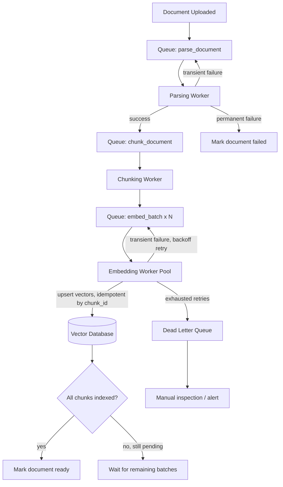

# Async Document Processing

## Why This Matters

Every stage between "file uploaded" and "chunk is queryable" — parsing, chunking, embedding, indexing (see [Chunking Pipelines](chunking-pipelines.md), [Embedding APIs](embedding-apis.md), [Vector Database APIs](vector-database-apis.md)) — can take anywhere from milliseconds (a short text file) to many minutes (a 500-page scanned PDF requiring OCR, split into hundreds of chunks, each needing an embedding API call). None of that belongs inside an HTTP request/response cycle, as established in [Document Ingestion APIs](document-ingestion-apis.md). But saying "do it asynchronously" is the easy part — the hard part is building that async pipeline so it survives worker crashes, handles documents ten times larger than you tested with, retries transient failures without duplicating work, and can be safely re-run when you change your chunking or embedding strategy. This is where RAG ingestion becomes a genuine distributed systems problem, not just a background thread.

## Core Concept

**Async document processing** is the background job system — built on the general patterns from [Part 8 — Async Systems](../08-async-systems/README.md) — that takes a document from "uploaded" to "fully indexed" through a queue-driven pipeline of discrete, independently retryable stages. The design goals specific to document processing, beyond generic background jobs, are:

- **Stage decomposition**: parsing, chunking, embedding, and indexing are modeled as separate steps (often separate queue messages or a state machine), not one monolithic function — so a failure in embedding doesn't force re-parsing, and a slow stage doesn't block a fast one from a different document.
- **Idempotent reprocessing**: because you *will* need to re-run parts of the pipeline (a chunking strategy change, an embedding model upgrade, a fixed parsing bug), every stage must be safely re-runnable on the same document without creating duplicate chunks or double-charging an embedding API.
- **Failure isolation and partial progress**: a document with 400 chunks where embedding fails on chunk 350 should not have to restart from chunk 1 — the system needs to track progress at a granular enough level to resume, not just retry the whole document.
- **Large document handling**: documents large enough to produce thousands of chunks need the pipeline to fan out work (e.g., one chunking job producing many embedding jobs) rather than processing everything in a single long-running task that risks timing out or exhausting worker memory.

## Mental Model

Think of async document processing like **a factory assembly line, not a single craftsman building one item start to finish**. On an assembly line, each station (parsing, chunking, embedding, indexing) does one job and passes its output to the next station via a conveyor belt (the queue) — if the embedding station briefly breaks down, parsed-and-chunked items pile up waiting for it, but the parsing station keeps working on the next item rather than sitting idle, and nothing has to go back to the very start of the line. A single craftsman model (one function that parses, chunks, embeds, and indexes a document top to bottom in one go) means any failure at any point loses all the work done before it and blocks that worker from doing anything else until it's resolved. The assembly-line model is what lets a document-processing system scale to thousands of concurrent documents and recover gracefully from partial failures.

## How It Works

1. **Job enqueued at upload** — the ingestion API (see [Document Ingestion APIs](document-ingestion-apis.md)) enqueues a `parse_document` job referencing the document's storage location, not its content.
2. **Parsing worker** picks up the job, extracts text from the raw file (PDF, DOCX, HTML, etc. — potentially using OCR for scanned documents), and on success enqueues a `chunk_document` job; on failure, marks the document `failed` with a specific error reason and either retries (transient errors) or stops (permanent errors, like a corrupt file).
3. **Chunking worker** splits the parsed text into chunks (see [Chunking Pipelines](chunking-pipelines.md)) and, for large documents, fans out embedding work — rather than embedding all chunks in one worker invocation, it enqueues embedding jobs in batches, so no single job has unbounded runtime.
4. **Embedding worker(s)** call the embedding API in batches (see [Embedding APIs](embedding-apis.md)) and write vectors to a staging area or directly upsert into the vector database.
5. **Indexing/finalization step** confirms all chunks for a document are embedded and indexed, then flips the document's status to `ready` — this is the point at which retrieval should start returning the document's chunks.
6. **Retry and dead-letter handling** at every stage: transient failures (network blips, rate limits) are retried with exponential backoff (see [Part 6 — Production Reliability](../06-production-reliability/README.md)); failures that exhaust retries move to a dead-letter queue for manual inspection rather than retrying forever or silently dropping the document.

**Idempotent reprocessing** is achieved by making each stage's output keyed deterministically off inputs it can recompute: chunk IDs are derived from `document_id + chunk_index` (not randomly generated), so re-running chunking on the same document produces the same IDs, and a subsequent upsert to the vector database simply overwrites rather than duplicates. Re-processing a document is then just re-enqueueing the pipeline from whichever stage needs to re-run, with the confidence that outputs won't accumulate as duplicates.

## Architecture



## Request / Response Example

**Internal job message for the chunking stage (as published to the queue):**

```json
{
  "job_type": "chunk_document",
  "document_id": "doc_71ab90",
  "storage_key": "employee-handbook/doc_71ab90/handbook.pdf",
  "parsed_text_key": "parsed/doc_71ab90.txt",
  "attempt": 1,
  "max_attempts": 5,
  "chunking_strategy": "recursive_v2",
  "enqueued_at": "2026-08-18T09:12:10Z"
}
```

**Status endpoint reflecting pipeline progress (same contract introduced in [Document Ingestion APIs](document-ingestion-apis.md)):**

```http
GET /v1/documents/doc_71ab90/status HTTP/1.1
Authorization: Bearer sk_live_abc123
```

```http
HTTP/1.1 200 OK
Content-Type: application/json

{
  "document_id": "doc_71ab90",
  "status": "embedding",
  "stages": {
    "parsing": "complete",
    "chunking": "complete",
    "embedding": "in_progress",
    "indexing": "pending"
  },
  "chunks_total": 412,
  "chunks_embedded": 287,
  "retries": {"embedding": 1},
  "updated_at": "2026-08-18T09:14:52Z"
}
```

## Code Example

```python
import os
import asyncio
from dataclasses import dataclass
from enum import Enum


class Stage(str, Enum):
    PARSING = "parsing"
    CHUNKING = "chunking"
    EMBEDDING = "embedding"
    INDEXING = "indexing"


@dataclass
class Job:
    document_id: str
    stage: Stage
    payload: dict
    attempt: int = 1
    max_attempts: int = 5


async def process_embedding_job(job: Job, embed_batch_fn, vector_store) -> None:
    """Embeds one batch of chunks and upserts them idempotently. Because
    chunk_id is deterministic (document_id + chunk_index), re-running this
    job after a partial failure simply overwrites existing vectors rather
    than duplicating them — safe to retry without special-casing."""
    chunks = job.payload["chunks"]  # list of {chunk_id, text, metadata}
    texts = [c["text"] for c in chunks]

    try:
        vectors = await embed_batch_fn(texts)
    except RateLimitError:
        # Transient — re-enqueue with backoff rather than failing the document
        await requeue_with_backoff(job)
        return
    except EmbeddingAPIError as e:
        if job.attempt >= job.max_attempts:
            await move_to_dead_letter(job, reason=str(e))
            await mark_document_stage_failed(job.document_id, Stage.EMBEDDING, str(e))
        else:
            job.attempt += 1
            await requeue_with_backoff(job)
        return

    # Idempotent upsert: chunk_id is deterministic, so re-running this exact
    # job (e.g. after a worker crash mid-batch) overwrites, never duplicates.
    records = [
        {"id": c["chunk_id"], "values": vec, "metadata": c["metadata"]}
        for c, vec in zip(chunks, vectors)
    ]
    await vector_store.upsert(collection=job.payload["collection"], records=records)

    await increment_chunks_embedded(job.document_id, count=len(chunks))
    await maybe_finalize_document(job.document_id)  # flips status to "ready" once all batches done


async def maybe_finalize_document(document_id: str) -> None:
    """Checked after every embedding batch completes — only the batch that
    observes chunks_embedded == chunks_total actually finalizes the
    document, so finalization itself is naturally idempotent and race-safe
    when guarded by a database-level conditional update."""
    doc = await get_document_record(document_id)
    if doc["chunks_embedded"] >= doc["chunks_total"]:
        await update_document_status_if_not_ready(document_id, status="ready")


async def requeue_with_backoff(job: Job) -> None:
    delay_seconds = min(2 ** job.attempt, 300)  # exponential backoff, capped
    await enqueue_job(job, delay_seconds=delay_seconds)
```

## Production Considerations

- **Large documents need fan-out, not one giant job**: a 1,000-chunk document should become many small embedding jobs (e.g., batches of 50-100 chunks), not one job trying to embed all 1,000 chunks synchronously — this bounds worker runtime and lets batches run in parallel across the worker pool.
- **Track progress at the chunk-batch level, not just document level**: `chunks_embedded` counters let you resume a partially-failed document without re-embedding chunks that already succeeded, saving both time and embedding API cost.
- **Dead-letter queues need alerting, not silence**: a document stuck in the dead-letter queue is a customer-visible failure (their document never becomes searchable) — route dead-letter events to your observability stack (see [Part 12 — Observability](../12-observability/README.md)), not just a queue nobody watches.
- **Reprocessing at scale is a migration, not a script**: re-chunking or re-embedding an entire corpus after a strategy change should go through the same queue-based pipeline, with rate limiting so it doesn't overwhelm the embedding API or vector database, rather than a one-off loop hammering both as fast as possible.
- **Worker crash recovery**: use the queue's visibility-timeout/lease mechanism (see [Part 8 — Async Systems](../08-async-systems/README.md)) so a job whose worker crashed mid-processing becomes available for another worker to pick up, rather than being lost.

## Common Mistakes

- Processing an entire document (parse + chunk + embed + index) in a single long-running task instead of decomposing into independently retryable stages.
- Non-deterministic chunk/vector IDs, making retries or reprocessing create duplicate vectors instead of safely overwriting them.
- Retrying failed jobs immediately and repeatedly without backoff, hammering an already-struggling downstream API (embedding provider, vector database) and worsening the outage.
- No dead-letter queue or alerting, so permanently failed documents sit silently "processing" forever with no one aware.
- Treating reprocessing (e.g., after a chunking strategy change) as a manual one-off script instead of running it through the same durable, retryable pipeline as normal ingestion.

## Best Practices

- Decompose the pipeline into stages with their own queue messages, each independently retryable and each writing its own progress state.
- Make every stage idempotent by deriving IDs deterministically from stable inputs (document ID, chunk index), never randomly per attempt.
- Use exponential backoff with jitter for retries (see [Part 6 — Production Reliability](../06-production-reliability/README.md)) and a dead-letter queue with alerting for exhausted retries.
- Fan out large documents into multiple bounded-size jobs rather than one unbounded job, and track granular progress (chunks embedded / total) to support partial resume.

## AI Engineering Perspective

The reliability of async document processing directly gates what an [AI agent](../17-ai-agents-and-mcp/README.md) can safely assume about its own tools: an agent with a "search documents" tool has no way to know a document is only 70% indexed unless your status tracking (from [Document Ingestion APIs](document-ingestion-apis.md)) surfaces that explicitly, so a robust async pipeline is what lets you build agent tools that can honestly report "still processing" instead of returning incomplete results the agent might mistake for the whole truth. This pipeline is also usually where the majority of your embedding API cost is incurred at scale (see [Part 15 — Production AI Systems](../15-production-ai-systems/README.md) on cost tracking and rate limits) — batching, idempotent retries that don't re-embed already-succeeded chunks, and rate-limited reprocessing are not just reliability concerns but direct cost controls, since a naive retry-everything-from-scratch policy can multiply your embedding spend on every transient failure.

## Exercises

**Beginner**: Sketch the queue message schema for a `parse_document` job and a `chunk_document` job, showing what fields carry over between them.

**Intermediate**: Design the database schema for tracking per-document stage progress (`parsing`, `chunking`, `embedding`, `indexing`) including counters needed to support partial resume after a worker crash mid-embedding.

**Advanced**: Design a rate-limited, resumable reprocessing job that re-embeds an entire multi-million-chunk corpus after an embedding model upgrade, without exceeding the embedding provider's rate limits or degrading latency for concurrent live ingestion traffic.

## Key Takeaways

- Document processing should be decomposed into independently retryable stages (parse, chunk, embed, index) connected by a queue, not one monolithic function.
- Idempotency — deterministic chunk/vector IDs — is what makes retries and reprocessing safe rather than duplicative.
- Large documents need to fan out into many bounded-size jobs; track progress at the chunk-batch level to support partial resume after failure.
- Dead-letter queues with alerting, and rate-limited backoff on retries, are what keep a struggling downstream dependency from becoming a cascading outage.

---
**Previous**: [Streaming RAG](streaming-rag.md) · **Back to**: [Part 16 Overview](README.md) · **Next Part**: [Part 17 — AI Agents & MCP](../17-ai-agents-and-mcp/README.md)
