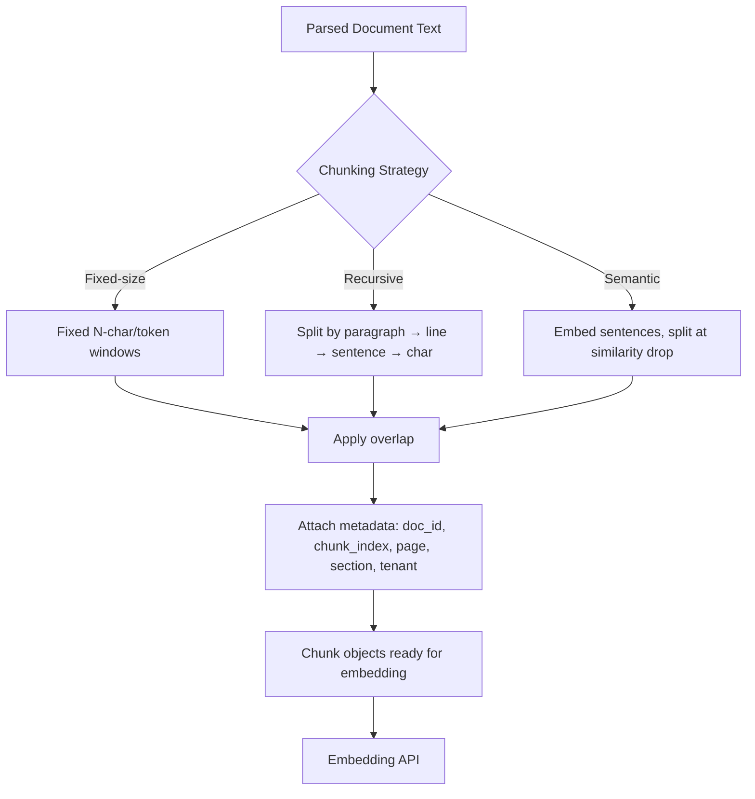

# Chunking Pipelines

## Why This Matters

You cannot hand an LLM an entire 200-page PDF and a query and expect efficient, accurate retrieval — not because the model couldn't theoretically read it (large context windows exist, see [Context Windows](../14-ai-api-engineering/context-windows.md)), but because retrieval is fundamentally a *search* problem, and search needs addressable, comparably-sized units to rank against each other. If your smallest retrievable unit is "the whole document," retrieval can only ever tell you "this whole document is relevant," which is both computationally wasteful (embedding and re-processing huge blocks of mostly-irrelevant text) and useless for precision (the model gets buried in the 95% of the document that doesn't answer the question). Chunking — splitting documents into smaller, retrievable pieces — is the decision that most directly determines whether your RAG system returns precise, relevant context or noisy, diluted context. Get chunking wrong and no amount of clever retrieval or reranking downstream can fully compensate.

## Core Concept

**Chunking** is the process of splitting a parsed document into smaller text segments ("chunks") that are each embedded and indexed independently, so that retrieval can operate at a granularity fine enough to be precise but coarse enough to preserve meaning. The core tension is between two failure modes:

- **Chunks too large**: each chunk covers multiple topics, so its embedding becomes a blurry average that matches many queries poorly and none precisely — and even when retrieved correctly, it wastes context-window budget with irrelevant surrounding text.
- **Chunks too small**: each chunk loses the surrounding context needed to be meaningful on its own — a sentence fragment like "the limit is $500 per transaction" is useless without knowing *which* limit, from *which* policy, for *whom*.

There is no universally "correct" chunk size — it depends on document structure, query patterns, and the embedding model's own effective range — but the strategies below are the standard toolkit for balancing this trade-off.

## Mental Model

Think of chunking like **deciding how to cut a book into index cards for a library card catalog**, not just slicing it by page count. If you cut by a fixed number of characters regardless of sentence or paragraph boundaries, you get cards that start and end mid-sentence — useless to a librarian searching for "what does this book say about X." If you cut along natural boundaries (paragraphs, sections) but keep each card a reasonable size, and you write a small amount of the previous card's ending onto the next card's beginning (overlap, so cutting a sentence in half doesn't lose it entirely), you get cards a librarian can pull independently, understand in isolation, and still connect back into their neighbors when needed. The goal of a chunking strategy is exactly this: pieces that are self-contained enough to retrieve and understand alone, small enough to be precise, and connected enough not to lose meaning at the seams.

## How It Works

**Fixed-size chunking** splits text into chunks of N characters or tokens, regardless of content structure. Simplest to implement and fastest to run, but indifferent to sentence/paragraph boundaries — it will happily cut a sentence in half.

**Recursive character/token splitting** (the most common production default) tries a hierarchy of separators in order — first split on `\n\n` (paragraph breaks), and only if a resulting piece is still too large, recursively split it on `\n` (line breaks), then on sentence-ending punctuation, then finally on raw characters as a last resort. This respects natural document structure whenever possible while still guaranteeing an upper bound on chunk size.

**Semantic chunking** goes further: instead of splitting on structural markers, it embeds consecutive sentences and looks for points where the embedding similarity between neighboring sentences drops sharply — a signal that the topic has shifted — and splits there. This produces chunks that are topically coherent rather than merely structurally bounded, at the cost of an extra embedding pass during ingestion.

**Chunk overlap** — carrying the last N tokens of one chunk into the start of the next — mitigates the "cut a fact in half at the boundary" problem. If a chunk boundary falls in the middle of an important sentence, overlap means that sentence still appears whole in at least one chunk.

**Metadata attached to chunks** — every chunk should carry structured metadata alongside its text: `document_id`, `chunk_index`, source `page_number` or `section`, `collection`/tenant identifier, and timestamps. This metadata is what makes [filtered retrieval](retrieval.md) and source citation ([Context Construction](context-construction.md)) possible — a chunk without provenance metadata is a fact you can't trace back to its source.

## Architecture



## Request / Response Example

Internally, a chunking service typically exposes (or is called as) a function rather than a public HTTP endpoint, but if wrapped as an internal microservice API it looks like this:

```http
POST /internal/chunk HTTP/1.1
Content-Type: application/json

{
  "document_id": "doc_71ab90",
  "text": "Section 4.2 Refund Policy\nCustomers may request a refund within 30 days...\n\nSection 4.3 Exceptions\nDigital goods are non-refundable once downloaded...",
  "strategy": "recursive",
  "chunk_size_tokens": 400,
  "overlap_tokens": 50
}
```

```http
HTTP/1.1 200 OK
Content-Type: application/json

{
  "document_id": "doc_71ab90",
  "chunk_count": 2,
  "chunks": [
    {
      "chunk_id": "doc_71ab90_c0",
      "chunk_index": 0,
      "text": "Section 4.2 Refund Policy\nCustomers may request a refund within 30 days of purchase, provided the item is unused and in original packaging...",
      "token_count": 387,
      "metadata": {"section": "4.2", "page": 12}
    },
    {
      "chunk_id": "doc_71ab90_c1",
      "chunk_index": 1,
      "text": "...provided the item is unused and in original packaging.\n\nSection 4.3 Exceptions\nDigital goods are non-refundable once downloaded...",
      "token_count": 402,
      "metadata": {"section": "4.3", "page": 12}
    }
  ]
}
```

Note the overlapping sentence ("provided the item is unused...") appearing at the end of chunk 0 and the start of chunk 1 — that's the overlap window in action.

## Code Example

```python
import re
from dataclasses import dataclass, field
from typing import Optional


@dataclass
class Chunk:
    text: str
    chunk_index: int
    token_count: int
    metadata: dict = field(default_factory=dict)


def estimate_tokens(text: str) -> int:
    # Cheap approximation; use a real tokenizer (e.g. tiktoken) in production
    return max(1, len(text) // 4)


def recursive_split(text: str, chunk_size: int, separators: list[str]) -> list[str]:
    """Recursively split `text` using the first separator that yields pieces
    within chunk_size; falls back to the next separator for oversized pieces."""
    if estimate_tokens(text) <= chunk_size or not separators:
        return [text]

    sep, remaining_seps = separators[0], separators[1:]
    pieces = text.split(sep) if sep else list(text)

    results: list[str] = []
    buffer = ""
    for piece in pieces:
        candidate = (buffer + sep + piece) if buffer else piece
        if estimate_tokens(candidate) <= chunk_size:
            buffer = candidate
        else:
            if buffer:
                results.append(buffer)
            # This single piece is still too big — recurse with the next separator
            if estimate_tokens(piece) > chunk_size:
                results.extend(recursive_split(piece, chunk_size, remaining_seps))
                buffer = ""
            else:
                buffer = piece
    if buffer:
        results.append(buffer)
    return results


def apply_overlap(pieces: list[str], overlap_tokens: int) -> list[str]:
    """Prepend a tail slice of each chunk onto the next, so facts split at a
    boundary still appear whole in at least one chunk."""
    if overlap_tokens <= 0 or len(pieces) < 2:
        return pieces

    overlapped = [pieces[0]]
    for prev, curr in zip(pieces, pieces[1:]):
        overlap_chars = overlap_tokens * 4  # rough token->char conversion
        tail = prev[-overlap_chars:]
        overlapped.append(tail + curr)
    return overlapped


def chunk_document(
    document_id: str,
    text: str,
    chunk_size_tokens: int = 400,
    overlap_tokens: int = 50,
) -> list[Chunk]:
    # Try paragraph, then line, then sentence, then raw-character boundaries
    separators = ["\n\n", "\n", ". ", ""]
    raw_pieces = recursive_split(text, chunk_size_tokens, separators)
    overlapped_pieces = apply_overlap(raw_pieces, overlap_tokens)

    return [
        Chunk(
            text=piece,
            chunk_index=i,
            token_count=estimate_tokens(piece),
            metadata={"document_id": document_id, "chunk_id": f"{document_id}_c{i}"},
        )
        for i, piece in enumerate(overlapped_pieces)
    ]
```

## Production Considerations

- **Chunk size is model- and use-case-dependent**: shorter chunks (100–300 tokens) favor precision for fact lookup; longer chunks (500–1000 tokens) favor coverage for summarization-style queries. Tune with real evaluation, not guesswork.
- **Structure-aware parsing matters before chunking**: chunking a PDF's raw extracted text without first identifying headings, tables, and lists produces much worse chunks than chunking text that preserves document structure markers.
- **Tables and code blocks need special handling**: naive text chunking can slice a table row-by-row across chunks, destroying its meaning — detect and either keep tables whole or serialize them (e.g., to markdown) before chunking.
- **Re-chunking is a migration**: changing your chunking strategy means re-embedding and re-indexing your entire corpus — plan for this as a versioned, replayable pipeline (see [Async Document Processing](async-document-processing.md)), not a one-off script.

## Common Mistakes

- Chunking without overlap, so a fact or sentence that straddles a chunk boundary is lost entirely — neither chunk contains it whole.
- Using a single fixed chunk size for wildly different document types (legal contracts vs. chat transcripts vs. code) without adjusting strategy.
- Stripping structural metadata (page number, section, heading) during chunking, making later citation and filtering impossible.
- Chunking tables or code naively as flat text, destroying row/column or indentation semantics.
- Not tracking a chunking strategy version, so you can't tell which chunks in your vector store came from which pipeline version after an upgrade.

## Best Practices

- Default to recursive splitting on structural separators; reach for semantic chunking only when structural boundaries poorly reflect topic boundaries (e.g., transcripts, freeform notes).
- Always apply overlap (typically 10-20% of chunk size) as a cheap insurance policy against boundary loss.
- Attach rich metadata to every chunk at creation time — it's far cheaper than trying to backfill it later.
- Store the chunking strategy and version as chunk metadata so you can selectively re-process documents when the strategy changes.

## AI Engineering Perspective

Chunking strategy has an outsized, often underestimated effect on downstream agent behavior. An agent ([Part 17](../17-ai-agents-and-mcp/README.md)) that calls a retrieval tool and receives a chunk with no section/page metadata cannot cite its source, cannot tell the user "see page 12," and cannot reason about whether it has the *complete* answer or just a fragment. Chunk granularity also interacts with [prompt caching](../15-production-ai-systems/README.md): if your context construction step assembles the same frequently-retrieved chunks in a stable order and position, you can structure prompts to maximize cache hits — but only if chunking is deterministic and stable across ingestion runs, which is another reason to version your chunking pipeline rather than let it silently drift.

## Exercises

**Beginner**: Given a 3-paragraph document, manually trace what fixed-size chunking (100 characters, no overlap) produces versus recursive chunking on `\n\n`. Which loses more meaning at the boundaries?

**Intermediate**: Implement overlap using actual token counts (not the character approximation shown above) with a real tokenizer library.

**Advanced**: Design a semantic chunking function that embeds each sentence, computes cosine similarity between consecutive sentence embeddings, and splits wherever similarity drops below a threshold. What happens at the very start and end of a document where there's no "previous" sentence to compare?

## Key Takeaways

- Chunking is a precision/context trade-off: too large dilutes relevance, too small loses meaning.
- Recursive splitting on structural separators (paragraph → line → sentence → char) is the practical default; semantic chunking trades ingestion cost for topical coherence.
- Overlap prevents facts at chunk boundaries from being lost entirely.
- Rich per-chunk metadata (document, section, page, tenant) is what makes retrieval filtering and source citation possible later.

---
**Previous**: [File Upload Architecture](file-upload-architecture.md) · **Next**: [Embedding APIs](embedding-apis.md)
