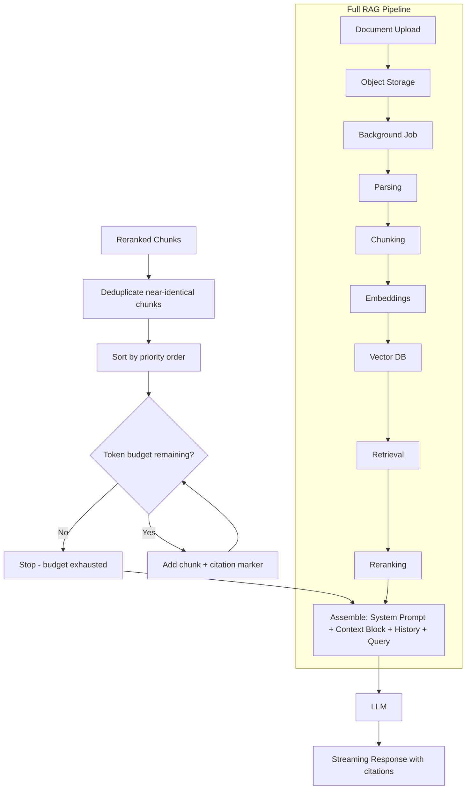

# Context Construction

## Why This Matters

Retrieval and reranking (see [Retrieval](retrieval.md) and [Reranking](reranking.md)) hand you a ranked list of chunks — but a ranked list is not a prompt. Between "here are the 5 most relevant chunks" and "here is what we send to the LLM" sits a step that's easy to underestimate: deciding what order to present chunks in, removing near-duplicate content, deciding how much of your model's [context window](../14-ai-api-engineering/context-windows.md) to actually spend on retrieved context versus system instructions and conversation history, and structuring everything so the model can both use the information *and* tell the user where it came from. Get context construction wrong and you can have perfect retrieval and still get a bad answer — a context window stuffed with redundant, unordered, or unattributed chunks confuses the model just as much as irrelevant chunks do.

## Core Concept

**Context construction** is the assembly step that transforms a set of retrieved (and possibly reranked) chunks into the actual text that gets inserted into the LLM prompt, governed by four concerns:

1. **Token budget management** — the total prompt (system instructions + conversation history + retrieved context) must fit within the model's context window with room left for the response (see [Context Windows](../14-ai-api-engineering/context-windows.md)). Context construction has to actively decide, given a fixed budget, how many chunks to include and, if necessary, how to trim them.
2. **Ordering** — the sequence chunks appear in the prompt affects how the model weighs them; a common practice is placing the highest-relevance chunk closest to the question (some architectures instead place it first, since models can exhibit position-dependent attention — you tune this empirically for your model).
3. **Deduplication** — overlapping chunks (from chunk overlap during [chunking](chunking-pipelines.md), or from retrieving multiple chunks of the same document that repeat similar content) waste budget and can make the model repeat itself; near-duplicate detection (exact match or high similarity) before assembly avoids this.
4. **Source attribution** — each chunk carries metadata (document, section, page — see [Chunking Pipelines](chunking-pipelines.md)) that should be threaded through into the prompt structure so the model can cite it, and so your application can show the user *where* an answer came from, which is often a hard requirement for trust in production RAG systems.

## Mental Model

Think of context construction like **a lawyer preparing an exhibit binder for a court case**, not just handing the judge a stack of loose documents. The lawyer doesn't dump every marginally-related document they found during discovery onto the judge's desk — they select the most relevant excerpts, remove duplicates, number and label each exhibit so it can be referenced precisely ("Exhibit 3, page 2"), and order them so the strongest evidence is easy to find, all while respecting that the judge has limited time and attention. Context construction does exactly this for an LLM's limited context window: curate, deduplicate, label, and order, rather than just concatenating whatever retrieval returned.

## How It Works

1. **Start with the reranked (or retrieved) chunk list**, each with text and metadata.
2. **Deduplicate** — compare chunks for exact or near-exact overlap (common when overlapping windows from the same document both get retrieved) and drop redundant ones, keeping the higher-scored version.
3. **Apply a token budget** — compute a running token count (using the same tokenizer family as your target model, since token boundaries aren't just "words") and greedily include chunks in priority order until the budget is exhausted, rather than truncating mid-chunk.
4. **Order chunks** for presentation — commonly either strict relevance-score order or a document-grouped order (so multi-chunk excerpts from the same source read coherently together).
5. **Format with citations** — wrap each chunk with a machine- and human-readable source marker (e.g., `[Source: Employee Handbook, Section 4.3]`) so the model can reference it directly in its answer, and so your application can map any citation the model produces back to the original document.
6. **Assemble the final prompt** — system instructions + formatted context block + conversation history + user question, in that structure, ready to send to the LLM (streamed or not, see [Streaming RAG](streaming-rag.md)).

## Architecture



## Request / Response Example

**Internal context-assembly service call:**

```http
POST /internal/assemble-context HTTP/1.1
Content-Type: application/json

{
  "query": "how long do I have to return a digital purchase",
  "chunks": [
    {"chunk_id": "doc_71ab90_c1", "text": "Digital goods are non-refundable once downloaded...", "score": 0.94, "metadata": {"document": "Employee Handbook", "section": "4.3", "page": 12}},
    {"chunk_id": "doc_71ab90_c0", "text": "Customers may request a refund within 30 days...", "score": 0.61, "metadata": {"document": "Employee Handbook", "section": "4.2", "page": 12}}
  ],
  "max_context_tokens": 1500
}
```

```http
HTTP/1.1 200 OK
Content-Type: application/json

{
  "assembled_context": "[Source: Employee Handbook, Section 4.3, p.12]\nDigital goods are non-refundable once downloaded, except where required by local law.\n\n[Source: Employee Handbook, Section 4.2, p.12]\nCustomers may request a refund within 30 days of purchase, provided the item is unused and in original packaging.",
  "chunks_included": 2,
  "chunks_dropped": 0,
  "tokens_used": 412
}
```

**Final LLM request assembled downstream:**

```json
{
  "model": "claude-sonnet-5",
  "system": "You are a helpful assistant. Answer using only the provided context. Cite sources using the [Source: ...] markers.",
  "messages": [
    {"role": "user", "content": "Context:\n[Source: Employee Handbook, Section 4.3, p.12]\nDigital goods are non-refundable...\n\nQuestion: how long do I have to return a digital purchase"}
  ],
  "stream": true
}
```

## Code Example

```python
from dataclasses import dataclass

TOKENS_PER_CHAR_ESTIMATE = 0.25  # rough approximation; use a real tokenizer in production


@dataclass
class Chunk:
    chunk_id: str
    text: str
    score: float
    metadata: dict


def estimate_tokens(text: str) -> int:
    return max(1, int(len(text) * TOKENS_PER_CHAR_ESTIMATE))


def deduplicate(chunks: list[Chunk], similarity_threshold: float = 0.9) -> list[Chunk]:
    """Drop near-duplicate chunks (e.g. from overlapping chunk windows),
    keeping the higher-scored version of each near-duplicate pair."""
    kept: list[Chunk] = []
    for chunk in sorted(chunks, key=lambda c: c.score, reverse=True):
        is_duplicate = any(
            _text_similarity(chunk.text, existing.text) >= similarity_threshold
            for existing in kept
        )
        if not is_duplicate:
            kept.append(chunk)
    return kept


def _text_similarity(a: str, b: str) -> float:
    # Simple token-overlap similarity as a stand-in for a real similarity
    # metric (e.g. cosine similarity on embeddings, or a fuzzy-match library)
    set_a, set_b = set(a.split()), set(b.split())
    if not set_a or not set_b:
        return 0.0
    return len(set_a & set_b) / len(set_a | set_b)


def format_chunk(chunk: Chunk) -> str:
    meta = chunk.metadata
    citation = f"[Source: {meta.get('document', 'Unknown')}, Section {meta.get('section', '?')}, p.{meta.get('page', '?')}]"
    return f"{citation}\n{chunk.text}"


def assemble_context(
    chunks: list[Chunk], max_context_tokens: int = 1500
) -> tuple[str, int, int]:
    """Deduplicate, then greedily fill the token budget in priority order.
    Never truncate a chunk mid-sentence — either it fits whole, or it's
    dropped and the next chunk is tried, preserving readability."""
    deduped = deduplicate(chunks)
    ranked = sorted(deduped, key=lambda c: c.score, reverse=True)

    included: list[Chunk] = []
    tokens_used = 0
    for chunk in ranked:
        formatted = format_chunk(chunk)
        chunk_tokens = estimate_tokens(formatted)
        if tokens_used + chunk_tokens > max_context_tokens:
            continue  # skip chunks that don't fit; keep trying smaller ones
        included.append(chunk)
        tokens_used += chunk_tokens

    context_block = "\n\n".join(format_chunk(c) for c in included)
    return context_block, len(included), tokens_used
```

## Production Considerations

- **Reserve budget for output, not just input** — a context window is shared between prompt and response (see [Context Windows](../14-ai-api-engineering/context-windows.md)); reserve enough tokens for the expected answer length, don't consume the entire window with retrieved context.
- **Citations must be traceable end-to-end** — the citation format in the prompt has to map back to something your application can resolve (a document ID, a page number, a URL) so the UI can render clickable sources, not just text the model made up to look like a citation.
- **Ordering effects are model-specific** — some models show measurable sensitivity to where in a long context the most important information sits; test empirically with your specific model rather than assuming a universal best order.
- **Conversation history competes for the same budget** — in multi-turn RAG (e.g., a chat interface), context construction has to jointly manage history truncation and retrieved-context budget, not just the latter in isolation.

## Common Mistakes

- Concatenating all retrieved chunks with no deduplication, wasting context budget on near-identical overlapping text.
- Truncating a chunk mid-sentence to fit a token budget instead of dropping the whole chunk, producing garbled, half-formed context.
- Not including citation metadata in the assembled prompt, making it impossible for the model (or your application) to attribute claims to sources.
- Blowing the context window by including too many chunks "just in case," leaving no budget for the model's own response and risking a truncated answer.
- Using a naive character-count token estimate in production instead of the actual tokenizer for the target model, causing budget miscalculations near the limit.

## Best Practices

- Deduplicate before budgeting, not after — it's wasteful to spend budget on a chunk you're about to discard as redundant.
- Reserve a fixed portion of the context window for the model's response and never let retrieved context encroach on it.
- Use consistent, parseable citation markers so your application layer can programmatically extract and verify sources from the model's answer.
- Log the assembled context (or a hash of it) alongside each generation for debugging — "why did the model say X" is often answered by "look at exactly what context it received."

## AI Engineering Perspective

Context construction is where retrieval quality and generation quality actually meet, and it's a natural interaction point with [prompt caching](../15-production-ai-systems/README.md): if your system prompt and instructions are stable and placed before the variable retrieved-context block, providers that support prefix caching can cache that stable portion across requests, reducing latency and cost — but only if you're disciplined about keeping the stable parts stable and the variable parts (retrieved context) appended after them, not interleaved. For [AI agents](../17-ai-agents-and-mcp/README.md) performing multi-hop retrieval, context construction also has to decide how much of *previous* hops' retrieved context to retain versus replace — carrying forward too much across hops reproduces the same context-window-blowout problem within a single agentic turn, just compounded across multiple retrieval calls instead of one.

## Exercises

**Beginner**: Given three retrieved chunks with scores 0.9, 0.85, and 0.4, and a token budget that fits only two of them, write out which two you'd include and why.

**Intermediate**: Extend `assemble_context` to reserve a configurable number of tokens for conversation history in addition to retrieved context, splitting the budget between the two.

**Advanced**: Design a context construction strategy for a multi-hop agent that retrieves multiple times per turn, deciding what to carry forward from earlier hops versus what to drop to avoid runaway context growth.

## Key Takeaways

- Context construction is the assembly step between "ranked chunks" and "the actual prompt sent to the LLM" — deduplication, ordering, budget management, and citation formatting all happen here.
- Never truncate a chunk mid-sentence to fit a budget; drop whole chunks that don't fit instead.
- Reserve context-window budget for the model's response, not just the retrieved input.
- Citation markers threaded through from chunk metadata are what make source attribution possible in the final answer.

---
**Previous**: [Reranking](reranking.md) · **Next**: [Streaming RAG](streaming-rag.md)
